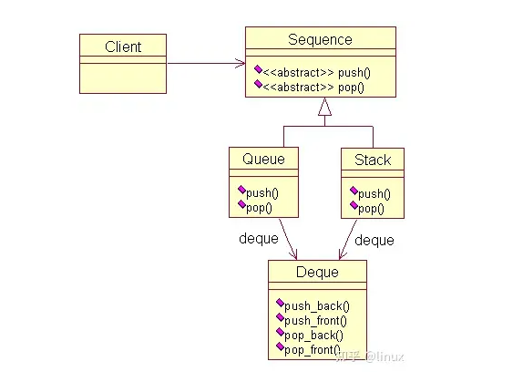

# 

# 1 创建型模式—— Create model

## 1.1 C++ 单例模式

### 1.1.1 什么是单例模式

> ​	单例模式（Singleton Pattern，也称为单件模式），使用最广泛的设计模式之一。其意图是保证一个类仅有一个实例，并提供一个访问它的全局访问点，该实例被所有程序模块共享。
>
> **定义一个实例类：**
>
> 1. 私有化它的构造函数，以防止外界创建单例类的对象；
> 2. 使用类的私有静态指针变量指向类的唯一实例。
> 3. 使用一个公有的静态方法获取该实例。
>
> 注意：
>
> * 通常情况下，单例类会将构造函数、拷贝构造函数和赋值运算符都声明为私有(private)，以禁止从外部进行对象的复制和赋值。这样做可以确保只有一个实例，并防止通过赋值运算符创建新的实例。但某些情况下，可以自定义拷贝构造和赋值运算符来确保单例对象的正确行为。
> * 私有化析构函数可以防止在类外部通过`delete`关键字删除单例对象。

### 1.1.2 懒汉版（Lazy Singleton）

```c++
class Singleton{
private:
	static Singleton* instance;
private:
	Singleton(){}
	~Singleton(){}	
	Singleton(const Singleton&) = delete;
	Singleton(const Singleton&&) = delete;
	Singleton& operator=(const Singleton&) = delete;
public:
	static Sigleton* getInstance(){
	if(instance == NULL)
		instance = new Singleton();
	return instance;
	}
};
Singleton* Singleton::instance = NULL;


int main() {
    Singleton* p = Singleton::getInstance();
    return 0;
}
```

> 存在内存泄漏的问题，有两种解决方法：
>
> 1. 使用智能指针
> 2. 使用静态的嵌套对象
>
> 对于第一种解决方法，代码如下：
>
> ```c++
> #include <iostream>
> #include <memory>
> using namespace std;
> 
> class Singleton {
> private:
> 	static shared_ptr<Singleton> instance;
> private:
>     Singleton() {
>         cout << "构造函数" << endl;
>     }
>     Singleton( const Singleton& ) = delete;
> 	Singleton& operator=(const Singleton&) = delete;
> public:
>     /* 此时，析构函数必须为公有，因为通过智能指针在类外调用类的析构，否则编译通过 */
>     ~Singleton() {
>         cout << "析构函数" << endl;
>     }
>     static shared_ptr<Singleton>& getInstance() {
>         if (instance == nullptr)
>         {
>             //instance = shared_ptr<Singleton>(new Singleton());
>             instance = make_shared<Singleton>()
>             //instance.reset( new Singleton() );
>         }
>         return instance;
> 	}
> };
> 
> shared_ptr<Singleton> Singleton::instance = nullptr;
> 
> int main() {
>     shared_ptr<Singleton>& p = Singleton::getInstance();
>     return 0;
> }
> ```
>
> 第二种解决方案，代码如下：
>
> ```c++
> #include <iostream>
> #include <memory>
> using namespace std;
> 
> class Singleton {
> private:
> 	static Singleton *instance;
> private:
>     Singleton() {
>         cout << "构造函数" << endl;
>     }
> 
>      ~Singleton() {
>         cout << "析构函数" << endl;
>      }
> 
>      Singleton( const Singleton& ) = delete;
>      Singleton& operator=( const Singleton& ) = delete;
> private:
>     class Deletor {
>     public:
>         ~Deletor() {
>             if (Singleton::instance != nullptr) {
>                 delete Singleton::instance;
>             }
>         }
>     };
>     static Deletor deletor;
> public:
>     static Singleton* getInstance() {
>         if (instance == nullptr)
>         {
>             instance = new Singleton();
>         }
>         return instance;
> 	}
> };
> 
> Singleton* Singleton::instance = nullptr;
> /* 必须对静态对象在类外初始化，否则可能被编译器优化删除 */
> Singleton::Deletor Singleton::deletor = Singleton::Deletor();
> 
> int main() {
>     Singleton* p = Singleton::getInstance();
>     return 0;
> }
> ```
>
> ​	在程序结束时，系统会调用静态成员`deletor`的析构函数，该析构函数会释放单例的唯一实例。使用这种方法释放单例对象有以下特征：
>
> * 在单例类内部定义专有的嵌套类
>
> * 在单例类内定义私有的专门用于释放的静态成员。
>
> * 利用程序在程序结束时析构静态变量的特性，选择最终的释放时机。
>
>
>   上述代码在单线程环境下是正确无误的，但是当拿到多线程环境下时，就会出现`race condition`，不是线程安全的。要使其线程安全，能在多线程环境下实现单例模式，我们首先想到的是利用同步机制来正确保护我们的`shared data`。可以**使用双检测锁模式**（DCL: Double-Checked Locking Pattern）：
>
>   ```c++
> static Singleton* getInstance(){
> 	if(instance == NULL){
> 		Lock lock;	//基于作用域的加锁，超出作用域，自动调用析构函数解锁
> 		if(instance == NULL){
> 			instance = new Singleton();
> 		}
> 	}
> 	return instance;
> }
>   ```
>
>   加入DCL后，其实还是有问题的，关于memory model。在某些内存模型中（虽然不常见）或者是由于编译器的优化以及运行时优化等等原因，**使得instance虽然已经不是nullptr但是其所指对象还没有完成构造**，这种情况下，另一个线程如果调用getInstance()就有可能使用到一个不完全初始化的对象。换句话说，就是代码中第2行：if(instance == NULL)和第六行instance = new Singleton();没有正确的同步，**在某种情况下会出现new返回了地址赋值给instance变量而Singleton此时还没有构造完全**，当另一个线程随后运行到第2行时将不会进入if从而返回了不完全的实例对象给用户使用，造成了严重的错误。**在C++11没有出来的时候，只能靠插入两个memory barrier（内存屏障）来解决这个错误，但是C++11引进了memory model**，**提供了Atomic实现内存的同步访问，即不同线程总是获取对象修改前或修改后的值，无法在对象修改期间获得该对象。**
>
>   ```c++
> atomic<Widget*> Widget::pInstance{ nullptr };
> Widget* Widget::Instance() {
>     if (pInstance == nullptr) { 
>         lock_guard<mutex> lock{ mutW }; 
>         if (pInstance == nullptr) { 
>             pInstance = new Widget(); 
>         }
>     } 
>     return pInstance;
> }
>   ```
>
> Best of All:
>
> C++11规定了local static在多线程条件下的初始化行为，要求编译器保证了内部静态变量的线程安全性。在C++11标准下，《Effective C++》提出了一种更优雅的单例模式实现，使用函数内的 local static 对象。这样，只有当第一次访问getInstance()方法时才创建实例。这种方法也被称为Meyers' Singleton。C++0x之后该实现是线程安全的，C++0x之前仍需加锁。
>
> ```c++
> class Singleton
> {
> private:
> 	Singleton() { };
> 	~Singleton() { };
> 	Singleton(const Singleton&);
> 	Singleton& operator=(const Singleton&);
> public:
> 	static Singleton& getInstance() 
>         {
> 		static Singleton instance;
> 		return instance;
> 	}
> };
> ```
>
> 

### 1.1.3 饿汉版（Eager Singleton)

> 饿汉版（Eager Singleton）：指单例实例在程序运行时被立即执行初始化
>
> ```c++
> class Singleton
> {
> private:
> 	static Singleton instance;
> private:
> 	Singleton();
> 	~Singleton();
> 	Singleton(const Singleton&);
> 	Singleton& operator=(const Singleton&);
> public:
> 	static Singleton& getInstance() {
> 		return instance;
> 	}
> }
> 
> // initialize defaultly
> Singleton Singleton::instance;
> ```
>
> 由于在main函数之前初始化，所以没有线程安全的问题。

> 懒汉单例和饿汉单例多线程场景分析
> 1."懒汉"模式虽然有优点，但是每次调用GetInstance()静态方法时，必须判断NULL == m_instance，使程序相对开销增大；
>
> 2.多线程中会导致多个实例的产生，从而导致运行代码不正确以及内存的泄露；
>
> 3.未提供释放资源的函数，存在内存泄漏问题。
>
> 由于C++中构造函数并不是线程安全的。C++中的构造函数简单来说分两步：
>
> 第一步：内存分配；
>
> 第二步：初始化成员变量；
>
> 由于多线程的关系，可能当我们在分配内存好了以后，还没来得急初始化成员变量，就进行线程切换，另外一个线程拿到所有权后，由于内存已经分配了，但是变量初始化还没进行，因此获取成员变量的相关值会发生不一致现象。

## 1.2 工厂模式——Factory

> **动机**
>
> * 在软件系统中，经常面临着创建对象的工作；由于需求的变化，需要创建的对象的具体类型经常变化。
> * 如何应对这种变化？如何绕过常规的对象创建方法（new），提供一种“封装机制“来避免客户程序和这种”具体对象创建工作“的紧耦合。
>
> **模式定义：**
>
> 定义一个创建对象的接口，让子类决定实例化哪一个类。Factory Method使得一个类的实例化延迟（目的：解耦，手段：虚函数）到子类。
>
> 要点总结：
>
> * Factory Method模式用于隔离类对象的使用者和具体类型之间的耦合关系。面对一个经常变化的具体类型，紧耦合关系（new）会导致软件的脆弱。
> * Factory Method模式通过面向对象的手法，将所要创建的具体对象延迟到子类，从而实现一种扩展（而非更改）的策略，较好的解决了这种紧耦合关系。
> * Factory Method模式解决“单个对象”的需求变化。缺点在于要求创建方法/参数相同。

### 1.2.1 简单工厂模式

> ​	简单工厂模式是属于创建型模式，又叫静态工厂方法（static Factory Method）模式，简单工厂模式是由一个工厂对象决定创建出来哪一种产品类的实例。
>
> ​	简单工厂模式的实质是由一个工厂类根据传入的参数，动态决定应该创建哪一类产品类（这些产品类继承自一个父类或接口）的实例。
>
> 例如：假设有一个工厂，它能生产A、B两种产品。当客户需要产品的时候一定要告诉工厂是哪种产品，是A还是B。当新增一种新产品时，那么就需要去修改工厂类了。
>
> ```c++
> #include <iostream>
> 
> using namespace std;
> //抽象产品类
> class Product{
> public:
> 	virtual void show() = 0;
> };
> 
> //具体产品类
> class Product_A : public Product{
> public:
>     void show(){
>         cout << "Product_A" << endl;
>     }
> };
> 
> class Product_B : public Product{
> public:
>   	void show(){
>         cout << "Product_B" << endl;
>     }  
> };
> //工厂类
> class Factory{
> public:
>     Product* Cretate(int i){
>         switch(i){
>             case 1: 
>                 return new Product_A;
>                 break;
>             case 2:
>                 return new Product_B;
>                 break;
>             default:
>                 break;
>         }
>     }
> };
> 
> int main(){
>     Factory * factory = new Factory();
>     factory->Create(1)->show();
>     factory->Ctreate(2)->show();
>     system("pause");
>     return 0;
> }
> ```

### 1.2.2 工厂方法模式

> ​	上面的简单工厂模式的缺点是当新增产品的时候就要去修改工厂的类，这就违反了开发封闭原则，（类、模块、函数）可以扩展，于是，就出现了工厂方法模式。所谓工厂方法模式，是指定义一个用于创建对象的接口，让子类决定实例化哪一个类。
>
> ​	工厂方法模式是使用频率最高的工厂模式。该模式又被简称为工厂模式或者多态工厂模式。
>
> ​	比如，现在有A、B两种产品，那么就开两个工厂。工厂A负责生成A产品，工厂B负责生产B产品。这时候客户就不需要告诉工厂生产哪种产品了，只需要告诉工厂生产就可以了。
>
> ```c++
> #include <iostream>
> 
> using namespace std;
> // 抽象产品类
> class Product{
> public:
> 	virtual void show() = 0;
> };
> //具体产品类
> class Product_A : public Product{
> public:
> 	void show(){
> 		cout << "Product_A" << endl;
> 	}
> };
> 
> class Product_B : public Product{
> public:
> 	void show(){
> 		cout << "Product_B" << endl;
> 	}
> };
> //抽象工厂类
> class Factory{
> public:
> 	virtual Product* create() = 0;
> };
> //具体工厂类
> class Factory_A : public Factory{
> public:
> 	Product* create(){
> 		return new Product_A;
> 	}
> }
> 
> class Factory_B : public Factory{
> public:
> 	Product* create(){
> 		return new Product_B;
> 	}
> };
> 
> int main(){
> 	Factory* factory_a = new Factory_A();
>     Factory* factory_b = new Factory_B();
>     
>     factory_a->create()->show();
>     factory_b->create()->show();
>     system("pause");
>     return 0;
> }
> ```

### 1.2.3 抽象工厂模式

> ​	抽象工厂是一种创建型设计模式，创建一系列相关的对象，无需指定具体类。抽象工厂模式是对工厂的抽象化，而不是制造方法。为了满足不同用户对产品的的多样化需求，工厂不会局限于生产一类产品，但是系统如果按工厂方法那样为每种产品都增加一个新工厂又会造成工厂泛滥。
>
> ​	为了调和这种矛盾，抽象工厂模式提供了另一种思路，将各种产品分门别类，基于此来规划各种工厂的制造接口，最终确立产品制造的顶级规范，使其与具体产品彻底脱钩。抽象工厂是建立在制造复杂产品体系需求基础之上的一种设计模式，在某种意义上，我们可以将抽象工厂模式理解为工厂方法模式的高度集群化的升级版。
>
> ​	在工厂方法模式中每个实际的工厂只定义了一个工厂方法。但随着产品的需求不断升级，各类工厂遍地开花，能够制造的产品种类也丰富起来，随之而来的弊端就是工厂泛滥。针对这种情况，我们就需要进行产业规划与整合，对现有工厂进行重构。
>
> 例如，我们可以基于产品品牌与系列进行生产线规划，按品牌划分A工厂与B工厂。具体以汽车工厂举例，A品牌汽车有轿车、越野车、跑车3个系列的产品，同样地，B品牌汽车也包括以上3个系列的产品，如此便形成了两个产品族，分别由A工厂和B工厂负责生产，每个工厂都有3条生产线，分别生产这3个系列的汽车。
>
> 
>
> 
>
> ```c++
> class AbstractProductA{
> public:
> 	virtual ~AbstractProductA(){};
> 	virtual std::string UsefulFunctionA() const = 0;
> };
> 
> class ConcreteProductA1 : public AbstractProductA{
>     std::string UsefulFunctionA() const override{
>         return "The result of the product A1.";
>     }
> };
> 
> class ConcreteProductA2 : public AbstractProductA{
>     std::string UsefulFunctionA() const override{
>         return "The result of the product A2.";
>     }
> };
> 
> class AbstractProductB{
> public:
>     virtual ~AbstractProductB(){}
>     virtual std::string UsefulFunctionB() const = 0;
>     
>     virtual std::string AnotherUsefulFunctionB(const AbstractProductA &collaborator) const = 0;
> };
> 
> class ConcreteProductB1 : public AbstaractProductB{
> public:
>     std::string UsefulFunctionB() const override{
>         return "The result of the product B1.";
>     }
>     
>     std::string AnotherUsefulFunctionB(const AbstractProductA &collaborator) const override{
>         const std::string result = collaborator.UsefulFunctionA();
>         return "The result of the B1 collaborating with ( " + result + ")";
>     }
> };
> 
> class ConcreteProductB2 : public AbstaractProductB{
> public:
>     std::string UsefulFunctionB() const override{
>         return "The result of the product B2.";
>     }
>     
>     std::string AnotherUsefulFunctionB(const AbstractProductA &collaborator) const override{
>         const std::string result = collaborator.UsefulFunctionA();
>         return "The result of the B2 collaborating with ( " + result + ")";
>     }
> };
> 
> class AbstractFactory{
> public:
>     virtual AbstractProductA *CreateProductA() const = 0;
>     virtual AbstractProductB *CreateProductB() const = 0;
> };
> 
> class ConcreteFactory1 : public AbstractFactory{
> public:
>     AbstractProductA *CreateProductA() const override{
>         return new ConcreteProductA1();
>     }
>     AbstractProductB *CreateProductB() const override{
>         return new ConcreteProductB1();
>     }
> };
> 
> class ConcreteFactory2 : public AbstractFactory{
> public:
>     AbstractProductA *CreateProductA() const override{
>         return new ConcreteProductA2();
>     }
>     AbstractProductB *CreateProductB() const override{
>         return new ConcreteProductB2();
>     }
> };
> 
> void ClientCode(const AbstractFactory &factory){
>     const AbstractProductA *product_a = factory.CreateProductA();
>     const AbstractProductB *product_b = factory.CreateProductB();
>     std::cout << product_b->UsefulFunctionB() << endl;
>     std::cout << product_b->AnotherUsefulFunctionB(*product_a) << endl;
>     delete product_a;
>     delete product_b;
> }
> 
> int main(){
>     std::cout << "Client: Testing client code with the first factory type:\n";
>     ConcreteFactory1 *f1 = new ConcreteFactory1();
>     ClientCode(*f1);
>     delete f1;
> }
> ```
>
> ```c++
> #include <iostream>
> using namespace std;
> //抽象产品
> class Product 
> {
> public:
> 	virtual void show() = 0;
> };
> //抽象产品族1 生产键盘
> class KeyBoard :public Product {};
>  
> //具体产品
> class LogiKeyBoard :public KeyBoard 
> {
> 	void show() 
> 	{
> 		cout << "罗技键盘......" << endl;
> 	}
> };
> class RazerKeyBoard :public KeyBoard 
> {
> 	void show()
> 	{
> 		cout << "雷蛇键盘......" << endl;
> 	}
> };
>  
> //抽象产品族2 除了生产键盘之外可以生产鼠标
> class Mouse :public Product {};
> class LogiMouse :public Mouse 
> {
> 	void show()
> 	{
> 		cout << "罗技鼠标......" << endl;
> 	}
> };
> class RazerMouse :public Mouse
> {
> 	void show() 
> 	{
> 		cout << "雷蛇鼠标......" << endl;
> 	}
> };
> //抽象工厂
> class Factory 
> {
> public:
>     //创建一个键盘
> 	virtual  KeyBoard* CreateKeyBoard() = 0;
>     //创建一个鼠标
> 	virtual Mouse* CreateMouse() = 0;
> };
>  
> //具体工厂 罗技工厂提供罗技键盘、罗技鼠标
> class LogiFactory :public Factory 
> {
> 	KeyBoard* CreateKeyBoard() 
> 	{
> 		return new LogiKeyBoard;
> 	}
> 	Mouse* CreateMouse() 
> 	{
> 		return new LogiMouse;
> 	}
> };
> //雷蛇工厂提供雷蛇键盘、雷蛇鼠标
> class RazerFactory :public Factory 
> {
> 	KeyBoard* CreateKeyBoard() 
> 	{
> 		return  new RazerKeyBoard;
> 	}
> 	Mouse* CreateMouse() 
> 	{
> 		return new RazerMouse;
> 	}
> };
>  
> int main() 
> {
>     //首先需要一个工厂
> 	Factory* factory = new LogiFactory;
> 	KeyBoard* keyBoard = factory->CreateKeyBoard();
> 	Mouse* mouse = factory->CreateMouse();
> 	keyBoard->show();
> 	mouse->show();
>     //释放后做第二次测试
> 	delete factory;
> 	delete keyBoard;
> 	delete mouse;
>     //雷蛇工厂只生产雷蛇产品
> 	factory = new RazerFactory;
> 	keyBoard = factory->CreateKeyBoard();
> 	mouse = factory->CreateMouse();
> 	keyBoard->show();
> 	mouse->show();
> 	delete factory;
> 	delete keyBoard;
> 	delete mouse;
> 	factory = nullptr;
> 	keyBoard = nullptr;
> 	mouse = nullptr;
> 	return 0;
> }
> ```


# 2 行为型模式——Behavioral model

## 2.1 观察者模式（Observer）

### 2.1.2 单线程版

> 观察者模式（Observer），又叫发布-订阅模式（Publish/Subscribe），定义对象间一种一对多的依赖关系，使得每当一个对象改变状态，则所有依赖于它的对象都会得到通知并自动更新。
> 该模式属于行为型模式。
>
> ```c++
> #include <algorithm>
> #include <vector>
> #include <stdio.h>
> 
> class Observable;
> 
> /* 抽象的观察者 */
> class Observer{
> public:
> 	virtual ~Observer();
> 	virtual void update() = 0;
> 
> 	void observe(Observable* s);
> protected:
>  /* 观察目标 */
> 	Obsersable* subject_;
> };
> 
> /* 被观察者 */
> class Observable{
> public:
>  void register_(Observer* x);
>  void unregister(Observer* x);
>  /* 通知每个具体的观察者 */
>  void notifyObservers(){
>      for(size_t i = 0; i < observers_.size(); ++i){
>          Observer* x = observers_[i];
>          if(x){
>              x->update();
>          }
>      }
>  }
> private:
>  std::vector<Observer*> observers_;
> };
> 
> /* 从观察者中退出观察，使得被观察者不再通知该对象 */
> Observer::~Observer(){
>  	subject_->unregister(this);
> }
> 
> /* 注册观察对象, 使观察者可通知该对象 */
> void Observer::observe(Observable* s){
>  	s->register_(this);
>  	subject_ = s;
> }
> /* 将观察者对象放到被观察者的一个vector容器中 */
> void Observable::register_(Observer* x){
>  	observers_.push_back(x);
> }
> 
> void Observable::unregister(Observer* x){
>  	std::vector<Observer*>::iterator it = std::find(observers_.begin(), observers_.end(), x);
>  	if(it != observers_.end()){
>      	std::swap(*it, observers_.back());
>      	observers_.pop_back();
>  }
> }
> 
> // 具体的观察者
> class Foo : public Observer{
>  virtual void update(){
>      printf("Foo::update() %p\n", this);
>  }
> };
> 
> int main(){
>  Foo* p = new Foo;
>  Observable subject;
>  p->observe(&subject);
>  subject.notifyObservers();
>  delete p;
>  subject.notifyObservers();
> }
> ```

## 2.2 策略模式

> ​	策略模式是指定义一系列的算法，把它们一个个封装起来，并且使它们可相互替换。本模式使得算法可独立于使用它的客户而变化。也就是说这些算法所完成的功能一样，对外的接口一样，只是各自实现上存在差异。用策略模式来封装算法，效果比较好。下面以高速缓存的替换算法为例，实现策略模式。
>
> ​	什么是Cache的替换算法呢？简单解释一下， 当发生Cache缺失时，Cache控制器必须选择Cache中的一行，并用欲获得的数据来替换它。所采用的选择策略就是Cache的替换算法。下面给出相应的UML图。
>
> 
>
> ReplaceAlgorithm是一个抽象类，定义了算法的接口，有三个类继承自这个抽象类，也就是具体的算法实现。Cache类中需要使用替换算法，因此维护了一个ReplaceAlgorithm的对象。
>
> 首先给出替换算法的定义：
>
> ```c++
> // 抽象接口
> class ReplaceAlgorithm{
> public:
> 	virtual void Replace() = 0;
> };
> 
> // 三种具体的替换算法
> class LRU_ReplaceAlgorithm : public ReplaceAlgorithm{
> public:
> 	void Replace(){
> 		cout << "Least Recently Used replace algorithm" << endl;
> 	}
> };
> 
> class FIFO_ReplaceAlgorithm : public ReplaceAlgorithm{
> public:
> 	void Replace(){
> 		cout << "First in First out replace algorithm" << endl;
> 	}
> };
> 
> class Random_ReplaceAlgorithm : public ReplaceAlgorithm{
> public:
> 	void Replace(){
> 		cout << "Random replace algorithm" << endl;
> 	}
> };
> ```
>
> ​	接着给出Cache的定义，这里很关键，Cache的实现方式直接影响了客户的使用方式，其关键在于如何指定替换算法。
>
> 方式一：直接通过参数指定，传入一个特定算法的指针：
>
> ```c++
> // Cache需要用到替换算法
> class Cache{
> private:
> 	ReplaceAlgorithm *m_ra;
> public:
> 	Cache(ReplaceAlgorithm *ra){
> 		m_ra = ra;
> 	}
> 	~Cache(){
> 		delete m_ra;
> 		m_ra = nullptr;
> 	}
> 	void Replace(){
> 		m_ra->Replace();
> 	}
> };
> ```
>
> ​	如果使用这种方式，客户就需要知道算法的具体定义。只能以下面这种方式使用，可以看到暴露了太多的细节：
>
> ```c++
> int main(){
> 	Cache cache(new LRU_ReplaceAlgorithm()); 
> 	cache.Replace();
> 	return 0;
> }
> ```
>
> 方式二：也是直接通过参数指定，只不过不是传入指针，而是一个标签。这样客户只要知道算法的相应标签即可，而不需要知道算法的具体定义。
>
> ```c++
> enum RA {LRU, FIFO, RANDOM}; // 标签
> 
> class Cache{
> private:
> 	ReplaceAlgorithm *m_ra;
> public:
> 	Cache(enum RA ra){
> 		if(ra == LRU)
> 			m_ra = new LRU_ReplaceAlgorithm();
> 		else if(ra == FIFO)
> 			m_ra = new FIFO_ReplaceAlgorithm();
> 		else if(ra == RANDOM)
> 			m_ra = NULL;
> 	}
> 	~Cache(){
> 		delete m_ra;
> 	}
> 	void Replace(){
> 		m_ra->Replace();
> 	}
> };
> 
> int main(){
>     Cache cache(LRU);
>     cache.Replace();
>     return 0;
> }
> ```
>
> 方式三：利用模板实现。算法通过模板的实参指定。当然了，还是使用了参数，只不过不是构造函数的参数。在策略模式中，参数的传递难以避免，客户必须指定某种算法。
>
> ```c++
> template <class RA>
> class Cache{
> private:
> 	RA m_ra;
> public:
> 	Cache() {}
> 	~Cache(){}
> 	void Replace() {
> 		m_ra.Replace();
> 	}
> };
> int main(){
> 	Cache<Random_ReplaceAlgorithm> cache;
> 	cache.Replace();
> 	return 0;
> }
> ```

# 3 结构型设计模式

## 3.1 装饰器模式

> ​	很多情况下，当一个类已经存在，并且可以对外提供核心功能时。但是，某个时刻，希望对这个类进行功能增强，当然，我们可以修改原来的类，并增加对应的增强功能。
>
> ​	但是，这种方式违背了“开闭”原则，需要修改原来的代码；而且不够灵活，如果某个时刻又不想要使用这个功能，又需要修改原来的代码，显然，这不是一个很好的解决方案。因此，就引出了装饰器模式。
>
> 定义：动态地给一个对象添加一些额外的职责。就添加功能来说，Decorator模式相比生成子类更为灵活。属于结构型模式。
>
> 本质：**在面向对象设计中，我们应该尽量使用对象组合，而不是对象继承来扩展和复用功能。**
>
> ​	装饰器模式就是基于对象组合的方式，可以很灵活的给对象添加所需要的功能。装饰器模式的本质就是动态组合。装饰器模式就是通过将复杂的功能简单化，分散化，然后在运行期间，根据需要来动态组合的模式。它使得我们可以给某个对象而不是整个类添加一些功能。
>
> ​	有时我们希望给某个对象而不是整个类添加一些功能。比如有一个手机，允许你为手机添加特性，比如增加挂件、屏幕贴膜等。一种灵活的设计方式是，将手机嵌入到另一对象中，由这个对象完成特性的添加，我们称这个嵌入的对象为装饰。这个装饰与它所装饰的组件接口一致，因此它对使用该组件的客户透明。下面给出装饰模式的UML图。
>
> 
>
> ```c++
> #include <iostream>
> #include <string>
> using namespace std;
> 
> // 公共抽象类
> class Phone {
> public:
>     Phone() {}
>     virtual ~Phone() {}
>     virtual void ShowDecorate() {}
> };
> 
> // 具体的手机类
> class NokiaPhone : public Phone {
> private:
>     string m_name;
> public:
>     NokiaPhone( string name ) : m_name( name ) {}
>     ~NokiaPhone() {}
>     void ShowDecorate() {
>         cout << m_name << "的装饰" << endl;
>     }
> };
> 
> // 装饰类
> class DecoratorPhone : public Phone {
> private:
>     Phone *m_phone; // 要装饰的手机
> public:
>     DecoratorPhone( Phone *phone ) : m_phone( phone ) {}
>     virtual void ShowDecorate() {
>         m_phone->ShowDecorate();
>     }
> };
> 
> // 具体的装饰类
> class DecoratorPhoneA : public DecoratorPhone {
> public:
>     DecoratorPhoneA( Phone *phone ) : DecoratorPhone( phone ) {}
>     void showDecorate() {
>         DecoratorPhone::ShowDecorate();
>         AddDecorate();
>     }
> private:
>     void AddDecorate() {
>         cout << "增加挂件" << endl; // 添加的装饰
>     }
> };
> 
> // 具体的装饰类
> class DecoratorPhoneB : public DecoratorPhone {
> public:
>     DecoratorPhoneB( Phone *phone ) : DecoratorPhone( phone ) {}
>     void ShowDecorate() {
>         DecoratorPhone::ShowDecorate();
>         AddDecorate();
>     }
> private:
>     void AddDecorate() {
>         cout << "屏幕贴膜" << endl;    // 添加的装饰
>     }
> };
> 
> int main() {
>     Phone *iphone = new NokiaPhone( "6300" );
>     Phone *dpa = new DecoratorPhoneA( iphone ); // 装饰，增加挂件
>     Phone *dpb = new DecoratorPhoneB( dpa );    // 装饰，屏幕贴膜
>     dpb->ShowDecorate();
>     delete dpa;
>     delete dpb;
>     delete iphone;
>     return 0;
> }
> ```
>
> ​	装饰器模式提供了更加灵活的面向对象添加职责的方式。可以用添加和分离的方法，用装饰在运行时刻增加和删除职责。装饰模式提供了一种“即用即付”的方法来添加职责。它并不试图在一个复杂的可定制的类中支持所有可预见的特征，相反，你可以定义一个简单的类，并且用装饰器给它逐渐地添加功能。可以从简单地部件组合出复杂的功能。

## 3.2 适配器模式

> ​	适配器模式将一个类的接口转换成客户希望的另外一个接口，使得原本由于接口不兼容而不能一起工作的那些类可以一起工作。它包括适配器和对象适配器。比如，在STL中就用到了适配器模式。STL实现了一种数据结构，称为双端队列（deque），支持前后两段的插入和删除。STL实现栈和队列时，没有从头开始定义它们，而是直接使用双端队列实现的。这里双端队列就扮演了适配器的角色。队列用到了它的后端插入，前端删除。而栈用到了它的后端插入，后端删除。
>
> 
>
> ```c++
> // 双端队列
> class Deque{
> public:
> 	void push_back(int x){
> 		cout << "Deque push_back" << endl;
> 	}
> 	void push_front(int x){
> 		cout << "Deque push_front" << endl;
> 	}
> 	void pop_back(){
> 		cout << "Deque pop_back" << endl;
> 	}
> 	void pop_front(){
> 		cout << "Deque pop_front" << endl;
> 	}
> };
> 
> // 顺序容器
> class Sequence{
> public:
>     virtual void push(int x) = 0;
>     virtual void pop() = 0;
> };
> 
> // 栈
> class stack : public Sequence{
> public:
>     void push(int x){
>         deque.pop_back();
>     }
>     void pop(){
>         deque.pop_back();
>     }
> private:
>     Deque deque;
> };
> 
> // 队列
> class Queue : public Sequence{
> public:
>     void push(int x){
>         deque.push_back(x);
>     }
>     void pop(){
>         deque.pop_front();
>     }
> private:
>     Deque deque; //双端队列
> };
> 
> int main(){
>     Sequence *s1 = new Stack();
>     Sequence *s2 = new Queue();
>     s1->push(1); s1->pop();
>     s2->push(2); s2->pop();
>     delete s1;
>     delete s2;
>     return 0;
> }
> ```

