# 1 播放器架构

> 

# 2 ffmpeg命令

> 
>
> 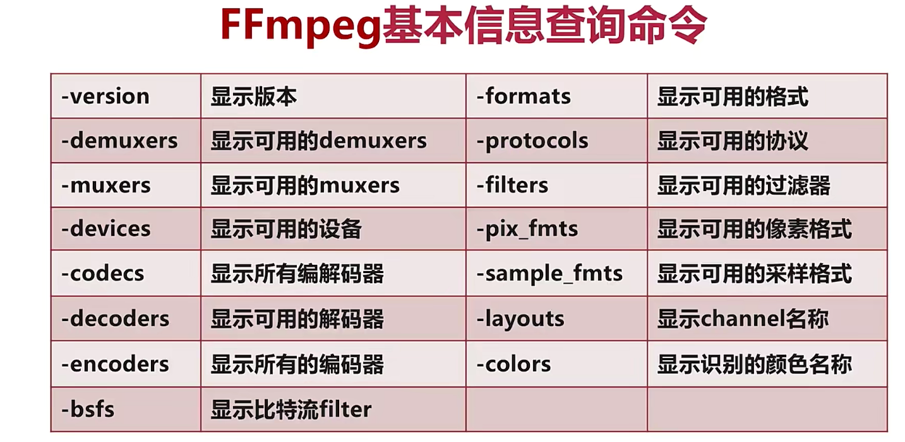

## 2.1 录制命令

> 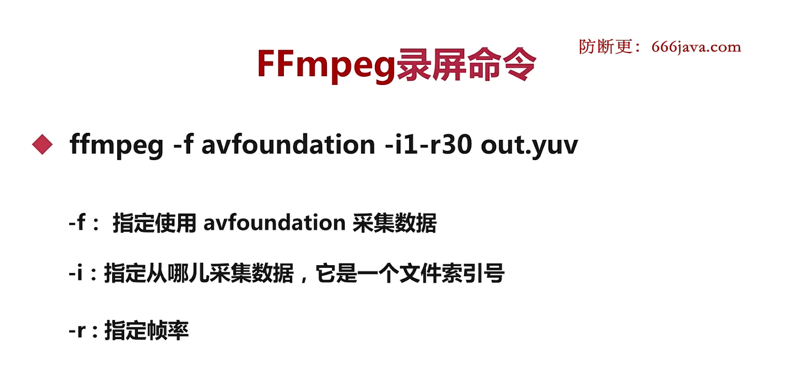
>
> ```shell
> # .yuv表示无压缩的原始数据
> ffmpeg -f avfoundation -i1 -r30 out.yuv
> # 播放视频
> ffplay -s 2560x1600 -pix_fmt uyvy422 out.yuv
> ffmpeg -f avfoundation -list_devices true -i ""
> ```
>
> 

## 2.2 分解与复用命令

> 
>
> 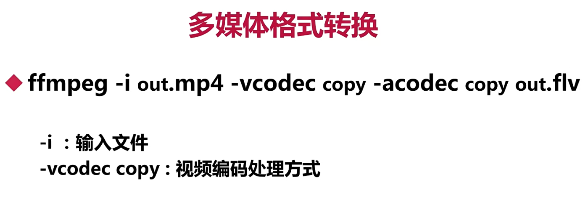
>
> ```shell
> # 抽取视频
> ffmpeg -i f35.mov -an -vcodec copy out.h264
> # 播放视频
> ffplay out.h264
> # 抽取音频
> ffmpeg -i f35.mov -acodec copy -vn out.aac
> ```

## 2.2 ffmpeg处理原始数据

> 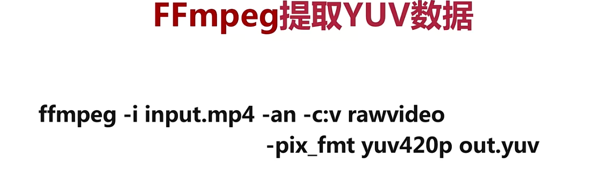
>
> 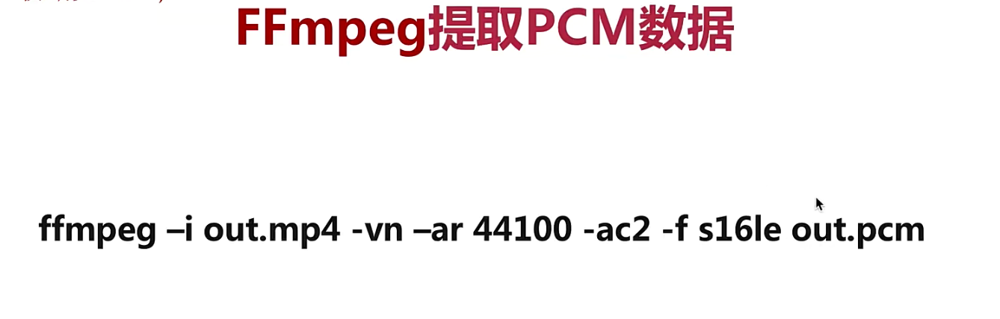

## 2.3 ffmpeg滤镜命令

> 
>
> 

## 2.4 ffmpeg音视频裁剪

> 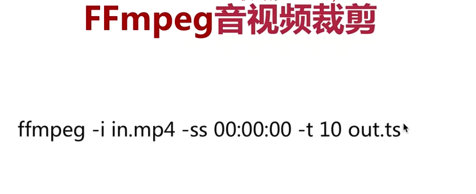
>
> 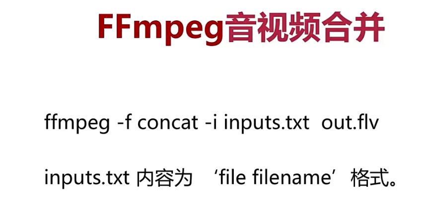

## 2.5 图片与视频互转命令

> 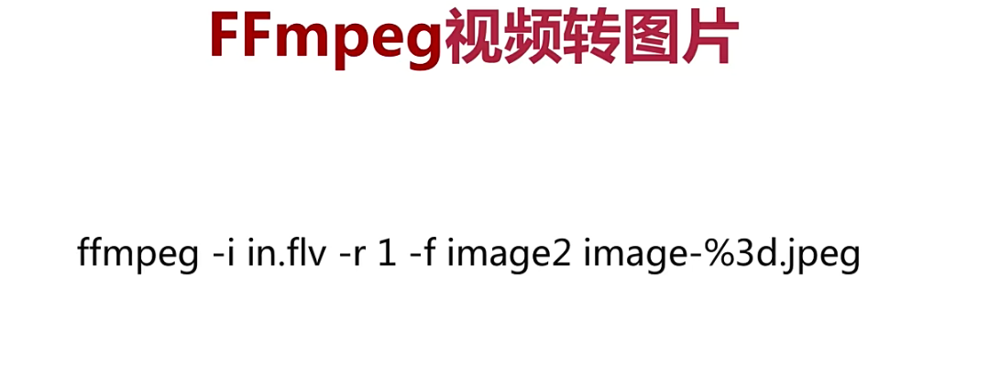
>
> 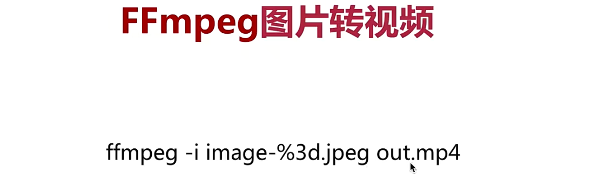

## 2.6 ffmpeg直播推/拉流

> 
>
> 

## 2.7 ffmpeg处理流程

> 

# 3 ffmpeg开发

> 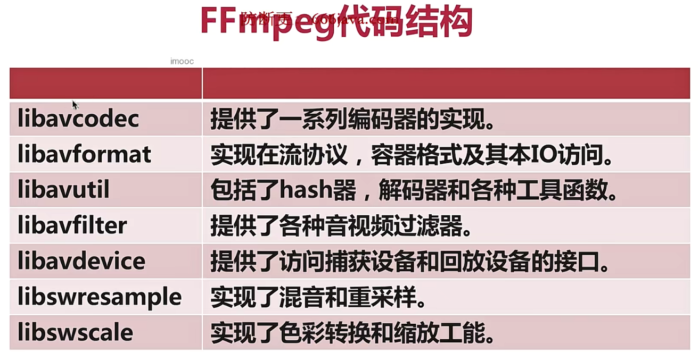

## 3. 1 ffmpeg日志系统

> 
>
> 
>
> ```c++
> #include <stdio.h>
> #include <libavutil/log.h>
> 
> int main() {
>  av_log_set_level( AV_LOG_DEBUG );
>  av_log( NULL , AV_LOG_INFO , "Hello World! %s\n", "LiQiaosheng" );
>  return 0;
> }
> ```
>

## 3.2 ffmpeg文件和目录操作

> 
>
> ```c++
> #include <libavformat/avformat.h>
> #include <libavutil/log.h>
> 
> int main( int argc , char *argv[] ) {
>     int ret;
>     ret = avpriv_io_move( "111.txt" , "222.txt" );
>     if (ret < 0) {
>         av_log( NULL , AV_LOG_ERROR , "Failed to rename\n" );
>         return -1;
>     }
>     av_log( NULL , AV_LOG_INFO , "Success to rename" );
>     
>     ret = avpriv_io_delete( "./mytestfile.txt" );
>     if (ret < 0) {
>         av_log( NULL , AV_LOG_ERROR , "Failed to delete file mytestfile.txt\n" );
>         return -1;
>     }
>     av_log( NULL , AV_LOG_INFO , "Success to delete mytestfile.txt\n" );
>     
>     return 0;
> }
> ```
>
> 
>
> 
>
> ```c
> #include <libavutil/log.h>
> #include <libavformat/avformat.h>
> 
> int main( int argc , char *argv[] ) {
>     int ret = -1;
>     AVIODirContext *ctx = NULL;
>     AVIODirEntry *entry = NULL;
>     av_log_set_level( AV_LOG_INFO );
>     ret = avio_open_dir( &ctx , "/home/li/" , NULL );
>     if (ret < 0) {
>         av_log( NULL , AV_LOG_ERROR , "Can't open dir: %s\n" , av_err2str( ret ) );
>         return -1;
>     }
>     while (1) {
>         ret = avio_read_dir( ctx , &entry );
>         if (ret < 0) {
>             av_log( NULL , AV_LOG_ERROR , "Can't read dir:%s\n" , av_err2str( ret ) );
>             goto __fail;
>         }
>         // 读到末尾
>         if (!entry) {
>             break;
>         }
>         av_log( NULL , AV_LOG_INFO , "%12"PRId64" %s \n" , entry->size , entry->name );
>         avio_free_directory_entry( &entry );
>     }
>     // 关闭目录
> __fail:
>     avio_close_dir( &ctx );
>     
>     return 0;
> }
> ```

## 3.3 多媒体文件的基本概念

> 
>
> 
>
> 
>
> 
>
> **多媒体文件中抽取音频**
>
> ```c
> #include <stdio.h>
> #include <libavutil/log.h>
> #include <libavutil/avutil.h>
> #include <libavformat/avformat.h>
> 
> int main( int argc , char *argv[] ) {
>  // 1. 处理一些参数
>  int ret = -1;
>  int idx = -1;
> 
>  char *src;
>  char *dst;
> 
>  AVFormatContext *pFmtCtx = NULL;
>  AVFormatContext *oFmtCtx = NULL;
> 
>  const AVOutputFormat *outFmt = NULL;
>  AVStream *outStream = NULL;
>  AVStream *inStream = NULL;
>  AVPacket pkt;
> 
>  if (argc < 3) {
>      av_log( NULL , AV_LOG_INFO , "arguments must be more than 3!\n" );
>      exit( -1 );
>  }
>  src = argv[1];
>  dst = argv[2];
> 
>  // 2. 打开多媒体文件，解封装
>  if (( ret = avformat_open_input( &pFmtCtx , src , NULL , NULL ) ) < 0) {
>      av_log( NULL , AV_LOG_ERROR , "%s\n" , av_err2str( ret ) );
>      exit( -1 );
>  }
> 
>  // 3. 从媒体文件中找到音频流
>  idx = av_find_best_stream( pFmtCtx , AVMEDIA_TYPE_AUDIO , -1 , -1 , NULL , 0 );
>  if (idx < 0) {
>      av_log( pFmtCtx , AV_LOG_ERROR , "Does not include audio stream!" );
>      goto _ERROR;
>  }
> 
>  // 4. 创建目的文件的上下文
>  oFmtCtx = avformat_alloc_context();
>  if (!oFmtCtx) {
>      av_log( NULL , AV_LOG_ERROR , "No Memory!\n" );
>      goto _ERROR;
>  }
>  // 根据dst设置outFmt的封装格式及其参数
>  outFmt = av_guess_format( NULL , dst , NULL );
>  oFmtCtx->oformat = outFmt;
> 
>  // 5. 为目的文件，创建一个新的音频流
>  avformat_new_stream( oFmtCtx , NULL );
> 
>  // 6. 设置输出音频参数
>  inStream = pFmtCtx->streams[idx];
>  // 将源音频流的编码参数拷贝给输出流
>  avcodec_parameters_copy( outStream->codecpar , inStream->codecpar );
>  // 自动检测编码算法
>  outStream->codecpar->codec_tag = 0;
> 
>  // 7. 写多媒体文件头到目的文件
>  // 创建目标文件及与绑定
>  ret = avio_open2( &oFmtCtx->pb , dst , AVIO_FLAG_WRITE , NULL , NULL );
>  if (ret < 0) {
>      av_log( oFmtCtx , AV_LOG_ERROR , "%s" , av_err2str( ret ) );
>      goto _ERROR;
>  }
>  ret = avformat_write_header( oFmtCtx , NULL );
>  if (ret < 0) {
>      av_log( oFmtCtx , AV_LOG_ERROR , "%s" , av_err2str( ret ) );
>      goto _ERROR;
>  }
>  // 8. 从源多媒体文件中读到音频数据到目的文件中
>  while (av_read_frame( pFmtCtx , &pkt ) >= 0) {
>      if (pkt.stream_index == idx) {
>          // 换算播放时间戳
>          pkt.pts = av_rescale_q_rnd( pkt.pts , inStream->time_base , outStream->time_base , ( AV_ROUND_NEAR_INF | AV_ROUND_PASS_MINMAX ) );
>          pkt.dts = pkt.pts;
>          pkt.duration = av_rescale_q( pkt.duration , inStream->time_base , outStream->time_base );
>          pkt.stream_index = 0;
>          pkt.pos = -1;
>          av_interleaved_write_frame( oFmtCtx , &pkt );
>          av_packet_unref( &pkt );
>      }
>  }
>  // 9. 写多媒体文件尾到文件中
>  av_write_trailer( oFmtCtx );
>  // 10. 将申请的资源释放掉
> _ERROR:
>  if (pFmtCtx) {
>      avformat_close_input( &pFmtCtx );
>      pFmtCtx = NULL;
>  }
>  if (oFmtCtx->pb) {
>      avio_close( oFmtCtx->pb );
>  }
>  if (oFmtCtx) {
>      avformat_free_context( oFmtCtx );
>      oFmtCtx = NULL;
>  }
>  return 0;
> }
> ```
>
> ```shell
> $ gcc extra_audio.c -o extra_audio -lavutil -lavformat -lavcodec
> ```
>
> **多媒体文件抽取视频流**
>
> ```c
> #include <stdio.h>
> #include <libavutil/log.h>
> #include <libavutil/avutil.h>
> #include <libavformat/avformat.h>
> 
> int main( int argc , char *argv[] ) {
>     // 1. 处理一些参数
>     int ret = -1;
>     int idx = -1;
> 
>     char *src;
>     char *dst;
> 
>     AVFormatContext *pFmtCtx = NULL;
>     AVFormatContext *oFmtCtx = NULL;
> 
>     const AVOutputFormat *outFmt = NULL;
>     AVStream *outStream = NULL;
>     AVStream *inStream = NULL;
>     AVPacket pkt;
> 
>     if (argc < 3) {
>         av_log( NULL , AV_LOG_INFO , "arguments must be more than 3!\n" );
>         exit( -1 );
>     }
>     src = argv[1];
>     dst = argv[2];
>     
>     // 2. 打开多媒体文件，解封装
>     if (( ret = avformat_open_input( &pFmtCtx , src , NULL , NULL ) ) < 0) {
>         av_log( NULL , AV_LOG_ERROR , "%s\n" , av_err2str( ret ) );
>         exit( -1 );
>     }
>     
>     // 3. 从媒体文件中找到视频流
>     idx = av_find_best_stream( pFmtCtx , AVMEDIA_TYPE_VIDEO , -1 , -1 , NULL , 0 );
>     if (idx < 0) {
>         av_log( pFmtCtx , AV_LOG_ERROR , "Does not include audio stream!" );
>         goto _ERROR;
>     }
>     
>     // 4. 创建目的文件的上下文
>     oFmtCtx = avformat_alloc_context();
>     if (!oFmtCtx) {
>         av_log( NULL , AV_LOG_ERROR , "No Memory!\n" );
>         goto _ERROR;
>     }
>     // 根据dst设置outFmt的封装格式及其参数
>     outFmt = av_guess_format( NULL , dst , NULL );
>     oFmtCtx->oformat = outFmt;
>     
>     // 5. 为目的文件，创建一个新的视频流
>     avformat_new_stream( oFmtCtx , NULL );
>     
>     // 6. 设置输出视频参数
>     inStream = pFmtCtx->streams[idx];
>     // 将源音频流的编码参数拷贝给输出流
>     avcodec_parameters_copy( outStream->codecpar , inStream->codecpar );
>     // 自动检测编码算法
>     outStream->codecpar->codec_tag = 0;
>     
>     // 7. 写多媒体文件头到目的文件
>     // 创建目标文件及与绑定
>     ret = avio_open2( &oFmtCtx->pb , dst , AVIO_FLAG_WRITE , NULL , NULL );
>     if (ret < 0) {
>         av_log( oFmtCtx , AV_LOG_ERROR , "%s" , av_err2str( ret ) );
>         goto _ERROR;
>     }
>     ret = avformat_write_header( oFmtCtx , NULL );
>     if (ret < 0) {
>         av_log( oFmtCtx , AV_LOG_ERROR , "%s" , av_err2str( ret ) );
>         goto _ERROR;
>     }
>     // 8. 从源多媒体文件中读到视频数据到目的文件中
>     while (av_read_frame( pFmtCtx , &pkt ) >= 0) {
>         if (pkt.stream_index == idx) {
>             // 换算播放时间戳
>             pkt.pts = av_rescale_q_rnd( pkt.pts , inStream->time_base , outStream->time_base , ( AV_ROUND_NEAR_INF | AV_ROUND_PASS_MINMAX ) );
>             pkt.dts = av_rescale_q_rnd(pkt.dts, inStream->time_base, outStream->time_base, (AV_ROUND_NEAR_INF| AV_ROUND_PASS_MINMAX));
>             pkt.duration = av_rescale_q( pkt.duration , inStream->time_base , outStream->time_base );
>             pkt.stream_index = 0;
>             pkt.pos = -1;
>             av_interleaved_write_frame( oFmtCtx , &pkt );
>             av_packet_unref( &pkt );
>         }
>     }
>     // 9. 写多媒体文件尾到文件中
>     av_write_trailer( oFmtCtx );
>     // 10. 将申请的资源释放掉
> _ERROR:
>     if (pFmtCtx) {
>         avformat_close_input( &pFmtCtx );
>         pFmtCtx = NULL;
>     }
>     if (oFmtCtx->pb) {
>         avio_close( oFmtCtx->pb );
>     }
>     if (oFmtCtx) {
>         avformat_free_context( oFmtCtx );
>         oFmtCtx = NULL;
>     }
>     return 0;
> }
> ```

## 3.4 封装格式转换

> 
>
> ```c
> #include <stdio.h>
> #include <libavutil/log.h>
> #include <libavutil/avutil.h>
> #include <libavformat/avformat.h>
> 
> int main( int argc , char *argv[] ) {
>     // 1. 处理一些参数
>     int ret = -1;
>     int idx = -1;
>     int i = 0;
>     int stream_idx = 0;
> 
>     int *stream_map = NULL;
> 
>     char *src;
>     char *dst;
> 
>     AVFormatContext *pFmtCtx = NULL;
>     AVFormatContext *oFmtCtx = NULL;
> 
>     const AVOutputFormat *outFmt = NULL;
>     AVPacket pkt;
> 
>     if (argc < 3) {
>         av_log( NULL , AV_LOG_INFO , "arguments must be more than 3!\n" );
>         exit( -1 );
>     }
>     src = argv[1];
>     dst = argv[2];
>     
>     // 2. 打开多媒体文件，解封装
>     if (( ret = avformat_open_input( &pFmtCtx , src , NULL , NULL ) ) < 0) {
>         av_log( NULL , AV_LOG_ERROR , "%s\n" , av_err2str( ret ) );
>         exit( -1 );
>     }
>     
>     // 3. 创建输出上下文，并猜测输出封装格式
>     avformat_alloc_output_context2( &oFmtCtx , NULL , NULL , dst );
>     if (!oFmtCtx) {
>         av_log( NULL , AV_LOG_ERROR , "NO MEMORY!\n" );
>         goto _ERROR;
>     }
> 
>     stream_map = av_alloc( pFmtCtx->nb_streams , sizeof( int ) );
>     if (!stream_map) {
>         av_log( NULL , AV_LOG_ERROR , "NO MEMORY!\n" );
>         goto _ERROR;
>     }
>     for (i = 0; i < pFmtCtx->nb_streams; i++) {
>         AVStream *outStream = NULL;
>         AVStream *inStream = pFmtCtx->streams[i];
>         AVCodecParameters *inCodecPar = inStream->codecpar;
> 
>         if (inCodecPar->codec_type != AVMEDIA_TYPE_AUDIO &&
>             inCodecPar->codec_type != AVMEDIA_TYPE_VIDEO &&
>             inCodecPar->codec_type != AVMEDIA_TYPE_SUBTITLE) {
>             stream_map[i] = -1;
>             continue;
>         }
>         stream_map[i] = stream_idx++;
>         // 4. 为输出文件创建流
>         outStream = avformat_new_stream( oFmtCtx , NULL );
>         if (!outStream) {
>             av_log( oFmtCtx , AV_LOG_ERROR , "NO MEMORY!\n" );
>             goto _ERROR;
>         }
>         avcodec_parameters_copy( outStream->codecpar , inStream->codecpar );
>         outStream->codecpar->codec_tag = 0;
>     }
>     
>     // 5. 写多媒体文件头到目的文件
>     // 创建目标文件及与绑定
>     ret = avio_open2( &oFmtCtx->pb , dst , AVIO_FLAG_WRITE , NULL , NULL );
>     if (ret < 0) {
>         av_log( oFmtCtx , AV_LOG_ERROR , "%s" , av_err2str( ret ) );
>         goto _ERROR;
>     }
>     ret = avformat_write_header( oFmtCtx , NULL );
>     if (ret < 0) {
>         av_log( oFmtCtx , AV_LOG_ERROR , "%s" , av_err2str( ret ) );
>         goto _ERROR;
>     }
>     // 6. 从源多媒体文件中读到音频/视频/字幕数据到目的文件中
>     while (av_read_frame( pFmtCtx , &pkt ) >= 0) {
>         AVStream *inStream , *outStream;
>         
>         if (s < 0) {
>             av_packet_unref( &pkt );
>             continue;
>         }
>         
>         inStream = pFmtCtx->streams[pkt.stream_index];
>         pkt.stream_index = stream_map[pkt.stream_index];
>         outStream = oFmtCtx->streams[pkt.stream_index];
>         
>         av_packet_rescale_ts( &pkt , inStream->time_base , outStream->time_base );
>         pkt.pos = -1;
>         av_interleaved_write_frame( oFmtCtx , &pkt );
>         av_packet_unref( &pkt );
>     }
>     // 7. 写多媒体文件尾到文件中
>     av_write_trailer( oFmtCtx );
>     // 8. 将申请的资源释放掉
> _ERROR:
>     if (pFmtCtx) {
>         avformat_close_input( &pFmtCtx );
>         pFmtCtx = NULL;
>     }
>     if (oFmtCtx->pb) {
>         avio_close( oFmtCtx->pb );
>     }
>     if (oFmtCtx) {
>         avformat_free_context( oFmtCtx );
>         oFmtCtx = NULL;
>     }
>     if (stream_map) {
>         av_free( stream_map );
>     }
>     return 0;
> }
> ```

## 3.5 视频裁剪

> 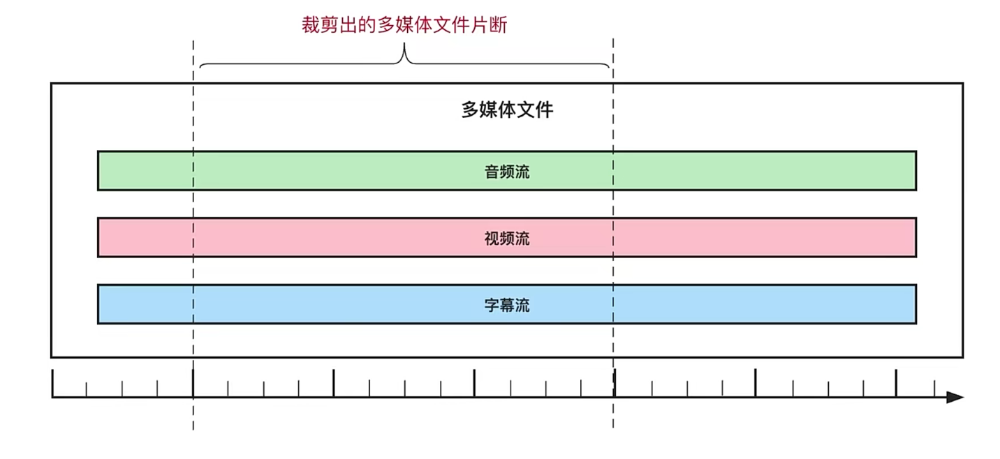
>
> ```c
> #include <stdio.h>
> #include <stdlib.h>
> #include <libavutil/log.h>
> #include <libavutil/avutil.h>
> #include <libavformat/avformat.h>
> 
> int main( int argc , char *argv[] ) {
>     // 1. 处理一些参数
>     int ret = -1;
>     int idx = -1;
>     int i = 0;
>     int stream_idx = 0;
> 
>     int *stream_map = NULL;
>     int64_t *dts_start_time = NULL;
>     int64_t *pts_start_time = NULL;
> 
>     char *src;
>     char *dst;
>     double starttime = 0;
>     double endtime = 0;
> 
> 
>     AVFormatContext *pFmtCtx = NULL;
>     AVFormatContext *oFmtCtx = NULL;
> 
>     const AVOutputFormat *outFmt = NULL;
>     AVPacket pkt;
> 
>     // cut src dst start end
>     if (argc < 5) {
>         av_log( NULL , AV_LOG_INFO , "arguments must be more than 5!\n" );
>         exit( -1 );
>     }
>     src = argv[1];
>     dst = argv[2];
>     starttime = atof( argv[3] );
>     endtime = atof( argv[4] );
> 
>     // 2. 打开多媒体文件，解封装
>     if (( ret = avformat_open_input( &pFmtCtx , src , NULL , NULL ) ) < 0) {
>         av_log( NULL , AV_LOG_ERROR , "%s\n" , av_err2str( ret ) );
>         exit( -1 );
>     }
>     
>     // 3. 创建输出上下文，并猜测输出封装格式
>     avformat_alloc_output_context2( &oFmtCtx , NULL , NULL , dst );
>     if (!oFmtCtx) {
>         av_log( NULL , AV_LOG_ERROR , "NO MEMORY!\n" );
>         goto _ERROR;
>     }
> 
>     stream_map = av_alloc( pFmtCtx->nb_streams , sizeof( int ) );
>     if (!stream_map) {
>         av_log( NULL , AV_LOG_ERROR , "NO MEMORY!\n" );
>         goto _ERROR;
>     }
>     for (i = 0; i < pFmtCtx->nb_streams; i++) {
>         AVStream *outStream = NULL;
>         AVStream *inStream = pFmtCtx->streams[i];
>         AVCodecParameters *inCodecPar = inStream->codecpar;
> 
>         if (inCodecPar->codec_type != AVMEDIA_TYPE_AUDIO &&
>             inCodecPar->codec_type != AVMEDIA_TYPE_VIDEO &&
>             inCodecPar->codec_type != AVMEDIA_TYPE_SUBTITLE) {
>             stream_map[i] = -1;
>             continue;
>         }
>         stream_map[i] = stream_idx++;
>         // 4. 为输出文件创建流
>         outStream = avformat_new_stream( oFmtCtx , NULL );
>         if (!outStream) {
>             av_log( oFmtCtx , AV_LOG_ERROR , "NO MEMORY!\n" );
>             goto _ERROR;
>         }
>         avcodec_parameters_copy( outStream->codecpar , inStream->codecpar );
>         outStream->codecpar->codec_tag = 0;
>     }
>     
>     // 5. 写多媒体文件头到目的文件
>     // 创建目标文件及与绑定
>     ret = avio_open2( &oFmtCtx->pb , dst , AVIO_FLAG_WRITE , NULL , NULL );
>     if (ret < 0) {
>         av_log( oFmtCtx , AV_LOG_ERROR , "%s" , av_err2str( ret ) );
>         goto _ERROR;
>     }
>     
>     ret = avformat_write_header( oFmtCtx , NULL );
>     if (ret < 0) {
>         av_log( oFmtCtx , AV_LOG_ERROR , "%s" , av_err2str( ret ) );
>         goto _ERROR;
>     }
> 
>     ret = av_seek_frame( pFmtCtx , -1 , starttime * AV_TIME_BASE , AVSEEK_FLAG_BACKWARD );
>     if (ret < 0) {
>         av_log( oFmtCtx , AV_LOG_ERROR , "%s" , av_err2str( ret ) );
>         goto _ERROR;
>     }
> 
>     dts_start_time = av_alloc( pFmtCtx->nb_streams , sizeof( int64_t ) );
>     for (int t = 0; t < pFmtCtx->nb_streams; t++) {
>         dts_start_time[t] = -1;
>     }
>     
>     pts_start_time = av_alloc( pFmtCtx->nb_streams , sizeof( int64_t ) );
>     for (int t = 0; t < pFmtCtx->nb_streams; t++) {
>         pts_start_time[t] = -1;
>     }
>     // 6. 从源多媒体文件中读到音频/视频/字幕数据到目的文件中
>     while (av_read_frame( pFmtCtx , &pkt ) >= 0) {
>         AVStream *inStream , *outStream;
> 
>         if (dts_start_time[pkt.stream_index] == -1 && pkt.dts > 0) {
>             dts_start_time[pkt.stream_index] = pkt.dts;
>         }
> 
>         if (dts_start_time[pkt.stream_index] == -1 && pkt.pts > 0) {
>             pts_start_time[pkt.stream_index] = pkt.pts;
>         }
>         
>         inStream = pFmtCtx->streams[pkt.stream_index];
>         if (av_q2d( inStream->time_base ) * pkt.pts > endtime) {
>             av_log( oFmtCtx , AV_LOG_INFO , "success!\n" );
>             break;
>         }
>         if (stream_map[pkt.stream_index] < 0) {
>             av_packet_unref( &pkt );
>             continue;
>         }
>         pkt.pts = pkt.pts - pts_start_time[pkt.stream_index];
>         pkt.dts = pkt.dts - dts_start_time[pkt.stream_index];
>         
>         if (pkt.dts > pkt.pts) {
>             pkt.pts = pkt.dts;
>         }
> 
>         pkt.stream_index = stream_map[pkt.stream_index];
>         outStream = oFmtCtx->streams[pkt.stream_index];
>         
>         av_packet_rescale_ts( &pkt , inStream->time_base , outStream->time_base );
>         
>         pkt.pos = -1;
>         av_interleaved_write_frame( oFmtCtx , &pkt );
>         av_packet_unref( &pkt );
>     }
>     // 7. 写多媒体文件尾到文件中
>     av_write_trailer( oFmtCtx );
>     // 8. 将申请的资源释放掉
> _ERROR:
>     if (pFmtCtx) {
>         avformat_close_input( &pFmtCtx );
>         pFmtCtx = NULL;
>     }
>     if (oFmtCtx->pb) {
>         avio_close( oFmtCtx->pb );
>     }
>     if (oFmtCtx) {
>         avformat_free_context( oFmtCtx );
>         oFmtCtx = NULL;
>     }
>     if (stream_map) {
>         av_free( stream_map );
>     }
> 
>     if (dts_start_time) {
>         av_free( dts_start_time );
>     }
>     if (pts_start_time) {
>         av_free( pts_start_time );
>     }
>     return 0;
> }
> ```

# 4 编解码

> 
>
> 
>
> 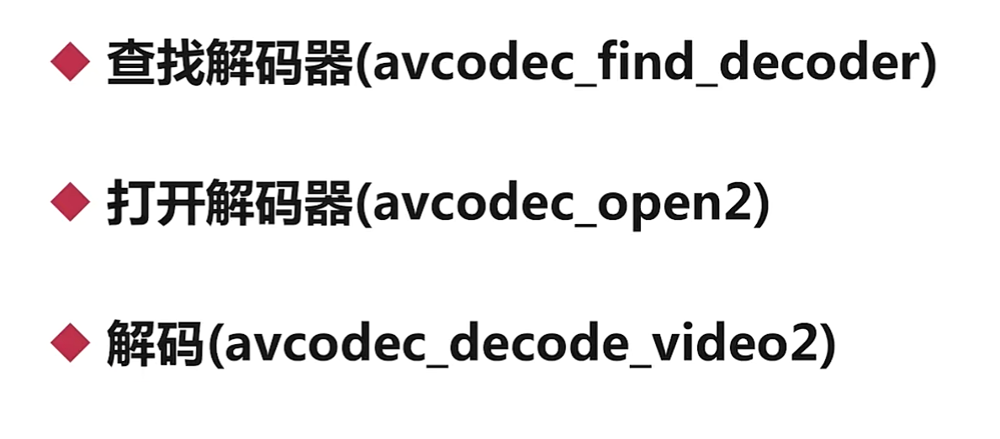
>
> ```c
> #include <libavutil/log.h>
> #include <libavcodec/avcodec.h>
> #include <libavutil/avutil.h>
> 
> // ./encode_video 6-1.h264 libx264
> static int encode( AVCodecContext *ctx , AVFrame *frame , AVPacket *pkt , FILE *out ) {
>     int ret = -1;
>     ret = avcodec_send_frame( ctx , frame );
>     if (ret < 0) {
>         av_log( NULL , AV_LOG_ERROR , "Failed to send frame to encoder!\n" );
>         goto _END;
>     }
>     while (ret >= 0) {
>         ret = avcodec_receive_packet( ctx , pkt );
>         if (ret == AVERROR( EAGAIN ) || ret == AVERROR_EOF) {
>             return 0;
>         }
>         else if (ret < 0) {
>             return -1;
>         }
> 
>         fwrite( pkt->data , 1 , pkt->size , out );
>         av_packet_unref( pkt );
>     }
> _END:
>     return 0;
> }
> int main( int argc , char *argv[] ) {
>     int ret = -1;
> 
>     FILE *f = NULL;
>     char *dst = NULL;
>     char *codecName = NULL;
>     const AVCodec *codec = NULL;
>     AVCodecContext *ctx = NULL;
>     AVFrame *frame = NULL;
>     AVPacket *pkt = NULL;
> 
>     av_log_set_level( AV_LOG_DEBUG );
>     // 1. 输入参数
>     if (argc < 3) {
>         av_log( NULL , AV_LOG_ERROR , "arguments must be more than 3\n" );
>         goto _ERROR;
>     }
> 
>     dst = argv[1];
>     codecName = argv[2];
>     
>     // 2. 查找编码器
>     codec = avcodec_find_encoder_by_name( codecName );
>     if (!codec) {
>         av_log( NULL , AV_LOG_ERROR , "don't find Codec: %s\n" , codecName );
>         goto _ERROR;
>     }
>     
>     // 3. 创建编码器上下文
>     ctx = avcodec_alloc_context3( codec );
>     if (!ctx) {
>         av_log( NULL , AV_LOG_ERROR , "No Memory!\n" );
>         goto _ERROR;
>     }
>     
>     // 4. 设置编码器参数
>     ctx->width = 640;
>     ctx->height = 480;
>     ctx->bit_rate = 500000;
> 
>     ctx->time_base = ( AVRational ) { 1, 25 };
>     ctx->framerate = ( AVRational ) { 25, 1 };
> 
>     ctx->gop_size = 10;
>     ctx->max_b_frames = 1;
>     ctx->pix_fmt = AV_PIX_FMT_YUV411P;
> 
>     if (codec->id == AV_CODEC_ID_H264) {
>         av_opt_set( ctx->priv_data , "preset" , "slow", 0);
>     }
>     
>     // 5. 编码器与编码器上下文绑定到一起
>     ret = avcodec_open2( ctx , codec , NULL );
>     if (ret < 0) {
>         av_log( ctx , AV_LOG_ERROR , "Don't open codec: %s\n" , av_err2str( ret ) );
>         goto _ERROR;
>     }
>     // 6. 创建输出文件
>     f = fopen( dst , "wb" );
>     if (!f) {
>         av_log( NULL , AV_LOG_ERROR , "Don't open file:%s\n" , dst );
>         goto _ERROR;
>     }
>     // 7. 创建AVFrame
>     frame = av_frame_alloc();
>     if (!frame) {
>         av_log( NULL , AV_LOG_ERROR , "No Memory!\n");
>         goto _ERROR;
>     }
> 
>     frame->width = ctx->width;
>     frame->height = ctx->height;
>     frame->format = ctx->pix_fmt;
>     
>     ret = av_frame_get_buffer( frame , 0 );
>     if (ret < 0) {
>         av_log( NULL , AV_LOG_ERROR , "Could not allocate the video frame\n" );
>         goto _ERROR;
>     }
>     // 8. 创建AVPacket
>     pkt = av_packet_alloc();
>     if (!pkt) {
>         av_log( NULL , AV_LOG_ERROR , "No Memory!\n" );
>         goto _ERROR;
>     }
>     // 9. 生成视频内容
>     for (int i = 0; i < 25; i++) {
>         ret = av_frame_make_writable( frame );
>         if (ret < 0) {
>             break;
>         }
>         // Y分量
>         for (int y = 0; y < ctx->height; y++) {
>             for (int x = 0; x < ctx->width; x++) {
>                 frame->data[0][y * frame->linesize[0] + x] = x + y + i * 3;
>             }
>         }
> 
>         // UV分量
>         for (int y = 0; y < ctx->height / 2; y++) {
>             for (int x = 0; x < ctx->width / 2; x++) {
>                 frame->data[1][y * frame->linesize[1] + x] = 128 + y + i * 2;
>                 frame->data[2][y * frame->linesize[2] + x] = 64 + x + i * 5;
>             }
>         }
> 
>         frame->pts = i;
>         // 10. 编码
>         ret = encode( ctx , frame , pkt , f );
>         if (ret == -1) {
>             goto _ERROR;
>         }
>     }
>     encode( ctx , NULL , pkt , f );
> _ERROR:
>     if (ctx) {
>         avcodec_free_context( &ctx );
>     }
>     if (frame) {
>         av_frame_free( &frame );
>     }
>     if (pkt) {
>         av_packet_free( &pkt );
>     }
>     if (f) {
>         fclose( f );
>     }
>     return 0;
> }
> ```