# 1 `AVPacket`

> 原文链接：[AVPacket_开水太烫的博客-CSDN博客](https://blog.csdn.net/weixin_42123332/article/details/120742502)
>
> AVPacket是FFmpeg中很重要的一个数据结构，它保存了解复用之后，解码之前的数据（仍然是压缩后的数据）和关于这些数据的一些附加信息，如显示时间戳（pts）、解码时间戳（dts）、数据时长，所在媒体流的索引等。对于视频来说，AVPacket通常包含一个压缩的Frame，而音频（Audio）则有可能包含多个压缩的Frame。并且，一个Packet有可能是空的，不包含任何压缩数据，只含有side
> data（side
> data，容器提供的关于Packet的一些附加信息。例如，在编码结束的时候更新一些流的参数）。AVPacket的大小是公共的ABI（public
> ABI）一部分，这样的结构体在FFmpeg很少，由此也可见AVPacket的重要性。它可以被分配在栈空间上（可以使用语句AVPacket
> packet; 在栈空间定义一个Packet ），并且除非libavcodec 和
> libavformat有很大的改动，不然不会在AVPacket中添加新的字段。
>
> `AVPacket` => `avcodec.h`
>
> ```c
> /**
>  * 该结构用来存储压缩数据. 这是典型的解复合器的输出然后塞入解码器，或者是接收编码器的输出然后塞入复合器
>  * 解复合器 --> AVPacket --> 解码器 --> YUV/RGB --> 编码器 --> AVPacket -->复合器
>  * 此结构存储压缩数据。它通常由分路器导出
>  * 然后作为输入传递给解码器，或作为输出从编码器接收和
>  * 然后传递给多路复用器。
>  *
>  * 对于视频，它通常应包含一个压缩帧。对于音频，它可能
>  * 包含几个压缩帧。编码器允许输出空
>  * 数据包，没有压缩数据，只包含边数据
>  *（例如在编码结束时更新一些流参数）。
>  *
>  * AVPacket 是 FFmpeg 中为数不多的结构体之一，其大小是 public 的一部分
>  * ABI。因此它可以在堆栈上分配并且不能向其中添加新字段
>  * 没有 libavcodec 和 libavformat 主要问题。
>  *
>  * 数据所有权的语义取决于 buf 字段。
>  * 如果设置，则包数据是动态分配的
>  * 无限期有效，直到调用 av_packet_unref() 减少
>  * 引用计数为 0。
>  *
>  * 如果未设置 buf 字段，则 av_packet_ref() 将进行复制
>  * 增加引用计数。
>  *
>  * 侧边数据总是用av_malloc()分配，复制
>  * av_packet_ref() 并由 av_packet_unref() 释放。
>  *
>  * @see av_packet_ref
>  * @see av_packet_unref
>  */
> typedef struct AVPacket {
>     /**
> * 对数据包数据所在的引用计数缓冲区的引用
>       * 存储。
>       * 可能为NULL，则数据包数据不被引用计数。
>      */
>     AVBufferRef *buf;
>     /**
> * 以 AVStream->time_base 为单位的演示时间戳； 的时间
>       * 解压后的数据包将呈现给用户。
>       * 如果未存储在文件中，则可以是 AV_NOPTS_VALUE。
>       * pts 必须大于或等于 dts 因为演示不能在之前发生
>       * 解压，除非想要查看十六进制转储。 某些格式误用
>       * 术语 dts 和 pts/cts 表示不同的含义。 这样的时间戳
>       * 在将它们存储在 AVPacket 中之前，必须将它们转换为真正的 pts/dts。
>      */
>     int64_t pts;
>     /**
> * 以 AVStream->time_base 为单位的解压时间戳； 的时间
>       * 数据包被解压。
>       * 如果未存储在文件中，则可以是 AV_NOPTS_VALUE。
>      */
>     int64_t dts;
>     uint8_t *data;
>     int   size;
>     int   stream_index;
>     /**
> * AV_PKT_FLAG 值的组合
>      */
>     int   flags;
>     /**
> * 容器可以提供的额外数据包数据。
>       * 数据包可以包含多种类型的边信息。
>      */
>     AVPacketSideData *side_data;
>     int side_data_elems;
> 
>     /**
> * 此数据包的持续时间以 AVStream->time_base 为单位，如果未知则为 0。
>       * 等于 next_pts - this_pts 按演示顺序。
>      */
>     int64_t duration;
> 
>     int64_t pos;                            ///< byte position in stream, -1 if unknown
> 
> #if FF_API_CONVERGENCE_DURATION
>     /**
> * @deprecated 与持续时间字段相同，但与 int64_t 相同。 这是必需的
>       * 对于 Matroska 字幕，其持续时间值可能会在
>       * 持续时间字段仍然是一个整数。
>      */
>     attribute_deprecated
>     int64_t convergence_duration;
> #endif
> } AVPacket;
> 
> ```

## 1.1 `AVPacket`相关API

### `av_packet_alloc()`

> ```c
> /**
>  * 分配一个 AVPacket 并将其字段设置为默认值。 所结果的
>   * 必须使用 av_packet_free() 释放结构体。
>   *
>   * @return 一个 AVPacket 填充默认值或失败时为 NULL。
>   *
>   * @note 这只会分配 AVPacket 本身，而不是数据缓冲区。 那些
>   * 必须通过av_new_packet等其他方式分配。
>   *
>   * @see av_new_packet
>  */
> AVPacket *av_packet_alloc(void);
> //源码:
> AVPacket *av_packet_alloc(void)
> {
>     AVPacket *pkt = av_mallocz(sizeof(AVPacket));
>     if (!pkt)
>         return pkt;
> 
>     av_packet_unref(pkt);
> 
>     return pkt;
> }
> ```

### `av_packet_clone`

> ```c
> /**
> * 创建一个引用与 src 相同数据的新数据包。
>   *
>   * 这是 av_packet_alloc()+av_packet_ref() 的快捷方式。
>   *
>   * @return 成功时新创建的 AVPacket，错误时为 NULL。
>   *
>   * @see av_packet_alloc
>   * @see av_packet_ref
>  */
> AVPacket *av_packet_clone(const AVPacket *src);
> //源码:
> AVPacket *av_packet_clone(const AVPacket *src)
> {
>     AVPacket *ret = av_packet_alloc();
> 
>     if (!ret)
>         return ret;
> 
>     if (av_packet_ref(ret, src))
>         av_packet_free(&ret);
> 
>     return ret;
> }
> ```

### `av_packet_free`

> ```c
> /**
> * 释放数据包，如果数据包被引用计数，它将是
>   * 首先未引用。
>   *
>   * @param pkt 数据包被释放。 指针将被设置为 NULL。
>   * @note 传递 NULL 是空操作。
>  */
> void av_packet_free(AVPacket **pkt);
> //源码:
> void av_packet_free(AVPacket **pkt)
> {
>     if (!pkt || !*pkt)
>         return;
> 	// 解引用缓冲区
>     av_packet_unref(*pkt);
>     // 释放指针，并将指针置为NULL
>     av_freep(pkt);
> }
> ```

### `av_init_packet`

> ```c
> /**
> * 使用默认值初始化数据包的可选字段。
>   *
>   * 注意，这不会触及数据和大小成员，它们必须是
>   * 单独初始化。
>   *
>   * @param pkt 数据包
>  */
> void av_init_packet(AVPacket *pkt);
> //源码:
> void av_init_packet(AVPacket *pkt)
> {
>     pkt->pts                  = AV_NOPTS_VALUE;
>     pkt->dts                  = AV_NOPTS_VALUE;
>     pkt->pos                  = -1;
>     pkt->duration             = 0;
> #if FF_API_CONVERGENCE_DURATION
> FF_DISABLE_DEPRECATION_WARNINGS
>     pkt->convergence_duration = 0;
> FF_ENABLE_DEPRECATION_WARNINGS
> #endif
>     pkt->flags                = 0;
>     pkt->stream_index         = 0;
>     pkt->buf                  = NULL;	//buf设置为NULL
>     pkt->side_data            = NULL;
>     pkt->side_data_elems      = 0;
> }
> ```

### `av_new_packet`

> ```c
> /**
> * 分配一个数据包的有效载荷并初始化它的字段
>   * 默认值。
>   *
>   * @param pkt 数据包
>   * @param size 想要的有效载荷大小
>   * @return 0 如果正常，则 AVERROR_xxx 否则
>  */
> int av_new_packet(AVPacket *pkt, int size);
> //定义
> int av_new_packet(AVPacket *pkt, int size)
> {
>     AVBufferRef *buf = NULL;
>     int ret = packet_alloc(&buf, size);
>     if (ret < 0)
>         return ret;
> 
>     av_init_packet(pkt);
>     pkt->buf      = buf;
>     pkt->data     = buf->data;
>     pkt->size     = size;
> 
>     return 0;
> }
> ```

### `av_shrink_packet`

> ```c
> /**
> *减少数据包大小，正确归零填充
>   *
>   * @param pkt 数据包
>   * @param size 新尺寸
>  */
> void av_shrink_packet(AVPacket *pkt, int size);
> //定义;
> void av_shrink_packet(AVPacket *pkt, int size)
> {
>     if (pkt->size <= size)
>         return;
>     pkt->size = size;
>     // AV_INPUT_BUFFER_PADDING_SIZE=64
>     // pkt->buffer.size 应该比 pkt->size 大64字节
>     memset(pkt->data + size, 0, AV_INPUT_BUFFER_PADDING_SIZE);
> }
> ```

### `av_grow_packet`

> ```c
> /**
> * 增加数据包大小，正确清零填充
>   *
>   * @param pkt 数据包
>   * @param grow_by 增加数据包大小的字节数
>  */
> int av_grow_packet(AVPacket *pkt, int grow_by);
> //定义
> int av_grow_packet(AVPacket *pkt, int grow_by)
> {
>     int new_size;
>     av_assert0((unsigned)pkt->size <= INT_MAX - AV_INPUT_BUFFER_PADDING_SIZE);
>     if ((unsigned)grow_by >
>         INT_MAX - (pkt->size + AV_INPUT_BUFFER_PADDING_SIZE))
>         return AVERROR(ENOMEM);
> 
>     new_size = pkt->size + grow_by + AV_INPUT_BUFFER_PADDING_SIZE;
>     if (pkt->buf) {
>         size_t data_offset;
>         uint8_t *old_data = pkt->data;
>         if (pkt->data == NULL) {
>             data_offset = 0;
>             pkt->data = pkt->buf->data;
>         } else {
>             data_offset = pkt->data - pkt->buf->data;
>             if (data_offset > INT_MAX - new_size)
>                 return AVERROR(ENOMEM);
>         }
> 
>         if (new_size + data_offset > pkt->buf->size) {
>             int ret = av_buffer_realloc(&pkt->buf, new_size + data_offset);
>             if (ret < 0) {
>                 pkt->data = old_data;
>                 return ret;
>             }
>             pkt->data = pkt->buf->data + data_offset;
>         }
>     } else {
>         pkt->buf = av_buffer_alloc(new_size);
>         if (!pkt->buf)
>             return AVERROR(ENOMEM);
>         if (pkt->size > 0)
>             memcpy(pkt->buf->data, pkt->data, pkt->size);
>         pkt->data = pkt->buf->data;
>     }
>     pkt->size += grow_by;
>     memset(pkt->data + pkt->size, 0, AV_INPUT_BUFFER_PADDING_SIZE);
> 
>     return 0;
> }
> ```

### `av_packet_from_data`

> ```c
> /**
> * 从 av_malloc()ed 数据初始化引用计数数据包。
>   *
>   * @param pkt 数据包被初始化。 此函数将设置数据、大小、
>   * 和 buf 字段，所有其他字段保持不变。
>   * @param data 由 av_malloc() 分配的数据，用作数据包数据。 如果这
>   * 函数返回成功，数据归底层AVBuffer所有。
>   * 来电者不得通过其他方式访问数据。
>   * @param size 以字节为单位的数据大小，没有填充。 IE。 完整的缓冲区
>   * 假定大小为 size + AV_INPUT_BUFFER_PADDING_SIZE。
>   *
>   * @return 成功时返回 0，错误时返回负 AVERROR
>  */
> int av_packet_from_data(AVPacket *pkt, uint8_t *data, int size);
> //定义
> int av_packet_from_data(AVPacket *pkt, uint8_t *data, int size)
> {
>     if (size >= INT_MAX - AV_INPUT_BUFFER_PADDING_SIZE)
>         return AVERROR(EINVAL);
> 
>     pkt->buf = av_buffer_create(data, size + AV_INPUT_BUFFER_PADDING_SIZE,
>                                 av_buffer_default_free, NULL, 0);
>     if (!pkt->buf)
>         return AVERROR(ENOMEM);
> 
>     pkt->data = data;
>     pkt->size = size;
> 
>     return 0;
> }
> ```

### `av_dup_packet`（丢弃）

> ```c
> #if FF_API_AVPACKET_OLD_API
> /**
> * @warning 这是一个黑客 - 数据包内存分配的东西被破坏了。 这
>   * 如果数据包没有真正分配，则分配数据包。
>   *
>   * @deprecated 使用 av_packet_ref 或 av_packet_make_refcounted
>  */
> attribute_deprecated
> int av_dup_packet(AVPacket *pkt);
> //定义
> int av_dup_packet(AVPacket *pkt)
> {
>     AVPacket tmp_pkt;
> 
>     if (!pkt->buf && pkt->data) {
>         tmp_pkt = *pkt;
>         return copy_packet_data(pkt, &tmp_pkt, 1);
>     }
>     return 0;
> }
> ```

### `av_copy_packet`（丢弃）

> ```c
> /**
> * 复制数据包，包括内容
>   *
>   * @return 成功时返回 0，失败时返回负 AVERROR
>   *
>   * @deprecated 使用 av_packet_ref
>  */
> attribute_deprecated
> int av_copy_packet(AVPacket *dst, const AVPacket *src);
> //定义
> int av_copy_packet(AVPacket *dst, const AVPacket *src)
> {
>     *dst = *src;
>     return copy_packet_data(dst, src, 0);
> }
> ```

### `av_copy_packet_side_data`（丢弃）

> ```c
> /**
> * 复制包端数据
>   *
>   * @return 成功时返回 0，失败时返回负 AVERROR
>   *
>   * @deprecated 使用 av_packet_copy_props
>  */
> attribute_deprecated
> int av_copy_packet_side_data(AVPacket *dst, const AVPacket *src);
> //定义
> 
> int av_copy_packet_side_data(AVPacket *pkt, const AVPacket *src)
> {
>     if (src->side_data_elems) {
>         int i;
>         DUP_DATA(pkt->side_data, src->side_data,
>                 src->side_data_elems * sizeof(*src->side_data), 0, ALLOC_MALLOC);
>         if (src != pkt) {
>             memset(pkt->side_data, 0,
>                    src->side_data_elems * sizeof(*src->side_data));
>         }
>         for (i = 0; i < src->side_data_elems; i++) {
>             DUP_DATA(pkt->side_data[i].data, src->side_data[i].data,
>                     src->side_data[i].size, 1, ALLOC_MALLOC);
>             pkt->side_data[i].size = src->side_data[i].size;
>             pkt->side_data[i].type = src->side_data[i].type;
>         }
>     }
>     pkt->side_data_elems = src->side_data_elems;
>     return 0;
> 
> failed_alloc:
>     av_packet_unref(pkt);
>     return AVERROR(ENOMEM);
> }
> ```

### `av_free_packet`

> ```c
> /**
> * 免费一包。
>   *
>   * @deprecated 使用 av_packet_unref
>   *
>   * @param pkt 数据包释放
>  */
> attribute_deprecated
> void av_free_packet(AVPacket *pkt);
> //定义
> FF_DISABLE_DEPRECATION_WARNINGS
> void av_free_packet(AVPacket *pkt)
> {
>     if (pkt) {
>         if (pkt->buf)
>             av_buffer_unref(&pkt->buf);
>         pkt->data            = NULL;
>         pkt->size            = 0;
> 
>         av_packet_free_side_data(pkt);
>     }
> }
> ```

### `av_packet_new_side_data`

> ```c
> #endif
> /**
> * 分配数据包的新信息。
>   *
>   * @param pkt 数据包
>   * @param type 边信息类型
>   * @param size 边信息大小
>   * @return 指向新分配数据的指针，否则为 NULL
>  */
> uint8_t* av_packet_new_side_data(AVPacket *pkt, enum AVPacketSideDataType type,
>                                  int size);
> //定义
> 
> 
> uint8_t *av_packet_new_side_data(AVPacket *pkt, enum AVPacketSideDataType type,
>                                  int size)
> {
>     int ret;
>     uint8_t *data;
> 
>     if ((unsigned)size > INT_MAX - AV_INPUT_BUFFER_PADDING_SIZE)
>         return NULL;
>     data = av_mallocz(size + AV_INPUT_BUFFER_PADDING_SIZE);
>     if (!data)
>         return NULL;
> 
>     ret = av_packet_add_side_data(pkt, type, data, size);
>     if (ret < 0) {
>         av_freep(&data);
>         return NULL;
>     }
> 
>     return data;
> }
> ```

### `av_packet_add_side_data`

> ```c
> /**
> * 将现有数组包装为数据包端数据。
>   *
>   * @param pkt 数据包
>   * @param type 边信息类型
>   * @param data 边数据数组。 它必须用 av_malloc() 分配
>   * 函数族。 数据的所有权转移到
>   * 包。
>   * @param size 边信息大小
>   * @return 成功时为非负数，成功时为负 AVERROR 代码
>   *         失败。 失败时，数据包不变，数据保持不变
>   * 由调用者拥有。
>  */
> int av_packet_add_side_data(AVPacket *pkt, enum AVPacketSideDataType type,
>                             uint8_t *data, size_t size);
> //定义
> int av_packet_add_side_data(AVPacket *pkt, enum AVPacketSideDataType type,
>                             uint8_t *data, size_t size)
> {
>     AVPacketSideData *tmp;
>     int i, elems = pkt->side_data_elems;
> 
>     for (i = 0; i < elems; i++) {
>         AVPacketSideData *sd = &pkt->side_data[i];
> 
>         if (sd->type == type) {
>             av_free(sd->data);
>             sd->data = data;
>             sd->size = size;
>             return 0;
>         }
>     }
> 
>     if ((unsigned)elems + 1 > AV_PKT_DATA_NB)
>         return AVERROR(ERANGE);
> 
>     tmp = av_realloc(pkt->side_data, (elems + 1) * sizeof(*tmp));
>     if (!tmp)
>         return AVERROR(ENOMEM);
> 
>     pkt->side_data = tmp;
>     pkt->side_data[elems].data = data;
>     pkt->side_data[elems].size = size;
>     pkt->side_data[elems].type = type;
>     pkt->side_data_elems++;
> 
>     return 0;
> }
> ```

### `av_packet_shrink_side_data`

> ```c
> /**
> * 缩小已经分配的侧数据缓冲区
>   *
>   * @param pkt 数据包
>   * @param type 边信息类型
>   * @param size 新的边信息大小
>   * @return 0 成功，< 0 失败
>  */
> int av_packet_shrink_side_data(AVPacket *pkt, enum AVPacketSideDataType type,
>                                int size);
> //定义
> int av_packet_shrink_side_data(AVPacket *pkt, enum AVPacketSideDataType type,
>                                int size)
> {
>     int i;
> 
>     for (i = 0; i < pkt->side_data_elems; i++) {
>         if (pkt->side_data[i].type == type) {
>             if (size > pkt->side_data[i].size)
>                 return AVERROR(ENOMEM);
>             pkt->side_data[i].size = size;
>             return 0;
>         }
>     }
>     return AVERROR(ENOENT);
> }
> ```

### `av_packet_get_side_data`

> ```c
> /**
> * 从数据包中获取边信息。
>   *
>   * @param pkt 数据包
>   * @param type 所需的边信息类型
>   * @param size 用于存储边信息大小的指针（可选）
>   * @return 指向数据的指针（如果存在，否则为 NULL）
>  */
> uint8_t* av_packet_get_side_data(const AVPacket *pkt, enum AVPacketSideDataType type,
>                                  int *size);
> //定义
> uint8_t *av_packet_get_side_data(const AVPacket *pkt, enum AVPacketSideDataType type,
>                                  int *size)
> {
>     int i;
> 
>     for (i = 0; i < pkt->side_data_elems; i++) {
>         if (pkt->side_data[i].type == type) {
>             if (size)
>                 *size = pkt->side_data[i].size;
>             return pkt->side_data[i].data;
>         }
>     }
>     if (size)
>         *size = 0;
>     return NULL;
> }
> ```
>
> ```c
> #if FF_API_MERGE_SD_API
> attribute_deprecated
> int av_packet_merge_side_data(AVPacket *pkt);
> attribute_deprecated
> int av_packet_split_side_data(AVPacket *pkt);
> #endif
> const char *av_packet_side_data_name(enum AVPacketSideDataType type);
> ```

### `av_packet_pack_dictionary`

> ```c
> /**
> * 打包用于 side_data 的字典。
>   *
>   * @param dict 要打包的字典。
>   * @param size 指针存储返回数据的大小
>   * @return 如果成功则返回数据指针，否则为NULL
>  */
> uint8_t *av_paket_pack_dictionary(AVDictionary *dict, int *size);
> //定义
> 
> uint8_t *av_packet_pack_dictionary(AVDictionary *dict, int *size)
> {
>     AVDictionaryEntry *t = NULL;
>     uint8_t *data = NULL;
>     *size = 0;
> 
>     if (!dict)
>         return NULL;
> 
>     while ((t = av_dict_get(dict, "", t, AV_DICT_IGNORE_SUFFIX))) {
>         const size_t keylen   = strlen(t->key);
>         const size_t valuelen = strlen(t->value);
>         const size_t new_size = *size + keylen + 1 + valuelen + 1;
>         uint8_t *const new_data = av_realloc(data, new_size);
> 
>         if (!new_data)
>             goto fail;
>         data = new_data;
>         if (new_size > INT_MAX)
>             goto fail;
> 
>         memcpy(data + *size, t->key, keylen + 1);
>         memcpy(data + *size + keylen + 1, t->value, valuelen + 1);
> 
>         *size = new_size;
>     }
> 
>     return data;
> 
> fail:
>     av_freep(&data);
>     *size = 0;
>     return NULL;
> }
> ```

### `av_packet_free_side_data`

> ```c
> /**
> * 方便的功能可以释放所有存储的侧面数据。
>   * 所有其他字段保持不变。
>   *
>   * @param pkt 数据包
>  */
> void av_packet_free_side_data(AVPacket *pkt);
> //定义
> void av_packet_free_side_data(AVPacket *pkt)
> {
>     int i;
>     for (i = 0; i < pkt->side_data_elems; i++)
>         av_freep(&pkt->side_data[i].data);
>     av_freep(&pkt->side_data);
>     pkt->side_data_elems = 0;
> }
> ```

### `av_packet_ref`

> ```c
> /**
> * 设置对给定数据包描述的数据的新引用
>   *
>   * 如果 src 是引用计数，则将 dst 设置为对
>   * src 中的缓冲区。 否则在 dst 中分配一个新缓冲区并复制
>   * 将数据从 src 导入其中。
>   *
>   * 所有其他字段均从 src 复制。
>   *
>   * @see av_packet_unref
>   *
>   * @param dst 目标包
>   * @param src 源数据包
>   *
>   * @return 成功时返回 0，错误时返回负 AVERROR。
>  */
> int av_packet_ref(AVPacket *dst, const AVPacket *src);
> //定义
> int av_packet_ref(AVPacket *dst, const AVPacket *src)
> {
>     int ret;
> 
>     ret = av_packet_copy_props(dst, src);
>     if (ret < 0)
>         return ret;
> 
>     if (!src->buf) {
>         ret = packet_alloc(&dst->buf, src->size);
>         if (ret < 0)
>             goto fail;
>         av_assert1(!src->size || src->data);
>         if (src->size)
>             memcpy(dst->buf->data, src->data, src->size);
> 
>         dst->data = dst->buf->data;
>     } else {
>         dst->buf = av_buffer_ref(src->buf);
>         if (!dst->buf) {
>             ret = AVERROR(ENOMEM);
>             goto fail;
>         }
>         dst->data = src->data;
>     }
> 
>     dst->size = src->size;
> 
>     return 0;
> fail:
>     av_packet_free_side_data(dst);
>     return ret;
> }
> ```

### `av_packet_unref`

> ```c
> /**
> * 擦拭数据包。
>   *
>   * 取消引用数据包引用的缓冲区并重置
>   * 剩余的数据包字段为其默认值。
>   *
>   * @param pkt 要取消引用的数据包。
>  */
> void av_packet_unref(AVPacket *pkt);
> //定义
> void av_packet_unref(AVPacket *pkt)
> {
>     av_packet_free_side_data(pkt);
>     av_buffer_unref(&pkt->buf);
>     av_init_packet(pkt);
>     pkt->data = NULL;
>     pkt->size = 0;
> }
> ```

### `av_packet_move_ref`

> ```c
> /**
> * 将 src 中的每个字段移动到 dst 并重置 src。
>   *
>   * @see av_packet_unref
>   *
>   * @param src 源数据包，将被重置
>   * @param dst 目标包
>  */
> void av_packet_move_ref(AVPacket *dst, AVPacket *src);
> //定义
> void av_packet_move_ref(AVPacket *dst, AVPacket *src)
> {
>     *dst = *src;
>     av_init_packet(src);
>     src->data = NULL;
>     src->size = 0;
> }
> ```

### `av_packet_copy_props`

> ```c
> /**
> * 仅将“属性”字段从 src 复制到 dst。
>   *
>   * 用于此功能的属性是所有字段
>   * 除了那些与包数据相关的（buf、data、size）
>   *
>   * @param dst 目标包
>   * @param src 源数据包
>   *
>   * @return 0 成功 AVERROR 失败。
>  */
> int av_packet_copy_props(AVPacket *dst, const AVPacket *src);
> //定义
> int av_packet_copy_props(AVPacket *dst, const AVPacket *src)
> {
>     int i;
> 
>     dst->pts                  = src->pts;
>     dst->dts                  = src->dts;
>     dst->pos                  = src->pos;
>     dst->duration             = src->duration;
> #if FF_API_CONVERGENCE_DURATION
> FF_DISABLE_DEPRECATION_WARNINGS
>     dst->convergence_duration = src->convergence_duration;
> FF_ENABLE_DEPRECATION_WARNINGS
> #endif
>     dst->flags                = src->flags;
>     dst->stream_index         = src->stream_index;
> 
>     dst->side_data            = NULL;
>     dst->side_data_elems      = 0;
>     for (i = 0; i < src->side_data_elems; i++) {
>         enum AVPacketSideDataType type = src->side_data[i].type;
>         int size          = src->side_data[i].size;
>         uint8_t *src_data = src->side_data[i].data;
>         uint8_t *dst_data = av_packet_new_side_data(dst, type, size);
> 
>         if (!dst_data) {
>             av_packet_free_side_data(dst);
>             return AVERROR(ENOMEM);
>         }
>         memcpy(dst_data, src_data, size);
>     }
> 
>     return 0;
> }
> ```

### `av_packet_make_refcounted`

> ```c
> /**
> * 确保给定数据包描述的数据被引用计数。
>   *
>   * @note 这个函数不能保证引用是可写的。
>   * 为此目的，请改用 av_packet_make_writable。
>   *
>   * @see av_packet_ref
>   * @see av_packet_make_writable
>   *
>   * @param pkt 数据包，其数据应进行引用计数。
>   *
>   * @return 成功时返回 0，错误时返回负 AVERROR。 失败时，
>   * 数据包不变。
>  */
> int av_packet_make_refcounted(AVPacket *pkt);
> //定义
> int av_packet_make_refcounted(AVPacket *pkt)
> {
>     int ret;
> 
>     if (pkt->buf)
>         return 0;
> 
>     ret = packet_alloc(&pkt->buf, pkt->size);
>     if (ret < 0)
>         return ret;
>     av_assert1(!pkt->size || pkt->data);
>     if (pkt->size)
>         memcpy(pkt->buf->data, pkt->data, pkt->size);
> 
>     pkt->data = pkt->buf->data;
> 
>     return 0;
> }
> ```

### `av_packet_writable`

> ```c
> /**
> * 为给定数据包描述的数据创建一个可写的引用，
>   * 尽可能避免数据复制。
>   *
>   * @param pkt 数据应可写的数据包。
>   *
>   * @return 成功时返回 0，失败时返回负的 AVERROR。 失败时，
>   * 数据包不变。
>  */
> int av_packet_make_writable(AVPacket *pkt);
> //定义
> int av_packet_make_writable(AVPacket *pkt)
> {
>     AVBufferRef *buf = NULL;
>     int ret;
> 
>     if (pkt->buf && av_buffer_is_writable(pkt->buf))
>         return 0;
> 
>     ret = packet_alloc(&buf, pkt->size);
>     if (ret < 0)
>         return ret;
>     av_assert1(!pkt->size || pkt->data);
>     if (pkt->size)
>         memcpy(buf->data, pkt->data, pkt->size);
> 
>     av_buffer_unref(&pkt->buf);
>     pkt->buf  = buf;
>     pkt->data = buf->data;
> 
>     return 0;
> }
> ```

### `av_packet_rescale_ts`

> ```c
> /**
> * 将数据包中的有效计时字段（时间戳/持续时间）从一个转换
>   * 时基到另一个。 具有未知值 (AV_NOPTS_VALUE) 的时间戳将是
>   * 忽略。
>   *
>   * @param pkt 数据包，将在其上执行转换
>   * @param tb_src 源时基，其中pkt中的时序字段为
>   *               表达
>   * @param tb_dst 目标时基，计时字段将指向该时基
>   * 转换
>  */
> void av_packet_rescale_ts(AVPacket *pkt, AVRational tb_src, AVRational tb_dst);
> //定义
> void av_packet_rescale_ts(AVPacket *pkt, AVRational src_tb, AVRational dst_tb)
> {
>     if (pkt->pts != AV_NOPTS_VALUE)
>         pkt->pts = av_rescale_q(pkt->pts, src_tb, dst_tb);
>     if (pkt->dts != AV_NOPTS_VALUE)
>         pkt->dts = av_rescale_q(pkt->dts, src_tb, dst_tb);
>     if (pkt->duration > 0)
>         pkt->duration = av_rescale_q(pkt->duration, src_tb, dst_tb);
> #if FF_API_CONVERGENCE_DURATION
> FF_DISABLE_DEPRECATION_WARNINGS
>     if (pkt->convergence_duration > 0)
>         pkt->convergence_duration = av_rescale_q(pkt->convergence_duration, src_tb, dst_tb);
> FF_ENABLE_DEPRECATION_WARNINGS
> #endif
> }
> ```

## 1.2 测试

> ```c
> #include "avpacket.h"
> 
> #define MEM_ITEM_SIZE (20*1024*102)
> #define AVPACKET_LOOP_COUNT 1000
> // 测试 内存泄漏
> /**
>  * @brief 测试av_packet_alloc和av_packet_free的配对使用
>  */
> void av_packet_test1()
> {
>     AVPacket *pkt = NULL;
>     int ret = 0;
> 
>     pkt = av_packet_alloc(); //分配一个 AVPacket 并将其字段设置为默认值。 所结果的必须使用 av_packet_free() 释放结构体。
>     ret = av_new_packet(pkt, MEM_ITEM_SIZE); // 引用计数初始化为1
> 
>     memccpy(pkt->data, (void *)&av_packet_test1, 1, MEM_ITEM_SIZE);
>     av_packet_unref(pkt);       // 要不要调用
>     av_packet_free(&pkt);       // 如果不free将会发生内存泄漏,内部调用了 av_packet_unref
> }
> 
> /**
>  * @brief 测试误用av_init_packet将会导致内存泄漏
>  */
> void av_packet_test2()
> {
>     AVPacket *pkt = NULL;
>     int ret = 0;
> 
>     pkt = av_packet_alloc();
>     ret = av_new_packet(pkt, MEM_ITEM_SIZE);
>     memccpy(pkt->data, (void *)&av_packet_test1, 1, MEM_ITEM_SIZE);
>     //av_init_packet(pkt);        // 这个时候init就会导致内存无法释放
>     av_packet_free(&pkt);
> }
> 
> /**
>  * @brief 测试av_packet_move_ref后，可以不用av_init_packet
>  */
> void av_packet_test3()
> {
>     AVPacket *pkt = NULL;
>     AVPacket *pkt2 = NULL;
>     int ret = 0;
> 
>     pkt = av_packet_alloc();
>     ret = av_new_packet(pkt, MEM_ITEM_SIZE);
>     memccpy(pkt->data, (void *)&av_packet_test1, 1, MEM_ITEM_SIZE);
>     pkt2 = av_packet_alloc();   // 必须先alloc
>     av_packet_move_ref(pkt2, pkt);//内部其实也调用了av_init_packet
>     av_init_packet(pkt);
>     av_packet_free(&pkt);
>     av_packet_free(&pkt2);
> }
> /**
>  * @brief 测试av_packet_clone
>  */
> void av_packet_test4()
> {
>     AVPacket *pkt = NULL;
>     // av_packet_alloc()没有必要，因为av_packet_clone内部有调用 av_packet_alloc
>     AVPacket *pkt2 = NULL;
>     int ret = 0;
> 
>     pkt = av_packet_alloc();
>     ret = av_new_packet(pkt, MEM_ITEM_SIZE);
>     memccpy(pkt->data, (void *)&av_packet_test1, 1, MEM_ITEM_SIZE);
>     pkt2 = av_packet_clone(pkt); // av_packet_alloc()+av_packet_ref()
>     av_init_packet(pkt);
>     av_packet_free(&pkt);
>     av_packet_free(&pkt2);
> }
> 
> /**
>  * @brief 测试av_packet_ref
>  */
> void av_packet_test5()
> {
>     AVPacket *pkt = NULL;
>     AVPacket *pkt2 = NULL;
>     int ret = 0;
> 
>     pkt = av_packet_alloc(); //分配一个AVPacket空间
>     if(pkt->buf)        // 打印referenc-counted，必须保证传入的是有效指针
>     {    printf("%s(%d) ref_count(pkt) = %d\n", __FUNCTION__, __LINE__,
>                av_buffer_get_ref_count(pkt->buf));
>     }
> 
>     ret = av_new_packet(pkt, MEM_ITEM_SIZE);//分配一个数据包的有效载荷并初始化它的字段* 默认值。
>     if(pkt->buf)        // 打印referenc-counted，必须保证传入的是有效指针
>     {    printf("%s(%d) ref_count(pkt) = %d\n", __FUNCTION__, __LINE__,
>                av_buffer_get_ref_count(pkt->buf));
>     }
>     memccpy(pkt->data, (void *)&av_packet_test1, 1, MEM_ITEM_SIZE);
> 
>     pkt2 = av_packet_alloc();   // 必须先alloc
>     av_packet_move_ref(pkt2, pkt); // av_packet_move_ref 将 src 中的每个字段移动到 dst 并重置 src。
> //    av_init_packet(pkt);  //av_packet_move_ref
> 
>     av_packet_ref(pkt, pkt2); //引用计数,      如果 src 是引用计数，则将 dst 设置为对src 中的缓冲区。 否则在 dst 中分配一个新缓冲区并复制将数据从 src 导入其中。
>     av_packet_ref(pkt, pkt2);     // 多次ref如果没有对应多次unref将会内存泄漏
>     if(pkt->buf)        // 打印referenc-counted，必须保证传入的是有效指针
>     {    printf("%s(%d) ref_count(pkt) = %d\n", __FUNCTION__, __LINE__,
>                av_buffer_get_ref_count(pkt->buf));
>     }
>     if(pkt2->buf)        // 打印referenc-counted，必须保证传入的是有效指针
>     {    printf("%s(%d) ref_count(pkt) = %d\n", __FUNCTION__, __LINE__,
>                av_buffer_get_ref_count(pkt2->buf));
>     }
>     av_packet_unref(pkt);   // 将为2 取消引用数据包引用的缓冲区并重置剩余的数据包字段为其默认值。
>     av_packet_unref(pkt);   // 做第二次是没有用的
>     if(pkt->buf)
>         printf("pkt->buf没有被置NULL\n");
>     else
>         printf("pkt->buf已经被置NULL\n");
>     if(pkt2->buf)        // 打印referenc-counted，必须保证传入的是有效指针
>     {    printf("%s(%d) ref_count(pkt) = %d\n", __FUNCTION__, __LINE__,
>                av_buffer_get_ref_count(pkt2->buf));
>     }
>     av_packet_unref(pkt2);
> 
> 
>     av_packet_free(&pkt);   //释放数据包
>     av_packet_free(&pkt2);
> }
> 
> /**
>  * @brief 测试AVPacket整个结构体赋值, 和av_packet_move_ref类似
>  */
> void av_packet_test6()
> {
>     AVPacket *pkt = NULL;
>     AVPacket *pkt2 = NULL;
>     int ret = 0;
> 
>     pkt = av_packet_alloc();
>     ret = av_new_packet(pkt, MEM_ITEM_SIZE);
>     memccpy(pkt->data, (void *)&av_packet_test1, 1, MEM_ITEM_SIZE);
> 
>     pkt2 = av_packet_alloc();   // 必须先alloc
>     *pkt2 = *pkt;   // 有点类似  pkt可以重新分配内存
>     av_init_packet(pkt);
> 
>     av_packet_free(&pkt);
>     av_packet_free(&pkt2);
> }
> 
> void av_packet_test()
> {
> //    av_packet_test1();
> //    av_packet_test2();
> //    av_packet_test3();
> //    av_packet_test4();
> //    av_packet_test5();
>     av_packet_test6();
> }
> ```

# 2 `avformat_alloc_context`

> 版权声明：本文为CSDN博主「开水太烫」的原创文章，遵循CC 4.0 BY-SA版权协议，转载请附上原文出处链接及本声明。
> 原文链接：https://blog.csdn.net/weixin_42123332/article/details/120675728
>
> `AVFormatContext`：统领全局的基本结构体。主要用于处理封装格式（FLV/MKV/RMVB等）。
> `AVIOContext`：输入输出对应的结构体，用于输入输出（读写文件，RTMP协议等）。
> `AVStream`，`AVCodecContext`：视音频流对应的结构体，用于视音频编解码。
> `AVFrame`：存储非压缩的数据（视频对应RGB/YUV像素数据，音频对应PCM采样数据）
> `AVPacket`：存储压缩数据（视频对应H.264等码流数据，音频对应AAC/MP3等码流数据）

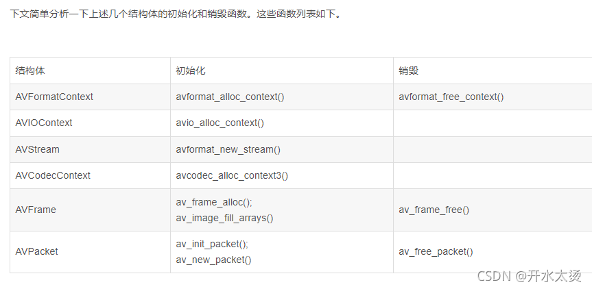

> 函数用来申请`AVFormatContext`类型变量并初始化默认参数。
> 该函数用于分配空间创建一个`AVFormatContext`对象，并且强调使用`avformat_free_context`方法来清理并释放该对象的空间。
>
> 分配空间，创建一个 `AVFormatContext`对象。
> `avformat_free_context() `可用于释放上下文和所有内容
> 由其中的框架分配。
>
> ```c
> /**
>  * Allocate an AVFormatContext.
>  * avformat_free_context() can be used to free the context and everything
>  * allocated by the framework within it.
>  */
> AVFormatContext *avformat_alloc_context(void);
> ```
>
> 源码：`avformat_alloc_context`
> 主要完成`AVFormatContext`的空间分配，注意分配在堆上；
> 给`AVFormatContext`的成员赋默认值；
> 完成`AVFormatContext`内部使用对象`AVFormatInternal`结构体的空间分配及其部分成员字段的赋值。
>
> ```c
> AVFormatContext *avformat_alloc_context(void)
> {
>     AVFormatContext *ic;	//创建一个AVFormatContext对象为ic
>     ic = av_malloc(sizeof(AVFormatContext));	//使用av_malloc分配空间，分配空间的作用是存储数据
>     if (!ic) return ic;		//判断ic是否为NILL，为空返回ic
>     avformat_get_context_defaults(ic);	//用于设置AVFormatContext的字段的默认值
> 
>     //给internal字段分配内存，ffmpeg内部使用
>     ic->internal = av_mallocz(sizeof(*ic->internal));
>     //判断ic->internal是否为NILL，为NILL，释放上下文和内容，返回NULL
>     if (!ic->internal) {
>         avformat_free_context(ic);
>         return NULL;
>     }
>     ic->internal->offset = AV_NOPTS_VALUE;
>     ic->internal->raw_packet_buffer_remaining_size = RAW_PACKET_BUFFER_SIZE;
>     ic->internal->shortest_end = AV_NOPTS_VALUE;
> 
>     return ic;
> }
> ```
>
> ​	从代码中可以看出，`avformat_alloc_context()`调用`av_malloc()`为`AVFormatContext`结构体分配了内存，而且同时也给`AVFormatContext`中的`internal`字段分配内存（这个字段是FFmpeg内部使用的，先不分析）。此外调用了一个`avformat_get_context_defaults()`函数。该函数用于设置`AVFormatContext`的字段的默认值。它的定义也位于`libavformat\options.c`，确切的说就位于`avformat_alloc_context()`上面。
>
> ​	`av_malloc`：是`libavutil`文件中的函数
> 该函数作用在于给对象分配内存块，并且是内存对齐的
>
> > - libavutil文件的功能：
> >   加密和哈希
> >   数学
> >   字符串操作
> >   内存管理
> >   数据结构
> >   视频相关
> >   音频相关
> >   错误代码
> >   记录设施
> >   其他
>
> - 分配一个适合所有内存访问的对齐方式的内存块
> - （包括矢量，如果在 CPU 上可用）。
> - @param size 要分配的内存块的大小（以字节为单位）
> - @return 指向已分配块的指针，如果块不能，则为`NULL`
> - 被分配
> - @参见 `av_mallocz()`
>
> ```c
> /**
>  * Allocate a memory block with alignment suitable for all memory accesses
>  * (including vectors if available on the CPU).
>  * @param size Size in bytes for the memory block to be allocated
>  * @return Pointer to the allocated block, or `NULL` if the block cannot
>  *         be allocated
>  * @see av_mallocz()
>  */
> void *av_malloc(size_t size) av_malloc_attrib av_alloc_size(1);
> ```
>
> > `av_malloc_attrib`是一个[宏定义](http://c.biancheng.net/view/287.html)，如果是在编译器GCC3.1及以上版本的情况下，给方法av_malloc增加属性__attribute__((**malloc**))，该属性指示编译器按照[malloc](https://so.csdn.net/so/search?q=malloc&spm=1001.2101.3001.7020)函数来对待，并且可以对其实施相应的优化措施。网上关于该属性的描述相关网址：
> >
> > http://www.keil.com/support/man/docs/armcc/armcc_chr1359124975555.htm；
> > https://stackoverflow.com/questions/18485447/gcc-attribute-malloc；
> > https://gcc.gnu.org/onlinedocs/gcc/Common-Function-Attributes.html#index-g_t_0040code_007bmalloc_007d-function-attribute-3251
>
> ```c
>   * @def av_malloc_attrib
>   * 函数属性表示类似 malloc 的函数。
>   * @see <a href="https://gcc.gnu.org/onlinedocs/gcc/Common-Function-Attributes.html#index-g_t_0040code_007bmalloc_007d-function-attribute-3251">GCC 文档中的函数属性 `malloc`< /a>
> /**
>  * @def av_malloc_attrib
>  * Function attribute denoting a malloc-like function.
>  * @see <a href="https://gcc.gnu.org/onlinedocs/gcc/Common-Function-Attributes.html#index-g_t_0040code_007bmalloc_007d-function-attribute-3251">Function attribute `malloc` in GCC's documentation</a>
>  */
> #if AV_GCC_VERSION_AT_LEAST(3,1)
>     #define av_malloc_attrib __attribute__((__malloc__))
> #else
>     #define av_malloc_attrib
> #endif
> ```
>
> > av_alloc_size(1)也是一个宏定义，如果是在编译器GCC4.3及以上版本的情况下，给方法增加一个属性__attribute__((alloc_size(1)))，告知编译器av_malloc(size_t size)方法的第一个参数，也即size是要分配的空间大小，关于__attribute__((alloc_size(VA_ARGS)))属性的详细描述可以见：https://gcc.gnu.org/onlinedocs/gcc/Common-Function-Attributes.html#index-g_t_0040code_007balloc_005fsize_007d-function-attribute-3220
>
> `av_malloc()` :
> `av_malloc()`是FFmpeg中最常见的内存分配函数。它的定义如下。
>
> ```c
> void *av_malloc(size_t size)
> {
>     void *ptr = NULL;
> 
>     /* let's disallow possibly ambiguous cases */
>     if (size > (max_alloc_size - 32))
>         return NULL;
> 
> #if HAVE_POSIX_MEMALIGN
>     if (size) //OS X on SDK 10.6 has a broken posix_memalign implementation
>     if (posix_memalign(&ptr, ALIGN, size))
>         ptr = NULL;
> #elif HAVE_ALIGNED_MALLOC
>     ptr = _aligned_malloc(size, ALIGN);
> #elif HAVE_MEMALIGN
> #ifndef __DJGPP__
>     ptr = memalign(ALIGN, size);
> #else
>     ptr = memalign(size, ALIGN);
> #endif
>     /* Why 64?
>      * Indeed, we should align it:
>      *   on  4 for 386
>      *   on 16 for 486
>      *   on 32 for 586, PPro - K6-III
>      *   on 64 for K7 (maybe for P3 too).
>      * Because L1 and L2 caches are aligned on those values.
>      * But I don't want to code such logic here!
>      */
>     /* Why 32?
>      * For AVX ASM. SSE / NEON needs only 16.
>      * Why not larger? Because I did not see a difference in benchmarks ...
>      */
>     /* benchmarks with P3
>      * memalign(64) + 1          3071, 3051, 3032
>      * memalign(64) + 2          3051, 3032, 3041
>      * memalign(64) + 4          2911, 2896, 2915
>      * memalign(64) + 8          2545, 2554, 2550
>      * memalign(64) + 16         2543, 2572, 2563
>      * memalign(64) + 32         2546, 2545, 2571
>      * memalign(64) + 64         2570, 2533, 2558
>      *
>      * BTW, malloc seems to do 8-byte alignment by default here.
>      */
> #else
>     ptr = malloc(size);
> #endif
>     if(!ptr && !size) {
>         size = 1;
>         ptr= av_malloc(1);
>     }
> #if CONFIG_MEMORY_POISONING
>     if (ptr)
>         memset(ptr, FF_MEMORY_POISON, size);
> #endif
>     return ptr;
> }
> ```
>
> > **关于size_t**
> > `size _t `这个类型在FFmpeg中多次出现，简单解释一下其作用。`size _t`是为了增强程序的可移植性而定义的。不同系统上，定义`size_t`可能不一样。它实际上就是`unsigned int`。
>
> > `posix_memalign()`:在大多数情况下，编译器和C库透明地帮你处理对齐问题。POSIX 标明了通过`malloc( )`, `calloc( )`, 和 `realloc( ) `返回的地址对于任何的C类型来说都是对齐的。在Linux中，这些函数返回的地址在32位系统是以8字节为边界对齐，在64位系统是以16字节为边界对齐的。有时候，对于更大的边界，例如页面，程序员需要动态的对齐。虽然动机是多种多样的，但最常见的是直接块I/O的缓存的对齐或者其它的软件对硬件的交互，因此，POSIX 1003.1d提供一个叫做`posix_memalign( )`的函数：
> > `_aligned_malloc()`：在指定的对齐边界上分配内存。
> > 内存对齐:
> > 	什么是内存对齐：还是用一个例子带出这个问题，看下面的小程序，理论上，32位系统下，`int`占4byte，`char`占一个byte，那么将它们放到一个结构体中应该占4+1=5byte；但是实际上，通过运行程序得到的结果是8 byte，这就是内存对齐所导致的。
> >
> > ```c
> > //32位系统
> > #include<stdio.h>
> > struct{
> > 	int x;
> > 	char y;
> > } s;
> > int main(){
> > 	printf("%d\n",sizeof(s)); // 输出8
> > 	return 0;
> > }
> > ```
> >
> > ​	现代计算机中内存空间都是按照 byte 划分的，从理论上讲似乎对任何类型的变量的访问可以从任何地址开始，但是实际的计算机系统对基本类型数据在内存中存放的位置有限制，它们会要求这些数据的首地址的值是某个数k（通常它为4或8）的倍数，这就是所谓的内存对齐。
> > 为什么要内存对齐：
> > ​	尽管内存是以字节为单位，但是大部分处理器并不是按字节块来存取内存的.它一般会以双字节,四字节,8字节,16字节甚至32字节为单位来存取内存，我们将上述这些存取单位称为内存存取粒度.
> > 现在考虑4字节存取粒度的处理器取int类型变量（32位系统），该处理器只能从地址为4的倍数的内存开始读取数据。
> > 1，平台原因(移植原因)：不是所有的硬件平台都能访问任意地址上的任意数据的；某些硬件平台只能在某些地址处取某些特定类型的数据，否则抛出硬件异常。
> > 2，性能原因：数据结构(尤其是栈)应该尽可能地在自然边界上对齐。原因在于，为了访问未对齐的内存，处理器需要作两次内存访问；而对齐的内存访问仅需要一次访问。
> > 假如没有内存对齐机制，数据可以任意存放，现在一个int变量存放在从地址1开始的联系四个字节地址中，该处理器去取数据时，要先从0地址开始读取第一个4字节块,剔除不想要的字节（0地址）,然后从地址4开始读取下一个4字节块,同样剔除不要的数据（5，6，7地址）,最后留下的两块数据合并放入寄存器。这需要做很多工作。
> > 现在有了内存对齐的，int类型数据只能存放在按照对齐规则的内存中，比如说0地址开始的内存。那么现在该处理器在取数据时一次性就能将数据读出来了，而且不需要做额外的操作，提高了效率。
> > 内存对齐规则：
> > 1.基本类型的对齐值就是其`sizeof`值;
> > 2.结构体的对齐值是其成员的最大对齐值;
> > 3.编译器可以设置一个最大对齐值，怎么类型的实际对齐值是该类型的对齐值与默认对齐值取最小值得来。
>
> `av_mallocz() `源码
> `av_mallocz()`可以理解为`av_malloc()+zeromemory`。代码如下。
> 从源代码可以看出`av_mallocz()`中调用了`av_malloc()`之后，又调用`memset()`将分配的内存设置为0。
>
> ```c
> void *av_mallocz(size_t size)
> {
>     void *ptr = av_malloc(size);	//使用av_malloc分配内存
>     if (ptr)
>         memset(ptr, 0, size);		//将分配的内存的所有字节置为0
>     return ptr;
> }
> ```
>
> ```c
> /**
>   * 释放 AVFormatContext 及其所有流。
>   * @param s 要释放的上下文
>   */
> /**
>  * Free an AVFormatContext and all its streams.
>  * @param s context to free
>  */
> void avformat_free_context(AVFormatContext *s);
> ```
>
> `avformat_free_context()`源码：
>
> ```c
> void avformat_free_context(AVFormatContext *s)
> {
>     int i;
> 
>     if (!s)
>         return;
> 
>     av_opt_free(s);
>     if (s->iformat && s->iformat->priv_class && s->priv_data)
>         av_opt_free(s->priv_data);
>     if (s->oformat && s->oformat->priv_class && s->priv_data)
>         av_opt_free(s->priv_data);
> 
>     for (i = s->nb_streams - 1; i >= 0; i--)
>         ff_free_stream(s, s->streams[i]);
> 
> 
>     for (i = s->nb_programs - 1; i >= 0; i--) {
>         av_dict_free(&s->programs[i]->metadata);
>         av_freep(&s->programs[i]->stream_index);
>         av_freep(&s->programs[i]);
>     }
>     av_freep(&s->programs);
>     av_freep(&s->priv_data);
>     while (s->nb_chapters--) {
>         av_dict_free(&s->chapters[s->nb_chapters]->metadata);
>         av_freep(&s->chapters[s->nb_chapters]);
>     }
>     av_freep(&s->chapters);
>     av_dict_free(&s->metadata);
>     av_dict_free(&s->internal->id3v2_meta);
>     av_freep(&s->streams);
>     flush_packet_queue(s);
>     av_freep(&s->internal);
>     av_freep(&s->url);
>     av_free(s);
> }
> ```
>
>   从代码中可以看出，`avformat_free_context()`调用了各式各样的销毁函数：`av_opt_free()`，`av_freep()`，`av_dict_free()`。这些函数分别用于释放不同种类的变量，在这里不再详细讨论。在这里看一个释放`AVStream`的函数`ff_free_stream()`。该函数的定义位于`libavformat\options.c`（其实就在`avformat_free_context()`上方）。
>
> ```c
> static void free_stream(AVStream **pst)
> {
>     AVStream *st = *pst;
>     int i;
> 
>     if (!st)
>         return;
> 
>     for (i = 0; i < st->nb_side_data; i++)
>         av_freep(&st->side_data[i].data);
>     av_freep(&st->side_data);
> 
>     if (st->parser)
>         av_parser_close(st->parser);
> 
>     if (st->attached_pic.data)
>         av_packet_unref(&st->attached_pic);
> 
>     if (st->internal) {
>         avcodec_free_context(&st->internal->avctx);
>         for (i = 0; i < st->internal->nb_bsfcs; i++) {
>             av_bsf_free(&st->internal->bsfcs[i]);
>             av_freep(&st->internal->bsfcs);
>         }
>         av_freep(&st->internal->priv_pts);
>         av_bsf_free(&st->internal->extract_extradata.bsf);
>         av_packet_free(&st->internal->extract_extradata.pkt);
>     }
>     av_freep(&st->internal);
> 
>     av_dict_free(&st->metadata);
>     avcodec_parameters_free(&st->codecpar);
>     av_freep(&st->probe_data.buf);
>     av_freep(&st->index_entries);
> #if FF_API_LAVF_AVCTX
> FF_DISABLE_DEPRECATION_WARNINGS
>     avcodec_free_context(&st->codec);
> FF_ENABLE_DEPRECATION_WARNINGS
> #endif
>     av_freep(&st->priv_data);
>     if (st->info)
>         av_freep(&st->info->duration_error);
>     av_freep(&st->info);
> #if FF_API_LAVF_FFSERVER
> FF_DISABLE_DEPRECATION_WARNINGS
>     av_freep(&st->recommended_encoder_configuration);
> FF_ENABLE_DEPRECATION_WARNINGS
> #endif
> 
>     av_freep(pst);
> }
> 
> void ff_free_stream(AVFormatContext *s, AVStream *st)
> {
>     av_assert0(s->nb_streams>0);
>     av_assert0(s->streams[ s->nb_streams - 1 ] == st);
> 
>     free_stream(&s->streams[ --s->nb_streams ]);
> }
> ```
>
> ​	`ff_free_stream()`函数中调用了`free_stream()`，从代码中可以看出，与释放`AVFormatContext`类似，释放`AVStream`的时候，也是调用了`av_freep()`，`av_dict_free()`这些函数释放有关的字段。如果使用了`parser`的话，会调用`av_parser_close()`关闭该`parser`。
>
> > `memset()`函数介绍
> > 首先来看函数原型
> > `void *memset(void *str, int c, size_t n)`
> > 解释：复制字符 c（一个无符号字符）到参数 str 所指向的字符串的前 n 个字符。
> > 作用：是在一段内存块中填充某个给定的值，它是对较大的结构体或数组进行清零操作的一种最快方法
> > 头文件：C中`#include<string.h>`，C++中`#include<cstring>`
> > 看着介绍其实函数作用非常简单，就是用于初始化，但是需要注意的是`memset`赋值的时候是按字节赋值，是将参数化成二进制之后填入一个字节。就比如前面的例子中，想要通过`memset(a,100,sizeof a)`给`int`类型的数组赋值，你给第一个字节的是一百，转成二进制就是0110 0100，而`int`有四个字节，也就是说，一个`int`被赋值为
> > 0110 0100,0110 0100,0110 0100,0110 0100，对应的十进制是1684300900，根本不是你想要赋的值100，这也就解释了为什么数组中的元素的值都为1684300900。
> > `memset`赋值时只能赋值为0？
> > 答案肯定不是，比如任意字符都是可以的，初始化成0是最常用的。`int`类型的一般都是赋值0或-1，其他的值都不行。
> > 结论
> > 为地址str开始的n个字节赋值c，注意：是逐个字节赋值，str开始的n个字节中的每个字节都赋值为c。
> > （1） 若str指向char型地址，value可为任意字符值；
> > （2） 若str指向非char型，如int型地址，要想赋值正确，value的值只能是-1或0，因为-1和0转化成二进制后每一位都是一样的，设int型占4个字节，则-1=0XFFFFFFFF, 0=0X00000000。
> > 举例：给数组赋值-1
> >
> > ```c
> > int A[2];
> > memset(A, -1, sizeof A);
> > ```
>
> ```c
> static void avformat_get_context_defaults(AVFormatContext *s)
> {
>     memset(s, 0, sizeof(AVFormatContext));	//memset()将AVFormatContext的所有字段置0
> 
>     s->av_class = &av_format_context_class;
> 
>     s->io_open  = io_open_default;
>     s->io_close = io_close_default;
> 
>     av_opt_set_defaults(s);		//设置默认值
> }
> ```
>
> > 1，将`AVFormatContext`对象内存块全置为0；
> > 2，将静态的`AVClass`对象`av_format_context_class`赋值给`AVFormatContext.av_class`；
> > 3，将静态函数`io_open_default`，`io_close_default`赋值给`AVFormatContext.io_open`，`AVFormatContext.io_close`
> > 4，使用`av_opt_set_defaults(s)`将根据赋值后的`AVClass.option`选项信息来填充`AVFormatContext`的成员字段。
>
> `av_format_context_class`结构体
>
> 该静态类位于`libavformat/options.c`中，是`AVClass`对象，`AVClass`对象是定义在`libavutil`库中的对象，可以想象下，肯定是提供某种功能的工具类，
>
> ```c
> static const AVClass av_format_context_class = {
>     .class_name     = "AVFormatContext",
>     .item_name      = format_to_name,
>     .option         = avformat_options,
>     .version        = LIBAVUTIL_VERSION_INT,
>     .child_next     = format_child_next,
>     .child_class_next = format_child_class_next,
>     .category       = AV_CLASS_CATEGORY_MUXER,
>     .get_category   = get_category,
> };
> ```
>
> > 1，`AVClass.class_name`：`AVClass`类名称，通常与其关联的上下文对象的结构体类型名相同。此处关联的是`AVFormatContext`上下文对象，因此`AVClass`的名称也即为`"AVFormatContext"`；
> >
> > 2，`AVClass.item_name`：这是一个函数指针，该函数返回关联的上下文实例名称。此处的`format_to_name`是`libavformat/options.c`文件中的静态函数，返回的是`AVFormatContext`中已经保存好的**输入文件格式名称或者是输出格式名称**，若是解封装过程还没有探测到文件格式或者是封装过程中用户还未设置输出文件格式，那么将返回NULL。源码如下：
> >
> > ```c
> > static const char* format_to_name(void* ptr)
> > {
> >     AVFormatContext* fc = (AVFormatContext*) ptr;
> >     if(fc->iformat) return fc->iformat->name;
> >     else if(fc->oformat) return fc->oformat->name;	
> >     else return "NULL";
> > }
> > ```
> >
> > 3， `AVClass.option`：指向的是某个选项列表数组的第一个选项，这个是非常重要的一个参数，提供了以“以字符串来设置结构体成员字段的方式”，`option`字段则指向一个元素个数很多的静态数组`avformat_options`。该数组单独定义于`libavformat\options_table.h`中。其中包含了`AVFormatContext`支持的所有的`AVOption`，如下所示。此处的`avformat_options`是定义在`libavformat/options_table.h`文件中定义的静态常量结构体，源码如下：
> >
> > ```c
> > static const AVOption avformat_options[] = {
> > {"avioflags", NULL, OFFSET(avio_flags), AV_OPT_TYPE_FLAGS, {.i64 = DEFAULT }, INT_MIN, INT_MAX, D|E, "avioflags"},
> > {"direct", "reduce buffering", 0, AV_OPT_TYPE_CONST, {.i64 = AVIO_FLAG_DIRECT }, INT_MIN, INT_MAX, D|E, "avioflags"},
> > {"probesize", "set probing size", OFFSET(probesize), AV_OPT_TYPE_INT64, {.i64 = 5000000 }, 32, INT64_MAX, D},
> > 此处省略几十行....
> > {NULL},
> > };
> > ```
> >
> > `AVClass.version`：表示的是libavutil库的当前版本，该版本号由宏`LIBAVUTIL_VERSION_INT`制定，该宏定义在`libavutil/version.h`文件中，如下源码所示：
> >
> > ```c
> > * @defgroup lavu_ver 版本和构建诊断 
> > * 在编译时和运行时检查有用的宏和函数 
> > * 正在使用哪个版本的 libavutil。
> > /**
> >  * @defgroup lavu_ver Version and Build diagnostics
> >  * Macros and function useful to check at compiletime and at runtime
> >  * which version of libavutil is in use.
> >  */
> > 
> > #define LIBAVUTIL_VERSION_MAJOR  56
> > #define LIBAVUTIL_VERSION_MINOR  31
> > #define LIBAVUTIL_VERSION_MICRO 100
> > 
> > #define LIBAVUTIL_VERSION_INT   AV_VERSION_INT(LIBAVUTIL_VERSION_MAJOR, \
> >                                                LIBAVUTIL_VERSION_MINOR, \
> >                                                LIBAVUTIL_VERSION_MICRO)
> > #define LIBAVUTIL_VERSION       AV_VERSION(LIBAVUTIL_VERSION_MAJOR,     \
> >                                            LIBAVUTIL_VERSION_MINOR,     \
> >                                            LIBAVUTIL_VERSION_MICRO)
> > #define LIBAVUTIL_BUILD         LIBAVUTIL_VERSION_INT
> > 
> > #define LIBAVUTIL_IDENT         "Lavu" AV_STRINGIFY(LIBAVUTIL_VERSION)
> > ```
> >
> > 5， `AVClass.child_next`：该字段是一个函数指针，仅限于字面意思，也就是返回输入对象中包含的子对象，此处关联的`format_child_next`是位于`libavformat/options.c`文件中的静态函数，源码如下：可知要么是`AVFormatContext`的`priv_data`存在且有效的情况返回这个字段的对象
> >
> > ```c
> > static void *format_child_next(void *obj, void *prev)
> > {
> >     AVFormatContext *s = obj;
> >     if (!prev && s->priv_data &&
> >         ((s->iformat && s->iformat->priv_class) ||
> >           s->oformat && s->oformat->priv_class))
> >         return s->priv_data;
> >     if (s->pb && s->pb->av_class && prev != s->pb)
> >         return s->pb;
> >     return NULL;
> > }
> > ```
> >
> > 7，`AVClass.category`：该字段是一个`AVClassCategory`枚举类型，作用是“Category used for visualization (like color)”，用于控制视觉特性，比如颜色，在ffmpeg日志系统中将使用该值。此处设置的值为`AV_CLASS_CATEGORY_MUXER`，具体的`AVClassCategory`分类信息如下源码所示：
> >
> > ```c
> > typedef enum {
> >     AV_CLASS_CATEGORY_NA = 0,	//AV 类别 NA
> >     AV_CLASS_CATEGORY_INPUT,	//AV 类别输入
> >     AV_CLASS_CATEGORY_OUTPUT,	//AV 类别输出
> >     AV_CLASS_CATEGORY_MUXER,	//AV 类别多路复用器
> >     AV_CLASS_CATEGORY_DEMUXER,	//AV 类别分路器
> >     AV_CLASS_CATEGORY_ENCODER,	//AV 类别编码器
> >     AV_CLASS_CATEGORY_DECODER,	//AV 类别解码器
> >     AV_CLASS_CATEGORY_FILTER,	//AV 类别过滤器
> >     AV_CLASS_CATEGORY_BITSTREAM_FILTER,	//AV 类类别比特流过滤器
> >     AV_CLASS_CATEGORY_SWSCALER,		// 对图像进行缩放或者改变图像格式
> >     AV_CLASS_CATEGORY_SWRESAMPLER,	// 软件重采样
> >     AV_CLASS_CATEGORY_DEVICE_VIDEO_OUTPUT = 40,	//AV 类别设备视频输出
> >     AV_CLASS_CATEGORY_DEVICE_VIDEO_INPUT,	//AV 类别设备视频输入
> >     AV_CLASS_CATEGORY_DEVICE_AUDIO_OUTPUT,	//AV 类别设备音频输出
> >     AV_CLASS_CATEGORY_DEVICE_AUDIO_INPUT,	//AV 类别设备音频输入
> >     AV_CLASS_CATEGORY_DEVICE_OUTPUT,	//AV 类别设备输出
> >     AV_CLASS_CATEGORY_DEVICE_INPUT,	//AV 类别设备输入
> >     AV_CLASS_CATEGORY_NB  ///< not part of ABI/API
> > }AVClassCategory;
> > ```
> >
> > `AVClass.get_category`：该字段是个函数指针，返回输入对象的`AVClassCategory`枚举类别。此处`get_category`是`libavformat/options.c`中的静态函数，源码如下所示：如果`AVFormatContext`的输入文件格式存在，那么`AVClassCategory`类别为解封装类目`AV_CLASS_CATEGORY_DEMUXER`，若不存在那么为封装类目`AV_CLASS_CATEGORY_MUXER`。
> >
> > ```c
> > static AVClassCategory get_category(void *ptr)
> > {
> >     AVFormatContext* s = ptr;
> >     if(s->iformat) return AV_CLASS_CATEGORY_DEMUXER;
> >     else           return AV_CLASS_CATEGORY_MUXER;
> > }
> > ```
> >
> > `io_open_default()` && `io_close_default()` 源码：
> >
> > > `io_open_default`: 主要作用是首先打印一条日志，告知现在要打开某个URL了，用于读还是用于写；然后会根据URL来创建文件读写的`AVIOContext`对象，如果旧接口还未被淘汰并且用户设置了打开IO的回调函数`open_cb`，那么该工作由用户设置的`s->open_sb`函数来完成； 如果旧接口已经被淘汰，那么该工作由`ffio_open_whitelist()`来完成。
> > > `io_close_default`: 主要作用是调用`avio_close()`方法来正确的关闭`AVIOContext`这个IO上下文对象。
> > >
> > > ```c
> > > static int io_open_default(AVFormatContext *s, AVIOContext **pb,
> > >                            const char *url, int flags, AVDictionary **options)
> > > {
> > >     int loglevel;
> > > 
> > >     if (!strcmp(url, s->url) ||
> > >         s->iformat && !strcmp(s->iformat->name, "image2") ||
> > >         s->oformat && !strcmp(s->oformat->name, "image2")
> > >     ) {
> > >         loglevel = AV_LOG_DEBUG;
> > >     } else
> > >         loglevel = AV_LOG_INFO;
> > >     av_log(s, loglevel, "Opening \'%s\' for %s\n", url, flags & AVIO_FLAG_WRITE ? "writing" : "reading");
> > > #if FF_API_OLD_OPEN_CALLBACKS
> > > FF_DISABLE_DEPRECATION_WARNINGS
> > >     if (s->open_cb)
> > >         return s->open_cb(s, pb, url, flags, &s->interrupt_callback, options);
> > > FF_ENABLE_DEPRECATION_WARNINGS
> > > #endif
> > >     return ffio_open_whitelist(pb, url, flags, &s->interrupt_callback, options, s->protocol_whitelist, s->protocol_blacklist);
> > > }
> > > ```
> >
> > `av_opt_set_defaults()`
> >
> > > “Set the values of all AVOption fields to their default values.”，注意这个入参的说明，入参对象的第一个成员必须是`AVClass`对象的指针。
> > > 作用：一言以蔽之，就是不断取出对应的`AVOption`对象，将`AVOption`对象中存储的初始值赋值给`s`对象（此处为`AVFormatContext`）的对应的成员
> > > `av_opt_set_defaults() `直接调用了 `av_opt_set_defaults2()`，而该函数逻辑也很简单：
> > >
> > > ```c
> > > void av_opt_set_defaults(void *s)
> > > {
> > >     av_opt_set_defaults2(s, 0, 0);
> > > }
> > >  
> > > void av_opt_set_defaults2(void *s, int mask, int flags)
> > > {
> > >     const AVOption *opt = NULL;
> > >     while ((opt = av_opt_next(s, opt))) { // 获取AVOption对象
> > >         // s->av_class->option与s的成员是对应关系；
> > >         // AVOption的offset属性定义了s对象对应的成员相对于s对象首地址的偏移offset，
> > >         // 从而求得该AVOption所映射的s对象成员的地址dst
> > >         void *dst = ((uint8_t*)s) + opt->offset; 
> > >  
> > >         // mask和flags用以控制需要修改设置哪些参数
> > >         if ((opt->flags & mask) != flags) 
> > >             continue;
> > >  
> > >         // 如果属性是只读，那么不设置
> > >         if (opt->flags & AV_OPT_FLAG_READONLY)
> > >             continue;
> > >  
> > >         // 根据AVOption对象的type属性可以映射的s对象的成员的类型
> > >         // 根据不同类型，调用不同的函数将AVOption的default_val属性提供的默认值
> > >         // 来设置s的对象的对应成员。
> > >         switch (opt->type) {
> > >             case AV_OPT_TYPE_CONST:
> > >                 /* Nothing to be done here */
> > >                 break;
> > >             case AV_OPT_TYPE_BOOL:
> > >             case AV_OPT_TYPE_FLAGS:
> > >             case AV_OPT_TYPE_INT:
> > >             case AV_OPT_TYPE_INT64:
> > >             case AV_OPT_TYPE_UINT64:
> > >             case AV_OPT_TYPE_DURATION:
> > >             case AV_OPT_TYPE_CHANNEL_LAYOUT:
> > >             case AV_OPT_TYPE_PIXEL_FMT:
> > >             case AV_OPT_TYPE_SAMPLE_FMT:
> > >                 write_number(s, opt, dst, 1, 1, opt->default_val.i64);
> > >                 break;
> > >             case AV_OPT_TYPE_DOUBLE:
> > >             case AV_OPT_TYPE_FLOAT: {
> > >                 double val;
> > >                 val = opt->default_val.dbl;
> > >                 write_number(s, opt, dst, val, 1, 1);
> > >             }
> > >             break;
> > >             case AV_OPT_TYPE_RATIONAL: {
> > >                 AVRational val;
> > >                 val = av_d2q(opt->default_val.dbl, INT_MAX);
> > >                 write_number(s, opt, dst, 1, val.den, val.num);
> > >             }
> > >             break;
> > >             case AV_OPT_TYPE_COLOR:
> > >                 set_string_color(s, opt, opt->default_val.str, dst);
> > >                 break;
> > >             case AV_OPT_TYPE_STRING:
> > >                 set_string(s, opt, opt->default_val.str, dst);
> > >                 break;
> > >             case AV_OPT_TYPE_IMAGE_SIZE:
> > >                 set_string_image_size(s, opt, opt->default_val.str, dst);
> > >                 break;
> > >             case AV_OPT_TYPE_VIDEO_RATE:
> > >                 set_string_video_rate(s, opt, opt->default_val.str, dst);
> > >                 break;
> > >             case AV_OPT_TYPE_BINARY:
> > >                 set_string_binary(s, opt, opt->default_val.str, dst);
> > >                 break;
> > >             case AV_OPT_TYPE_DICT:
> > >                 /* Cannot set defaults for these types */
> > >             break;
> > >         default:
> > >             av_log(s, AV_LOG_DEBUG, "AVOption type %d of option %s not implemented yet\n",
> > >                    opt->type, opt->name);
> > >         }
> > >     }
> > > }
> > > ```
> > >
> > > 我们已经分析了`AVFormatContext->AVClass->option`被初始化指向了一个静态的`AVOption`数组，`av_opt_next() `作用就是获取下`AVFormatContext->AVClass->option`数组中，由last指定的`AVOption`对象的下一个。具体`av_opt_next() `如何实现这一点的，见下面源码以及注释：
> > >
> > > ```c
> > > const AVOption *av_opt_next(const void *obj, const AVOption *last)
> > > {
> > >     const AVClass *class;
> > >     // 若obj对象为空，自然option也肯定不存在，返回空
> > >     if (!obj) 
> > >         return NULL;
> > >  
> > >     // 这个是重点：
> > >     // obj是一个对象的指针，其指向的对象实体的第一个参数是一个指向AVClass对象的指针
> > >     // 如下的强制转换就是取出obj第一个参数值，也即指向obj对象关联的AVClass对象的地址
> > >     // 赋值给class
> > >     class = *(const AVClass**)obj; 
> > >  
> > >     // 如果last为空，也即没有指定AVOption对象
> > >     // 并且class不为空，也即obj这个对象第一个参数确实是AVClass对象指针
> > >     // 并且AVClass->option不为空，也即指向有效的AVOption数组
> > >     // 并且class->option[0].name不为空，也即AVOption数组的第一项的name成员不为空
> > >     if (!last && class && class->option && class->option[0].name)     
> > >         return class->option;         // 返回AVOption数组的第一个成员
> > >  
> > >     // 如果last不为空，即已被指定
> > >     // 并且last[1].name不为空，即注意理解这个last[1]的数组操作：last指向的AVOption的下一个AVOption的name成员不为空。
> > >     if (last && last[1].name)
> > >         return ++last;               // 返回AVOtion数组的last的下一个AVOption，注意一般AVOption数组的最后一项是NULL。
> > >  
> > >     // 若之前没找到合适的AVOption，那么返回NULL
> > >     return NULL;
> > > }
> > > ```
>
> 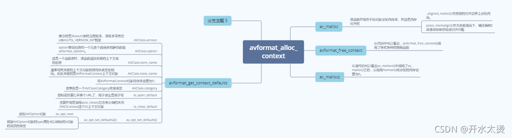
>
> `avformat_alloc_context()`函数主要干了哪些事儿：分配`AVFormatContext`、设置`av_class`(关联`AVOptions`)、设置`io_open`、设置`io_close`、`avformat_options`初始化`AVFormatContext`。

# 3 `avformat_open_input()`

> 原文链接：https://blog.csdn.net/ice_ly000/article/details/93161260
>
> 具体上，从源码来说，该函数有这么几项功能：
> 1. 在用户没有提供`AVFormatContext`的情况下，创建一个格式上下文对象`AVFormatContext`；
> 2. 在用户没有提供IO层上下文对象`AVIOContext`的情况下，打开文件并创建IO层上下文对象`AVIOContext`；
> 3. 在用户没有指定输入文件格式`AVInputFormat`的情况下，探测文件格式，得到输入文件格式信息`AVInputFormat`；
> 4. 读取文件头，在文件头描述信息足够的情况下创建流`AVStream`以及获取并设置编解码参数相关信息；
> 5. 填充`AVFormatContext`其他字段信息。
>     总之，该函数的作用就是打开文件，尽可能的收集各方面的信息并填充`AVFormatContext`结构体，基本上是做了除过解码之外的所有工作。
>
> `avformat_open_input()`。该函数用于打开多媒体数据并且获得一些相关的信息。它的声明位于`libavformat\avformat.h`，如下所示。
>
> **`avformat_open_input()`**
>
> ```c
> * 打开一个输入流并读取头部。未打开编解码器。
>  * 必须使用 avformat_close_input() 关闭流。
>  * @param ps 指向用户提供的 AVFormatContext 的指针（由 avformat_alloc_context 分配）。
>  * 可能是一个指向 NULL 的指针，在这种情况下，一个 AVFormatContext 由 this 分配
>  * 函数并写入 ps。
>  * 请注意，用户提供的 AVFormatContext 将在失败时被释放。
>  * @param url 要打开的流的 URL。
>  * @param fmt 如果非空，此参数强制特定的输入格式。
>  * 否则格式是自动检测的。
>  * @param options 一个充满 AVFormatContext 和 demuxer-private 选项的字典。
>  * 返回时，此参数将被销毁并替换为包含
>  * 未找到的选项。可能为 NULL。
>  * @return 成功时返回 0，失败时返回负的 AVERROR。
>  * @note 如果要使用自定义 IO，请预先分配格式上下文并设置其 pb 字段。
> 
> int avformat_open_input(AVFormatContext **ps, const char *url, ff_const59 AVInputFormat *fmt, AVDictionary **options);
> ```
>
> `avformat_open_input()`源码：
>
> ```c
> 参数说明：
> AVFormatContext **ps, 格式化的上下文。要注意，如果传入的是一个AVFormatContext*的指针，则该空间须自己手动清理，若传入的指针为空，则FFmpeg会内部自己创建。
> const char *filename, 传入的文件地址。支持http,RTSP,以及普通的本地文件。地址最终会存入到AVFormatContext结构体当中。
> AVInputFormat *fmt, 指定输入的封装格式。一般传NULL，由FFmpeg自行探测。
> AVDictionary **options, 其它参数设置。它是一个字典，用于参数传递，不传则写NULL;
> 
> int avformat_open_input(AVFormatContext **ps, const char *filename, AVInputFormat *fmt, AVDictionary **options){
>     AVFormatContext *s = *ps;
>     int i, ret = 0;
>     AVDictionary *tmp = NULL;
>     ID3v2ExtraMeta *id3v2_extra_meta = NULL;
> 
>     // 判断传入的AVFormatContext对象是否为空
>     // 为空则创建该对象
>     if(!s && !(s = avformat_alloc_context()))
>         return AVERROR(ENOMEM);
> 
>     // 判断AVFormatContext对象是否被合法的创建
>     // 由于AVFormatContext对象只能使用avformat_alloc_context()来创建
>     // 若外部传入应该由av_malloc()创建的该对象，此处将检测这种情况的发生
>     if(!s->av_class){
>         av_log(NULL, AV_LOG_ERROR, "Input context has not been properly allocated by avformat_allock_context() and is not NULL either\n");
>         return AVERROR(EINVAL);
>     }
> 
>     // 判断外部是否强制指定了输入文件格式
>     if(fmt){
>         s->iformat = fmt;
>     }
> 
>     // 拷贝选项
>     if(options)
>         av_dict_copy(&tmp, *options, 0);
> 
>     // 如果外部指定了I/O层，那么设置标志位AVFMT_FLAG_CUSTOM_IO
>     if(s->pb)
>         s->flags |= AVFMT_FLAG_CUSTOM_IO;
> 
>     // 应用选项信息到AVFormatContext
>     if((ret = av_opt_set_dict(s, &tmp)) < 0){
>         goto fail;
>     }
> 
>     // 拷贝filename到AVFormatContext.url字段
>     if(!(s->url = av_strdup(filename ? filename : ""))){
>         ret = AVERROR(ENOMEM);
>         goto fail;
>     }
> 
>     // 拷贝filename到AVFormatContext.filename字段
>     // 注意该字段已经被声明为deprecated
> #if FF_API_FROMAT_FILENAME
> FF_DISABLE_DEPRECATION_WARNINGS
>     av_strlcpy(s->filename, filename ? filename : "", sizeof(s->filename));
> FF_ENABLE_DEPRECATION_WARNINGS
> #endif
>     // 探测文件格式，将探测得分存储于AVFormatContext.probe_score字段
>     if((ret = init_input(s, filename, &tmp)) < 0)
>         goto fail;
>     s->probe_score = ret;
> 
>     // 拷贝协议白名单到AVFormatContext.protocol_whitelist
>     if(!s->protocol_whitelist && s->pb && s->pb->protocol_whitelist){
>         s->protocol_whitelist = av_strdup(s->pb->protocol_whitelist);
>         if(!s->protol_whitelist){
>             ret = AVERROR(ENOMEM);
>             goto fail;
>         }
>     }
> 
>     // 如果格式白名单存在，那么探测到的格式必须要属于白名单
>     if(s->format_whitelist && av_match_list(s->iformat->name, s->format_whitelist, ',') <= 0){
>         av_log(s, AV_LOG_ERROR, "Format not on whitelist \'%s\'\n", s->format_whitelist);
>     }
> 
>     // 设置AVIOContext内部缓冲区跳过初始字节
>     avio_skip(s->pb, s->skip_initial_bytes);
> 
>     // 检查文件是否是图片序列中的一个，名称中必须包含图片序列号数字
>     if(s->iformat->flags & AVFMT_NEEDNUMBER){
>         if(!av_filename_number_list(filename)){
>             ret = AVERROR(EINVAL);
>             goto fail;
>         }
>     }
> 
>     // 初始化文件的持续时间和起始时间为AV_NOPTS_VALUE
>     s->duration = s->start_time = AV_NOPTS_VALUE;
> 
>     // 设置AVFormatContext的私有数据，套路与设置AVIOContext的私有数据一样
>     // 注意该私有数据也是一个上下文对象，后续以FLV格式来分析该私有数据
>     /* Allocate private data */
>     if(s->iformat->priv_data_size > 0){
>         // 分配AVFormatContext私有数据空间
>         if(!(s->priv_data = av_mallocz(s->iformat->priv_data_size))){
>             ret = AVERROR(ENOMEM);
>             goto fail;
>         }
> 
>         if(s->iformat->priv_class){
>             // 设置AVFormatContext私有数据的第一个成员字段AVClass*
>             *(const AVClass **)s->priv_data = s->iformat->priv_class;
>             // 初始化AVFormatContext私有数据的其它成员
>             av_opt_set_defaults(s->priv_data);
>             // 应用用户提供的选项信息到AVFormatContext的私有数据
>             if((ret = av_opt_set_dict(s->priv_data, &tmp)) < 0){
>                 goto fail;
>             }
>         }
>     }
> 
>     // 如果AVIOContext存在，读取ID3信息
>     /* e.g. AVFMT_NOFILE fomats whill not have a AVIOContext */
>     if(s->pb)
>         ff_id3v2_read_dict(s->pb, &s->internal->id3v2_meta, ID3v2_DEFAULT_MAGIC, &Id3v2_extra_meta);
> 
>     // 读取文件头，可能获取到metadata信息，流信息
>     if(!(s->flags & AVFMT_FLAG_PRIV_OPT) && s_iformat->read_header)
>         if((ret = s->iformat->read_header(s)) < 0)
>             goto fail;
> 
>     // 处理metadata信息与id3v2信息
>     if(!s->metadata){
>         s->metadata = s->internal->id3v2_meta;
>         s->internal->id3v2_meta = NULL;
>     } else if(s->internal->id3v2_meta){
>         int level = AV_LOG_WARNING;
>         if(s->error_recognition & AV_EF_COMPLIANT)
>             level = AV_LOG_ERROR;
>         av_log(s, level, "Discarding ID3 tags because more suitable tags were found.\n");
>         av_dict_free(&s->internal->id3v2_meta);
>         if(s->error_recognition & AV_EF_EXPLODE)
>             return AVERROR_INVALIDDATA;
>     }
>      // 处理id3v2额外信息
>     if (id3v2_extra_meta) {
>         if (!strcmp(s->iformat->name, "mp3") || !strcmp(s->iformat->name, "aac") ||
>             !strcmp(s->iformat->name, "tta")) {
>             if ((ret = ff_id3v2_parse_apic(s, &id3v2_extra_meta)) < 0)
>                 goto fail;
>             if ((ret = ff_id3v2_parse_chapters(s, &id3v2_extra_meta)) < 0)
>                 goto fail;
>             if ((ret = ff_id3v2_parse_priv(s, &id3v2_extra_meta)) < 0)
>                 goto fail;
>         } else
>             av_log(s, AV_LOG_DEBUG, "demuxer does not support additional id3 data, skipping\n");
>     }
>     ff_id3v2_free_extra_meta(&id3v2_extra_meta);
> 
>     // 封面图片处理
>     if ((ret = avformat_queue_attached_pictures(s)) < 0)
>         goto fail;
> 
>     // 更新AVFormatContext.AVFormatInternal的成员 
>     if (!(s->flags&AVFMT_FLAG_PRIV_OPT) && s->pb && !s->internal->data_offset)
>         s->internal->data_offset = avio_tell(s->pb);
> 
>     s->internal->raw_packet_buffer_remaining_size = RAW_PACKET_BUFFER_SIZE;
> 
>     update_stream_avctx(s);
> 
>     for (i = 0; i < s->nb_streams; i++)
>         s->streams[i]->internal->orig_codec_id = s->streams[i]->codecpar->codec_id;
> 
>     if (options) {
>         av_dict_free(options);
>         *options = tmp;
>     }
>     *ps = s;
>     return 0;
> 
> fail:
>     ff_id3v2_free_extra_meta(&id3v2_extra_meta);
>     av_dict_free(&tmp);
>     if (s->pb && !(s->flags & AVFMT_FLAG_CUSTOM_IO))
>         avio_closep(&s->pb);
>     avformat_free_context(s);
>     *ps = NULL;
>     return ret;
> }
> ```
>
> > 1. 入参检查：检查所有的入参，并做相应的处理。
> >
> >    1. 处理`AVFormatContext **ps`：确保后续操作有一个非空的并且使合法创建的`AVFormatContext`对象可以使用。
> >    2. 处理`AVInputFormat *fmt`：判断是否强制指定了输入文件格式，若指定了，那么将该文件格式挂载于`AVFormatContext.iformat`成员 上，后续将不再自动探测音视频文件格式。
> >    3. 处理`AVDictionary **options`：先将选项信息拷贝到内部临时变量，然后调用`av_opt_dict()`方法来应用选项信息到`AVFormatContext`。`av_opt_set_dict()`方法的具体分析见FFMPEG源码分析之`av_opt_set_dict()`
> >    4. 处理`AVFormatContext.pb`：如果用户希望用自己的代码处理IO层，也即`AVIOContext`在外部已经被创建并赋值给`AVFormatContext.pb`，那么确保`AVFormatContext.flags`的`AVFMT_FLAG_CUSTOM_IO`置位。
> >    5. 处理`const char *filename`：拷贝`filename`到`AVFormatContext.url`和`AVFormatContext.filename`字段，后者已经被标注为`deprecated`，为了兼容以前的版本，此处也会赋值。
> >
> > 2. 调用`init_input()`打开文件，并进行文件格式探测：
> >
> >    1. `init_input()`进行文件格式探测，创建合适的`AVIOContext`上下文对象，并找到最合适的`AVInputFormat`。
> >    2. 将探测的文件格式得分赋值给`AVFormatContext.probe_score`。
> >
> > 3. 获取信息并填充到`AVFormatContext`的其他字段
> >
> >    1. `AVForamatContext.protocol_whitelist&&.protocol_blacklist`：复制`AVIOContext`持有的黑白名单到对应的字段。
> >
> >    2. `AVFormatContext.format_whitelist`：判断推断的输入文件格式是否在格式白名单中。以`mov`格式为例，其`AVInputFormat`对象为以下源码所示，那么名称为一个列表，可以看到`"mov, mp4, m4a, 3gp, 3g2, mj2"`这些文件格式共享一个文件格式对象，因为这几个格式都是基于ISO base media file format衍生出来的格式，基本上遵循同样的规范。文件格式白名单`format_whitelist`要么不存在，要么以`","`分割的文件格式，只要文件格式名称中的一个格式与白名单中的一个匹配则认为文件格式在白名单中。
> >
> >       ```c
> >       AVInputFormat ff_mov_demuxer = {
> >           .name           = "mov,mp4,m4a,3gp,3g2,mj2",
> >           .long_name      = NULL_IF_CONFIG_SMALL("QuickTime / MOV"),
> >           .priv_class     = &mov_class,
> >           .priv_data_size = sizeof(MOVContext),
> >           .extensions     = "mov,mp4,m4a,3gp,3g2,mj2",
> >           .read_probe     = mov_probe,
> >           .read_header    = mov_read_header,
> >           .read_packet    = mov_read_packet,
> >           .read_close     = mov_read_close,
> >           .read_seek      = mov_read_seek,
> >           .flags          = AVFMT_NO_BYTE_SEEK,
> >       };
> >       ```
> >
> >    3. `AVFormatContext.skip_initial_bytes`：该参数释义为“set number of bytes to skip before reading header and frames”，通过`avio_skip()`函数跳过`skip_initial_bytes`，该值在创建初始化为`AVFormatContext`时被设置为0.`avio_skip()`先前跳过给定的字节数。
> >
> >    4. 检查`AVInputFormat.flags`标志`AVFMT_NEEDNUMBER`与输入文件名中是否包含数字序列所匹配。如何理解这点呢？首先要知道，ffmpeg支持视频文件与图片文件互转，比如支持一系列的图片组合成一个视频，那么对应的ffmpeg命令类似于`"ffmpeg -i image-%3d.jpeg out.mp4"`，那么输入文件名为`"image-%3d.jpeg"`。`av_filename_number_test()`方法可以检测文件名中是否存在`"%3d"`这个字符串。
> >
> >    5. `AVFormatContext.duration && .start_time`：设置媒体持续时长以及起始时间为`AV_NOPTS_VALUE`，该值为`(int64_t)UINT64_C(0x8000000000000000)`，表示没有提供时间信息。
> >
> >    6. `AVFormatContext.priv_data`：`AVFormatContext`的私有数据，类型为`void*`，根据输入文件格式的不同，该字段为不同类型的，以`mov`格式的文件为例，见上述`ff_mov_demuxer`源码：该私有字段将是`MOVContext`的结构，源码中先分配`MOVContext`空间 -> 将`AVClass`对象`mov_class`赋值给`MOVContext`的第一个成员 -> 调用`av_opt_set_defaults()`来给`MOVContext`设置默认值 -> 调用`av_opt_set_dict()`将用户传入的信息应用到`MOVContext`成员。
> >
> >    7. `AVFormatContext.AVFormatInternal.id3v2_meta`：读取文件开头的ID3V2信息，保存到该字段。额外的id3v2信息存储在`id3v2_extra_meta`的临时变量中。
> >
> >    8. 通过`AVInputFormat.read_header()`来获取`metadata`信息，创建流等等：以`flv`格式和`mp4`格式为例来说明，`flv_read_header()`和`mov_read_header()`在后文中详述，二者基本代表了两种类型的数据：`flv`格式适合流传输的格式，除了最初始有个简单的`header`外，就是一个个`TAG`的结构体，每个`TAG`都可以自描述，包含了自描述信息和音视频数据，这种格式的好处是不论从流的哪儿开始播放都很方便。相应的`flv_read_header()`函数比较简单，因为`flv`的头比较单一，包含的信息量少，因此并没有获取到`metadata`信息，也就是`s->metadata`不会被赋值，并且，也没有找到足够多的关于流的信息，只简单的知道是否存在视频流，是否存在音频流，不会调用`avformat_vew_stream()`来创建`AVStream`对象，所以`s->nb_stream，s->stream`都不会被赋值；`mp4`格式是一种交换格式，所有的音视频信息集中在一起，并建立索引信息来查找真正的音视频数据，而音视频数据在一起。相应的`mov_read_header()`函数就特别复杂，由于`mp4`是由一个个`box`组成，`mov_read_header()`会读取所有的`box`以获取`mp4`文件的完整信息，最重要的是`moov`这个`box`，因此，`s->metadata`会被赋值，并且流的个数，流本身的信息也非常清楚，因此`avformat_new_stream()`会被调用来创建`AVStream`对象，`s->nb_streams, s->streams`都会被正确的赋值。
> >
> >    9. `AVFormatContext.metadata`：在`metadata`存在的条件下，其更可靠，因此$7.)$中提到的`id3v2_meta`可以丢弃，若不存在那么`AVFormatContext.metadata`将取值`AVFormatContext.AVFormatIternal.id3v2_meta`。
> >
> >    10. `mp3, aac, tta`的音频格式，`id3v2_extra_meta`数据会存储封面(`apic`)，章节(`chapters`)，私有帧(`priv`)信息。
> >
> >    11. 将封面图片放到队列中
> >
> >    12. 更新`AVFormatContext.AVFormatInternal`成员
> >
> >    13. 通过调用`update_stream_avctx(s)`更新流的上下文信息。
> >
> > 
>
> ​	`av_dict_copy()`
>
> ```c
>  将条目从一个 AVDictionary 结构复制到另一个。
> @param dst 指向 AVDictionary 结构的指针。 如果 *dst 为 NULL，
> 这个函数会为你分配一个结构体并将其放入 *dst
> @param src 指向源 AVDictionary 结构的指针
> @param 标记在 *dst 中设置条目时使用的标志
> @note 元数据使用 AV_DICT_IGNORE_SUFFIX 标志读取
> @return 成功时返回 0，失败时返回负的 AVERROR 代码。 如果分配了 dst
> 通过这个函数，调用者应该释放相关的内存。
> 
> int av_dict_copy(AVDictionary **dst, const AVDictionary *src, int flags);
> ```
>
> **`av_dict_copy()`**源码：
>
> ```c
> int av_dict_copy(AVDictionary **dst, const AVDictionary *src, int flags)
> {
>     AVDictionaryEntry *t = NULL;
> 
>     while ((t = av_dict_get(src, "", t, AV_DICT_IGNORE_SUFFIX))) {
>         int ret = av_dict_set(dst, t->key, t->value, flags);
>         if (ret < 0)
>             return ret;
>     }
> 
>     return 0;
> }
> 
> av_dict_get(）不停迭代获取条目，注意flag为AV_DICT_IGNORE_SUFFIX，这个标志使得进行key匹配的时候，只要传入的key字符串与条目的key字符串前面的字符能匹配上，则认为该条目是要查找的条目。此处传入的key字符串为""，因此可以匹配所有的条目。
> av_dict_set() 将根据取出的每个条目，以及传入的flags值来设置目标AVDictionary。
> 
> ```
>
> **`av_strcup()`**
>
> 所属库：libavutil（lavu），lavu是ffmpeg中的功能库，本函数属于内存管理功能
> 声明：拷贝一份字符串。注意，该函数使用了`av_malloc_attrib`宏进行了属性修饰
>
> ```c
> /**
>  * Duplicate a string.
>  *
>  * //入参s指向需要拷贝的字符串
>  * @param s String to be duplicated 
>  *
>  * //返回一个指向新分配的内存，该内存拷贝了一份字符串，如果无法分配出空间，则返回NULL 
>  * @return Pointer to a newly-allocated string containing a  
>  *         copy of `s` or `NULL` if the string cannot be allocated
>  * @see av_strndup()
>  */
> char *av_strdup(const char *s) av_malloc_attrib;
> 
> char *av_strdup(const char *s)
> {
>     char *ptr = NULL;
>     if (s) {
>         // 求取存储字符串的长度，注意c串后的需要"\0"，因此需要长度+1
>         size_t len = strlen(s) + 1; 
>         // av_realloc()分配空间，为什么不是av_malloc()?
>         ptr = av_realloc(NULL, len);
>         // 如果空间分配成功，则memcpy进行内存拷贝
>         if (ptr)
>             memcpy(ptr, s, len);
>     }
>     return ptr;
> }
> ```
>
> `av_strndup()`
> 源文件：`libavutil/mem.c`
>
> ```c
> char *av_strndup(const char *s, size_t len)
> {
>     char *ret = NULL, *end;
> 
>     if (!s)
>         return NULL;
> 
>     end = memchr(s, 0, len);  // 计算'\0'的位置
>     if (end)                  // 重新计算可拷贝字符串的长度
>         len = end - s;
> 
>     ret = av_realloc(NULL, len + 1); // 分配内存
>     if (!ret)
>         return NULL;
> 
>     memcpy(ret, s, len);  // 拷贝内存
>     ret[len] = 0;         // 最后一个字节赋值'\0'
>     return ret;           // 返回新串地址
> }
> ```
>
> > 检查参数的有效性：如果源串s是空串，则目的串直接为NULL
> > 匹配源串长度与len的大小：`memchr()`函数提供这样的功能：“C 库函数 `void *memchr(const void *str, int c, size_t n) `在参数 str 所指向的字符串的前 n 个字节中搜索第一次出现字符 c（一个无符号字符）的位置”，具体该函数的用法，这儿提供一个很不错的手册类查询网站，提供多种语言的api查询：https://www.runoob.com/。此处，查询0的位置，其实就是字符"\0"，C类字符串的结尾。
> > 1）如果返回值不为空，说明len的长度比源串的长度要长，需要重新计算可拷贝的字符串len的长度：len = end - s
> > 2）如果返回值为空，说明len比源串的长度要短，拷贝len个字符是安全的，因此不需要重新计算len
> > 分配内存，拷贝串，返回新串地址。
>
> > `av_opt_set_dict() `声明：
> > 头文件：`libavutil/opt.h`
> >
> > 所属库：libavutil（lavu）
> > 源文件：`libavutil/opt.c`
> > 源码：该函数简单的调用了`av_opt_set_dict2()`
> >
> > 功能：设置所有的选项到一个对象中
> > 入参`obj`：将被应用选项的对象，该对象必须第一个成员为`AVClass*`，也即`obj`应该是某个上下文结构体对象
> > 入参`options`：需要被应用的选项字典。输入的选项字典将被释放，并且会被一个新的字典替代，这个新的字典中的选项由没有在`obj`中找到的所有选项组成。这个新的选项需要本函数的调用着在函数外部使用`av_dict_free()`来释放空间。
> > 返回值：成功返回0，当某些选项在`obj`中被找到，但是又设置失败，那么该函数返回负的错误码。
> >
> > ```c
> > int av_opt_set_dict(void *obj, AVDictionary **options)
> > {
> >     return av_opt_set_dict2(obj, options, 0);
> > }
> > 
> > int av_opt_set_dict2(void *obj, AVDictionary **options, int search_flags)
> > {
> >     AVDictionaryEntry *t = NULL;
> >     AVDictionary    *tmp = NULL;
> >     int ret = 0;
> >  
> >     if (!options)
> >         return 0;
> >  
> >     while ((t = av_dict_get(*options, "", t, AV_DICT_IGNORE_SUFFIX))) {
> >         ret = av_opt_set(obj, t->key, t->value, search_flags);
> >         if (ret == AVERROR_OPTION_NOT_FOUND)
> >             ret = av_dict_set(&tmp, t->key, t->value, 0);
> >         if (ret < 0) {
> >             av_log(obj, AV_LOG_ERROR, "Error setting option %s to value %s.\n", t->key, t->value);
> >             av_dict_free(&tmp);
> >             return ret;
> >         }
> >         ret = 0;
> >     }
> >     av_dict_free(options);
> >     *options = tmp;
> >     return ret;
> > }
> > ```
> >
> > 使用`av_dict_get()`函数迭代选项字典中的`option`
> > 使用`av_opt_set()`函数应用选项到`obj`中。
> > 2.1）若`av_opt_set()`函数在`obj`中未找到选项对应的参数，则返回`AVERROR_OPTION_NOT_FOUND`。此种情况，该选项信息将被设置到函数内部分配的临时选项字典中。
> > 2.2）若`av_opt_set()`函数在`obj`中找到选项但是设置失败则返回`AVERROR(EINVAL)`，即-22，表示输入参数值非法。此种情况，函数将清理临时选项字典，并返回错误。
> > 如果2中没有出现2.2）的情况，那么入参选项字典中的选项要么是已经成功应用到`obj`中，要么是存储到临时的选项字典中，此时，释放入参选项字典所占用的内存，并将临时的选项字典传递给入参，从而让函数调用者通过该入参获取到剩余的未应用到`obj`上的所有选项。
>
> **`init_input()`**源码：
>
> 所属库：libavformat（lavf）
> 源文件：`libavformat/utils.c `静态函数，无头文件
> 源码：
> 功能：该函数有两个目标：一个是需要找到合适的I/O层对象，也即`AVIOContext`，其用于资源的访问；一个是探测文件格式，得到合适的`AVInputFormat`结构体对象。后续的代码分析过程中务必带着这个思维去看。
>
> ```c
> /* Open input file and probe the format if necessary */
> static int init_input(AVFormatContext *s, const char *filename, AVDictionary **options){
> 	int ret;
>     AVProbeData pd = {filename, NULL, 0}
>     int score = AVPROBE_SCORE_RETRY;
> 
>     // 用户指定了文件访问I/O层上下文对象AVIOContext
>     if(s->pb){
>         // 修改下标志，表示IO层是用户提供的
>         s->flags |= AVFMT_FLAG_CUSTOM_IO;
>         // 如果用户没有指定文件格式
>         if(!s->iformat)
>             // 使用用户提供的I/O层接口来读取文件，并使用av_probe_input_buffer2
>             // 进行文件格式探测，并返回探测得分
>             return av_probe_input_buffer2(s->pb, &s->iformat, filename, s, 0, s->format_probesize);
>         // 用户指定了文件访问IO, 指定了输入文件格式，但是文件格式的标志位AVFMT_NOFILE又告知
>         // 根本不需要访问文件，所以用户提供IO层的AVIOContext岂不是毫无作用，因此，打印下面这条警告日志
>         else if(s->iformat->flags & AVFMT_NOFILE)
>             av_log(s, AV_LOG_WARNING, "Custom AVIOContext makes no sense and will be ignored whith AVFMT_NOFILE format.\n");
>         // 直接返回0，也就是说用户指定了输入格式了不需要进行文件格式探测了
>         return 0;
>     }
> 
>     // 如果指定了输入文件格式，该文件格式的标志AVFMT_NOFILE被设置，表示不需要IO层接口了
>     // 因为没有文件需要打开与读取，后续的操作肯定也不需要I/O层，此时，直接返回即可；
>     // 若没有指定文件格式，那么通过av_probe_input_format2函数以及AVProbeData中提供的信息
>     // 进行文件格式探测
>     if((s->iformat && s->iformat->flags & AVFMT_NOFILE) || (!s->iformat && (s->iformat = av_probe_input_format2(&pd, 0, &score))))
>         return score;
> 
>    // 函数走到此处还未返回有两种情况；
>     //一种是用户指定了输入文件格式，但是AVFMT_NOFILE标志未设置，即后续的操作是需要读取文件的
>     // 那么必不可少需要I/O层的对象，因此，调用io_open()来打开文件，初始化I/O层的一切吧。
>     // 另一种情况时用户没有指定文件格式，但是之前根据文件扩展名也猜不出输入文件格式，那么
>     // 调用io_open()来打开文件，初始化I/O层的一切吧
>     if((ret = s->io_open(s, &s->pb, filename, AVIO_FLAG_READ | s->avio_flags, options)) < 0)
>         return ret;
> 
>     // 函数走到这，若输入文件格式已经确定，这种情形只可能是用户指定了
>     // 输入文件格式，并且该文件也是需要读取的，即s->iformat->flags的AVFMT_NOFILE未被设置
>     // I/O层也初始化，那么该做的都做了，返回吧
>     if(s->iformat){
>         return 0;
>     }
> 
>     // 函数走到此处还未返回只可能是一种情况：
>     // 用户没有设置输入文件格式，根据文件扩展名也无法确定文件格式；
>     // 此时需要av_probe_input_buffer2(来读取文件内容进行文件格式确认
>     return av_probe_input_buffer2(s->pb, &s->iformat, filename, s, 0, s->format_)
> }
> ```
>
> > 1. 初始化探测参数`AVProbeData`以及探测得分`score`：
> >
> >    1. `AVProbeData`：`{filename, NULL, 0}`；只提供了资源URL。
> >
> >       ```c
> >       /**
> >        * This structure contains the data a format has to probe a file.
> >        */
> >       typedef struct AVProbeData {
> >           const char *filename;
> >           缓冲区必须具有填充零的额外分配字节的 AVPROBE PADDING SIZE。
> >           unsigned char *buf; /**< Buffer must have AVPROBE_PADDING_SIZE of extra allocated bytes filled with zero. */
> >           除额外分配字节外的 buf 大小
> >           int buf_size;       /**< Size of buf except extra allocated bytes */
> >           mime type, when known. 
> >           const char *mime_type; /**< mime_type, when known. */
> >       } AVProbeData;
> >       ```
> >
> >    2. `score`初始值设置为`AVPROBE_SCORE_RETRY`，该值为25。
> >
> >       1. `score`变量是一个判决`AVInputFormat`的分数门限值，如果最后得到的`AVInputFormat`的分数低于该门限值，就认为没有找到合适的`AVInputFormat`。FFmpeg内部判断封装格式的原理实际上是对每种`AVInputFormat`给出一个分数，满分是$100$分，越有可能正确的`AVInputFormat`给出的分数就越高。最后选择分数最高的`AVInputFormat`作为推测结果。如果推测后得到的最佳`AVInputFormat`分数值低于25，就认为没有找到合适的`AVInputFormat`。
> >
> >       2. 与文件探测得分相关的几个宏定义如下：根据不同条件推导出`AVInputFormat`的得分是不一样的，如下所示：
> >
> >          ```c
> >          #define AVPROBE_SCORE_RETRY (AVPROBE_SCORE_MAX/4) 
> >          #define AVPROBE_SCORE_STREAM_RETRY (AVPROBE_SCORE_MAX/4-1)
> >                                               
> >          #define AVPROBE_SCORE_EXTENSION  50 ///< score for file extension
> >          #define AVPROBE_SCORE_MIME       75 ///< score for file mime type
> >          #define AVPROBE_SCORE_MAX       100 ///< maximum score
> >          ```
> >
> > 2. 用户提供了I/O层，即`AVIOContext`上下文对象情形的处理：出现用户提供I/O的情形很少，可能有这么两个：一是从内存中读取数据，而非解析某个协议的情形，此时需要初始化自定义的`AVIOContext`；一个是ffmpeg无法识别的新协议，这时，需要用户来提供自定义的协议解析相关接口来初始化`AVIOContext`。
> >
> >    1. 用户指定了输入文件格式`AVInputFormat`，此时，输入文件格式有了，I/O层也有了，该有的都有了，直接返回；
> >    2. 用户未指定输入文件格式`AVInputFormat`，那么此时使用`av_probe_input_buffer2()`来读取文件内容，进行文件格式探测，非常重要的一点是，此时的I/O层是用户提供的，该函数内部使用用户提供的I/O层接口访问文件，读取数据。探测到格式后直接返回。
> >
> > 3. 用户没有提供I/O层的情形：
> >
> >    1. 用户指定了输入文件格式`AVInputFormat`，并且`AVInputFormat.flags`的标志`AVFMT_NOFILE`被设置，表明根本没有文件需要访问，后续操作也不需要文件可以访问，既然这样，那就不需要IO层接口了，直接返回即可；
> >    2. 用户未指定输入文件格式`AVInputFormat`，那么优先通过`av_probe_input_format2()`函数进行文件格式探测，该函数通过`AVProbeData`结构中提供的三类信息进行格式识别：文件后缀（由资源的URL提供），文件的MIME类型（此处为空），缓冲数据。非常需要认识到的一点是该函数不会进行I/O层的操作，当`av_probe_input_format2()`函数根据以上三类信息识别到格式后，本函数就退出了，此时，并没有创建一个合适的I/O层对象`AVIOContext`。**重要！重要！重要！该函数有个入参`is_opened`，表征着文件是否被打开，在文件未被打开的情况下，该函数绝大多数情况下会返回空，除非对应的文件格式是`"image2"`并且文件格式明确不需要读文件，即`AVFMT_NOFILE`被置位。这样，$3.2)$的情形下绝大多数是不会返回的。**
> >    3. 在$3.1) 3.2)$情形下函数未返回，有两种情况：
> >       1. 一种情况时用户指定了输入文件格式，并且存在文件后续需要被访问，那么使用`s->io_open()`打开文件，创建I/O层的对象`AVIOContext`，此时，输入文件格式有了，I/O层也有了，该有的都有了，直接返回；
> >       2. 另外一种情况是用户未指定输入文件格式，并且$3.2)$探测文件的方式失败，那么使用`s->is_open()`打开文件，创建I/O层的对象`AVIOContext`，并调用`av_probe_input_buffer2()`函数进行文件格式探测。注意在用户提供I/O层的情形下也使用了`av_probe_input_buffer2()`函数进行文件格式探测，差别在于`av_probe_input_buffer2()`使用的I/O层对象`AVIOContext`对象，一个是用户外部提供的，一个是`s->io_open()`自主分析资源URL的所属访问协议来产生的。
>
> `av_probe_input_buffer2`声明：
>
> > 所属库：`libavformat`（lavf） 头文件：`libavformat/avformat.h` 声明：
> >
> > 功能：读取开的文件中的比特流，探测输入文件格式。每次探测返回一个得分，若得分太低，则增加探测缓冲区的长度，读取更多的数据，再进行尝试。当达到探测缓冲区的上限时，返回具有最大探测得分的输入格式。
> >
> > 参数`logctx`：日志上下文对象，影响到日子输出，详细情况需要分析ffmpeg中的日志系统，可以参见雷神博客，FFmpeg源代码简单分析：日志输出系统`av_log()`等。
> >
> > 参数`offset`：从读取比特流的哪个位置(`offset`)开始探测，一般为0，从头开始。
> >
> > 参数`max_probe_size`：探测缓冲区的最大值，该值一般为`AVFormatContext.format_probesize`字段提供，该字段在`AVFormatContext`创建过程中被设置为默认值5000000。
> >
> > ```c
> > /**
> > * 探测字节流以确定输入格式。 每次探测器返回
> >   * 分数太低，探针缓冲区大小增加，另一个
> >   * 进行了尝试。 当达到最大探针尺寸时，输入格式
> >   * 返回最高分。
> >   *
> >   * @param pb 要探测的字节流
> >   * @param fmt 输入格式放在这里
> >   * @param url 流的url
> >   * @param logctx 日志上下文
> >   * @param offset 字节流中要探测的偏移量
> >   * @param max_probe_size 最大探针缓冲区大小（默认为零）
> >   * @return 成功时的分数，负值对应一个
> >   * 最高分是 AVPROBE_SCORE_MAX
> >   * 否则为 AVERROR 代码
> >  */
> > int av_probe_input_buffer2(AVIOContext *pb, AVInputFormat **fmt,
> >                            const char *url, void *logctx,
> >                            unsigned int offset, unsigned int max_probe_size);
> > 
> > 
> > int av_probe_input_buffer2(AVIOContext *pb, AVInputFormat **fmt,
> >                           const char *filename, void *logctx,
> >                           unsigned int offset, unsigned int max_probe_size){
> >     AVProbeData pd = {filename ? filename : ""};
> >     uint8_t *buf = NULL;
> >     int ret = 0, probe_size, buf_offset = 0;
> >     int score = 0;
> >     int ret2;
> > 
> >     // 检查探测缓冲区最大长度，确保其取合适的值
> >     if(!max_probe_size)
> >         max_probe_size = PROBE_BUF_MAX;
> >     else if (max_probe_size < PROBE_BUF_MIN){
> >         av_log(logctx, AV_LOG_ERROR, "Specified probe size value %u cannot be < %u\n", max_probe_size, PROBE_BUF_MIN);
> >         return AVERROR(EINVAL);
> >     }
> > 
> >     // 检查探测的初始偏移是否合法
> >     if(offset >= max_probe_size)
> >         return AVERROR(EINVAL);
> > 
> >     // 找寻音视频资源的mime_type
> >     if(pb->av_class){
> >         uint8_t *mime_type_opt = NULL;
> >         char *semi;
> >         // 找寻AVIOContext以及子对象的mime_type选项信息
> >         av_opt_get(pb, "mime_type", AV_OPT_SEARCH_CHILDREN, &mime_type_opt);
> >         pd.mime_type = (const char *)mime_type_opt;
> >         // 选项信息中存在多个，以分号分隔，截断pd_mime_type取第一个
> >         semi = pd.mime_type ? strchr(pd.mime_type, ';') : NULL;
> >         if(semi){
> >             *semi = '\0';
> >         }
> >     }
> > 
> >     // probe_size初始化为最小buffer大小2048
> >     // 退出条件是probe_size超过最大探测缓冲区大小max_probe_size或者是找到了AVInputFormat
> >     // probe_size每循环一次，缓冲区大小乘2，指数增长
> >     for(probe_size = PROBE_BUF_MIN; probe_size <= max_probe_size && !*fmt; probe_size = FFMIN(probe_size << 1, FFMAX(max_probe_size, probe_size + 1))){
> >         score = probe_size < max_probe_size ? AVPROBE_SCORE_RETRY : 0;
> > 
> >         // 分配缓冲区大小为probe_size + AVPROBE_PADDING_SIZE
> >         // 为什么缓冲区的长度要加AVPROBE_PADDING_SIZE，将在后文分析
> >         // 注意此处使用的是av_realloc而非av_malloc，为了新分配的缓冲区中还保留上次读取的数据
> >         /* Read probe data. */
> >         if((ret = av_reallocp(&buf, probe_size + AVPROBE_PADDING_SIZE)) < 0)
> >             goto fail;
> > 
> >         // 调用avio_read从上次读取数据之处（合理的偏移量）处读取缓冲区扩展大小的字节数
> >         // 填充到扩展的空间上
> >         if((ret = avio_read(pb, buf + buf_offset, probe_size - buf_offset)) < 0){
> >             //读取文件失败
> >             /* Fail if error was not end of file, otherwise, lower score. */
> >             if(ret != AVERROR_EOF)
> >                 goto fail;
> > 
> >             // 读到文件尾了
> >             score = 0;
> >             ret = 0;
> >         }
> > 
> >         // 更新读取数据bytes
> >         buf_offset += ret;
> > 
> >         // 读取数据bytes不够传入的探测数据offset
> >         // 不进行文件格式探测，此时数据是不够的，因此，进入下一轮继续读取数据
> >         if(buf_offset < offset)
> >             continue;
> > 
> >         // 填充AVProbeData对象，数据大小时已读数据字节数 - 探测偏移量offset
> >         // 设置相应的指针从offset开始，注意一点AVProbeData的缓冲区是复用了
> >         // 本函数内部临时变量buf分配的内存，并没有再申请新的内存
> >         pd.buf_size = buf_offset - offset;
> >         pd.buf = &buf[offset];
> > 
> >         // 缓冲区尾部多余的AVPROBE_PADDING_SIZE清零
> >         // 为什么要这么做？见av_probe_input_format2函数分析
> >         memset(pd.buf + pd.buf_size, 0, AVPROBE_PADDING_SIZE);
> > 
> >         // av_probe_input_format2根据AVProbeData提供的文件名
> >         // mime类型，读取文件数据来猜测文件格式
> >         /* Guess file format */
> >         *fmt = av_probe_input_format2(&pd, 1, &score);
> >         if(*fmt){
> >             /* This can only be true in the last iteration */
> >             if(score <= AVPROBE_SCOTE_RETRY){
> >                 av_log(logctx, AV_LOG_WARNING,
> >                       "Format %s detected only with low score of %d, misdetection possible!\n", (*fmt)->name, score);
> >             }else{
> >               av_log(logctx, aV_LOG_DEBUG, "Format %s probed with size=%d and score=%d\n", (*fmt)->name, probe_size, score);  
> >             }
> > #if 0
> >             FILE *f = fopen("probestat.tmp", "ab");
> >             fprintf(f, "probe_size:%d format:%s score:%d filename:%s\n", probe_size, (*fmt)->name, score, filename);
> >             fclose(f);
> > #endif
> >         }
> >     }
> > 
> >     // 如果上述过程还未探测到输入文件格式，那么返回错误
> >     if(!*fmt)
> >         ret = AVERROR_INVALIDDATA;
> > 
> > fail:
> >     // 注意，探测完毕需要将AVIOContext中的buffer归位
> >     /* Rewind. Reuse probe buffer to avoid seeking. */
> >     ret2 = ffio_rewind_with_probe_data(pb, &buf, buf_offset);
> >     if(ret >= 0)
> >         ret = ret2;
> > 
> >     av_freep(&pb.mime_type);
> >     return ret < 0 ? 
> > }
> > ```
> >
> > 1. 函数内部参数声明以及入参检查
> >
> >    1. 初始化`AVProbeData`，注意，此时`AVProbeData`中只有`filename`是有效的。
> >
> >    2. 检查`max_probe_size`探测缓冲区最大长度，确保其取合适的值：当传入`max_probe_size`为0时，`max_probe_size`取值`PROBE_BUF_MAX`如下所示，十进制$524288$，当传入`max_probe_size`不为0时，那么`max_probe_size`必须大于`PROBE_BUF_MIN`，为2048.
> >
> >    3. 检查`offset`探测的初始偏移量是否合法，不能超过`max_probe_size`。
> >
> >       ```c
> >       /** size of probe buffer, for guessing file type from file contents */
> >       #define PROBE_BUF_MIN 2048
> >       #define PROBE_BUF_MAX (1 << 20)
> >       ```
> >
> > 2. 搜索`mime_type`，填充`AVProbeData`，通过`av_opt_get()`设置选项`AV_OPT_SEARCH_CHILDREN`来层层搜索`AVIOContext`及其子对象，由FFMPEG4.1源码可知`AVIOContext`持有`URLContext`，`URLContext`持有`URLProtocol`以及`xxxContext`，`xxx`为协议名，目前只有`http`协议的`HttpContext`上下文对象中才会有`mime_type`成员。在`http`协议交互的过程中，`http`协议头`key`为`ContentType`会传输`mime_type`，如果可能存在多个`mime_type`时，其`value`会以“;"分隔。分析代码可知，此处取第一个`mime_type`。
> >
> > 3. 读取文件数据，进行文件格式探测。
> >
> >    1. 缓冲区大小初始化为`PROBE_BUF_MIN`，每循环一次缓冲区大小乘2，当缓冲区超过`max_probe_size`或者是找到文件格式了则退出循环。
> >    2. 使用`avio_read()`读取文件字节填充临时缓冲区，然后`AVProbeData`中的缓冲区复用这个临时缓冲区，该函数是FFMPEG中IO层api函数。
> >    3. 调用`av_probe_format2()`以及`AVProbeData`进行文件格式探测，后文将分析该函数。
> >    4. 重复$3.2) 3.3)$以便找到满足条件的文件格式。
> >
> > 4. 收尾工作
> >
> >    1. 若$3)$中未找到合适的输入文件格式，说明无法识别输入文件格式，直接返回错误就行了，一般应用程序运行到此就结束了
> >    2. 若$3)$中找到了合适的输入文件格式，那么调用`ffio_rewind_with_probe_data()`将I/O层的`AVIOContext`内部缓冲区归位，此时内部还保留着文件探测过程中读取的数据。
>
> `av_probe_input_format2`声明:
>
> 所属库：`libavformat`(lavf)
>
> 头文件：`libavformat/avformat.h`
>
> 声明：
>
> 功能：猜测文件格式
>
> 参数`pd`：需要探测的数据，`AVProbeData`结构体对象
>
> 参数`is_opened`：文件是否已被打开，相当重要的一个参数，决定了过滤掉哪些文件格式！！！
>
> 参数`score_max`：传入初始化的文件格式探测得分门限，传出整个探测过程中得到最适文件格式的值。
>
> ```c
> 
> /**
> * 猜测文件格式。
>   *
>   * @param pd 要探测的数据
>   * @param is_opened 文件是否已经打开； 决定是否
>   * 探测带有或不带有 AVFMT_NOFILE 的分路器。
>   * @param score_max 一个比这需要接受一个更大的探测分数
>   *检测，变量设置为实际检测
>   * 之后得分。
>   * 如果分数 <= AVPROBE_SCORE_MAX / 4 则推荐
>   * 使用更大的探针缓冲区重试。
>  */
> AVInputFormat *av_probe_input_format2(AVProbeData *pd, int is_opened, int *score_max){
>     int score_ret;
>     AVInputFormat *fmt = av_probe_input_format3(pd, is_opened, &score_ret);
>     if(score_ret > *score_max){
>         *score_max = score_ret;
>         return fmt;
>     } else
>         return NULL;
> }
> ```
>
> > 该函数逻辑比较简单，将主要的探测过程交由`av_probe_input_format3()`去完成，找到最适合的输入文件格式后，判断这个最适合文件格式得分是否比门限值（25）大，如果确实大于门限25，那么这次探测是成功的，返回这个最适合文件格式以及得分；若是探测得分不高于（小于等于）门限值25，那么表示本次探测失败，返回空的文件格式。
>
> `av_probe_input_format3()`声明：
>
> 所属库：`libavformat`（lavf）
> 头文件：`libavformat/avformat.h`
> 声明：
> 功能：猜测文件格式
> 参数`pd`：需要探测的数据，`AVProbeData` 结构体对象
> 参数`is_opened`：文件是否已被打开，相当重要的一个参数，决定了过滤掉哪些文件格式！！！！
> 参数 `score_ret`：传出整个探测过程中得到最适文件格式的值。
>
> ```c
> /**
> * 猜测文件格式。
>   *
>   * @param is_opened 文件是否已经打开； 决定是否
>   * 探测带有或不带有 AVFMT_NOFILE 的分路器。
>   * @param score_ret 最佳检测的分数。
>  */
> AVInputFormat *av_probe_input_format3(AVProbeData *pd, int is_opened, int *score_ret){
> 	AVProbeData lpd = *pd;
>     const AVInputFormat *fmt1 = NULL;
>     int score, score_max = 0;
>     void *i = 0;
>     const static uint8_t zerobuffer[AVPROBE_PADDING_SIZE];
>     enum nodat{
>         NO_ID3,
>         ID3_ALMOST_GREATER_PROBE,
>         ID3_GREATER_PROBE,
>         ID3_GREATER_MAX_PROBE,
>     } nodat = NO_ID3;
> 
>     // 检查参数的有效性，必须保证buf的最尾部有32字节的0
>     // 当buf为空时，提供一个栈上的32个字节0的数组
>     if(!pd.buf)
>         lpd.buf = (unsigned char *) zerobuffer;
> 
>     // 对文件头部是否存在ID3进行处理，得出当前探测缓冲区长度与ID3长度之间的关系
>     // 处理ID3，ID3的头部10个字节长，分析文件前10个字节分析是否存在ID3
>     if(pd.buf_size > 10 && ff_id3v2_match(lpd.buf, ID3v2_DEFAULT_MAGIC)){
>         // 分析id3头获取id3所占长度
>         int id3len = ff_id3v2_tag_len(lpd.buf);
> 
>         // 将id3长度与缓冲区长度比较
>         if(lpd.buf_size > id3len + 16){ // id3长度小于探测缓冲区大小
>             if(lpd.buf_size < 2LL * id3len + 16) // id3长度小于探测缓冲区大小，但差不多要大于了
>                 nodat = ID3_ALMOST_GREATER_PROBE;
>             // 将探测buffer起始位置进行偏移，从id3数据往后进行探测
>             lpd.buf += id3len;
>             lpd.buf_size -=id3len;
>         } else if(id3len >= PROBE_BUF_MAX){	// id3长度大于探测缓冲区的最大值了
>             nodat = ID3_GREATER_MAX_PROBE;
>         } else
>             nodat = ID3_GREATER_PROBE;  
>     }
> 
>     // 文件格式探测
>     // 迭代获取一个FFMPEG支持的文件格式AVInputFormat
>     while((fmt1 = av_demuxer_iterate(&i))){
>         // 过滤掉一些格式
>         // IO层已打开，那么，不需要读取数据的文件格式都会被过滤掉
>         // IO层未打开，那么，需要读取数据的文件格式都会被过滤掉
>         if(!is_opened == !(fmt1->flags & AVFMT_NOFILE) && strcmp(fmt1->name, "image2"))
>             continue;
> 
>         // 开始计算得分
>         score = 0;
>         // 优先使用read_probe()进行打分
>         if(fmt1->read_probe){
>             // 打分
>             score = fmt1->read_probe(&lpd);
>             if(score)
>                 av_log(NULL, AV_LOG_TRACE, "Probing %s score:%d size:%d\n", fmt1->name, score, lpd.buf_size);
>             // 综合考虑计算得分与文件扩展名匹配得分
>             if(fmt1->extensions && av_match_ext(lpd.filename, fmt1->extensions)){
>                 switch(nodat){
>                     case NO_ID3:	// 该情况，取计算得分
>                         score = FFMAX(score, 1);
>                         break;
>                     case ID3_GREATER_PROBE:	// 该情况计算得分一般小于24，需要读取更多数据再次进行判断
>                         score = FFMAX(score, AVPROBE_SCORE_EXTENSION / 2 - 1);
>                         break;
>                     case ID3_GREATER_MAX_PROBE:	// 该情况取计算得分与50的最大值，读取再多数据也无用
>                         score = FFMAX(score, AVPROBE_SCORE_EXTENSION);
>                         break;
>                 }
>             }
>          // 不存在read_probe()，而存在扩展名，则根据扩展名判断
>         } else if(fmt1->extensions){
>             if(av_mathc_ext(lpd.filename, fmt1->extensions))
>                 score = AVPROBE_SCORE_EXTENSION;
>         }
> 
>         // 再次根据MIME类型进行判断
>         if(av_match_name(lpd.mime_type, fmt1->mime_type)){
>             if(AVPROBE_SCORE_MIME > score){
>                 av_log(NULL, AV_LOG_DEBUG, "Probing %s score:%d increased to %d due to MIME type\n", fmt1->name, score, AVPROBE_SCORE_MIME);
>                 score = AVPROBE_SCORE_MIME;
>             }
>         }
> 
>         // 保留最高得分以及对应的文件格式
>         if(score > score_max){
>             score_max = score;
>             fmt = (AVInputFormat*)fmt1;
>         } else if (score = score_max)
>             fmt = NULL;
>     }
> 
>     // 该情况期待读取更多数据再进行判断
>     if(nodat == ID3_GREATER_PROBE)
>         score_max = FFMIN(AVPROBE_SCORE_EXTENSION / 2 - 1, score_max);
>    *score_ret = score_max;
> 
>     return fmt;
> }
> ```
>
> > `strcmp()`
> > 功能：用来比较两个字符串
> > 参数：`s1`、`s2`为两个进行比较的字符串
> > 返回值：若`s1`、`s2`字符串相等，则返回零；若`s1`大于`s2`，则返回大于零的数；否则，则返回小于零的数。
> > 说明：`strcmp()`函数是根据ACSII码的值来比较两个字符串的；`strcmp()`函数首先将`s1`字符串的第一个字符值减去`s2`第一个字符，若差值为零则继续比较下去；若差值不为零，则返回差值。
>
> 文件格式探测有3类数据可以参考：一个是文件扩展名，一个是`MIME`类型，还有一个是读取文件数据进行分析。本函数倾向于读取文件数据，然后通过各个`AVInputFormat.read_probe`来分析确定是否是该格式，这样找到的文件格式是最可信的，而通过文件扩展名判断文件格式是下下策，因为文件扩展名嘛，谁都能修改，当然，通过`MIME`来判断文件格式比扩展名可信度上升一个台阶，但小于读取数据进行判定。也即可信度排序：读取数据进行判定 > 根据`MIME`类型判定 > 根据文件扩展名判定。但是！有个问题是当读取的文件数据不够时，也即探测缓冲区的里面的数据不太多，根据某个格式的`AVInputFormat.read_probe()`方法计算得分会比较低，这样，这个得分无法真实判定该文件就是该格式，这样，我们一般会期待读取更多的数据到探测缓冲区进一步的判断，FFMPEG中就是这样一个逻辑。
>
> 1. 检查参数有效性，保证`AVProbeData.buf`的最尾部有`AVPROBE_PADDING_SIZE`（32字节）的0，当`buf`为空时，提供一个栈上的32个字节0的数组空间。为什么这么做？为什么是32字节的0？
>
> 2. 对文件头部是否存在`ID3`进行处理，得出的当前探测缓冲区的长度与`ID3`长度之间的关系：
>
> 3. 要理解这块代码那么就需要了解什么是`ID3`，此处简单的引用下wikipedia对`ID3`描述：`ID3`是一种metadata容器，多应用于MP3格式的音频文件中。它可以将相关的曲名、演唱者、专辑、音轨数等信息存储在MP3文件中，又称作“ID3Tags”。
>    可以参考如下几个链接对ID3进行详细的了解：
>    https://zh.wikipedia.org/wiki/ID3
>    https://blog.csdn.net/u014294166/article/details/53153507
>    https://blog.csdn.net/thomasyuan8/article/details/81571362
>    函数内部声明了一个枚举变量，表征了ID3长度与当前探测缓冲区长度之间的关系，如下：
>
>    ```c
>    enum nodat {
>        NO_ID3,                    //不存在ID3
>        ID3_ALMOST_GREATER_PROBE,  //ID3长度小于探测缓冲区长度，但差不多要大于了
>        ID3_GREATER_PROBE,         //ID3长度大于探测缓冲区长度
>        ID3_GREATER_MAX_PROBE,     //ID3长度大于探测缓冲区长度，并且大于探测缓冲区最大长度
>    } nodat = NO_ID3;
>    ```
>
>    该参数的值会影响到后续格式探测函数`AVInputFormat.read_probe`得分的有效性，列举如下：
>
>    1. `nodat`为`NO_ID3`：参与`read_probe()`探测的数据是刨除掉`ID3`数据后的真实有效数据，因此，通过该函数计算得分可信程度高。
>    1. `nodat`为`ID3_ALMOST_GERATER_PROBE`：参与`read_probe()`探测的数据是刨除掉`ID3`数据后的真实有效数据，但比`NO_ID3`可信度要低，因为其意思是“`ID3`长度小于探测缓存区长度，但差不多要大于了”， 意味着探测缓冲区内可用于`read_probe()`探测的有效数据可能不会太长，因此得分可能不太准确，如果判断得分很低，会期待读取更多的数据再进一步的判断。但也保不准数据已经够了，得分高。
>    1. `nodat`为`ID3_GREATER_PROBE`：参与`read_probe()`探测的数据全都是`ID3`数据，通过该函数计算得分是不可靠的。我们需要也可以读取更多的数据再进一步的判断。
>    1. `nodat`为`ID3_GREATER_MAX_PROBE`：参与`read_probe()`探测的数据全都是`ID3`数据，通过该函数计算得分是不可靠的。但是由于`ID3`长度实在太大，已经超过了用于探测的最大缓冲区，读再多的数据也是无用，因此，该情况还是使用文件扩展名和`MIME`类型进行判断吧。
>    
> 4. 文件格式探测
>
>    1. `av_demuxer_iterate()`迭代获取一个`AVInputFormat`对象。
>    2. 过滤掉一些文件格式，如源码上注释所说。这个地方非常重要，因为在前文分析`init_input()`函数中，在没有打开文件的情况下，就会调用本函数进行文件探测，此时，一些常规的文件格式，比如`mp4, flv`等等都会被过滤掉，从而获取不到对应的文件格式。
>    3. 文件格式探测
>       1. `AVInputFormat.read_probe()`存在。则使用其进行文件格式探测，并计算得分；判断文件扩展名是否匹配，若匹配，则根据`nodat`值进行分类处理，综合考虑计算得分与文件扩展名匹配的得分`AVPROBE_SCORE_EXTENSION`给出最终得分。
>       2. `AVInputFormat.read_probe()`不存在，则根据文件扩展名。根据`MIME`是否匹配，来更新得分；保留最大得分以及对应的文件格式。
>    4. 如果`nodat==ID3_GREATER_PROBE`，那么期待读取更多的有效数据到缓冲区，然后进行`read_probe()`来计算得分，因此将最终得分更新为24与当前最大得分中的较小值。
>
> `flv_read_header`源码：
>
> 源码的解释见注释，可见，对于`flv`格式来说，本函数只做了这么几件很简单的工作
>
> 1. 对`AVFormatContext`的媒体起始时间段赋初值0：`s->start_time=0`；
>
> 2. 对`AVFormatContext`的私有数据`AVFormatContext.priv_data`数据（此处为`FLVContext`）进行了初始化，尤其是`flv->missing_streams`字段，在读取`flv header`的基础上进行了是否存在音频流，视频流的判定，该值不为0，表示存在流，为0表示不存在流。
>
> 3. 读取`flv header`之后，还读取了`PreviousTagSize0`，这个记录了前一个`TAG`的数据大小，由于这个数据之前没有`TAG`存在，因此恒为0，若读到数据不为0，那么肯定不是标准的`flv`格式，打印下警告信息。
>
>    ```c
>    static int flv_read_header(AVFormatContext *s)
>    {
>        int flags;
>        // 注意在前文AVFormat_open_input()函数中，s->priv_data已经被创建正确的创建并且初始化
>        FLVContext *flv = s->priv_data;   
>        int offset;
>        int pre_tag_size = 0;
>                 
>        // 跳过前4个字节，前4个字节分别是"F" "L" "V"和版本号
>        avio_skip(s->pb, 4);
>                    
>        // 读取一个字节到flags
>        flags = avio_r8(s->pb);
>                    
>        // flags的高5个bit为0，第二个bit为0，第1个bit和第3个bit分别是否存在视频流和音频流，只要有流
>        // 那么missing_streams为真
>        flv->missing_streams = flags & (FLV_HEADER_FLAG_HASVIDEO | FLV_HEADER_FLAG_HASAUDIO);
>                    
>        // 设置流信息flag标志位为AVFMTCTX_NOHEADER，告知该格式无头信息，其实就是告知流本身的具体信
>        // 息需要进一步读取数据包才能获知
>        s->ctx_flags |= AVFMTCTX_NOHEADER;
>                 
>        // 读取4个字节到offset，该正数值表示了整个flv头的长度，一半就是0x00000009，整个头(包含本 
>        // offset数据本身)共9个字节，avio_seek()直接跳过整个文件头
>        offset = avio_rb32(s->pb);
>        avio_seek(s->pb, offset, SEEK_SET);
>                 
>        // 文件头后的4个字节是记录前一个TAG的长度，由于前面没有TAG，只有flv header，因此该值应该为0
>        // 如果不为0，则输出告警日志，告知本flv文件不是标准的flv格式
>        /* Annex E. The FLV File Format
>         * E.3 TheFLVFileBody
>         *     Field               Type    Comment
>         *     PreviousTagSize0    UI32    Always 0
>         * */
>        pre_tag_size = avio_rb32(s->pb);
>        if (pre_tag_size) {
>            av_log(s, AV_LOG_WARNING, "Read FLV header error, input file is not a standard flv format, first PreviousTagSize0 always is 0\n");
>        }
>                 
>        // 设置其实时间戳为0，从0开始；
>        // 设置当前位置总共的flv tag的大小为0，因为当前位置还未读取任一TAG
>        // 设置最后关键帧的流index为-1
>        s->start_time = 0;
>        flv->sum_flv_tag_size = 0;
>        flv->last_keyframe_stream_index = -1;
>                 
>        return 0;
>    }
>    ```
>
> ​    `mov_read_header`源码：只指出一些比较重要的点：该函数会去找所有的`mp4`文件格式的`box`，主要是`moov`以及`mdat`这两个主要的`box`，会去层层解析`moov box`，找到文件中包含几个流，调用 `avformat_new_stream(）`方法创建对应的流，并读取流相关信息(比如码率，帧率，宽高，时间基，采样率，采样格式等等)，用于流的编解码。
>
> ```c
> static int mov_read_header(AVFormatContext *s)
> {
>     MOVContext *mov = s->priv_data;
>     AVIOContext *pb = s->pb;
>     int j, err;
>     MOVAtom atom = { AV_RL32("root") };
>     int i;
>  
>     if (mov->decryption_key_len != 0 && mov->decryption_key_len != AES_CTR_KEY_SIZE) {
>         av_log(s, AV_LOG_ERROR, "Invalid decryption key len %d expected %d\n",
>             mov->decryption_key_len, AES_CTR_KEY_SIZE);
>         return AVERROR(EINVAL);
>     }
>  
>     mov->fc = s;
>     mov->trak_index = -1;
>     /* .mov and .mp4 aren't streamable anyway (only progressive download if moov is before mdat) */
>     if (pb->seekable & AVIO_SEEKABLE_NORMAL)
>         atom.size = avio_size(pb);
>     else
>         atom.size = INT64_MAX;
>  
>     // 读取moov box
>     /* check MOV header */
>     do {
>         if (mov->moov_retry)
>             avio_seek(pb, 0, SEEK_SET);
>         if ((err = mov_read_default(mov, pb, atom)) < 0) {
>             av_log(s, AV_LOG_ERROR, "error reading header\n");
>             mov_read_close(s);
>             return err;
>         }
>     } while ((pb->seekable & AVIO_SEEKABLE_NORMAL) && !mov->found_moov && !mov->moov_retry++);
>     if (!mov->found_moov) {
>         av_log(s, AV_LOG_ERROR, "moov atom not found\n");
>         mov_read_close(s);
>         return AVERROR_INVALIDDATA;
>     }
>     av_log(mov->fc, AV_LOG_TRACE, "on_parse_exit_offset=%"PRId64"\n", avio_tell(pb));
>  
>     if (pb->seekable & AVIO_SEEKABLE_NORMAL) {
>         if (mov->nb_chapter_tracks > 0 && !mov->ignore_chapters)
>             mov_read_chapters(s);
>         for (i = 0; i < s->nb_streams; i++)
>             if (s->streams[i]->codecpar->codec_tag == AV_RL32("tmcd")) {
>                 mov_read_timecode_track(s, s->streams[i]);
>             } else if (s->streams[i]->codecpar->codec_tag == AV_RL32("rtmd")) {
>                 mov_read_rtmd_track(s, s->streams[i]);
>             }
>     }
>  
>     /* copy timecode metadata from tmcd tracks to the related video streams */
>     for (i = 0; i < s->nb_streams; i++) {
>         AVStream *st = s->streams[i];
>         MOVStreamContext *sc = st->priv_data;
>         if (sc->timecode_track > 0) {
>             AVDictionaryEntry *tcr;
>             int tmcd_st_id = -1;
>  
>             for (j = 0; j < s->nb_streams; j++)
>                 if (s->streams[j]->id == sc->timecode_track)
>                     tmcd_st_id = j;
>  
>             if (tmcd_st_id < 0 || tmcd_st_id == i)
>                 continue;
>             tcr = av_dict_get(s->streams[tmcd_st_id]->metadata, "timecode", NULL, 0);
>             if (tcr)
>                 av_dict_set(&st->metadata, "timecode", tcr->value, 0);
>         }
>     }
>     export_orphan_timecode(s);
>  
>     for (i = 0; i < s->nb_streams; i++) {
>         AVStream *st = s->streams[i];
>         MOVStreamContext *sc = st->priv_data;
>         fix_timescale(mov, sc);
>         if(st->codecpar->codec_type == AVMEDIA_TYPE_AUDIO && st->codecpar->codec_id == AV_CODEC_ID_AAC) {
>             st->skip_samples = sc->start_pad;
>         }
>         if (st->codecpar->codec_type == AVMEDIA_TYPE_VIDEO && sc->nb_frames_for_fps > 0 && sc->duration_for_fps > 0)
>             av_reduce(&st->avg_frame_rate.num, &st->avg_frame_rate.den,
>                       sc->time_scale*(int64_t)sc->nb_frames_for_fps, sc->duration_for_fps, INT_MAX);
>         if (st->codecpar->codec_type == AVMEDIA_TYPE_SUBTITLE) {
>             if (st->codecpar->width <= 0 || st->codecpar->height <= 0) {
>                 st->codecpar->width  = sc->width;
>                 st->codecpar->height = sc->height;
>             }
>             if (st->codecpar->codec_id == AV_CODEC_ID_DVD_SUBTITLE) {
>                 if ((err = mov_rewrite_dvd_sub_extradata(st)) < 0)
>                     return err;
>             }
>         }
>         if (mov->handbrake_version &&
>             mov->handbrake_version <= 1000000*0 + 1000*10 + 2 &&  // 0.10.2
>             st->codecpar->codec_id == AV_CODEC_ID_MP3
>         ) {
>             av_log(s, AV_LOG_VERBOSE, "Forcing full parsing for mp3 stream\n");
>             st->need_parsing = AVSTREAM_PARSE_FULL;
>         }
>     }
>  
>     if (mov->trex_data) {
>         for (i = 0; i < s->nb_streams; i++) {
>             AVStream *st = s->streams[i];
>             MOVStreamContext *sc = st->priv_data;
>             if (st->duration > 0) {
>                 if (sc->data_size > INT64_MAX / sc->time_scale / 8) {
>                     av_log(s, AV_LOG_ERROR, "Overflow during bit rate calculation %"PRId64" * 8 * %d\n",
>                            sc->data_size, sc->time_scale);
>                     mov_read_close(s);
>                     return AVERROR_INVALIDDATA;
>                 }
>                 st->codecpar->bit_rate = sc->data_size * 8 * sc->time_scale / st->duration;
>             }
>         }
>     }
>  
>     if (mov->use_mfra_for > 0) {
>         for (i = 0; i < s->nb_streams; i++) {
>             AVStream *st = s->streams[i];
>             MOVStreamContext *sc = st->priv_data;
>             if (sc->duration_for_fps > 0) {
>                 if (sc->data_size > INT64_MAX / sc->time_scale / 8) {
>                     av_log(s, AV_LOG_ERROR, "Overflow during bit rate calculation %"PRId64" * 8 * %d\n",
>                            sc->data_size, sc->time_scale);
>                     mov_read_close(s);
>                     return AVERROR_INVALIDDATA;
>                 }
>                 st->codecpar->bit_rate = sc->data_size * 8 * sc->time_scale /
>                     sc->duration_for_fps;
>             }
>         }
>     }
>  
>     for (i = 0; i < mov->bitrates_count && i < s->nb_streams; i++) {
>         if (mov->bitrates[i]) {
>             s->streams[i]->codecpar->bit_rate = mov->bitrates[i];
>         }
>     }
>  
>     ff_rfps_calculate(s);
>  
>     for (i = 0; i < s->nb_streams; i++) {
>         AVStream *st = s->streams[i];
>         MOVStreamContext *sc = st->priv_data;
>  
>         switch (st->codecpar->codec_type) {
>         case AVMEDIA_TYPE_AUDIO:
>             err = ff_replaygain_export(st, s->metadata);
>             if (err < 0) {
>                 mov_read_close(s);
>                 return err;
>             }
>             break;
>         case AVMEDIA_TYPE_VIDEO:
>             if (sc->display_matrix) {
>                 err = av_stream_add_side_data(st, AV_PKT_DATA_DISPLAYMATRIX, (uint8_t*)sc->display_matrix,
>                                               sizeof(int32_t) * 9);
>                 if (err < 0)
>                     return err;
>  
>                 sc->display_matrix = NULL;
>             }
>             if (sc->stereo3d) {
>                 err = av_stream_add_side_data(st, AV_PKT_DATA_STEREO3D,
>                                               (uint8_t *)sc->stereo3d,
>                                               sizeof(*sc->stereo3d));
>                 if (err < 0)
>                     return err;
>  
>                 sc->stereo3d = NULL;
>             }
>             if (sc->spherical) {
>                 err = av_stream_add_side_data(st, AV_PKT_DATA_SPHERICAL,
>                                               (uint8_t *)sc->spherical,
>                                               sc->spherical_size);
>                 if (err < 0)
>                     return err;
>  
>                 sc->spherical = NULL;
>             }
>             if (sc->mastering) {
>                 err = av_stream_add_side_data(st, AV_PKT_DATA_MASTERING_DISPLAY_METADATA,
>                                               (uint8_t *)sc->mastering,
>                                               sizeof(*sc->mastering));
>                 if (err < 0)
>                     return err;
>  
>                 sc->mastering = NULL;
>             }
>             if (sc->coll) {
>                 err = av_stream_add_side_data(st, AV_PKT_DATA_CONTENT_LIGHT_LEVEL,
>                                               (uint8_t *)sc->coll,
>                                               sc->coll_size);
>                 if (err < 0)
>                     return err;
>  
>                 sc->coll = NULL;
>             }
>             break;
>         }
>     }
>     ff_configure_buffers_for_index(s, AV_TIME_BASE);
>  
>     for (i = 0; i < mov->frag_index.nb_items; i++)
>         if (mov->frag_index.item[i].moof_offset <= mov->fragment.moof_offset)
>             mov->frag_index.item[i].headers_read = 1;
>  
>     return 0;
> }
> ```
>
> `update_stream_avctx`源码：`AVStream.codecpar`中保存着流的最新编码信息。在前文文件格式的读取文件头函数`xxx_read_header()`中，如果能获取到流的信息，则会创建流`AVStream`对象，并且会对`AVStream`的`AVCodecParameters`类型的成员`AVStream.coedecpar`进行赋值，但是`AVStream.internal.avctx`以及为了兼容老版本的`AVStream.codec`都需要进行赋值，这两个参数都是`AVCodecContext`结构体，本函数的作用就是调用`avcodec_parameters_to_context()`函数将编码器参数从`AVStream.codecpar`拷贝到`AVStream.internal.avctx`以及`AVStream.codec`这两个`AVCodecContext`对象中。
>
> ```c
> static int update_stream_avctx(AVFormatContext *s)
> {
>     int i, ret;
>     for (i = 0; i < s->nb_streams; i++) {
>         AVStream *st = s->streams[i];
>  
>         // 该字段表征是否需要进行参数拷贝
>         if (!st->internal->need_context_update)
>             continue;
>  
>         // 关闭解析器，依赖于编码器
>         /* close parser, because it depends on the codec */
>         if (st->parser && st->internal->avctx->codec_id != st->codecpar->codec_id) {
>             av_parser_close(st->parser);
>             st->parser = NULL;
>         }
>  
>         // 拷贝编解码参数到st->internal->avctx
>         /* update internal codec context, for the parser */
>         ret = avcodec_parameters_to_context(st->internal->avctx, st->codecpar);
>         if (ret < 0)
>             return ret;
>  
>         // 拷贝编解码参数到st->codec
> #if FF_API_LAVF_AVCTX
> FF_DISABLE_DEPRECATION_WARNINGS
>         /* update deprecated public codec context */
>         ret = avcodec_parameters_to_context(st->codec, st->codecpar);
>         if (ret < 0)
>             return ret;
> FF_ENABLE_DEPRECATION_WARNINGS
> #endif
>  
>         // 参数已更新，设置标志位
>         st->internal->need_context_update = 0;
>     }
>     return 0;
> }
> ```
>
> `avcodec_parameters_to_context`声明：
>
> 所属库：`libavcodec`（lavf）
> 头文件：`libavcodec/avcodec.h`
> 声明：根据编码器参数中的值来填充编码器上下文结构体。编解码器上下文中的已分配的，在编码器参数中能找到对应的字段将被释放并替换成编码器参数中的对应值，那些存在于编码器上下文中但是不在编码器参数中的字段将不变。
>
> ```c
> /**
> * 根据提供的编解码器中的值填充编解码器上下文
>   * 参数。 编解码器中任何已分配的字段在
>   * par 被释放并替换为 par 中相应字段的重复项。
>   * 编解码器中在 par 中没有对应项的字段不会被触及。
>   *
>   * @return >= 0 成功，失败时返回负的 AVERROR 代码。
>  */
> int avcodec_parameters_to_context(AVCodecContext *codec,
>                                   const AVCodecParameters *par);
> 
> ```
>
> ```c
> int avcodec_parameters_to_context(AVCodecContext *codec,
>                                   const AVCodecParameters *par)
> {
>     // 编码器类型-视频？音频？字幕？
>     codec->codec_type = par->codec_type;
>     // 编码器id，可以找到唯一的编码器
>     codec->codec_id   = par->codec_id;
>     // 编码器tag，编码器的另外一种表述
>     codec->codec_tag  = par->codec_tag;
>  
>     // 平均码率
>     codec->bit_rate              = par->bit_rate;
>     // 采样点编码后所占位数
>     codec->bits_per_coded_sample = par->bits_per_coded_sample;
>     // 原始采样点所占位数
>     codec->bits_per_raw_sample   = par->bits_per_raw_sample;
>     // 编码profile
>     codec->profile               = par->profile;
>     // 编码level
>     codec->level                 = par->level;
>  
>     // 针对不同的编码器类型赋值
>     switch (par->codec_type) {
>     // 视频
>     case AVMEDIA_TYPE_VIDEO:
>         // 像素格式
>         codec->pix_fmt                = par->format;
>         // 视频宽度
>         codec->width                  = par->width;
>         // 视频高度
>         codec->height                 = par->height;
>         // 场帧顺序-逐行扫描？顶场先编码先展示，顶场先编码后展示，底场先编码先展示，底场先编码后展示
>         codec->field_order            = par->field_order;
>         // 颜色相关的几个参数，不太懂
>         codec->color_range            = par->color_range;
>         codec->color_primaries        = par->color_primaries;
>         codec->color_trc              = par->color_trc;
>         codec->colorspace             = par->color_space;
>         codec->chroma_sample_location = par->chroma_location;
>         // SAR，样本的宽高比
>         codec->sample_aspect_ratio    = par->sample_aspect_ratio;
>         // 是否有b帧，对应par中是否有视频延迟
>         codec->has_b_frames           = par->video_delay;
>         break;
>  
>     // 音频
>     case AVMEDIA_TYPE_AUDIO:
>         // 采样格式
>         codec->sample_fmt       = par->format;
>         // 通道布局
>         codec->channel_layout   = par->channel_layout;
>         // 通道数
>         codec->channels         = par->channels;
>         // 采样率
>         codec->sample_rate      = par->sample_rate;
>         // 音频包中的对齐块大小
>         codec->block_align      = par->block_align;
>         // 一帧音频中单个通道采样个数(Number of samples per channel in an audio fram)
>         codec->frame_size       = par->frame_size;
>         // 编码延迟，为送入若干采样点之后编码器才能产生合法的输出，此时的采样点个数
>         codec->delay            =
>         // 音频编码会在编码数据前加initial_padding个字节，解码后需要丢弃这么多字节，才能得到真正的音频数据
>         codec->initial_padding  = par->initial_padding;
>         // 音频编码会在编码数据后加trailing_padding个字节，解码后需要丢弃这么多字节，才能得到真正的音频数据
>         codec->trailing_padding = par->trailing_padding;
>         // 遇到不连续时需要跳过的样本数(编码时使用)
>         codec->seek_preroll     = par->seek_preroll;
>         break;
>  
>     // 字幕
>     case AVMEDIA_TYPE_SUBTITLE:
>         // 宽
>         codec->width  = par->width;
>         // 高
>         codec->height = par->height;
>         break;
>     }
>  
>     // 拷贝extradata，对于h.264视频流来说，sps和pps存在此处
>     if (par->extradata) {
>         av_freep(&codec->extradata);
>         codec->extradata = av_mallocz(par->extradata_size + AV_INPUT_BUFFER_PADDING_SIZE);
>         if (!codec->extradata)
>             return AVERROR(ENOMEM);
>         memcpy(codec->extradata, par->extradata, par->extradata_size);
>         codec->extradata_size = par->extradata_size;
>     }
>  
>     return 0;
> }
> ```

# 4 `ffmpeg`中字典类型的描述

> 原创：https://blog.csdn.net/ice_ly000/article/details/90599713?spm=1001.2014.3001.5501
>
> [开水太烫_got an unexpected keyword argument,微博抓取-CSDN博客](https://blog.csdn.net/weixin_42123332?type=blog)
>
> `ffmpeg`中字典类型的描述：
>
> 字典类型`API`使用简介
>
> ```c
> /**
>  * @文件
>  * 公共字典API。
>  * @已弃用
>  * 提供 AVDictionary 是为了与 libav 兼容。它既在
>  * 实现以及 API 效率低下。它没有规模，是
>  * 使用大词典时速度极慢。
>  * 建议新代码使用我们来自 tree.c/h 的树容器
>  * 在适用的情况下，它使用 AVL 树来实现 O(log n) 性能。
>  */
> 
> 
> #ifndef AVUTIL_DICT_H
> #define AVUTIL_DICT_H
> 
> #include <stdint.h>
> 
> #include "version.h"
> 
> * @addtogroup lavu_dict AVDictionary
>  * @ingroup lavu_data
>  * @brief 简单键：值存储
>  * @{
>  * 字典用于存储键值对。创造
>  * 一个 AVDictionary，只需将一个 NULL 指针的地址传递给
>  * av_dict_set()。 NULL 可以在任何地方用作空字典
>  * 需要一个指向 AVDictionary 的指针。
>  * 使用 av_dict_get() 检索条目或遍历所有条目
>  * 条目，最后 av_dict_free() 释放字典
>  * 及其所有内容。
>  /*
> @code
> 	AVDictionary *d = NULL;	// 创建一个空字典
> 	AVDictionaryEntry *t = NULL;
> 	av_dict_set(&d, "foo", "bar", 0); // 添加一个条目
> 	char *k = av_strdup("key");	// 如果你的字符串已经被分配
> 	char *v = av_strdup("value");	// 你可以避免像这样复制它们
> 	av_dict_set(&d, k, v, AV_DICT_DONT_STRDUP_KEY | AV_DICT_DONT_STRDUP_VAL);
> 	(t = av_dict_get(d, "", t, AV_DICT_IGNORE_SUFFIX)){
> 		<...> // 遍历d中的所有条目
> 	}
> 	av_dict_free(&d);
> @endcode
> */
> #define AV_DICT_MATCH_CASE      1   /**< Only get an entry with exact-case key match. Only relevant in av_dict_get(). */
> #define AV_DICT_IGNORE_SUFFIX   2   /**< Return first entry in a dictionary whose first part corresponds to the search key,
>                                          ignoring the suffix of the found key string. Only relevant in av_dict_get(). */
> #define AV_DICT_DONT_STRDUP_KEY 4   /**< Take ownership of a key that's been
>                                          allocated with av_malloc() or another memory allocation function. */
> #define AV_DICT_DONT_STRDUP_VAL 8   /**< Take ownership of a value that's been
>                                          allocated with av_malloc() or another memory allocation function. */
> #define AV_DICT_DONT_OVERWRITE 16   ///< Don't overwrite existing entries.
> #define AV_DICT_APPEND         32   /**< If the entry already exists, append to it.  Note that no
>                                       delimiter is added, the strings are simply concatenated. */
> #define AV_DICT_MULTIKEY       64   /**< Allow to store several equal keys in the dictionary */
> 
> typedef struct AVDictionaryEntry {
>     char *key;
>     char *value;
> } AVDictionaryEntry;
> 
> struct AVDictionary{	// libavutil/dict.c
>     int count;
>     AVDictionaryEntry *elems;
> };
> typedef struct AVDictionary AVDictionary;	// libavutil/dict.h
> ```
>
> > `AVDictionary`用来存储键-值对；
> >
> > `av_dict_set()`可以用来创建`AVDictionary`，通过给方法传入`NULL`指针，其内部会创建新的`AVDictionary`，并通过这个指针返回给用户新创建的`AVDictionary`对象；注意上面源码的示例，在`key`和`value`都已经分配好空间的时候，使用`av_dict_set()`时需要设置`flags`以便使得函数内部不再为`key`和`value`另分配空间了，直接利用外部已经分配好的。
> >
> > `av_dict_get()`可以用来获取`AVDictionary`的单个条目，进行迭代就可以获取`AVDictionary`的所有条目；
> >
> > `av_dict_free()`用来释放`AVDictionary`所占用的所有空间。
>
> `av_dict_get()`
>
> 源码比较简单，分析见注释。这儿主要把两个`flag`拿出来单独看下：
> `AV_DICT_MATCH_CASE`标志表示`key`的匹配是大小写敏感的。
> `AV_DICT_IGNORE_SUFFIX`标志表示`key`只要与条目中的`key`的前面的字符相同，那么就算是匹配上了。
>
> ```c
> /*
> * 获取具有匹配键的字典条目。
>   * 返回的条目键或值不得更改，否则将
>   * 导致未定义的行为。
>   * 要遍历所有字典条目，您可以设置匹配键
>   * 到空字符串 "" 并设置 AV_DICT_IGNORE_SUFFIX 标志。
>   *
>   * @param prev 设置为前一个匹配元素以查找下一个。
>   * 如果设置为 NULL，则返回第一个匹配元素。
>   * @param key 匹配key
>   * @param 标记了一组控制如何检索条目的 AV_DICT_* 标记
>   * @return 找到的条目或 NULL 以防在字典中找不到匹配的条目
> */
> AVDictionaryEntry *av_dict_get(const AVDictionary *m, const char *key, const AVDictionaryEntry *prev, int flags){
>     unsigned int i, j;
>     
>     // AVDictionary为空，自然条目为空
>     if(!m)
>         return NULL;
>     
>     // 计算prev下一个entry是第几个，注意计算方式
>     // 若prev是不属于AVDictionary的条目或者已经是最后一个，
>     // 那么计算出来的i必然是越界的。
>     if(prev)
>         i = prev - m->elems + 1;
>     else
>         i = 0;
>     // 从第i个条目进行匹配
>     for(; i < m->count; i++){
>         const char *s = m->elems[i].key;
>         // 大小写敏感，则不进行字符串转换
>         if(flags & AV_DICT_MATCH_CASE)
>             for(j = 0; s[j] == key[j] && key[j]; j++)
>                 ;
>         // 大小写不敏感，则都转换为大写，然后进行匹配
>         else
>             for(j = 0; av_toupper(s[j]) == av_toupper(key[j]) && key[j]; j++)
>                 ;
>         // 经过上述匹配过程，key中还有余留字符没有进行匹配，说明没有匹配上
>         // 因此进入下一循环
>         if(key[j])
>             continue;
>         
>         // 经过上述匹配过程，key中已无余留字符，但是条目的key中还有余留字符
>         // 若是AV_DICT_IGNORE_SUFFIX标志存在，那么也算匹配上，否则，就是要求
>         // 全部都必须匹配上，那么也进入下一个循环
>         if(s[j] && !(flags & AV_DICT_IGNORE_SUFFIX))
>             continue;
>         
>         // 上述条件都通过，那么当前条目就是满足匹配条件的条目，返回该条目
>         return &m->elems[i];
>     }
>     // 结果for循环还未从函数返回，那么没找到匹配的条目，此时返回NULL
>     return NULL;
> }
> ```
>
> `av_dict_count()`
>
> 返回`dictionary`中条目数
>
> ```c
> int av_dict_count(const AVDictionary *m){
> 	return m ? m->count : 0;
> }
> ```
>
> `av_dict_set()`
>
> ```c
> * 在 *pm 中设置给定条目，覆盖现有条目。
>   *
>   * 注意：如果设置了 AV_DICT_DONT_STRDUP_KEY 或 AV_DICT_DONT_STRDUP_VAL，
>   * 这些参数将在出错时被释放。
>   *
>   * 警告：向字典添加新条目会使所有现有条目无效
>   * 之前用 av_dict_get 返回。
>   *
>   * @param pm 指向字典结构指针的指针。 如果 *pm 为 NULL
>   * 一个字典结构被分配并放入 *pm。
>   * @param key 输入键添加到 *pm （将被 av_strduped 或作为新键添加，具体取决于标志）
>   * @param value 要添加到 *pm 的条目值（将被 av_strduped 或作为新键添加，具体取决于标志）。
>   * 传递 NULL 值将导致删除现有条目。
>   * @return >= 0 成功否则错误代码 <0
>   
> int av_dict_set(AVDictionary **pm, const char *key, const char *value, int flags);
> ```
>
> ```c
> int av_dict_set(AVDictionary **pm, const char *key, const char *value,
>                 int flags)
> {
>     AVDictionary *m = *pm;
>     AVDictionaryEntry *tag = NULL;
>     char *oldval = NULL, *copy_key = NULL, *copy_value = NULL;
>  
>     // AV_DICT_MULTIKEY存在，表示AVDictionary的条目中允许出现重复的key值
>     // 如果不允许出现重复的key，那么获取传入key值所对应的条目
>     if (!(flags & AV_DICT_MULTIKEY)) {
>         tag = av_dict_get(m, key, NULL, flags);
>     }
>  
>     // AV_DICT_DONT_STRDUP_KEY用于告知对于传入的key是否需要为其新分配空间
>     // 如果需要重新分配，则调用av_strdup来拷贝一份新的字符串，并将新串地址返给copy_key
>     // 如果不需要，则直接利用入参传入的key值所占据的空间
>     if (flags & AV_DICT_DONT_STRDUP_KEY)
>         copy_key = (void *)key;
>     else
>         copy_key = av_strdup(key);
>     
>     // 同上
>     if (flags & AV_DICT_DONT_STRDUP_VAL)
>         copy_value = (void *)value;
>     else if (copy_key)
>         copy_value = av_strdup(value);
>  
>     // 如果不存在AVDictionary，那么新创建一个
>     if (!m)
>         m = *pm = av_mallocz(sizeof(*m));
>  
>     // 以下三种情况认为是出错：
>     // 1 如果m还为空，那边就是AVDictionary空间分配失败
>     // 2 如果传入的key不为空，但是内部copy_key为空，也即分配空间失败
>     // 3 如果传入的value不为空，但是内部copy_value为空，也即分配空间失败
>     if (!m || (key && !copy_key) || (value && !copy_value))
>         goto err_out; // 出现空间分配失败，跳转到err_out标签处理
>  
>     // tag存在，也即不允许存在重复key的情况下，找到了传入key对应的已存在条目
>     // 那么就不需要创建新的条目了
>     if (tag) {
>  
>         // AV_DICT_DONT_OVERWRITE表示不允许覆盖已有值
>         // 如果不允许重写value值，则直接释放掉copy_key和copy_value所占用的空间，并且返回0
>         if (flags & AV_DICT_DONT_OVERWRITE) {
>             av_free(copy_key);
>             av_free(copy_value);
>             return 0;
>         }
>  
>         // AV_DICT_APPEND表示允许在当前value之后追加值
>         // 如果允许重写，允许在当前value后追加，那么使用oldval变量记住条目中的value值
>         // 如果允许重写，但是不许追加，那么释放掉条目中的value空间
>         if (flags & AV_DICT_APPEND)
>             oldval = tag->value;
>         else
>             av_free(tag->value);
>         
>         av_free(tag->key); // 释放调用条目中key占用的空间
>  
>         // 将最后一个条目内容复制到tag这个条目，这是干啥呀？
>         // 请看后文！！！并且注意啊，m->count在这个时候自减一了！！！！
>         *tag = m->elems[--m->count];
>  
>     // 需要创建新条目的场景
>     } else if (copy_value) {
>         // 使用av_realloc()来扩展m->elems指向的空间，扩展一个AVDictionaryEntry槽位
>         AVDictionaryEntry *tmp = av_realloc(m->elems,
>                                             (m->count + 1) * sizeof(*m->elems));
>         // 分配失败，跳转到err_out标签处理
>         if (!tmp)
>             goto err_out;
>  
>         // 由于av_realloc扩展后的地址可能与之前的不一致，因此
>         // 还需将m->elems指向分配后的空间
>         m->elems = tmp;
>     }
>  
>     // copy_value不为空，意味着要进行设置
>     // 不论是新创建条目的场景还是设置旧有条目的场景，最后
>     // 一个条目都是目的条目！！注意设置旧有条目的场景的最后一个语句干啥了~~
>     if (copy_value) {
>         // 更新条目key && value指针
>         m->elems[m->count].key = copy_key;
>         m->elems[m->count].value = copy_value;
>  
>         // 如果存在旧值，并且value是允许append，那么进行如下操作
>         if (oldval && flags & AV_DICT_APPEND) {
>             
>             size_t len = strlen(oldval) + strlen(copy_value) + 1; // 计算旧值+新值总大小
>             char *newval = av_mallocz(len); // 为新旧二者创建新的空间
>             if (!newval)                    // 如果创建失败，跳转err_out标签进行处理
>                 goto err_out;
>             
>             // 将旧值和新值都拷贝到新分配的空间，并释放旧空间
>             av_strlcat(newval, oldval, len); 
>             av_freep(&oldval);
>             av_strlcat(newval, copy_value, len);
>             m->elems[m->count].value = newval; // 更新条目的value指针
>             av_freep(&copy_value);
>         }
>         m->count++; // 条目数加1
>         
>     // copy_value为空，意味着要删除条目，那为啥这儿只做了释放copy_key的操作？
>     // 奇怪呢~~为啥这儿删除条目，m->elems按理说应该减一才对
>     // 为啥不减呢？结合上面的代码认真思考
>     } else {
>         av_freep(&copy_key);
>     }
>  
>     // 若删除到无条目的情况下，释放空间
>     if (!m->count) {
>         av_freep(&m->elems);
>         av_freep(pm);
>     }
>  
>     // 返回成功
>     return 0;
>  
> err_out:
>     if (m && !m->count) {
>         av_freep(&m->elems);
>         av_freep(pm);
>     }
>     av_free(copy_key);
>     av_free(copy_value);
>     return AVERROR(ENOMEM);
> }
> ```
>
> > 代码最开始，需要对传入参数进行一系列的验证：
> >
> > 1. 验证`AVDictionary`结构体是否存在，若不存在则需要新建一个
> > 2. 验证`flags`提供的属性：
> >    1. 根据入参`flags`相应的标志位`AV_DICT_MULTIKEY && AV_DICT_DONT_STRDUP_VAL`是否置位来决定是否需要新建空间，拷贝`key`和`value`的字符串
> >    2. 根据入参`flags`相应的标志位`AV_DICT_MULTIKEY`是否置位来确定是操作新的条目，还是操作`AVDictionary`中已经存在的条目
> > 3. 若操作旧的条目
> >    1. 如果入参`flags`的`AV_DICT_OVERWRITE`置位，意思就是不能重写旧条目，“既要操作旧条目，又不能重写旧条目”，那就没法操作了，所以释放`key && value`空间，函数退出。
> >    2. 如果入参`flags`的`AV_DICT_APPEND`置位，意思就是新`value`拼接到旧`value`之后，那么旧`value`还有用，否则没用了就释放就`value`所占空间。
> >    3. 释放旧`key`，还记否？`flags`中有两个标志是控制`key`匹配规则的，一个控制匹配是大小写是否敏感，一个控制是需要完全匹配还是只需前面的字符能匹配上即可。因此，注意`key`可是会被替换掉的，所以应用上要根据场景正确的使用，否则，会造成不必要的困惑。
> >    4. `*tag = m->elems[--m->count];`这句代码是重点需要理解的地方，首先是一点是将最后一个条目内的值复制道需要操作的条目上，这儿的操作是为了让最后一个条目成为需要操作的旧条目，与新分配条目代码达成一致，因为新分配条目也会附加到最后一个条目！！！其次，`m->count`会自减一，那么最后一个条目会先从当前所有条目中除名，这也会为了后续能统一操作。
> > 4. 若操作新条目
> >    1. 使用`av_realloc()`来扩展空间，增加一个条目结构体空间；
> >    2. 由于`av_realloc()`处理之后的空间地址不一定与源地址相同，因此还需要`m->elems = tmp;`
> >    3. 注意，此时并没有`m_count`加1，因此新增的条目结构体还未纳入`AVDictionary`的版图。
> >    4. 根据`copy_value`是否为`NULL`，则是需要进行条目的删除。

# 5 `ffmpeg`中的重要结构体

> [原文链接](https://blog.csdn.net/ice_ly000/article/details/93142128?spm=1001.2014.3001.5501)
>
> FFMPEG中结构体很多。最关键的结构体可以分成以下几类：
>
> **应用层**
>
> ​	`AVFormatContext`结构体按名字来说，应该将其归为封装层，但是，从整体的架构上来说，它是FFMPEG中提纲要领的最外层结构体，在音视频处理过程中，该结构体保存着所有信息。这些信息一部分由`AVFormatContext`结构体的直接成员持有，另一部分由后续要介绍的结构体所持有，而这些结构体都是`AVFormatContext`的直接成员或者间接成员。总的来说，`AVFormatContext`结构体作用可以类比于`WebRtc`中的`PeerConnection`，但是区别在于，`WebRtc`是`C++`的接口，`PeerConnection`不仅持有数据（状态信息），而且还提供方法。而FFMPEG是C语言实现，`AVFormatContext`持有数据，方法与其是分开的。具体关于`AVFormatContext`结构体的分析见[FFMPEG4.1源码分析之AVFormatContext](https://mp.csdn.net/postedit/90246027)。
>
> **协议层（http, rtsp, rtmp, mms, file) — I/O相关结构体**
>
> ​	协议层，处理各种协议，但我更倾向于认为其是FFMPEG的I/O处理层，提供了资源按字节读写能力。这一层的作用：一方面根据音视频资源的URL，来识别该以什么协议来访问该资源。本地存储的文件？那么是`file`协议。网络资源？是`http`协议？`rtsp`协议？`rtmp`协议？另一方面识别协议后，那么使用协议相关的方法`open`资源，`read`资源的原始比特流，向资源中`write`原始比特流，在资源中`seek`，`close`资源，并提供缓冲区`buffer`，所有操作就像访问一个文件一样。FFMPEG这层提供了这样一个抽象，像访问文件一样去访问资源，这个概念在`Linux`系统中普遍存在，一切皆文件。这一层的主要结构体有下面三个`URLProtocol`，`URLContext`和`AVIOContext`，可以认为这3个结构体在协议层也是由上下级关系的。
>
> ​	`URLProtocol`是这层中最底层的结构体，持有协议访问方法：每个协议都有其专属的`URLProtocol`结构体，在FFMPEG中以常量的形式存在，命名方式是`ff_xxx_protocol`，其中`xxx`是协议名。`URLProtocol`的成员函数指针族提供了上述类文件操作的所有方法，如果是网络协议，那么网络访问的所有一切也被封装在这些方法之中，可以认为`URLProtocol`提供了协议的访问方法。
>
> ​	`URLContext`是协议上下文对象，是`URLProtocol`上一层的结构体，持有协议访问方法以及当前访问状态信息：通过持有`URLProtocol`对象而持有协议访问方法，并且通过持有另外一个协议相关的状态信息结构体来持有当前协议访问的状态信息。持有状态信息的这个结构体名称跟协议名相关，以`HTTP`协议为例，相应的结构体名称为`HttpContext`。注意一点：有些相关的协议会映射到同一个状态信息结构体上，比如`http, https, httpproxy`对应的`URLProtocol`结构体为`ff_http_protocol, ff_https_protocol, ff_httpproxy_protocol,`但是这3个协议对应同一个状态信息上下文结构体`HttpContext`。再比如`file, pipe`协议对应的`URLProtocol`结构体`ff_file_protocol, ff_pipe_protocol`，二者对应同一个状态信息上下文结构体`FileContext`。
>
> ​	`AVIOContext`是协议层的最上一层的结构体，可以认为是协议层的`public api`，提纲挈领的`AVFormatContext`通过持有`AVIOContext`而具备I/O访问能力。`AVIOContext`通过持有`URLContext`而持有协议访问方法以及访问状态，同时内部再提供一个读写缓冲。注意是读写缓冲区，既可以作为读缓冲区，也可以作为写缓冲区，当然同一时刻只支持读或者写。
>
> **封装层（flv, avi, rmvb, mp4)**
>
> ​	以解封装为例，协议层提供了对资源的按字节读写能力，并将字节数据存储到缓冲区中，而封装层所起作用就是从字节流中截取一个个数据帧出来，这个数据帧以`AVPacket`结构体来表示，这个数据帧可能是属于视频，一般是存一帧，也可能是音频，可能对应好几帧。这一层主要的结构体有如下几个：`AVInputFormat, AVOutputFormat, AVFormatContext, AVFormatInternal`。
>
> ​	`AVInputFormat`存储输入音视频使用的封装格式，提供了按格式读取数据的方法。类似于每种协议格式对应一个`URLProtocol`结构体，每种输入音视频音视频封装格式都对应一个`AVInputFormat`结构体，在FFMPEG中以常量的形式存在，命名方式是`ff_xxx_demuxer`，其中`xxx`是封装格式名。`AVInputFormat`结构体提供了文件格式探测`read_probe`，读文件头`read_header`，读数据包`read_packet`，读关闭`read_close`等方法。注意没有`read_open`，因为到这一层的时候，资源肯定是打开的。
>
> ​	`AVOutputFormat`存储输出音视频使用的封装格式，提供了将格式化的数据转成无差别的字节流的方法。类似于每种协议格式对应一个`URLProtocol`结构体，每种输出音视频封装格式都对应一个`AVOutputFormat`结构体，在FFMPEG中以常量形式存在，命名方式是`ff_xxx_muxer`，其中`xxx`是封装格式名。`AVOutputFormat`结构体提供了写文件头`write_header`，写数据包`write_packet`，写文件尾`write_trailer`等方法。
>
> ​	`AVFormatInternal`是一个封装层内部使用的对象，提供了已读取数据或者待写入数据的编码数据包`AVPacket`队列等状态信息。
>
> ​	`AVFormatContext`是一个上下文对象，是`AVOutputFormat / AVInputFormat`上层结构体，可认为是封装层的`public api`，当然也如应用层所述，其作用不止如此，一方面，`AVFormatContext`通过持有`AVOutputFormat`或者是`AVInputFormat`从具有按格式写数据包和按格式读取数据包的方法；另一方面，`AVFormatContext`通过持有`AVFormatInternal`从而持有了封装 / 解封装的过程的状态信息。
>
> ​	`AVPacket`是从IO层读取字节数据后经封装层包装号的编码数据包。该结构体存储了编码数据，以及描述这些数据的信息，比如`pts`（播放时间戳），`dts`（解码时间戳），`size`（数据大小），`stream_index`（所属流的序号），`duration`（持续时间）等等。
>
> **编解码层（h264, mpeg2, aac, mp3)**
>
> ​	以编码为例，封装层将数据提取成一个个`AVPacket`，包含了编码后的数据包，从概念上来说，由于音视频资源中会存在多路流，音频流，视频流，字幕流，用户自定义数据流，并且每种类型的流还可以有多个。那么封装层得到的`AVPacket`是其中某一路流的数据包（归属于哪路流在封装层就能确定），每路流的编码解码方式都可以各不相同，因此，`AVPacket`需要使用其归属的那路流的解码器去解码。编解码层就是将编码后的数据包解码出来成为原始音视频数据，以`AVFrame`结构体来承载解码后的数据。原始音视频数据可以进一步的滤镜处理或者直接渲染出来。主要涉及到的结构体有`AVStream, AVCodecContext, AVCodec`。
>
> ​	`AVCodec`是编码层的核心对象，也是该层中最底层的数据结构，持有音视频数据的编解码方法：每一种编解码算法都有专属的`AVCodec`，编码器的命名规则为`ff_xxx_encoder`，解码器命名方式为`ff_xxx_decoder`，但都是`AVCodec`结构体。比如常见的`AAC`编码器结构体对象为`ff_ac_encoder`，其持有编码器的`init`方法，`encode2`方法，`close`方法；`AAC`解码器结构体对象为`ff_aac_decoder`，其持有`init`方法，`decode`方法，`close`方法。
>
> ​	`AVCodecContext`是编解码上下文对象，是`AVCodec`上一层的结构体，持有编解码方法以及当前编解码的状态信息：通过持有`AVCodec`对象而持有编解码方法，并且通过持有另外一个编解码相关的状态信息结构体来持有当前编解码状态信息。持有状态信息的这个结构体名称跟协议名相关，以`AAC`编码器为例，相应的结构体名称为`AACEncContext`；以`AAC`解码器为例，相应的结构体名称为`AACContext`。
>
> ​	`AVStream`是编解码层最上层的数据结构，表征的是封装中的一路流。其通过持有`AVCodecContext`对象来持有编解码的一切。不过目前，该成员在`AVStream`中被声明为`deprecated`，`AVStream`通过持有`AVCodecParameters`对象来获取编解码相关的参数。提纲挈领的`AVFormatContext`通过持有`AVStream`数组而持有编解码的一切。
>
> ​	`AVFrame`是`AVPacket`经过编解码层解码后的原始音视频数据。该结构存储着原始音视频数据，以及原始音视频数据的信息，比如原始数据是音频数据，那么必不可少的有`sample_rate`（采样率），`channel_layout`（通道布局），`format`（采用格式）等等，对于视频数据，必不可少的有`width`（宽），`height`（高），`format`（像素格式），`key_frame`（是否关键帧），`coded_picture_number`（编码序号），`display_picture_number`（显示序号），`pts`（播放时间戳），注意可没有帧率这个参数。
>
> **总结**
>
> 1) `URLProtocol， AVInputFormat / AVOutputFormat, AVcodec`分别持有I/O层（协议层），文件格式层（封装层），数据压缩层（编解码层）的数据操作方法。
> 2) `AVIOContext, AVFormatContext, AVCodecContext`分别持有I/O层（协议层），文件格式层（封装层），数据压缩层（编解码层）的数据（音视频数据本身，以及操作中的状态），再分别通过持有对应层的$1)$中的结构体的实例从而持有数据操作方法，从而这些上下文结构体充当着各层级的API功能。
>
> **结构体之间的层次关系：**
>
> 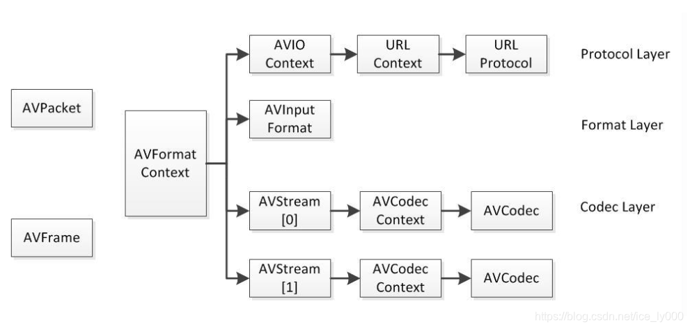

# 6 `avformat_find_stream_Info`

> `avformat_find_stream_Info`声明：
>
> 所属库：`libavformat`（lavf）
> 头文件：`avformat.h`
>
> 声明：从如下声明的解释可以获知如下几点信息
>
> 1) 该函数将读取媒体文件的音视频包去获取流信息。本函数常用于`avformat_open_input()`函数之后，在`avformat_open_input()`函数中会调用输入文件格式的`read_header()`函数，比如`flv`格式的`flv_read_header()`函数来读取文件头，由于`flv`格式的头很简单，只能知道是否存在音频流和视频流，获取不到流的编码信息，因此，对于`flv`格式来说，本函数就非常重要，本函数会读取`flv`文件中的音视频包，从这些包中获知流的编码信息。对于没有文件头的`MPEG`格式来说存在同样的情况。
> 2) 本函数还会在`MPEG`的重复帧模式下计算真实的帧率
> 3) 本函数不会改变文件的逻辑位置（即程序访问文件时文件的偏移`offset`），那些读取并用来做检测的数据包将被缓冲，并留作后续处理使用。
> 4) 本函数的入参`AVDictionary **option`如果不为空，那么该入参是一个`AVDictionary`列表，第几个`AVDictionary`就作用于`AVFormatContext.nb_streams`的第几个流，如果在对应的流中找不到相应的选项，函数返回时，那么该入参中还会保留着没有找到的选项。
> 5) 本函数不会保证打开所有的编解码器，因此，在函数返回时，选项非空是正常行为。
> 6) 本函数通过`options`来让用户决定哪些信息是需要的，因此，不浪费时间在获取一些用户根本不需要的信息。
>
> ```c
> /**
> * 读取媒体文件的数据包以获取流信息。 这个
>   * 对于没有标题的文件格式（如 MPEG）很有用。 这个
>   * 在 MPEG-2 重复的情况下，函数还计算实际帧率
>   * 帧模式。
>   * 逻辑文件位置不会被这个函数改变；
>   * 检查的数据包可能会被缓冲以供以后处理。
>   *
>   * @param ic 媒体文件句柄
>   * @param options 如果非 NULL，一个 ic.nb_streams 长指针数组
>   * 字典，其中第 i 个成员包含以下选项
>   * 对应于第 i 个流的编解码器。
>   * 返回时，每本词典将填充未找到的选项。
>   * @return >=0 如果正常，AVERROR_xxx 出错
>   *
>   * @note 这个函数不能保证打开所有的编解码器，所以
>   * 返回时非空的选项是完全正常的行为。
>   *
>   * @todo 让用户以某种方式决定需要什么信息，以便
>   * 我们不会浪费时间获取用户不需要的东西。
>  */
> int avformat_find_stream_info(AVFormatContext *ic, AVDictionary **options);
> ```
>
> `avformat_find_stream_Info`源码：
>
> ```c
> int avformat_find_stream_info(AVFormatContext *ic, AVDictionary **options)
> {
>     /*** 第一部分：申明一些局部变量，并初始化 ***/
>     int i, count = 0, ret = 0, j;
>     int64_t read_size;
>     AVStream *st;
>     AVCodecContext *avctx;
>     AVPacket pkt1, *pkt;
>     // 获取已消费完毕的数据对应于文件偏移量，注意不是已读取数据对应文件偏移量
>     int64_t old_offset  = avio_tell(ic->pb);
>     // new streams might appear, no options for those
>     // 在avformat_open_input函数中可能已经new出AVStream，nb_streams也对应流个数
>     int orig_nb_streams = ic->nb_streams;
>     int flush_codecs;
>     // 在AVFormatContext初始化中已经设置该值为默认值0
>     int64_t max_analyze_duration = ic->max_analyze_duration;
>     int64_t max_stream_analyze_duration;
>     int64_t max_subtitle_analyze_duration;
>     // 在AVFormatContext初始化中已经设置该值为默认值为5000000
>     int64_t probesize = ic->probesize;
>     int eof_reached = 0;
>     // 若在avformat_open_input分析输入封装格式时，会读取文件头部来看是否存在流来给missing_streams赋值
>     int *missing_streams = av_opt_ptr(ic->iformat->priv_class, ic->priv_data, "missing_streams");
>  
>     flush_codecs = probesize > 0;
>  
>     av_opt_set(ic, "skip_clear", "1", AV_OPT_SEARCH_CHILDREN);
>  
>     // 由于max_analyze_duration大概率为0(因为被初始化为0，中间被修改的概率比较小)，因此一般情况下，会进入if(){...}语句中执行
>     max_stream_analyze_duration = max_analyze_duration;
>     max_subtitle_analyze_duration = max_analyze_duration;
>     if (!max_analyze_duration) {
>         // 分析流的最大时长和分析文件的最大时长均设置为5倍AV_TIME_BASE, AV_TIME_BASE为1000000，而max_stream_analyze_duration和max_analyze_duration单位刚好为微妙，结合起来正好描述为5s重
>         max_stream_analyze_duration =
>         max_analyze_duration        = 5*AV_TIME_BASE;
>         // 同理，分析字幕时的时长为30s                    
>         max_subtitle_analyze_duration = 30*AV_TIME_BASE;
>         // 如果是flv文件格式，流分析时长延长到90s
>         if (!strcmp(ic->iformat->name, "flv"))
>             max_stream_analyze_duration = 90*AV_TIME_BASE;
>         // 如果是mpeg格式，mpegts格式，流分析时长为7s
>         if (!strcmp(ic->iformat->name, "mpeg") || !strcmp(ic->iformat->name, "mpegts"))
>             max_stream_analyze_duration = 7*AV_TIME_BASE;
>     }
>  
>     // 如果AVIOContext已经存在，那么也许已经读取了数据，这儿输出当前io读取情况。
>     // avio_tell(ic->pb)输出已读取并处理完的数据偏移位置（文件偏移量），
>     // bytes_read为已读取数据字节数，seek_count是已经做过多少次seek操作， nb_streams为流个数
>     if (ic->pb)
>         av_log(ic, AV_LOG_DEBUG, "Before avformat_find_stream_info() pos: %"PRId64" bytes read:%"PRId64" seeks:%d nb_streams:%d\n",
>                avio_tell(ic->pb), ic->pb->bytes_read, ic->pb->seek_count, ic->nb_streams);
>  
>     // 第一个for循环，做什么的？
>     // 赋值AVStream->AVStreamInternal编码器参数值，并通过打开流的解码器来验证这些参数值是否正确
>     for (i = 0; i < ic->nb_streams; i++) {
>         const AVCodec *codec;
>         AVDictionary *thread_opt = NULL;
>         st = ic->streams[i];
>         avctx = st->internal->avctx;
>  
>         // 在文件格式读取文件头的函数中，会解析并给AVStream->time_base时间基赋值
>         // 复制时间基到AVStream->AVStreamInternal->AVCodecContext->time_base中
>         if (st->codecpar->codec_type == AVMEDIA_TYPE_VIDEO ||
>             st->codecpar->codec_type == AVMEDIA_TYPE_SUBTITLE) {
> /*            if (!st->time_base.num)
>                 st->time_base = */
>             if (!avctx->time_base.num)
>                 avctx->time_base = st->time_base;
>         }
>  
>         // 外部用户修改了AVStream的AVCodecContext，那么这儿保持AVStream的AVCodecParameters中 
>         // codec_id, codec_type, AVStream的AVStreamInternal中的orig_codec_id，与AVStream的 
>         // AVCodecContext中的数据保持一致。
>         /* check if the caller has overridden the codec id */
> #if FF_API_LAVF_AVCTX
> FF_DISABLE_DEPRECATION_WARNINGS
>         if (st->codec->codec_id != st->internal->orig_codec_id) {
>             st->codecpar->codec_id   = st->codec->codec_id;
>             st->codecpar->codec_type = st->codec->codec_type;
>             st->internal->orig_codec_id = st->codec->codec_id;
>         }
> FF_ENABLE_DEPRECATION_WARNINGS
> #endif
>  
>         // 查看流分析需不需要解析器，解析器用来从流中分离出单独的视频帧和音频帧
>         // only for the split stuff
>         if (!st->parser && !(ic->flags & AVFMT_FLAG_NOPARSE) && st->request_probe <= 0) {
>             st->parser = av_parser_init(st->codecpar->codec_id);
>             if (st->parser) {
>                 if (st->need_parsing == AVSTREAM_PARSE_HEADERS) {
>                     st->parser->flags |= PARSER_FLAG_COMPLETE_FRAMES;
>                 } else if (st->need_parsing == AVSTREAM_PARSE_FULL_RAW) {
>                     st->parser->flags |= PARSER_FLAG_USE_CODEC_TS;
>                 }
>             } else if (st->need_parsing) {
>                 av_log(ic, AV_LOG_VERBOSE, "parser not found for codec "
>                        "%s, packets or times may be invalid.\n",
>                        avcodec_get_name(st->codecpar->codec_id));
>             }
>         }
>  
>  
>         // 确保AVStream->AVStreaminternal中关于编解码器的相关参数正确
>         if (st->codecpar->codec_id != st->internal->orig_codec_id)
>             st->internal->orig_codec_id = st->codecpar->codec_id;
>         ret = avcodec_parameters_to_context(avctx, st->codecpar); // 复制编解码器参数
>         if (ret < 0)
>             goto find_stream_info_err;
>         if (st->request_probe <= 0)
>             st->internal->avctx_inited = 1; // 设置初始化标志位
>  
>         // 查找解码器
>         codec = find_probe_decoder(ic, st, st->codecpar->codec_id);
>  
>         // 设置解码线程为1个
>         /* Force thread count to 1 since the H.264 decoder will not extract
>          * SPS and PPS to extradata during multi-threaded decoding. */
>         av_dict_set(options ? &options[i] : &thread_opt, "threads", "1", 0);
>  
>         if (ic->codec_whitelist)
>             av_dict_set(options ? &options[i] : &thread_opt, "codec_whitelist", ic->codec_whitelist, 0);
>  
>         // 对于字幕流，尝试打开解码器，确保字幕头是否正确的设置
>         /* Ensure that subtitle_header is properly set. */
>         if (st->codecpar->codec_type == AVMEDIA_TYPE_SUBTITLE
>             && codec && !avctx->codec) {
>             if (avcodec_open2(avctx, codec, options ? &options[i] : &thread_opt) < 0)
>                 av_log(ic, AV_LOG_WARNING,
>                        "Failed to open codec in %s\n",__FUNCTION__);
>         }
>  
>         // 尝试打开解码器，看是否已获得足够的编解码参数
>         // Try to just open decoders, in case this is enough to get parameters.
>         if (!has_codec_parameters(st, NULL) && st->request_probe <= 0) {
>             if (codec && !avctx->codec)
>                 if (avcodec_open2(avctx, codec, options ? &options[i] : &thread_opt) < 0)
>                     av_log(ic, AV_LOG_WARNING,
>                            "Failed to open codec in %s\n",__FUNCTION__);
>         }
>         if (!options)
>             av_dict_free(&thread_opt);
>     }
>  
>     // 第二个for循环，做什么的？
>     // 给AVStream内部使用的info结构体的一些成员赋初始值，这几个成员用于平均帧率估计
>     for (i = 0; i < ic->nb_streams; i++) {
> #if FF_API_R_FRAME_RATE
>         ic->streams[i]->info->last_dts = AV_NOPTS_VALUE;
> #endif
>         ic->streams[i]->info->fps_first_dts = AV_NOPTS_VALUE;
>         ic->streams[i]->info->fps_last_dts  = AV_NOPTS_VALUE;
>     }
>  
>     // 第三个for循环，死循环，做什么的？
>     // 
>     read_size = 0;
>     for (;;) {
>         int analyzed_all_streams;
>         // 检测是否有外部中断，可以帮助快速退出循环，终止程序运行，ic->interrupt_callback
>         // 由用户定义，因此，何时需要终止程序是受用户支配的。
>         if (ff_check_interrupt(&ic->interrupt_callback)) {
>             ret = AVERROR_EXIT;
>             av_log(ic, AV_LOG_DEBUG, "interrupted\n");
>             break;
>         }
>  
>         // 
>         /* check if one codec still needs to be handled */
>         for (i = 0; i < ic->nb_streams; i++) {
>             int fps_analyze_framecount = 20;
>             int count;
>  
>             st = ic->streams[i];
>             if (!has_codec_parameters(st, NULL))
>                 break;
>             /* If the timebase is coarse (like the usual millisecond precision
>              * of mkv), we need to analyze more frames to reliably arrive at
>              * the correct fps. */
>             if (av_q2d(st->time_base) > 0.0005)
>                 fps_analyze_framecount *= 2;
>             if (!tb_unreliable(st->internal->avctx))
>                 fps_analyze_framecount = 0;
>             if (ic->fps_probe_size >= 0)
>                 fps_analyze_framecount = ic->fps_probe_size;
>             if (st->disposition & AV_DISPOSITION_ATTACHED_PIC)
>                 fps_analyze_framecount = 0;
>             /* variable fps and no guess at the real fps */
>             count = (ic->iformat->flags & AVFMT_NOTIMESTAMPS) ?
>                        st->info->codec_info_duration_fields/2 :
>                        st->info->duration_count;
>             if (!(st->r_frame_rate.num && st->avg_frame_rate.num) &&
>                 st->codecpar->codec_type == AVMEDIA_TYPE_VIDEO) {
>                 if (count < fps_analyze_framecount)
>                     break;
>             }
>             // Look at the first 3 frames if there is evidence of frame delay
>             // but the decoder delay is not set.
>             if (st->info->frame_delay_evidence && count < 2 && st->internal->avctx->has_b_frames == 0)
>                 break;
>             if (!st->internal->avctx->extradata &&
>                 (!st->internal->extract_extradata.inited ||
>                  st->internal->extract_extradata.bsf) &&
>                 extract_extradata_check(st))
>                 break;
>             if (st->first_dts == AV_NOPTS_VALUE &&
>                 !(ic->iformat->flags & AVFMT_NOTIMESTAMPS) &&
>                 st->codec_info_nb_frames < ((st->disposition & AV_DISPOSITION_ATTACHED_PIC) ? 1 : ic->max_ts_probe) &&
>                 (st->codecpar->codec_type == AVMEDIA_TYPE_VIDEO ||
>                  st->codecpar->codec_type == AVMEDIA_TYPE_AUDIO))
>                 break;
>         }
>         analyzed_all_streams = 0;
>         if (!missing_streams || !*missing_streams)
>         if (i == ic->nb_streams) {
>             analyzed_all_streams = 1;
>             /* NOTE: If the format has no header, then we need to read some
>              * packets to get most of the streams, so we cannot stop here. */
>             if (!(ic->ctx_flags & AVFMTCTX_NOHEADER)) {
>                 /* If we found the info for all the codecs, we can stop. */
>                 ret = count;
>                 av_log(ic, AV_LOG_DEBUG, "All info found\n");
>                 flush_codecs = 0;
>                 break;
>             }
>         }
>         /* We did not get all the codec info, but we read too much data. */
>         if (read_size >= probesize) {
>             ret = count;
>             av_log(ic, AV_LOG_DEBUG,
>                    "Probe buffer size limit of %"PRId64" bytes reached\n", probesize);
>             for (i = 0; i < ic->nb_streams; i++)
>                 if (!ic->streams[i]->r_frame_rate.num &&
>                     ic->streams[i]->info->duration_count <= 1 &&
>                     ic->streams[i]->codecpar->codec_type == AVMEDIA_TYPE_VIDEO &&
>                     strcmp(ic->iformat->name, "image2"))
>                     av_log(ic, AV_LOG_WARNING,
>                            "Stream #%d: not enough frames to estimate rate; "
>                            "consider increasing probesize\n", i);
>             break;
>         }
>  
>         /* NOTE: A new stream can be added there if no header in file
>          * (AVFMTCTX_NOHEADER). */
>         ret = read_frame_internal(ic, &pkt1);
>         if (ret == AVERROR(EAGAIN))
>             continue;
>  
>         if (ret < 0) {
>             /* EOF or error*/
>             eof_reached = 1;
>             break;
>         }
>  
>         pkt = &pkt1;
>  
>         if (!(ic->flags & AVFMT_FLAG_NOBUFFER)) {
>             ret = ff_packet_list_put(&ic->internal->packet_buffer,
>                                      &ic->internal->packet_buffer_end,
>                                      pkt, 0);
>             if (ret < 0)
>                 goto find_stream_info_err;
>         }
>  
>         st = ic->streams[pkt->stream_index];
>         if (!(st->disposition & AV_DISPOSITION_ATTACHED_PIC))
>             read_size += pkt->size;
>  
>         avctx = st->internal->avctx;
>         if (!st->internal->avctx_inited) {
>             ret = avcodec_parameters_to_context(avctx, st->codecpar);
>             if (ret < 0)
>                 goto find_stream_info_err;
>             st->internal->avctx_inited = 1;
>         }
>  
>         if (pkt->dts != AV_NOPTS_VALUE && st->codec_info_nb_frames > 1) {
>             /* check for non-increasing dts */
>             if (st->info->fps_last_dts != AV_NOPTS_VALUE &&
>                 st->info->fps_last_dts >= pkt->dts) {
>                 av_log(ic, AV_LOG_DEBUG,
>                        "Non-increasing DTS in stream %d: packet %d with DTS "
>                        "%"PRId64", packet %d with DTS %"PRId64"\n",
>                        st->index, st->info->fps_last_dts_idx,
>                        st->info->fps_last_dts, st->codec_info_nb_frames,
>                        pkt->dts);
>                 st->info->fps_first_dts =
>                 st->info->fps_last_dts  = AV_NOPTS_VALUE;
>             }
>             /* Check for a discontinuity in dts. If the difference in dts
>              * is more than 1000 times the average packet duration in the
>              * sequence, we treat it as a discontinuity. */
>             if (st->info->fps_last_dts != AV_NOPTS_VALUE &&
>                 st->info->fps_last_dts_idx > st->info->fps_first_dts_idx &&
>                 (pkt->dts - st->info->fps_last_dts) / 1000 >
>                 (st->info->fps_last_dts     - (uint64_t)st->info->fps_first_dts) /
>                 (st->info->fps_last_dts_idx - st->info->fps_first_dts_idx)) {
>                 av_log(ic, AV_LOG_WARNING,
>                        "DTS discontinuity in stream %d: packet %d with DTS "
>                        "%"PRId64", packet %d with DTS %"PRId64"\n",
>                        st->index, st->info->fps_last_dts_idx,
>                        st->info->fps_last_dts, st->codec_info_nb_frames,
>                        pkt->dts);
>                 st->info->fps_first_dts =
>                 st->info->fps_last_dts  = AV_NOPTS_VALUE;
>             }
>  
>             /* update stored dts values */
>             if (st->info->fps_first_dts == AV_NOPTS_VALUE) {
>                 st->info->fps_first_dts     = pkt->dts;
>                 st->info->fps_first_dts_idx = st->codec_info_nb_frames;
>             }
>             st->info->fps_last_dts     = pkt->dts;
>             st->info->fps_last_dts_idx = st->codec_info_nb_frames;
>         }
>         if (st->codec_info_nb_frames>1) {
>             int64_t t = 0;
>             int64_t limit;
>  
>             if (st->time_base.den > 0)
>                 t = av_rescale_q(st->info->codec_info_duration, st->time_base, AV_TIME_BASE_Q);
>             if (st->avg_frame_rate.num > 0)
>                 t = FFMAX(t, av_rescale_q(st->codec_info_nb_frames, av_inv_q(st->avg_frame_rate), AV_TIME_BASE_Q));
>  
>             if (   t == 0
>                 && st->codec_info_nb_frames>30
>                 && st->info->fps_first_dts != AV_NOPTS_VALUE
>                 && st->info->fps_last_dts  != AV_NOPTS_VALUE)
>                 t = FFMAX(t, av_rescale_q(st->info->fps_last_dts - st->info->fps_first_dts, st->time_base, AV_TIME_BASE_Q));
>  
>             if (analyzed_all_streams)                                limit = max_analyze_duration;
>             else if (avctx->codec_type == AVMEDIA_TYPE_SUBTITLE) limit = max_subtitle_analyze_duration;
>             else                                                     limit = max_stream_analyze_duration;
>  
>             if (t >= limit) {
>                 av_log(ic, AV_LOG_VERBOSE, "max_analyze_duration %"PRId64" reached at %"PRId64" microseconds st:%d\n",
>                        limit,
>                        t, pkt->stream_index);
>                 if (ic->flags & AVFMT_FLAG_NOBUFFER)
>                     av_packet_unref(pkt);
>                 break;
>             }
>             if (pkt->duration) {
>                 if (avctx->codec_type == AVMEDIA_TYPE_SUBTITLE && pkt->pts != AV_NOPTS_VALUE && pkt->pts >= st->start_time) {
>                     st->info->codec_info_duration = FFMIN(pkt->pts - st->start_time, st->info->codec_info_duration + pkt->duration);
>                 } else
>                     st->info->codec_info_duration += pkt->duration;
>                 st->info->codec_info_duration_fields += st->parser && st->need_parsing && avctx->ticks_per_frame ==2 ? st->parser->repeat_pict + 1 : 2;
>             }
>         }
>         if (st->codecpar->codec_type == AVMEDIA_TYPE_VIDEO) {
> #if FF_API_R_FRAME_RATE
>             ff_rfps_add_frame(ic, st, pkt->dts);
> #endif
>             if (pkt->dts != pkt->pts && pkt->dts != AV_NOPTS_VALUE && pkt->pts != AV_NOPTS_VALUE)
>                 st->info->frame_delay_evidence = 1;
>         }
>         if (!st->internal->avctx->extradata) {
>             ret = extract_extradata(st, pkt);
>             if (ret < 0)
>                 goto find_stream_info_err;
>         }
>  
>         /* If still no information, we try to open the codec and to
>          * decompress the frame. We try to avoid that in most cases as
>          * it takes longer and uses more memory. For MPEG-4, we need to
>          * decompress for QuickTime.
>          *
>          * If AV_CODEC_CAP_CHANNEL_CONF is set this will force decoding of at
>          * least one frame of codec data, this makes sure the codec initializes
>          * the channel configuration and does not only trust the values from
>          * the container. */
>         try_decode_frame(ic, st, pkt,
>                          (options && i < orig_nb_streams) ? &options[i] : NULL);
>  
>         if (ic->flags & AVFMT_FLAG_NOBUFFER)
>             av_packet_unref(pkt);
>  
>         st->codec_info_nb_frames++;
>         count++;
>     }
>  
>     if (eof_reached) {
>         int stream_index;
>         for (stream_index = 0; stream_index < ic->nb_streams; stream_index++) {
>             st = ic->streams[stream_index];
>             avctx = st->internal->avctx;
>             if (!has_codec_parameters(st, NULL)) {
>                 const AVCodec *codec = find_probe_decoder(ic, st, st->codecpar->codec_id);
>                 if (codec && !avctx->codec) {
>                     AVDictionary *opts = NULL;
>                     if (ic->codec_whitelist)
>                         av_dict_set(&opts, "codec_whitelist", ic->codec_whitelist, 0);
>                     if (avcodec_open2(avctx, codec, (options && stream_index < orig_nb_streams) ? &options[stream_index] : &opts) < 0)
>                         av_log(ic, AV_LOG_WARNING,
>                                "Failed to open codec in %s\n",__FUNCTION__);
>                     av_dict_free(&opts);
>                 }
>             }
>  
>             // EOF already reached while reading the stream above.
>             // So continue with reoordering DTS with whatever delay we have.
>             if (ic->internal->packet_buffer && !has_decode_delay_been_guessed(st)) {
>                 update_dts_from_pts(ic, stream_index, ic->internal->packet_buffer);
>             }
>         }
>     }
>  
>     if (flush_codecs) {
>         AVPacket empty_pkt = { 0 };
>         int err = 0;
>         av_init_packet(&empty_pkt);
>  
>         for (i = 0; i < ic->nb_streams; i++) {
>  
>             st = ic->streams[i];
>  
>             /* flush the decoders */
>             if (st->info->found_decoder == 1) {
>                 do {
>                     err = try_decode_frame(ic, st, &empty_pkt,
>                                             (options && i < orig_nb_streams)
>                                             ? &options[i] : NULL);
>                 } while (err > 0 && !has_codec_parameters(st, NULL));
>  
>                 if (err < 0) {
>                     av_log(ic, AV_LOG_INFO,
>                         "decoding for stream %d failed\n", st->index);
>                 }
>             }
>         }
>     }
>  
>     ff_rfps_calculate(ic);
>  
>     for (i = 0; i < ic->nb_streams; i++) {
>         st = ic->streams[i];
>         avctx = st->internal->avctx;
>         if (avctx->codec_type == AVMEDIA_TYPE_VIDEO) {
>             if (avctx->codec_id == AV_CODEC_ID_RAWVIDEO && !avctx->codec_tag && !avctx->bits_per_coded_sample) {
>                 uint32_t tag= avcodec_pix_fmt_to_codec_tag(avctx->pix_fmt);
>                 if (avpriv_find_pix_fmt(avpriv_get_raw_pix_fmt_tags(), tag) == avctx->pix_fmt)
>                     avctx->codec_tag= tag;
>             }
>  
>             /* estimate average framerate if not set by demuxer */
>             if (st->info->codec_info_duration_fields &&
>                 !st->avg_frame_rate.num &&
>                 st->info->codec_info_duration) {
>                 int best_fps      = 0;
>                 double best_error = 0.01;
>                 AVRational codec_frame_rate = avctx->framerate;
>  
>                 if (st->info->codec_info_duration        >= INT64_MAX / st->time_base.num / 2||
>                     st->info->codec_info_duration_fields >= INT64_MAX / st->time_base.den ||
>                     st->info->codec_info_duration        < 0)
>                     continue;
>                 av_reduce(&st->avg_frame_rate.num, &st->avg_frame_rate.den,
>                           st->info->codec_info_duration_fields * (int64_t) st->time_base.den,
>                           st->info->codec_info_duration * 2 * (int64_t) st->time_base.num, 60000);
>  
>                 /* Round guessed framerate to a "standard" framerate if it's
>                  * within 1% of the original estimate. */
>                 for (j = 0; j < MAX_STD_TIMEBASES; j++) {
>                     AVRational std_fps = { get_std_framerate(j), 12 * 1001 };
>                     double error       = fabs(av_q2d(st->avg_frame_rate) /
>                                               av_q2d(std_fps) - 1);
>  
>                     if (error < best_error) {
>                         best_error = error;
>                         best_fps   = std_fps.num;
>                     }
>  
>                     if (ic->internal->prefer_codec_framerate && codec_frame_rate.num > 0 && codec_frame_rate.den > 0) {
>                         error       = fabs(av_q2d(codec_frame_rate) /
>                                            av_q2d(std_fps) - 1);
>                         if (error < best_error) {
>                             best_error = error;
>                             best_fps   = std_fps.num;
>                         }
>                     }
>                 }
>                 if (best_fps)
>                     av_reduce(&st->avg_frame_rate.num, &st->avg_frame_rate.den,
>                               best_fps, 12 * 1001, INT_MAX);
>             }
>  
>             if (!st->r_frame_rate.num) {
>                 if (    avctx->time_base.den * (int64_t) st->time_base.num
>                     <= avctx->time_base.num * avctx->ticks_per_frame * (int64_t) st->time_base.den) {
>                     av_reduce(&st->r_frame_rate.num, &st->r_frame_rate.den,
>                               avctx->time_base.den, (int64_t)avctx->time_base.num * avctx->ticks_per_frame, INT_MAX);
>                 } else {
>                     st->r_frame_rate.num = st->time_base.den;
>                     st->r_frame_rate.den = st->time_base.num;
>                 }
>             }
>             if (st->display_aspect_ratio.num && st->display_aspect_ratio.den) {
>                 AVRational hw_ratio = { avctx->height, avctx->width };
>                 st->sample_aspect_ratio = av_mul_q(st->display_aspect_ratio,
>                                                    hw_ratio);
>             }
>         } else if (avctx->codec_type == AVMEDIA_TYPE_AUDIO) {
>             if (!avctx->bits_per_coded_sample)
>                 avctx->bits_per_coded_sample =
>                     av_get_bits_per_sample(avctx->codec_id);
>             // set stream disposition based on audio service type
>             switch (avctx->audio_service_type) {
>             case AV_AUDIO_SERVICE_TYPE_EFFECTS:
>                 st->disposition = AV_DISPOSITION_CLEAN_EFFECTS;
>                 break;
>             case AV_AUDIO_SERVICE_TYPE_VISUALLY_IMPAIRED:
>                 st->disposition = AV_DISPOSITION_VISUAL_IMPAIRED;
>                 break;
>             case AV_AUDIO_SERVICE_TYPE_HEARING_IMPAIRED:
>                 st->disposition = AV_DISPOSITION_HEARING_IMPAIRED;
>                 break;
>             case AV_AUDIO_SERVICE_TYPE_COMMENTARY:
>                 st->disposition = AV_DISPOSITION_COMMENT;
>                 break;
>             case AV_AUDIO_SERVICE_TYPE_KARAOKE:
>                 st->disposition = AV_DISPOSITION_KARAOKE;
>                 break;
>             }
>         }
>     }
>  
>     if (probesize)
>         estimate_timings(ic, old_offset);
>  
>     av_opt_set(ic, "skip_clear", "0", AV_OPT_SEARCH_CHILDREN);
>  
>     if (ret >= 0 && ic->nb_streams)
>         /* We could not have all the codec parameters before EOF. */
>         ret = -1;
>     for (i = 0; i < ic->nb_streams; i++) {
>         const char *errmsg;
>         st = ic->streams[i];
>  
>         /* if no packet was ever seen, update context now for has_codec_parameters */
>         if (!st->internal->avctx_inited) {
>             if (st->codecpar->codec_type == AVMEDIA_TYPE_AUDIO &&
>                 st->codecpar->format == AV_SAMPLE_FMT_NONE)
>                 st->codecpar->format = st->internal->avctx->sample_fmt;
>             ret = avcodec_parameters_to_context(st->internal->avctx, st->codecpar);
>             if (ret < 0)
>                 goto find_stream_info_err;
>         }
>         if (!has_codec_parameters(st, &errmsg)) {
>             char buf[256];
>             avcodec_string(buf, sizeof(buf), st->internal->avctx, 0);
>             av_log(ic, AV_LOG_WARNING,
>                    "Could not find codec parameters for stream %d (%s): %s\n"
>                    "Consider increasing the value for the 'analyzeduration' and 'probesize' options\n",
>                    i, buf, errmsg);
>         } else {
>             ret = 0;
>         }
>     }
>  
>     compute_chapters_end(ic);
>  
>     /* update the stream parameters from the internal codec contexts */
>     for (i = 0; i < ic->nb_streams; i++) {
>         st = ic->streams[i];
>  
>         if (st->internal->avctx_inited) {
>             int orig_w = st->codecpar->width;
>             int orig_h = st->codecpar->height;
>             ret = avcodec_parameters_from_context(st->codecpar, st->internal->avctx);
>             if (ret < 0)
>                 goto find_stream_info_err;
> #if FF_API_LOWRES
>             // The decoder might reduce the video size by the lowres factor.
>             if (st->internal->avctx->lowres && orig_w) {
>                 st->codecpar->width = orig_w;
>                 st->codecpar->height = orig_h;
>             }
> #endif
>         }
>  
> #if FF_API_LAVF_AVCTX
> FF_DISABLE_DEPRECATION_WARNINGS
>         ret = avcodec_parameters_to_context(st->codec, st->codecpar);
>         if (ret < 0)
>             goto find_stream_info_err;
>  
> #if FF_API_LOWRES
>         // The old API (AVStream.codec) "requires" the resolution to be adjusted
>         // by the lowres factor.
>         if (st->internal->avctx->lowres && st->internal->avctx->width) {
>             st->codec->lowres = st->internal->avctx->lowres;
>             st->codec->width = st->internal->avctx->width;
>             st->codec->height = st->internal->avctx->height;
>         }
> #endif
>  
>         if (st->codec->codec_tag != MKTAG('t','m','c','d')) {
>             st->codec->time_base = st->internal->avctx->time_base;
>             st->codec->ticks_per_frame = st->internal->avctx->ticks_per_frame;
>         }
>         st->codec->framerate = st->avg_frame_rate;
>  
>         if (st->internal->avctx->subtitle_header) {
>             st->codec->subtitle_header = av_malloc(st->internal->avctx->subtitle_header_size);
>             if (!st->codec->subtitle_header)
>                 goto find_stream_info_err;
>             st->codec->subtitle_header_size = st->internal->avctx->subtitle_header_size;
>             memcpy(st->codec->subtitle_header, st->internal->avctx->subtitle_header,
>                    st->codec->subtitle_header_size);
>         }
>  
>         // Fields unavailable in AVCodecParameters
>         st->codec->coded_width = st->internal->avctx->coded_width;
>         st->codec->coded_height = st->internal->avctx->coded_height;
>         st->codec->properties = st->internal->avctx->properties;
> FF_ENABLE_DEPRECATION_WARNINGS
> #endif
>  
>         st->internal->avctx_inited = 0;
>     }
>  
> find_stream_info_err:
>     for (i = 0; i < ic->nb_streams; i++) {
>         st = ic->streams[i];
>         if (st->info)
>             av_freep(&st->info->duration_error);
>         avcodec_close(ic->streams[i]->internal->avctx);
>         av_freep(&ic->streams[i]->info);
>         av_bsf_free(&ic->streams[i]->internal->extract_extradata.bsf);
>         av_packet_free(&ic->streams[i]->internal->extract_extradata.pkt);
>     }
>     if (ic->pb)
>         av_log(ic, AV_LOG_DEBUG, "After avformat_find_stream_info() pos: %"PRId64" bytes read:%"PRId64" seeks:%d frames:%d\n",
>                avio_tell(ic->pb), ic->pb->bytes_read, ic->pb->seek_count, count);
>     return ret;
> }
> ```
>
> 本函数中，先对一部分数据进行声明和初始化，然后有多个类似于for (i = 0; i < ic->nb_streams; i++) {…}的循环处理，还有一个for(;;)死循环的处理。接下来就对整个过程做一个比较详细的分析：
>
> 1) 局部变量的声明，以及数据初始化：
>    1) `int64_t old_offset = avio_tell(ic->pb);`保存当前文件偏移量，由于`avformat_open_input()`函数已经打开文件，并且读取了文件头，因此，文件偏移已经不为0，此时，该变量保存当前的文件偏移。
>    2) `int orig_nb_streams = ic->nb_streams;`保存`avformat_open_input()`读取文件头是获取的文件中流的个数，注意对于`flv`这种格式这个值为0.
>    3) `int64_t max_analyze_duration = ic->max_analyze_duration;`保存最大的分析时长，`ic_analyze_duration`在构建`AVFormatContext`过程中被初始化为0，单位微秒
>    4) `int64_t probesize = av_opt_ptr(ic->iformat->priv_class, ic->priv_data, "missing_streams");`保存文件中是否存在流的指示。`avformat_open_input()`中分析了`flv_read_header()`函数中就对该值进行了阐述，该值不为0，表示音视频流存在，为0表示不存在音视频流。
>    5) 流分析最大时长，最大分析时长，字幕时长的计算：分析时长的基本单位是微秒，而`AV_TIME_BASE`是1000000，那么由源码得知：通用情况下，流分析最大时长和最大分析时长为`5AV_TIME_BASE`，即`5s`，字幕分析时长为`30AV_TIME_BASE`，即`30s`；特诉情况下，比如文件格式为`flv`格式，那么流分析最大时长更新为`90AV_TIME_BASE`，即`90s`，如果文件格式为`mpeg`或者`mpegts`格式，那么流分析最大时长更新为`7AV_TIME_BASE`，即`7s`。
> 2) 第一次`for`循环变流每一个流：
>    1) 复制时间基到`AVStream->AVStreamInternal->AVCodecContext->time_base`：在文件格式读取文件头函数中，会解析并给`AVStream->time_base`时间基赋值，此处将该时间基复制一份到`AVStream->AVStreamInternal->AVCodecContext->tme_base`中，因为后续的解码，解码器使用`AVStream->AVStreamInternal`中的数据。
>    2) 检查用户是否修改了解码器：外部用户修改了`AVStream->AVCodecContext`中的编解码器，那么这儿保持`AVStream->AVStreaminternal->orig_codec_id`要赋值为`AVStream->codecpar->codec_id`，`AVStream->codecpar->codec_id`在媒体打开函数`av_format_open_input()`中已经通过文件格式读取文件头的函数获知到正确的`codec_id`；另一方面`AVStream->AVStreaminternal->AVCodecContext`编码器上下文从`AVStream->AVCodecParameters->codec_id, codec_type, AVStream->AVStreaminternal->codec_id`与修改后一致。
>    3) 创建流的解析器：解析器用来从原始码流中分离出单独的一帧视频或音频，按需创建。
>    4) 检查`AVStream->AVStreaminternal`中的编解码参数都被合理赋值：一方面是`AVStream->AVStreaminternal->orig_codec_id`要赋值为`AVStream->codecpar->codec_id`，`AVStream->codecpar->codec_id`在媒体打开函数`avformat_open_input()`中已经通过文件格式读取文件头的函数获知到正确的`codec_id`；另一方面`AVStream->AVStreaminternal->AVCodecContext`编码器上下文从`AVStream->AVCodecParameters`中拷贝一份编解码参数，因为文件格式读取文件头的函数会分析文件头并给`AVStream->AVCodecParamters`赋值。
>    5) 查找解码器，并打开解码器，从而对上述的解码器参数是否正确进行预判。
>       1) 总结：由上分析可知，第一次`for`循环遍历流，目的在于给流的`AVStream->AVStreaminternal`中的编码器相关参数赋值（时间戳`time_base`，编码器`orig_codec_id`，编码器上下文结构`avctx`）；然后找到每个流的解码器，通过打开解码器是否成功来验证上述赋值的编解码器参数是否正确。
> 3) 第二次`for`循环遍历每一个流：
>    1) 本次遍历是对`AVStream->info`结构体的部分成员赋初始值，该结构用于存储流信息，且仅供`avformat_find_stream_info()`函数使用。此次赋值的几个变量是用来进行平均帧率估计的参数。
> 4) 第三次`for`循环，`for(;;)`死循环
>    1) 使用`ff_check_interrupt(&ic->interrupt_callback)`检测是否有外部中断，可以帮助快速退出循环，终止程序运行，`ic->interrupt_callback`由用户定义，并在构建`AVFormatContext`对象是传入，因此，何时需要终止程序是受用户支配的。

# 7 `av_read_frame`

> [av_read_frame_开水太烫的博客-CSDN博客](https://blog.csdn.net/weixin_42123332/article/details/120726362?spm=1001.2014.3001.5502)
>
> ​	ffmpeg中的`av_read_frame()`的作用是读取码流中的音频若干帧或者视频一帧。例如，解码视频的时候，每解码一个视频帧，需要先调用 `av_read_frame()`获得一帧视频的压缩数据，然后才能对该数据进行解码（例如H.264中一帧压缩数据通常对应一个NAL）。对于视频的编解码来说，要对数据进行解码，那么首先要获取视频帧的压缩数据。 av_read_frame()的作用就是获取视频的数据。
>
> 注：`av_read_frame()`获取视频的一帧，不存在半帧说法。但可以获取音频的若干帧。
>
> 说明①：`av_read_frame()`函数是ffmpeg新型的用法，旧用法之所以被抛弃，就是因为以前获取的数据可能不是完整的，`av_read_frame()`保证了视频数据一帧的完整性。
> 说明②：查看API的改变可以看到，从2012-03-20开始，Deprecate `av_read_packet()`, use
> `av_read_frame()`，返回流的下一帧。
>
> ​	此函数返回存储在文件中的内容，但不验证解码器是否有有效帧。 它将把文件中存储的内容拆分为帧，并为每个调用返回一个帧。 它不会省略有效帧之间的无效数据，以便给解码器最大可能的解码信息。
> ​	如果`pkt->buf`为`NULL`，那么直到下一个`av_read_frame()`或直到`avformat_close_input()`，包都是有效的。否则数据包将无限期有效。在这两种情况下，当不再需要包时，必须使用`av_free_packet`释放包。 对于视频，数据包只包含一帧。对于音频，如果每个帧具有已知固定大小（例如PCM或ADPCM数据），则它包含整数帧数。如果音频有一个可变大小（例如MPEG音频），那么它包含一帧。
> ​	在`AVStream`中，`pkt->pts`、`pkt->dts`和`pkt->duration`总是被设置为恰当的值。`AVStream->time_base`单位中的值，如果格式不能提供，则猜测它们。如果视频格式有`B`帧，最好依靠`pkt->dts`解压有效载荷。
>
> `int av_read_frame(AVFormatContext *s, AVPacket *pkt);`
> 参数说明：
> `AVFormatContext *s `　　// 文件格式上下文，输入的`AVFormatContext`
> `AVPacket *pkt` 　 // 这个值不能传`NULL`，必须是一个空间，输出的`AVPacket`
> 　　　　　　　　　　　　// 返回值：`return 0 is OK, <0 on error or end of file`
>
> `av_read_frame()`函数源码位于`libavformat\utils.c`
>
> ```c
> int av_read_frame(AVFormatContext *s, AVPacket *pkt)
> {
>     const int genpts = s->flags & AVFMT_FLAG_GENPTS;
>     int eof = 0;
>     int ret;
>     AVStream *st;
> 
>     if (!genpts) {
>         ret = s->internal->packet_buffer
>               ? ff_packet_list_get(&s->internal->packet_buffer,
>                                         &s->internal->packet_buffer_end, pkt)
>               : read_frame_internal(s, pkt);
>         if (ret < 0)
>             return ret;
>         goto return_packet;
>     }
> 
>     for (;;) {
>         AVPacketList *pktl = s->internal->packet_buffer;
> 
>         if (pktl) {
>             AVPacket *next_pkt = &pktl->pkt;
> 
>             if (next_pkt->dts != AV_NOPTS_VALUE) {
>                 int wrap_bits = s->streams[next_pkt->stream_index]->pts_wrap_bits;
>                 // last dts seen for this stream. if any of packets following
>                 // current one had no dts, we will set this to AV_NOPTS_VALUE.
>                 int64_t last_dts = next_pkt->dts;
>                 av_assert2(wrap_bits <= 64);
>                 while (pktl && next_pkt->pts == AV_NOPTS_VALUE) {
>                     if (pktl->pkt.stream_index == next_pkt->stream_index &&
>                         av_compare_mod(next_pkt->dts, pktl->pkt.dts, 2ULL << (wrap_bits - 1)) < 0) {
>                         if (av_compare_mod(pktl->pkt.pts, pktl->pkt.dts, 2ULL << (wrap_bits - 1))) {
>                             // not B-frame
>                             next_pkt->pts = pktl->pkt.dts;
>                         }
>                         if (last_dts != AV_NOPTS_VALUE) {
>                             // Once last dts was set to AV_NOPTS_VALUE, we don't change it.
>                             last_dts = pktl->pkt.dts;
>                         }
>                     }
>                     pktl = pktl->next;
>                 }
>                 if (eof && next_pkt->pts == AV_NOPTS_VALUE && last_dts != AV_NOPTS_VALUE) {
>                     // Fixing the last reference frame had none pts issue (For MXF etc).
>                     // We only do this when
>                     // 1. eof.
>                     // 2. we are not able to resolve a pts value for current packet.
>                     // 3. the packets for this stream at the end of the files had valid dts.
>                     next_pkt->pts = last_dts + next_pkt->duration;
>                 }
>                 pktl = s->internal->packet_buffer;
>             }
> 
>             /* read packet from packet buffer, if there is data */
>             st = s->streams[next_pkt->stream_index];
>             if (!(next_pkt->pts == AV_NOPTS_VALUE && st->discard < AVDISCARD_ALL &&
>                   next_pkt->dts != AV_NOPTS_VALUE && !eof)) {
>                 ret = ff_packet_list_get(&s->internal->packet_buffer,
>                                                &s->internal->packet_buffer_end, pkt);
>                 goto return_packet;
>             }
>         }
> 
>         ret = read_frame_internal(s, pkt);
>         if (ret < 0) {
>             if (pktl && ret != AVERROR(EAGAIN)) {
>                 eof = 1;
>                 continue;
>             } else
>                 return ret;
>         }
> 
>         ret = ff_packet_list_put(&s->internal->packet_buffer,
>                                  &s->internal->packet_buffer_end,
>                                  pkt, FF_PACKETLIST_FLAG_REF_PACKET);
>         av_packet_unref(pkt);
>         if (ret < 0)
>             return ret;
>     }
> 
> return_packet:
> 
>     st = s->streams[pkt->stream_index];
>     if ((s->iformat->flags & AVFMT_GENERIC_INDEX) && pkt->flags & AV_PKT_FLAG_KEY) {
>         ff_reduce_index(s, st->index);
>         av_add_index_entry(st, pkt->pos, pkt->dts, 0, 0, AVINDEX_KEYFRAME);
>     }
> 
>     if (is_relative(pkt->dts))
>         pkt->dts -= RELATIVE_TS_BASE;
>     if (is_relative(pkt->pts))
>         pkt->pts -= RELATIVE_TS_BASE;
> 
>     return ret;
> }
> ```

# 8 `AVBuffer`

> ​	[AVBuffer_开水太烫的博客-CSDN博客](https://blog.csdn.net/weixin_42123332/article/details/120739114?spm=1001.2014.3001.5502)
>
> ​	在ffmpeg的位置`libavutil\buffer_internal.h`（对于调用者隐藏的）和`libavutil\buffer.h`（对于调用者是公开的）。`AVBuffer`是一个具有引用计数的数据缓存，FFMPEG提供了一套完善的API对`AVBuffer`进行操作。`AVBuffer`和`AVBufferRef`是两个核心结构体。`AVBuffer`代表数据缓存本身，但一般情况下调用者不应该直接调用它，而是需要通过`AVBufferRef`的调用，让API内部对`AVBuffer`进行操作。当然了，调用者可以检测两个`AVBuffer`指针，对比其是否指向同一个`AVBuffer`对象。`AVBufferRef`则是直接面向调用者，调用者可以直接操作它。有两种方法来分配`AVBuffer`，一种是`av_buffer_alloc()`，另一种是`av_buffer_create()`，`av_buffer_create()`可以自定义内存的释放方法，具体见API分析。`AVBuffer`在创建的时候引用计数为1，当调用`av_buffer_ref()`对其进行操作是，引用计数加1，当`av_buffer_unref()`对其操作时引用计数减1（当减1后引用计数为0时，`av_buffer_unref()`将自动释放分配的数据缓存）。
>
> ​	一个`AVBuffer`是否可写，通过`av_buffer_writable()`来判断。只有引用计数为1的情况下，`AVBuffer`才处于可写状态。当一个`AVBuffer`为只读时（不可写），你可以通过`av_buffer_make_writable()`来让其可写，该函数内部自动创建一个新的缓冲区，并且原来的`AVBuffer`引用计数减1.
>
> 注：
>
> 1) `AVBuffer`引用计数加1和减1的操作是线程安全的，调用者不需要额外的加锁机制。
> 2) 不同的`AVBufferRef`对同一`AVBuffer`的操作是平等的，不会因为谁先谁后而有差异。
>
> `AVBuffer`
>
> ```c
> struct AVBuffer {
>     uint8_t *data; /**< data described by this buffer 数据指针 */
>     int      size; /**< size of data in bytes 数据长度 */
> 
>     // number of existing AVBufferRef instances referring to this buffer 引用计数
>     atomic_uint refcount;
> 
>     //  a callback for freeing the data 释放数据的回调函数
>     void (*free)(void *opaque, uint8_t *data);
> 
>     /*
>      an opaque pointer, to be used by the freeing callback 隐性指针，
>     供释放数据的回调函数使用，pool_alloc_buffer就使用了该参数
>     */
>     void *opaque;
> 
>     // A combination of BUFFER_FLAG_ 标记该buffer是否为总是只读
>     int flags;
> };
> ```
>
> > `AVBuffer`使用了引用计数来管理数据缓存。引用计数时内存管理的一个技巧，可以看做是一种简单的垃圾回收机制，它允许多个拥有共同值的对象共享同一个缓存du。
> >
> > 为什么要使用引用计数
> > 对于没有垃圾自动回收机制的语言（如C/C++)和技术（如COM）来说，引用计数提供了一种简洁高效的内存管理方法。
> > 它简化了跟踪处理堆中对象的过程。
> > 一个对象被从堆中分配出来之后，我们需要明确的知道是谁拥有了这个对象，因为只有拥有这个对象的所有者能够销毁它。但我们在实际使用过程中， 这个对象可能被传递给另一个对象（例如通过传递指针参数），一旦这个过程复杂，我们很难确定谁最后拥有了这个对象。
> > 使用引用计数就可以抛开这个问题，我们不需要再去关心谁拥有了这个对象，因为我们把管理权交割给了对象自己（这有点类似__stdcall和__cdecl两种函数调用约定）。当这个对象不再被任何人使用时，它自己负责销毁自己。
> > 简单并且高效。简单是特定时候增减一下对象的引用计数就可以了；高效是让多个具有相同值的对象共享同一个对象，省却了拷贝复值的过程，而且更加节省内存和宝贵的CPU时间。
>
> `AVBufferRef`
>
> ```c
> typedef struct AVBufferRef {
>     AVBuffer *buffer;        // 真正的数据对象
> 
>     /**
>     * The data buffer. It is considered writable if and only if
>     * this is the only reference to the buffer, in which case
>     * av_buffer_is_writable() returns 1. 只有当av_buffer_is_writable()
>     * 判断为可读是才能通过该data指针来写入数据
>     */
>     uint8_t *data;        // 和 buffer->data指向同样的内存，
> 
>     // Size of data in bytes.
>     int      size;            // 数据长度 buffer->size一致
> } AVBufferRef;
> # 调用者可以通过API来操作AVBufferRef 。
> ```
>
> `AVBufferPool`
>
> ```c
> struct AVBufferPool {
>     AVMutex mutex;
>     BufferPoolEntry *pool;        
> 
>     /*
>     * This is used to track when the pool is to be freed.
>     * The pointer to the pool itself held by the caller is considered to
>     * be one reference. Each buffer requested by the caller increases refcount
>     * by one, returning the buffer to the pool decreases it by one.
>     * refcount reaches zero when the buffer has been uninited AND all the
>     * buffers have been released, then it's safe to free the pool and all
>     * the buffers in it.
>     * 当调用者调用一次av_buffer_pool_get时，其引用计数+1，当调用者调用av_buffer_unref
>     * 释放分配的AVBufferRef时，其引用计数-1
>     * av_buffer_unref -> buffer_replace -> AVBuffer->free -> pool_release_buffer , 
>     * pool_release_buffer 将其引用计数-1
>     */
>     atomic_uint refcount;         
> 
>     int size;                               // 每个Buffer的数据长度
>     void *opaque;
>     AVBufferRef* (*alloc)(int size);
>     AVBufferRef* (*alloc2)(void *opaque, int size);
>     void        (*pool_free)(void *opaque);
> };
> ```
>
> **API分析**
>
> 这里分为两部分进行分析，一个是对`AVBufferRef`的操作，一个是对`AVBufferPool`的操作。
>
> **`AVBufferRef`相关API分析**
>
> ```c
> /**
> * 根据指定的数据大小使用av_malloc分配一个AVBuffer
> *
> * @成功时返回一个包含指定数据大小的AVBufferRef， 返回NULL则说明分配失败。
> */
> AVBufferRef *av_buffer_alloc(int size);
> 
> /**
> * 功能和av_buffer_alloc一样，但其在返回的时候将数据缓冲区初始化为0。
> */
> AVBufferRef *av_buffer_allocz(int size);
> 
> /**
> * 该标志将缓存数据强制标记为只读，即使它引用计数为1。
> */
> #define AV_BUFFER_FLAG_READONLY (1 << 0)
> 
> /**
> * 通过已存在的数据缓存区创建一个AVBuffer.
> *
> * 当该函数调用成功时，AVBuffer拥有传入的数据的操作所有权， 调用者只能通过AVBufferRef 对象对数据进行操作，
> * 不能直接再通过指针直接操作传入的数据。
> * 如果函数调用失败，则不能使用AVBufferRef来操作，即是av_buffer_create与传入的数据没有产生关联。
> * @param data  数据指针
> * @param size  数据长度（字节为定位）
> * @param free  释放缓存数据的回调函数，当为NULL时，API内部默认使用av_buffer_default_free进行释放
> * @param opaque 供释放数据的回调函数使用
> * @param flags     AV_BUFFER_FLAG_ 数据缓冲区的读写标志，当设置为AV_BUFFER_FLAG_READONLY时数据缓冲区
> *                  处于只读状态。
> *
> * @成功时返回指向data的AVBufferRef，返回 NULL则失败.
> */
> AVBufferRef *av_buffer_create(uint8_t *data, int size,
>                               void (*free)(void *opaque, uint8_t *data),
>                               void *opaque, int flags);
> 
> /**
> * 缺省的用于数据释放的回调函数, 其使用av_free() 释放数据.
> * 这是一个回调函数，不能直接调用。
> */
> void av_buffer_default_free(void *opaque, uint8_t *data);
> 
> /**
> * 新创建一个指向同一AVBuffer的引用参考.
> *
> * @成功时返回和buf指向同一AVBuffer 的AVBufferRef，返回NULL 则失败
> */
> AVBufferRef *av_buffer_ref(AVBufferRef *buf);
> 
> /**
> * 释放参考引用计数，且当AVBuffer没有其他AVBufferRef时，则释放自动 AVBuffer本身，
> * 即是其占用的内存将会被释放
> *
> * @param buf  指向AVBuffer的参考对象，函数返回时其被置为NULL。
> */
> void av_buffer_unref(AVBufferRef **buf);
> 
> /**
> * 检测AVBuffer是否为可写
> * @return 1 ，AVBuffer处于可写状态，说明只有一个AVBufferRef 引用了它
> * Return 0 则说明不能写入数据.
> */
> int av_buffer_is_writable(const AVBufferRef *buf);
> 
> /**
> * @return 返回被av_buffer_create设置的opaque（隐形指针）参数 .
> */
> void *av_buffer_get_opaque(const AVBufferRef *buf);
> 
> /**
> *  返回buf指向的AVBuffer的引用计数
> */
> int av_buffer_get_ref_count(const AVBufferRef *buf);
> 
> /**
> * 将给定的AVBufferRef变为可写，当其引用的AVBuffer本身可写时直接返回，如果引用的AVBuffer处于只读状态，
> * 则重新创建一个AVBuffer，并将原来AVBuffer的数据拷贝给新的AVBuffer，而且原来的AVBuffer引用计数-1，
> * 此时buf指向一个新的AVBuffer。
> *
> * @param buf  AVBufferRef对象. 
> * @成功则返回0 , 返回负数 AVERROR则失败.
> */
> int av_buffer_make_writable(AVBufferRef **buf);
> 
> /**
> * 给指定的AVBufferRef重新分配AVBuffer。
> *
> * @param buf 指向重新分配AVBuffer的AVBufferRef. 
> * @param size 新数据缓冲区的大小.
> * @成功则返回0 , 返回负数 AVERROR则失败.
> *
> * @注意 （1）当传入的数据长度和原来数据长度相同时，并不会重新分配AVBuffer，而是直接返回成功。
> *  （2）当传入的AVBufferRef处于非已重新分配、或只读、或AVBufferRef和AVBuffer的data指向不同时，
> *      函数内部重新分配一个AVBuffer对象。
> *  （3）其他情况则对原来的AVBuffer调用av_realloc重新分配内存。
> */
> int av_buffer_realloc(AVBufferRef **buf, int size);
> ```
>
> `AVBufferPool`相关API分析
>
> ```c
> /**
> * 分配和初始化一个.AVBuffer池
> *
> * @param size 该池内每个buffer的大小
> * @param alloc 用于分配新buffers的回调函数，当其为NULL时，API内部默认使用 av_buffer_alloc()
> * @return  成功时返回AVBufferPool对象，返回NULL则说明失败。
> */
> AVBufferPool *av_buffer_pool_init(int size, AVBufferRef* (*alloc)(int size));
> 
> /**
> * 使用更复杂的allocator分配和初始化AVBuffer 池.
> *
> * @param size 该池内每个buffer的大小
> * @param opaque  allocator的自定义参数
> * @param alloc 用于分配新buffers的回调函数.
> * @param pool_free a function that will be called immediately before the pool
> *                  is freed. I.e. after av_buffer_pool_uninit() is called
> *                  by the caller and all the frames are returned to the pool
> *                  and freed. It is intended to uninitialize the user opaque
> *                  data.
> * @return 成功时返回AVBufferPool对象，返回NULL则说明失败。
> */
> AVBufferPool *av_buffer_pool_init2(int size, void *opaque,
>                                   AVBufferRef* (*alloc)(void *opaque, int size),
>                                   void (*pool_free)(void *opaque));
> 
> /**
> * Mark the pool as being available for freeing. It will actually be freed only
> * once all the allocated buffers associated with the pool are released. Thus it
> * is safe to call this function while some of the allocated buffers are still
> * in use.
> * 只有在其分配的所有AVBuffer都被释放时，其才真正被释放。
> * 即使存在AVBuffer没有被释放时调用该函数，也不影响AVBuffer的继续使用，
> * 其实现机制参考源码的pool_release_buffer，只有在引用计数为1的时候才会真正调用buffer_pool_free()
> *
> * @param pool pointer to the pool to be freed. It will be set to NULL.
> */
> void av_buffer_pool_uninit(AVBufferPool **pool);
> 
> /**
> * 分配一个新的AVBuffer，如果池中有被释放的AVBuffer，则重新使用它。可以参考后续章节的测试范例.
> * 该函数可以在多线程环境使用.
> *
> * @成功时返回一个AVBufferRef，返回NULL 则失败
> */
> AVBufferRef *av_buffer_pool_get(AVBufferPool *pool);
> ```

# 9 `AVFrame`

> [Frame_开水太烫的博客-CSDN博客](https://blog.csdn.net/weixin_42123332/article/details/120740749?spm=1001.2014.3001.5502)
>
> [音视频从入门到精通——FFmpeg结构体：AVFrame分析_ffmpeg frame结构-CSDN博客](https://blog.csdn.net/e891377/article/details/126717216?ops_request_misc=&request_id=&biz_id=102&utm_term=AVFrame&utm_medium=distribute.pc_search_result.none-task-blog-2~all~sobaiduweb~default-4-126717216.nonecase&spm=1018.2226.3001.4187)
>
> ​	`AVFrame`结构体是存储音视频原始数据（即未被编码的数据）的结构体。该结构体位于`libavutil/frame.h`中。`AVFrame`必须使用`av_frame_alloc()`来分配。注意，这只是分配`AVFrame`本身，缓冲区的数据（解码成功后的数据）必须通过其他途径被管理。因为`AVFrame`通常只分配一次，然后多次复用来保存不同类型的数据，复用的时候需要调用`av_frame_unref()`将其重置到它前面的原始清洁状态。注意调用`avcodec_receive_frame()`时会自动引用减1后再获取`frame`，所以解码过程中无需每次调用。释放的时候必须用`av_frame_free()`释放。
>
> **常用函数使用**
>
> ```c
> // 初始化
> AVFrame *av_frame_alloc(void);	// 创建空间， 分配内存
> // 引用减1，若为0则释放缓冲区数据，注意调用avcodec_receive_frame()时会自动引用减1再获取frame，所以解锁过程中无需每次调用
> void av_frame_unref(AVFrame *frame);
> // 释放frame本身
> void av_frame_free(AVFrame **frame);
> // 从src复制到一个初始化好的dst中，并引用加1
> av_frame_ref(AVFrame *dst, const AVFrame *src);
> // 创建并返回一个复制好的AVPacket(在音视频同步处理中用到该函数)
> av_frame_clone(const AVFrame *src);
> 
> // 发送要解码的数据到解码队列中，并引用加1，返回0表示发送成功
> int avcodec_send_packet(pCodecCtx, pPacket);
> // 从解码队列中获取一帧AVFrame，并且获取的AVFrame是已经通过pts排列好的数据，返回0表示获取成功
> int avcodec_receive_frame(pCodecCtx, pFrame);
> ```
>
> `frame.h`
>
> ```c
> typedef struct AVFrame {
> #define AV_NUM_DATA_POINTERS 8
> 
> uint8_t *data[AV_NUM_DATA_POINTERS];
> //存储原始帧数据(视频的YUV, RGB, 音频的PCM),数组的每一个元素是一个指针,指向了AVBufferRef *buf中的data
> //对于packet格式,都存在data[0]中,比如yuv,data[0]中就存的是yuvyuvyuv...,pcm则是lrlrlrlr...
> //对于planar格式,则是分开存储,比如yuv,data[0]存y,data[1]存u,data[2]存v,pcm则是data[0]存L,data[1]存R
> 
> 
> int linesize[AV_NUM_DATA_POINTERS];
> //对于视频，linesize存储的是每个图像的一行(宽)数据大小(字节数)。注意有对齐要求(16或32对齐)
> //由于有对齐要求,所以如果width!=linesize[0],那么表示需要行对齐.//比如yuv420p,那么data[0]里的数据可能就是YYYYY000YYYYY000(0表示是不需要的数据),获取示例如下所示:
> //for(int i = 0; i < height; i++) //获取Y原始数据   //QByteArray datas[0].append(width,frame->data[0] + frame->linesize[0]*i);	//只要width个数据
> //对于音频,则是每个data[]通道里的字节大小,并且每个通道(一般就两通道:L和R)的字节数相同
> 
> 
> uint8_t **extended_data;
> //extended_data:*extended_data始终等于data[0]里的成员。
> //之所以取名为extended_data,是因为data[]最大只能8个通道.
> //比如planar格式的pcm的通道数超过了8个,那么就只能使用extended_data来获取数据.
> 
> 
> int width, height;
> //视频帧的尺寸(以像素为单位)
> //用户可以通过if (frame->width > 0 && frame->height > 0)来判断是否为视频流
> 
> int nb_samples;
> //音频帧的单通道样本数据数量(不是以字节为单位,以单个音频数据为单位)//比如frame的linesize[0]=8192,LR双通道,format为float planar格式(4字节),那么nb_samples=8192/2/4=1024
> 
> 
> int format;
> //帧的格式，如果未知或未设置为-1
> //对于视频帧,参考AVPixelFormat枚举值,比如:AV_PIX_FMT_YUV420P
> //对于音频帧,参考AVSampleFormat枚举值,比如:AV_SAMPLE_FMT_U8
> 
> 
> int key_frame;
> //是否为一幅完整的画面,关键帧(I帧)的标识
> //1->关键帧，0->非关键帧
> 
> enum AVPictureType pict_type;
> //视频帧类型(I、B、P等)，比如:AV_PICTURE_TYPE_I(I帧)
> //I帧:一幅完整的画面
> //B帧:参考前面和后面两帧的数据加上本帧的变化而得出的本帧数据
> //P帧:参考前面而得出的本帧数据.
> //如果I帧不完整,那么整个GOP(Group of Picture)都是花屏的.
> 
> /**
> * Sample aspect ratio for the video frame, 0/1 if unknown/unspecified.
> */
> AVRational sample_aspect_ratio;
> //像素的宽高比,通过av_q2d()来获取值,如果未知/未指定，为0/1。
> 
> /**
> * Presentation timestamp in time_base units (time when frame should be shown to user).
> */
> int64_t pts;
> //显示时间戳,表示当前为第几帧,如果要换算为时分秒,则需要AVStream的time_base时基来一起换算
> //比如:
> //int timeVal=av_q2d(pFormatCtx->streams[videoindex]->time_base) * pFrame->pts*100;    
> //int hour = timeVal/360000;
> //int minute = timeVal%360000/6000;
> //int second = timeVal%6000/100;
> //int msec = timeVal%100*10;
> 
> 
> #if FF_API_PKT_PTS
> /**
> * PTS copied from the AVPacket that was decoded to produce this frame.
> * @deprecated use the pts field instead
> */
> int64_t pkt_pts;    //使用pts字段代替(pts=pkt_pts)
> #endif
> 
> 
> int64_t pkt_dts;
> //pkt_dts:解码时间戳,等于AVPacket的dts,如果AVPacket只有dts而未设置pts,此值也是此frame的pts
> //比如mjpeg格式的视频,就只有I帧,不需要对pts进行排序,所以dts和pts值一样
> 
> int coded_picture_number;
> //编码顺序的图像
> 
> int display_picture_number;
> //播放顺序的图像
> 
> /**
> * quality (between 1 (good) and FF_LAMBDA_MAX (bad))
> */
> int quality;
> //视频质量,值越小越好
> 
> 
> int repeat_pict;
> //当解码时，这表示图片必须延迟多少.extra_delay = repeat_pict / (2*fps)
> 
> int interlaced_frame;
> //图像逐行/隔行模式标识。
> 
> int top_field_first;
> //如果内容是隔行模式扫描，则首先显示顶部字段。
> 
> 
> int palette_has_changed;
> //用来告诉应用程序,调色板已从前一帧更改。
> 
> 
> int64_t reordered_opaque;
> //重新排序的不透明64位（通常是整数或双精度浮点PTS，但可以是任何东西）。
> 
> int sample_rate;
> //音频数据的采样率。
> 
> uint64_t channel_layout;
> //音频数据的通道布局,参考channel_layout.h
> //比如AV_CH_FRONT_LEFT:表示前左声道
> 
> /**
> * AVBuffer references backing the data for this frame. If all elements of
> * this array are NULL, then this frame is not reference counted. This array
> * must be filled contiguously -- if buf[i] is non-NULL then buf[j] must
> * also be non-NULL for all j < i.
> *
> * There may be at most one AVBuffer per data plane, so for video this array
> * always contains all the references. For planar audio with more than
> * AV_NUM_DATA_POINTERS channels, there may be more buffers than can fit in
> * this array. Then the extra AVBufferRef pointers are stored in the
> * extended_buf array.
> */
> AVBufferRef *buf[AV_NUM_DATA_POINTERS];
> //通过引用计数,使该AVBufferRef来间接使用AVBuffer缓冲区,也就是data[]指向的原始数据.
> //用户不应直接使用data成员，应通过buf成员间接使用data成员
> //如果buf[]的所有元素都为NULL，则此帧不会被引用计数。必须连续填充buf[] - 如果buf[i]为非NULL，则对于所有j<i，buf[j]也必须为非NULL
> 
> AVBufferRef **extended_buf;
> int nb_extended_buf;
> //和extended_data类似,因为buf最多存储8通道.
> //extended_buf和AVFrame.extended_data唯一不同在于:extended_data包含所有指向各plane的指针，而extended_buf只包含buf中装不下的指针。
> AVFrameSideData **side_data;
> int nb_side_data;
> //边缘数据和数目
> 
> /**
> * @defgroup lavu_frame_flags AV_FRAME_FLAGS
> * @ingroup lavu_frame
> * Flags describing additional frame properties.
> *
> * @{
> */
> 
> 
> #define AV_FRAME_FLAG_CORRUPT (1 << 0)
> //标记需要解码但不应该输出的帧的标志。帧数据可能被损坏，例如由于解码错误
> 
> #define AV_FRAME_FLAG_DISCARD (1 << 2)
> //标记需要解码但不应该输出的帧的标志。
> 
> int flags;    //编解码失败后,用户可以通过该flag查看是否为AV_FRAME_FLAG_CORRUPT或者AV_FRAME_FLAG_DISCARD
> 
> 
> enum AVColorRange color_range;    //图像的编码格式(MPEG/JPEG),解码时,由库设置,编码时,由用户来设置
> 
> enum AVColorPrimaries color_primaries;    //图像源初选的色度坐标
> 
> enum AVColorTransferCharacteristic color_trc;    //图像颜色传输特性
> 
> /**
> * YUV colorspace type.
> * - encoding: Set by user
> * - decoding: Set by libavcodec
> */
> enum AVColorSpace colorspace;    
> //图像彩色空间类型,解码时,由库设置,编码时,由用户来设置
> //比如等于AVCOL_SPC_RGB时,那么color_trc等于AVCOL_TRC_IEC61966_2_1
> 
> enum AVChromaLocation chroma_location;
> //储存的颜色色度样品的位置
> 
> /**
> * reordered pos from the last AVPacket that has been input into the decoder
> * - encoding: unused
> * - decoding: Read by user.
> */
> int64_t pkt_pos;
> //标记最后一个解码的packet在输入文件中的位置偏移量。
> 
> 
> int64_t pkt_duration;
> //该帧的持续时间,需要通过AVStream的time_base时基来换算
> 
> 
> /**
> * metadata.
> * - encoding: Set by user.
> * - decoding: Set by libavcodec.
> */
> AVDictionary *metadata;
> 
> 
> int decode_error_flags; //解码帧的错误标志
> #define FF_DECODE_ERROR_INVALID_BITSTREAM 1
> #define FF_DECODE_ERROR_MISSING_REFERENCE 2
> #define FF_DECODE_ERROR_CONCEALMENT_ACTIVE 4
> #define FF_DECODE_ERROR_DECODE_SLICES 8
> 
> 
> int channels;
> //音频通道数量，仅用于音频
> //用户可以通过 if (frame->nb_samples > 0 && (frame->channel_layout || frame->channels > 0))来判断该frame是否为音频
> 
> int pkt_size;    
> //压缩帧的相应数据包的大小。
> 
> 
> size_t crop_top;
> size_t crop_bottom;
> size_t crop_left;
> size_t crop_right;
> //用于裁剪视频帧图像用的。四个值分别为从frame的上/下/左/右边界裁切的像素数。
> 
> //...
> }AVFrame;
> ```

# 10 解封装测试

> ```c
> #include <stdio.h>
> #include <libavformat/avformat.h>
> 
> int main(int argc, char **argv){
>     // 打开网络流，如果只需要读取本地媒体文件，不需要用到网络功能，可以不用加上这一句
>     // avformat_network_init();
>     
>     const char *default_filename = "believe.mp4";
>     
>     char *in_filename = NULL;
>     
>     if(argv[1] == NULL){
>         in_filename = default_filename;
>     }
>     else{
>         in_filename = argv[1];
>     }
>     printf("in_filename = %s\n", in_filename);
>     
>     // AVFormatContext是描述一个媒体文件或媒体流的构成和基本信息的结构体
>     AVFormatContext *ifmt_ctx = NULL;	// 输入文件的demux
>     
>     int videoindex = -1;	// 视频索引
>     int audioindex = -1;	// 音频索引
>     
>     // 打开文件，主要是探测协议类型，如果是网络文件则创建网络连接
>     int ret = avformat_open_input(&ifmt_ctx, in_filename, NULL, NULL);
>     if(ret < 0){	// 如果打开媒体文件失败，打印失败原因
>         char buf[1024] = {0};
>         av_strerror(ret, buf, sizeof(buf) - 1);
>         printf("open %s failed:%s\n", in_filename, buf);
>         goto failed;
>     }
>     
>     ret = avformat_find_stream_stream_info(ifmt_ctx, NULL);
>     if(ret < 0){
>         char buf[1024] = {0};
>         av_strerror(ret, buf, sizeof(buf) - 1);
>         printf("open %s failed:%s\n", in_filename, buf);
>         goto failed;
>     }
>     
>     // 打开媒体文件成功
>     printf_s("\n=== av_dump_format in_filename:%s\n", in_filename);
>     // av_dump_format(AVFormatContext *ic, int index, const char *url, in is_output);
>     av_dump_format(ifmt_ctx, 0, in_filename, 0);
>     printf_s("\n=== av_dump_format finish ===\n\n");
>     // url: 调用avformat_open_input读取到的媒体文件的路径/名字
>     printf("media name: %s\n", ifmt_ctx->url);
>     // nb_streams: nb_streams媒体流数量（音频，视频，字幕等）
>     printf("stream number: %d\n", ifmt_ctx->nb_streams);
>     // bit_rate: 媒体文件的码率，单位为bps
>     printf("media average ratio: %lldkbps\n", (int64_t)(ifmt_ctx->bit_rate / 1024));
>     // 时间
>     int total_seconds, hour, minute, second;
>     // duration: 媒体文件时长，单位微秒
>     total_seconds = (ifmt_ctx->duration) / AV_TIME_BASE;	// 1000us = 1ms, 1000ms = 1s
>     hour = total_seconds / 3600;
>     minute = (total_seconds % 3600) / 60;
>     second = (total_seconds % 60);
>     // 通过上述运算，可以得到媒体文件的总时长
>     printf("total duration: %02d:%02d:%02d\n", hour, minute, second);
>     printf("\n");
>     /*
>     * 老版本通过遍历的方式读取媒体文件视频和音频的信息
>     * 新版本的FFmpeg新增加了函数av_find_best_stream，也可以取得同样的效果
>     */
>     for(uint32_t i = 0; i < ifmt_ctx->nb_streams; i++){
>         AVStream *in_stream = ifmt_ctx->streams[i];	// 获取流信息，音频流、视频流、字幕流
>         // 如果是音频流，则打印音频的信息，codecpar：与此流关联的编解码器参数。分配和释放
>         if(AVMEDIA_TYPE_AUDIO == in_stream->codecpar->codec_type){
>             printf("---- Audio info:\n");
>             // index: 每个流成分在ffmpeg解复用分析后都有唯一的index作为标识
>             printf("index:%d\n", in_stream->index);
>             // sample_rate: 音频编解码器的采样率，单位为Hz
>             printf("samplerate:%dHz\n", in_stream->codecpar->sample_rate);
>             // codecpar->format: 音频采样格式
>             if(AV_STREAM_FMT_FLTP == in_stream->codecpar->format){
>                 printf("sampleformat: AV_STREAM_FMT_FLTP\n");
>             }
>             else if(AV_STREAM_FMT_S16P == in_stream->codecpar->format){
>                 printf("sampleformat: AV_STREAM_FMT_S16P\n");
>             }
>             // channels：音频信道数目
>             printf("channel number: %d\n", in_stream->codecpar->channels);
>             // codec_id：音频压缩编码格式，codec_id是惟一的
>             if(AV_CODEC_ID_AAC == in_stream->codecpar->codec_id){
>                 printf("audio codec:AAC\n");
>             }
>             else if(AV_CODEC_ID_MP3 == in_stream->codecpar->codec_id){
>                 printf("audio codec: MP3\n");
>             }
>             else{
>                 printf("audio codec_id:id\n", in_stream->codecpar->codec_id);
>             }
>             // 音频总时长，单位为秒。注意如果把单位放大为毫秒或者微秒，音频总时长跟视频总时长不一定相等的
>             if(in_stream_duration != AV_NOPTS_VALUE){
>                 int duration_audio = (in_stream->duration) * av_q2d(in_stream->time_base);
>                 // 将音频总时长转换为时分秒的格式打印到控制台上
>                 printf("audio duration: %02d:%02d:%02d\n", duration_audio / 3600, (duration_audio % 3600) / 60, (duration_audio % 60));
>             }
>             else{
>                 printf("audio duration unknown");
>             }
>             
>             printf("\n");
>             
>             audioindex = i;	// 获取音频的索引
>         }
>         else if(AVMEDIA_TYPE_VIDEO == in_stream->codecpar->codec_type){	// 如果是视频流，则打印视频的信息
>             printf("----- Video info:\n");
>             printf("index:%d\n", in_stream-index);
>             // avg_frame_rate: 视频帧率，单位为fps，表示每秒出现多少帧
>             pritnf("fps:%lffps\n", av_q2d(in_stream->avg_frame_rate));
>             if(AV_CODEC_ID_MPEG4 == in_stream->codecpar->codec_id){	// 视频压缩编码格式
>                 printf("video codec: MPEG4\n");
>             }
>             else if(AV_CODEC_ID_H264 == in_stream->codecpar->codec_id){
>                 printf("video codec: H264\n");
>             }
>             else{
>                 printf("vide codec_id:%d\n", in_stream->codecpar->codec_id);
>             }
>             // 视频帧宽度和帧高度
>             printf("width:%d height:%d\n", in_stream->codecpar->width, in_stream->codecpar->height);
>             // 视频总时长， 单位秒。
>             if(in_stream->duration != AV_NOPTS_VALUE){
>                 int duration_video = (in_stream->duration) * av_q2d(in_stream->time_base);
>                 printf("video duration: %02d:%02d:%02d\n", duration_video / 3600,
>                       (duration_video % 3600) / 60, (duration % 60));
>             }
>             else{
>                 printf("video duration unknown");
>             }
>             
>             printf("\n");
>             videoindex = i;
>         }
>     }
>     
>     AVPacket *pkt = av_packet_alloc();
>     
>     int pkt_count = 0;
>     int print_max_count = 10;
>     printf("\n-------av_read_frame start\n");
>     while(1){
>         ret = av_read_frame(ifmt_ctx, pkt);
>         if(ret < 0){
>             printf("av_read_frame end\n");
>             break;
>         }
>         
>         if(pkt_count++ < print_max_count){
>             if(pkt->stream_index == audioindex){
>                 printf("audio pts: %lld\n", pkt->pts);
>                 printf("audio dts: %lld\n", pkt->dts);
>                 printf("audio size: %d\n", pkt->size);
>                 printf("audio pos: %lld\n", pkt->pos);
>                 printf("audio duration: %lf\n\n", pkt->duration * av_q2d(ifmt_ctx->streams[audioindex]->time_base));
>             }
>             else if(pkt->stream_index == videoindex){
>                 printf("video pts: %lld\n", pkt->pts);
>                 printf("video dts: %lld\n", pkt->dts);
>                 printf("video size: %d\n", pkt->size);
>                 printf("video pos: %lld\n", pkt->pos);
>                 printf("video duration: %lf\n\n",
>                        pkt->duration * av_q2d(ifmt_ctx->streams[videoindex]->time_base));
>             }
>             else{
>                 printf("unknown stream_index:\n", pkt->stream_index);
>             }
>         }
>         av_packet_unref(pkt);
>     }
>     
>     if(pkt){
>         av_packet_free(&pkt);
>     }
> failed:
>     if(ifmt_ctx)
>         avformat_close_input(&ifmt_ctx);
>     
>     getchar();
>     return 0;
> }
> ```
>
> 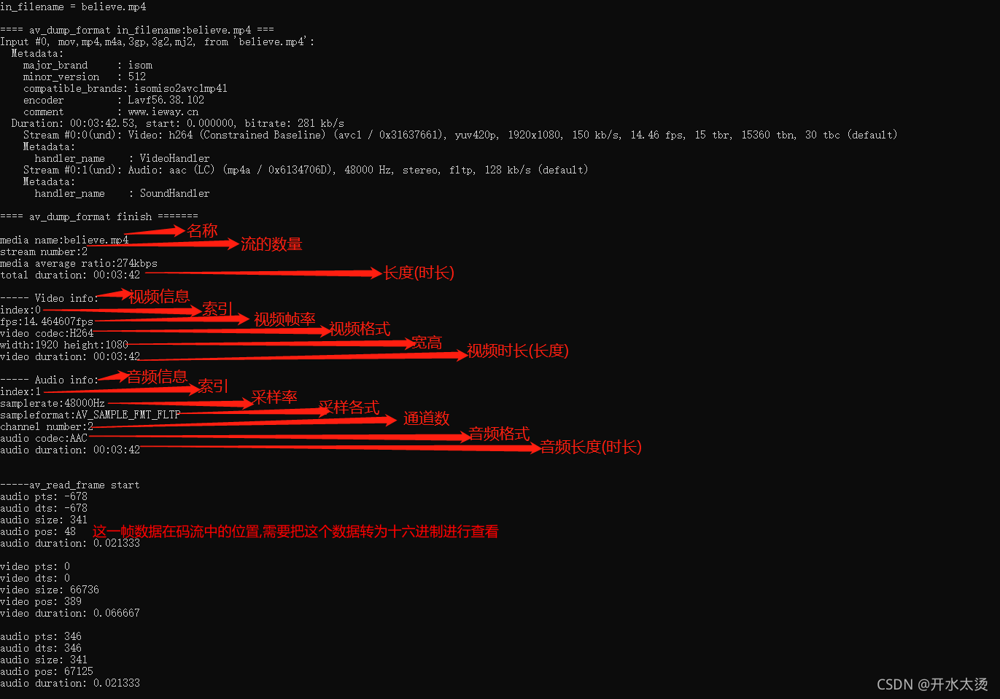
>
> 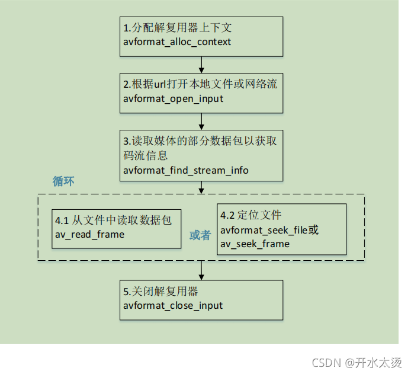

# 11 `AVFormatContext`

> ```c
> 
> /**
> * 格式化 I/O 上下文。
>   * 新的字段可以添加到小版本颠簸的末尾。
>   * 删除、重新排序和更改现有字段需要一个主要的
>   * 版本凹凸。
>   * sizeof(AVFormatContext) 不能在 libav* 之外使用，使用
>   * avformat_alloc_context() 创建一个 AVFormatContext。
>   *
>   * 字段可以通过 AVOptions (av_opt*) 访问，
>   * 使用的名称字符串匹配相关的命令行参数名称和
>   * 可以在 libavformat/options_table.h 中找到。
>   * AVOption/命令行参数名称在某些情况下与 C 不同
>   * 出于历史原因或简洁起见，结构字段名称。
>  */
> typedef struct AVFormatContext {
>     /**
> * 用于日志记录和@ref avoptions 的类。 由 avformat_alloc_context() 设置。
>       * 导出 (de) muxer 私有选项（如果存在）。
>      */
>     const AVClass *av_class;
> 
>     /**
> * 输入容器格式。
>       *
>       * 仅解复用，由 avformat_open_input() 设置。
>      */
>     ff_const59 struct AVInputFormat *iformat;
> 
>     /**
> * 输出容器格式。
>       *
>       * 仅 Muxing，必须由调用者在 avformat_write_header() 之前设置。
>      */
>     ff_const59 struct AVOutputFormat *oformat;
> 
>     /**
> * 格式化私人数据。 这是一个启用 AVOptions 的结构
>       * 当且仅当 iformat/oformat.priv_class 不为 NULL。
>       *
>       * - 多路复用：由 avformat_write_header() 设置
>       * - 解复用：由 avformat_open_input() 设置
>      */
>     void *priv_data;
> 
>     /**
> * I/O 上下文。
>       *
>       * - 解复用：要么由用户在 avformat_open_input() 之前设置（然后
>       * 用户必须手动关闭它）或由 avformat_open_input() 设置。
>       * - muxing：由用户在 avformat_write_header() 之前设置。 来电者必须
>       * 负责关闭/释放 IO 上下文。
>       *
>       * 如果设置了 AVFMT_NOFILE 标志，请不要设置此字段
>       * iformat/oformat.flags。 在这种情况下，（解）复用器将处理
>       * 以其他方式进行 I/O，该字段将为 NULL。
>      */
>     AVIOContext *pb;
> 
> /* 流信息 */
>      /**
>       * 标志信号流属性。 AVFMTCTX_* 的组合。
>       * 由 libavformat 设置。
>      */
>     int ctx_flags;
> 
>     /**
> * AVFormatContext.streams 中的元素数量。
>       *
>       * 由 avformat_new_stream() 设置，不得被任何其他代码修改。
>      */
>     unsigned int nb_streams;
>     /**
> * 文件中所有流的列表。 创建新的流
>       * avformat_new_stream()。
>       *
>       * - 解复用：流由 libavformat 在 avformat_open_input() 中创建。
>       * 如果在 ctx_flags 中设置了 AVFMTCTX_NOHEADER，那么新的流也可能
>       * 出现在 av_read_frame() 中。
>       * - muxing：流由用户在 avformat_write_header() 之前创建。
>       *
>       * 由 libavformat 在 avformat_free_context() 中释放。
>      */
>     AVStream **streams;
> 
> #if FF_API_FORMAT_FILENAME
>     /**
> * 输入或输出文件名
>       *
>       * - 解复用：由 avformat_open_input() 设置
>       * - muxing：可以在 avformat_write_header() 之前由调用者设置
>       *
>       * @deprecated 改用 url。
>      */
>     attribute_deprecated
>     char filename[1024];
> #endif
> 
>     /**
> * 输入或输出 URL。 与旧的文件名字段不同，该字段没有
>       * 长度限制。
>       *
>       * - 分离：由 avformat_open_input() 设置，初始化为空
>       * 字符串，如果 avformat_open_input() 中的 url 参数为 NULL。
>       * - muxing：可以在调用 avformat_write_header() 之前由调用者设置
>       *（或 avformat_init_output() 如果首先调用）到字符串
>       * 可以通过 av_free() 释放。 如果它设置为空字符串
>       * 在 avformat_init_output() 中为 NULL。
>       *
>       * 由 libavformat 在 avformat_free_context() 中释放。
>      */
>     char *url;
> 
>     /**
> * 组件第一帧的位置，在
>       * AV_TIME_BASE 小数秒。 切勿直接设置此值：
>       * 它是从 AVStream 值推导出来的。
>       *
>       * 仅解复用，由 libavformat 设置。
>      */
>     int64_t start_time;
> 
>     /**
> * 流的持续时间，以 AV_TIME_BASE 小数表示
>       * 秒。 仅当您不知道单个流时才设置此值
>       * 持续时间，也不要设置它们中的任何一个。 这是从
>       * 如果未设置，则为 AVStream 值。
>       *
>       * 仅解复用，由 libavformat 设置。
>      */
>     int64_t duration;
> 
>     /**
>   * 以比特/秒为单位的总流比特率，如果不是则为 0
>       * 可用的。 如果 file_size 和
>       * 持续时间被称为 FFmpeg 可以自动计算。
>      */
>     int64_t bit_rate;
> 
>     unsigned int packet_size;
>     int max_delay;
> 
>     /**
> * 修改（去）复用器行为的标志。 AVFMT_FLAG_* 的组合。
>       * 由用户在 avformat_open_input() / avformat_write_header() 之前设置。
>      */
>     int flags;
> #define AVFMT_FLAG_GENPTS       0x0001 ///< 即使需要解析未来的帧，也会生成丢失的 pts。
> #define AVFMT_FLAG_IGNIDX       0x0002 ///< 忽略索引。
> #define AVFMT_FLAG_NONBLOCK     0x0004 ///< 从输入读取数据包时不要阻塞。
> #define AVFMT_FLAG_IGNDTS       0x0008 ///< 忽略包含 DTS 和 PTS 的帧上的 DTS
> #define AVFMT_FLAG_NOFILLIN     0x0010 ///< 不要从其他值推断任何值，只返回存储在容器中的内容
> #define AVFMT_FLAG_NOPARSE      0x0020 ///< 不要使用 AVParsers，您还必须设置 AVFMT_FLAG_NOFILLIN，因为填充代码适用于帧并且没有解析 -> 没有帧。 如果已禁用解析以查找帧边界，则查找帧也将无法工作
> #define AVFMT_FLAG_NOBUFFER     0x0040 ///< 尽可能不要缓冲帧
> #define AVFMT_FLAG_CUSTOM_IO    0x0080 ///< 调用者提供了一个自定义的 AVIOContext，不要 avio_close() 它。
> #define AVFMT_FLAG_DISCARD_CORRUPT  0x0100 ///< 丢弃标记为损坏的帧
> #define AVFMT_FLAG_FLUSH_PACKETS    0x0200 ///< 刷新 AVIOContext 每个数据包。
> /**
> * 混合时，尽量避免将任何随机/易失性数据写入输出。
>   * 这包括任何随机 ID、实时时间戳/日期、多路复用器版本等。
>   *
>   * 此标志主要用于测试。
>  */
> #define AVFMT_FLAG_BITEXACT         0x0400
> #if FF_API_LAVF_MP4A_LATM
> #define AVFMT_FLAG_MP4A_LATM    0x8000 ///< 已弃用，什么都不做。
> #endif
> #define AVFMT_FLAG_SORT_DTS    0x10000 ///< 尝试通过 dts 交错输出数据包（使用此标志可以减慢解复用速度）
> #define AVFMT_FLAG_PRIV_OPT    0x20000 ///< 通过延迟编解码器打开启用私有选项（一旦所有代码都被转换，这可以设为默认值）
> #if FF_API_LAVF_KEEPSIDE_FLAG
> #define AVFMT_FLAG_KEEP_SIDE_DATA 0x40000 ///< 已弃用，什么都不做。
> #endif
> #define AVFMT_FLAG_FAST_SEEK   0x80000 ///< 启用快速但不准确的搜索某些格式
> #define AVFMT_FLAG_SHORTEST   0x100000 ///< S当最短流停止时进行顶部复用。
> #define AVFMT_FLAG_AUTO_BSF   0x200000 ///< 根据多路复用器的要求添加比特流过滤器
> 
>     /**
> * 从输入读取的数据的最大大小以确定
>       * 输入容器格式。
>       * 仅解复用，由调用者在 avformat_open_input() 之前设置。
>      */
>     int64_t probesize;
> 
>     /**
> * 读取数据的最大持续时间（以 AV_TIME_BASE 为单位）
>       * 来自 avformat_find_stream_info() 的输入。
>       * 仅解复用，由调用者在 avformat_find_stream_info() 之前设置。
>       * 可以设置为 0 以让 avformat 使用启发式进行选择。
>      */
>     int64_t max_analyze_duration;
> 
>     const uint8_t *key;
>     int keylen;
> 
>     unsigned int nb_programs;
>     AVProgram **programs;
> 
>     /**
> * 强制视频 codec_id。
>       * 解复用：由用户设置。
>      */
>     enum AVCodecID video_codec_id;
> 
>     /**
> * 强制音频 codec_id。
>       * 解复用：由用户设置。
>      */
>     enum AVCodecID audio_codec_id;
> 
>     /**
> * 强制字幕 codec_id。
>       * 解复用：由用户设置。
>      */
>     enum AVCodecID subtitle_codec_id;
> 
>     /**
> * 用于每个流的索引的最大内存量（以字节为单位）。
>       * 如果索引超过此大小，条目将被丢弃为
>       * 需要保持较小的尺寸。 这可能会导致更慢或更少
>       * 准确搜索（取决于多路分配器）。
>       * 强制使用完整内存索引的解复用器将忽略
>       * 这个。
>       * - 多路复用：未使用
>       * - 解复用：由用户设置
>      */
>     unsigned int max_index_size;
> 
>     /**
> * 用于缓冲帧的最大内存量（以字节为单位）
>       * 从实时捕获设备获得。
>      */
>     unsigned int max_picture_buffer;
> 
>     /**
> * AVChapter 数组中的章节数。
>       * muxing时，章节一般写在文件头中，
>       * 所以 nb_chapters 通常应该在 write_header 之前初始化
>       * 叫做。 一些多路复用器（例如 mov 和 mkv）也可以编写章节
>       * 在预告片中。 要在预告片中写章节，nb_chapters
>       * 调用 write_header 时必须为零，调用时必须为非零
>       * write_trailer 被调用。
>       * - 复用：由用户设置
>       * - 解复用：由 libavformat 设置
>      */
>     unsigned int nb_chapters;
>     AVChapter **chapters;
> 
>     /**
> * 适用于整个文件的元数据。
>       *
>       * - 解复用：由 libavformat 在 avformat_open_input() 中设置
>       * - muxing：可以在 avformat_write_header() 之前由调用者设置
>       *
>       * 由 libavformat 在 avformat_free_context() 中释放。
>      */
>     AVDictionary *metadata;
> 
>     /**
> * 真实世界时间中流的开始时间，以微秒为单位
>       * 自 Unix 时代（1970 年 1 月 1 日 00:00）以来。 也就是说，pts=0 在
>       *流是在这个现实世界时间捕获的。
>       * - muxing：由调用者在 avformat_write_header() 之前设置。 如果设置为
>       * 0 或 AV_NOPTS_VALUE，则当前挂墙时间将
>       *           使用。
>       * - 分离：由 libavformat 设置。 AV_NOPTS_VALUE 如果未知。 注意
>       * 该值可能会在一定数量的帧后为人所知
>       * 已收到。
>      */
>     int64_t start_time_realtime;
> 
>     /**
> * 用于确定帧率的帧数
>       * avformat_find_stream_info()。
>       * 仅解复用，由调用者在 avformat_find_stream_info() 之前设置。
>      */
>     int fps_probe_size;
> 
>     /**
> * 错误识别； 较高的值会检测到更多的错误，但可能
>       * 将一些或多或少的有效部分误检测为错误。
>       * 仅解复用，由调用者在 avformat_open_input() 之前设置。
>      */
>     int error_recognition;
> 
>     /**
> * I/O 层的自定义中断回调。
>       *
>       * demuxing：由用户在 avformat_open_input() 之前设置。
>       * muxing：由用户在 avformat_write_header() 之前设置
>       *（主要用于 AVFMT_NOFILE 格式）。 回调
>       * 也应该传递给 avio_open2() 如果它用于
>       * 打开文件。
>      */
>     AVIOInterruptCB interrupt_callback;
> 
>     /**
> * 启用调试的标志。
>      */
>     int debug;
> #define FF_FDEBUG_TS        0x0001
> 
>     /**
> * 交错的最大缓冲持续时间。
>       *
>       * 为确保所有流正确交错，
>       * av_interleaved_write_frame() 将等待，直到它至少有一个数据包
>       * 在实际将任何数据包写入输出文件之前，针对每个流。
>       * 当一些流是“稀疏的”（即之间有很大的差距
>       * 连续数据包），这可能会导致过度缓冲。
>       *
>       * 该字段指定时间戳之间的最大差异
>       * 混合队列中的第一个和最后一个数据包，在其上方 libavformat
>       * 将输出一个数据包，不管它是否已经为所有人排队了一个数据包
>       * 流。
>       *
>       * 仅混合，由调用者在 avformat_write_header() 之前设置。
>      */
>     int64_t max_interleave_delta;
> 
>     /**
> * 允许非标准和实验性扩展
>       * @见 AVCodecContext.strict_std_compliance
>      */
>     int strict_std_compliance;
> 
>     /**
> * 用于用户检测文件上发生的事件的标志。 标志必须
>       * 事件处理完毕后由用户清除。
>       * AVFMT_EVENT_FLAG_* 的组合。
>      */
>     int event_flags;
> #define AVFMT_EVENT_FLAG_METADATA_UPDATED 0x0001 ///< The call resulted in updated metadata.
> 
>     /**
> * 等待第一个时间戳时要读取的最大数据包数。
>       * 仅解码。
>      */
>     int max_ts_probe;
> 
>     /**
> * 在多路复用期间避免负时间戳。
>       * AVFMT_AVOID_NEG_TS_* 常量的任何值。
>       * 注意，这仅在使用 av_interleaved_write_frame 时有效。 （interleave_packet_per_dts 正在使用中）
>       * - 复用：由用户设置
>       * - 解复用：未使用
>      */
>     int avoid_negative_ts;
> #define AVFMT_AVOID_NEG_TS_AUTO             -1 ///< 目标格式需要时启用
> #define AVFMT_AVOID_NEG_TS_MAKE_NON_NEGATIVE 1 ///< 移动时间戳，使它们非负
> #define AVFMT_AVOID_NEG_TS_MAKE_ZERO         2 ///< 移动时间戳，使它们从 0 开始
> 
>     /**
> * 传输流 ID。
>       * 这将被移到 demuxer 私有选项中。 因此没有 API/ABI 兼容性
>      */
>     int ts_id;
> 
>     /**
> * 以微秒为单位的音频预加载。
>       * 请注意，并非所有格式都支持此功能，如果在不支持的情况下使用它，可能会发生不可预测的事情。
>       * - 编码：由用户设置
>       * - 解码：未使用
>      */
>     int audio_preload;
> 
>     /**
> * 以微秒为单位的最大块时间。
>       * 请注意，并非所有格式都支持此功能，如果在不支持的情况下使用它，可能会发生不可预测的事情。
>       * - 编码：由用户设置
>       * - 解码：未使用
>      */
>     int max_chunk_duration;
> 
>     /**
> * 最大块大小（以字节为单位）
>       * 请注意，并非所有格式都支持此功能，如果在不支持的情况下使用它，可能会发生不可预测的事情。
>       * - 编码：由用户设置
>       * - 解码：未使用
>      */
>     int max_chunk_size;
> 
>     /**
> * 强制使用挂钟时间戳作为数据包的 pts/dts
>       * 这在存在 B 帧的情况下具有未定义的结果。
>       * - 编码：未使用
>       * - 解码：由用户设置
>      */
>     int use_wallclock_as_timestamps;
> 
>     /**
> * avio 标志，用于强制 AVIO_FLAG_DIRECT。
>       * - 编码：未使用
>       * - 解码：由用户设置
>      */
>     int avio_flags;
> 
>     /**
> * 持续时间字段可以通过多种方式估算，可以使用该字段
>       * 了解持续时间是如何估计的。
>       * - 编码：未使用
>       * - 解码：由用户读取
>      */
>     enum AVDurationEstimationMethod duration_estimation_method;
> 
>     /**
> * 打开流时跳过初始字节
>       * - 编码：未使用
>       * - 解码：由用户设置
>      */
>     int64_t skip_initial_bytes;
> 
>     /**
> * 纠正单个时间戳溢出
>       * - 编码：未使用
>       * - 解码：由用户设置
>      */
>     unsigned int correct_ts_overflow;
> 
>     /**
> * 强制寻找任何（也是非关键）帧。
>       * - 编码：未使用
>       * - 解码：由用户设置
>      */
>     int seek2any;
> 
>     /**
> * 在每个数据包之后刷新 I/O 上下文。
>       * - 编码：由用户设置
>       * - 解码：未使用
>      */
>     int flush_packets;
> 
>     /**
> * 格式探测分数。
>       * 最大得分为 AVPROBE_SCORE_MAX，它在 demuxer 探测时设置
>       * 格式。
>       * - 编码：未使用
>       * - 解码：由 avformat 设置，由用户读取
>      */
>     int probe_score;
> 
>     /**
> * 最大读取字节数以识别格式。
>       * - 编码：未使用
>       * - 解码：由用户设置
>      */
>     int format_probesize;
> 
>     /**
>  * ',' 分隔的允许解码器列表。
>       * 如果为 NULL 则允许所有
>       * - 编码：未使用
>       * - 解码：由用户设置
>      */
>     char *codec_whitelist;
> 
>     /**
> * ',' 分隔的允许分路器列表。
>       * 如果为 NULL 则允许所有
>       * - 编码：未使用
>       * - 解码：由用户设置
>      */
>     char *format_whitelist;
> 
>     /**
> * libavformat 内部使用的不透明字段。
>       * 呼叫者不得以任何方式访问。
>      */
>     AVFormatInternal *internal;
> 
>     /**
> * IO 重新定位标志。
>       * 这是在底层 IO 上下文读取指针时由 avformat 设置的
>       * 被重新定位，例如在进行基于字节的查找时。
>       * 分路器可以使用该标志来检测此类更改。
>      */
>     int io_repositioned;
> 
>     /**
>  * 强制视频编解码器。
>       * 这允许强制特定的解码器，即使有多个
>       * 相同的 codec_id。
>       * 解复用：由用户设置
>      */
>     AVCodec *video_codec;
> 
>     /**
> * 强制音频编解码器。
>       * 这允许强制特定的解码器，即使有多个
>       * 相同的 codec_id。
>       * 解复用：由用户设置
>      */
>     AVCodec *audio_codec;
> 
>     /**
> * 强制字幕编解码器。
>       * 这允许强制特定的解码器，即使有多个
>       * 相同的 codec_id。
>       * 解复用：由用户设置
>      */
>     AVCodec *subtitle_codec;
> 
>     /**
> * 强制数据编解码器。
>       * 这允许强制特定的解码器，即使有多个
>       * 相同的 codec_id。
>       * 解复用：由用户设置
>      */
>     AVCodec *data_codec;
> 
>     /**
> * 在元数据头中作为填充写入的字节数。
>       * 解复用：未使用。
>       * Muxing：由用户通过 av_format_set_metadata_header_padding 设置。
>      */
>     int metadata_header_padding;
> 
>     /**
> * 用户数据。
>       * 这是用户的一些私人数据的地方。
>      */
>     void *opaque;
> 
>     /**
>    * 设备用于与应用程序通信的回调。
>      */
>     av_format_control_message control_message_cb;
> 
>     /**
>  * 输出时间戳偏移，以微秒为单位。
>       * Muxing：由用户设置
>      */
>     int64_t output_ts_offset;
> 
>     /**
> * 转储格式分隔符。
>       * 可以是 ", " 或 "\n " 或其他任何东西
>       * - 多路复用：由用户设置。
>       * - 分离：由用户设置。
>      */
>     uint8_t *dump_separator;
> 
>     /**
> * 强制数据 codec_id。
>       * 解复用：由用户设置。
>      */
>     enum AVCodecID data_codec_id;
> 
> #if FF_API_OLD_OPEN_CALLBACKS
>     /**
> * 在需要进行多路复用时调用以打开更多 IO 上下文。
>       *
>       * 这可以由用户应用程序设置来执行安全检查
>       * 打开它们之前的 URL。
>       * 该函数的行为应该类似于 avio_open2()，提供了 AVFormatContext
>       * 作为上下文信息并到达 AVFormatContext.opaque。
>       *
>       * 如果为 NULL，则一些简单的检查与 avio_open2() 一起使用。
>       *
>       * 不得直接从 avformat 外部访问。
>       * @见av_format_set_open_cb()
>       *
>       * 解复用：由用户设置。
>       *
>       * @deprecated 使用 io_open 和 io_close。
>      */
>     attribute_deprecated
>     int (*open_cb)(struct AVFormatContext *s, AVIOContext **p, const char *url, int flags, const AVIOInterruptCB *int_cb, AVDictionary **options);
> #endif
> 
>     /**
> * ',' 分隔的允许协议列表。
>       * - 编码：未使用
>       * - 解码：由用户设置
>      */
>     char *protocol_whitelist;
> 
>     /**
> * 用于打开新 IO 流的回调。
>       *
>       * 每当复用器或解复用器需要打开 IO 流（通常来自
>       * avformat_open_input() 用于分路器，但对于某些格式可能发生在
>       * 其他时候也是），它将调用此回调来获取 IO 上下文。
>       *
>       * @param s 格式上下文
>       * @param pb 成功时，这里应该返回新打开的 IO 上下文
>       * @param url 要打开的url
>       * @param 标记 AVIO_FLAG_* 的组合
>       * @param options 附加选项的字典，与
>       * avio_open2() 中的语义
>       * @return 成功时返回 0，失败时返回负的 AVERROR 代码
>       *
>       * @note 某些 muxers 和 demuxers 会嵌套，即它们打开一个或多个
>       * 额外的内部格式上下文。 因此 AVFormatContext 指针
>       * 传递给此回调的可能与面向调用者的回调不同。
>       * 但是，它将具有相同的“不透明”字段。
>      */
>     int (*io_open)(struct AVFormatContext *s, AVIOContext **pb, const char *url,
>                    int flags, AVDictionary **options);
> 
>     /**
>      * 关闭使用 AVFormatContext.io_open() 打开的流的回调。
>      */
>     void (*io_close)(struct AVFormatContext *s, AVIOContext *pb);
> 
>     /**
> * ',' 分隔的禁止协议列表。
>       * - 编码：未使用
>       * - 解码：由用户设置
>      */
>     char *protocol_blacklist;
> 
>     /**
> * 最大流数。
>       * - 编码：未使用
>       * - 解码：由用户设置
>      */
>     int max_streams;
> 
>     /**
> * 在estimating_timings_from_pts 中跳过持续时间计算。 * - 编码：未使用 * - 解码：由用户设置
>      */
>     int skip_estimate_duration_from_pts;
> } AVFormatContext;
> ```

# 12 `av_find_best_stream()`

> ```c
> /**
> * 在文件中找到“最佳”流。
>  * 最佳流根据各种启发式确定为最
>  * 可能是用户所期望的。
>  * 如果解码器参数非空，av_find_best_stream 将找到
>  * 流编解码器的默认解码器；没有解码器可以处理的流
>  * 被发现被忽略。
>  *
>  * @param ic 媒体文件句柄
>  * @param type 流类型：视频、音频、字幕等。
>  * @param Wanted_stream_nb 用户请求的流号，
>  * 或 -1 用于自动选择
>  * @param related_stream 尝试查找相关的流（例如，在相同的
>  * program) 到这个，或者 -1 如果没有
>  * @paramdecoder_ret 如果非空，返回解码器
>  * 选定的流
>  * @param 标志标志；目前没有定义
>  * @return 成功时的非负流数，
>  * AVERROR_STREAM_NOT_FOUND 如果没有请求类型的流
>  * 可以找到，
>  * AVERROR_DECODER_NOT_FOUND 如果找到流但没有解码器
>  * @note 如果 av_find_best_stream 成功返回并且没有decoder_ret
>  * NULL，则 *decoder_ret 保证设置为有效的 AVCodec。
>  */
> 
> 
> int av_find_best_stream(AVFormatContext *ic, enum AVMediaType type,
>                         int wanted_stream_nb, int related_stream,
>                         AVCodec **decoder_ret, int flags)
> {
>     int i, nb_streams = ic->nb_streams;
>     int ret = AVERROR_STREAM_NOT_FOUND;
>     int best_count = -1, best_multiframe = -1, best_disposition = -1;
>     int count, multiframe, disposition;
>     int64_t best_bitrate = -1;
>     int64_t bitrate;
>     unsigned *program = NULL;
>     const AVCodec *decoder = NULL, *best_decoder = NULL;
> 
>     if (related_stream >= 0 && wanted_stream_nb < 0) {
>         AVProgram *p = av_find_program_from_stream(ic, NULL, related_stream);
>         if (p) {
>             program    = p->stream_index;
>             nb_streams = p->nb_stream_indexes;
>         }
>     }
>     for (i = 0; i < nb_streams; i++) {
>         int real_stream_index = program ? program[i] : i;
>         AVStream *st          = ic->streams[real_stream_index];
>         AVCodecParameters *par = st->codecpar;
>         if (par->codec_type != type)
>             continue;
>         if (wanted_stream_nb >= 0 && real_stream_index != wanted_stream_nb)
>             continue;
>         if (type == AVMEDIA_TYPE_AUDIO && !(par->channels && par->sample_rate))
>             continue;
>         if (decoder_ret) {
>             decoder = find_decoder(ic, st, par->codec_id);
>             if (!decoder) {
>                 if (ret < 0)
>                     ret = AVERROR_DECODER_NOT_FOUND;
>                 continue;
>             }
>         }
>         disposition = !(st->disposition & (AV_DISPOSITION_HEARING_IMPAIRED | AV_DISPOSITION_VISUAL_IMPAIRED))
>                       + !! (st->disposition & AV_DISPOSITION_DEFAULT);
>         count = st->codec_info_nb_frames;
>         bitrate = par->bit_rate;
>         multiframe = FFMIN(5, count);
>         if ((best_disposition >  disposition) ||
>             (best_disposition == disposition && best_multiframe >  multiframe) ||
>             (best_disposition == disposition && best_multiframe == multiframe && best_bitrate >  bitrate) ||
>             (best_disposition == disposition && best_multiframe == multiframe && best_bitrate == bitrate && best_count >= count))
>             continue;
>         best_disposition = disposition;
>         best_count   = count;
>         best_bitrate = bitrate;
>         best_multiframe = multiframe;
>         ret          = real_stream_index;
>         best_decoder = decoder;
>         if (program && i == nb_streams - 1 && ret < 0) {
>             program    = NULL;
>             nb_streams = ic->nb_streams;
>             /* no related stream found, try again with everything */
>             i = 0;
>         }
>     }
>     if (decoder_ret)
>         *decoder_ret = (AVCodec*)best_decoder;
>     return ret;
> }
> ```

# 13 `avformat_alloc_output_context2()`

> [FFMpeg学习笔记_av_codec_iterate_asiwxy的博客-CSDN博客](https://blog.csdn.net/asiwxy/article/details/125205959?ops_request_misc=&request_id=&biz_id=102&utm_term=av_guess_format&utm_medium=distribute.pc_search_result.none-task-blog-2~all~sobaiduweb~default-3-125205959.142^v96^pc_search_result_base4&spm=1018.2226.3001.4187)	
>
> `avformat_alloc_output_context2()`接口位于`ffmpeg/libavformat/avformat.h`中，`avformat_alloc_output_context2()`函数可以初始化一个用于输出的`AVFormatContext`结构体。
>
> > 参数含义：
> >
> > `ctx`：函数调用成功之后创建的`AVFormatContext`结构体。
> >
> > `oformat`：指定`AVFormatContext`中的`AVOutputFormat`，用于确定输出格式。如果指定为`NULL`，可以设定后两个参数（`format_name`或者`filename`）由FFmpeg猜测输出格式。
> >
> > `filename`：指定输出文件的名称。根据文件名称，FFmpeg会推测输出格式。文件名称可以是`xx.flv, yy.mkv`等等。
> >
> > 函数执行成功的话，其返回值大于等于0；
>
> 函数实现位于`ffmpeg/libavformat/mux.c`中
>
> ```c
>  
> int avformat_alloc_output_context2(AVFormatContext **avctx, ff_const59 AVOutputFormat *oformat,
>                                    const char *format, const char *filename)
> {
>     //初始化一个默认的AVFormatContext
>     AVFormatContext *s = avformat_alloc_context();
>     int ret = 0;
>  
>     *avctx = NULL;
>     if (!s)
>         goto nomem;
>  
>     if (!oformat) {
>         //如果没有指定输入的AVOutputFormat，就需要根据文件格式名称或者文件名推测输出的AVOutputFormat
>         if (format) {
>             oformat = av_guess_format(format, NULL, NULL);
>             if (!oformat) {
>                 av_log(s, AV_LOG_ERROR, "Requested output format '%s' is not a suitable output format\n", format);
>                 ret = AVERROR(EINVAL);
>                 goto error;
>             }
>         } else {
>             //如果指定了输入的AVOutputFormat，则直接将输入的AVOutputFormat赋值给AVOutputFormat的oformat
>             oformat = av_guess_format(NULL, filename, NULL);
>             if (!oformat) {
>                 ret = AVERROR(EINVAL);
>                 av_log(s, AV_LOG_ERROR, "Unable to find a suitable output format for '%s'\n",
>                        filename);
>                 goto error;
>             }
>         }
>     }
>  
>     s->oformat = oformat;
>     if (s->oformat->priv_data_size > 0) {
>         s->priv_data = av_mallocz(s->oformat->priv_data_size);
>         if (!s->priv_data)
>             goto nomem;
>         if (s->oformat->priv_class) {
>             *(const AVClass**)s->priv_data= s->oformat->priv_class;
>             av_opt_set_defaults(s->priv_data);
>         }
>     } else
>         s->priv_data = NULL;
>  
>     if (filename) {
> #if FF_API_FORMAT_FILENAME
> FF_DISABLE_DEPRECATION_WARNINGS
>         av_strlcpy(s->filename, filename, sizeof(s->filename));
> FF_ENABLE_DEPRECATION_WARNINGS
> #endif
>         if (!(s->url = av_strdup(filename)))
>             goto nomem;
>  
>     }
>     *avctx = s;
>     return 0;
> nomem:
>     av_log(s, AV_LOG_ERROR, "Out of memory\n");
>     ret = AVERROR(ENOMEM);
> error:
>     avformat_free_context(s);
>     return ret;
> }
> ```

# 14 `avformat_new_stream()`

> `avformat_new_stream`接口声明位于`ffmpeg/libavformat/avformat.h` 中，主要功能为在`AVFormatContext `中创建 `Stream` 通道。
>
> ```c
> /**
>  * Add a new stream to a media file.
>  *
>  * When demuxing, it is called by the demuxer in read_header(). If the
>  * flag AVFMTCTX_NOHEADER is set in s.ctx_flags, then it may also
>  * be called in read_packet().
>  *
>  * When muxing, should be called by the user before avformat_write_header().
>  *
>  * User is required to call avcodec_close() and avformat_free_context() to
>  * clean up the allocation by avformat_new_stream().
>  *
>  * @param s media file handle
>  * @param c If non-NULL, the AVCodecContext corresponding to the new stream
>  * will be initialized to use this codec. This is needed for e.g. codec-specific
>  * defaults to be set, so codec should be provided if it is known.
>  *
>  * @return newly created stream or NULL on error.
>  */
> AVStream *avformat_new_stream(AVFormatContext *s, const AVCodec *c);
> ```
>
> `avformat_new_stream`接口实现位于`ffmpeg/libavformat/utils.c` 中：
>
> ```c
>  
> AVStream *avformat_new_stream(AVFormatContext *s, const AVCodec *c)
> {
>     AVStream *st;
>     int i;
>     AVStream **streams;
>  
>     //创建avstream
>     if (s->nb_streams >= FFMIN(s->max_streams, INT_MAX/sizeof(*streams))) {
>         if (s->max_streams < INT_MAX/sizeof(*streams))
>             av_log(s, AV_LOG_ERROR, "Number of streams exceeds max_streams parameter (%d), see the documentation if you wish to increase it\n", s->max_streams);
>         return NULL;
>     }
>     streams = av_realloc_array(s->streams, s->nb_streams + 1, sizeof(*streams));
>     if (!streams)
>         return NULL;
>     s->streams = streams;
>  
>     st = av_mallocz(sizeof(AVStream));
>     if (!st)
>         return NULL;
>     if (!(st->info = av_mallocz(sizeof(*st->info)))) {
>         av_free(st);
>         return NULL;
>     }
>     st->info->last_dts = AV_NOPTS_VALUE;
>  
> //ffmpeg 3.1.4版本codec 已经废除了
> #if FF_API_LAVF_AVCTX
> FF_DISABLE_DEPRECATION_WARNINGS
>     st->codec = avcodec_alloc_context3(c);
>     if (!st->codec) {
>         av_free(st->info);
>         av_free(st);
>         return NULL;
>     }
> FF_ENABLE_DEPRECATION_WARNINGS
> #endif
>  
>     st->internal = av_mallocz(sizeof(*st->internal));
>     if (!st->internal)
>         goto fail;
>  
>     通道记录的流的编码参数的默认设置
> 	//注: AVCodecParameters codecpar 替换原先的CodecContext codec
>     st->codecpar = avcodec_parameters_alloc();
>     if (!st->codecpar)
>         goto fail;
>  
>     st->internal->avctx = avcodec_alloc_context3(NULL);
>     if (!st->internal->avctx)
>         goto fail;
>  
>     if (s->iformat) {
> #if FF_API_LAVF_AVCTX
> FF_DISABLE_DEPRECATION_WARNINGS
>         /* no default bitrate if decoding */
>         st->codec->bit_rate = 0;
> FF_ENABLE_DEPRECATION_WARNINGS
> #endif
>  
>         /* default pts setting is MPEG-like */
>         avpriv_set_pts_info(st, 33, 1, 90000);
>         /* we set the current DTS to 0 so that formats without any timestamps
>          * but durations get some timestamps, formats with some unknown
>          * timestamps have their first few packets buffered and the
>          * timestamps corrected before they are returned to the user */
>         st->cur_dts = RELATIVE_TS_BASE;
>     } else {
>         st->cur_dts = AV_NOPTS_VALUE;
>     }
>  
>     st->index      = s->nb_streams;
>     st->start_time = AV_NOPTS_VALUE;
>     st->duration   = AV_NOPTS_VALUE;
>     st->first_dts     = AV_NOPTS_VALUE;
>     st->probe_packets = s->max_probe_packets;
>     st->pts_wrap_reference = AV_NOPTS_VALUE;
>     st->pts_wrap_behavior = AV_PTS_WRAP_IGNORE;
>  
>     st->last_IP_pts = AV_NOPTS_VALUE;
>     st->last_dts_for_order_check = AV_NOPTS_VALUE;
>     for (i = 0; i < MAX_REORDER_DELAY + 1; i++)
>         st->pts_buffer[i] = AV_NOPTS_VALUE;
>  
>     st->sample_aspect_ratio = (AVRational) { 0, 1 };
>  
> #if FF_API_R_FRAME_RATE
>     st->info->last_dts      = AV_NOPTS_VALUE;
> #endif
>     st->info->fps_first_dts = AV_NOPTS_VALUE;
>     st->info->fps_last_dts  = AV_NOPTS_VALUE;
>  
>     st->inject_global_side_data = s->internal->inject_global_side_data;
>  
>     st->internal->need_context_update = 1;
>  
>     s->streams[s->nb_streams++] = st;
>     return st;
> fail:
>     free_stream(&st);
>     return NULL;
> }
> ```

# 15 `AAC-ADTS`测试

> `AAC`
>
> `AAC`是在`MPEG-2`和`MPEG-4`中定义的，是一系列编码规格的统称。`AAC`标准包括一系列编码规格，这里列出常用的几种：`AAC-LC, AAC-LD, AAC-ELD, HE-AAC`。可以将它们之间的关系理解成`H264`中`base, main, high, profile`的关系。`AAC-LC`定义在`MPEG-2`中。`AAC-LD, AAC-ELD, HE-AAC`定义在`MPEG-4`中。
>
> **应用场景**
>
> 既然是一种音频编码格式，它有两大基本应用场景：媒体存储文件（storage），如常见的`h264+aac`的`mp4`文件。流媒体（stream），如`rtp`携带`aac`媒体流。
>
> **封装格式**
>
> `WAV`格式是封装的`PCM`。音频码流（封装格式是记录码流中的信息，比如采样率，声道数等），那么对应的`AAC`也有封装格式，并且对不同的场景有不同的封装格式。包括：`ADIF`（用于文件存储），`ADTS`（流媒体或文件存储），`LOAS`（流媒体），`LaTM`（流媒体）。`ADIF`和`ADTS`定义在`MPEG-2`中，`LOAS`和`LATM`定义在`MPEG-4`中。`RTP`封包方式针对流媒体应用场景，有三个`rfc`文档：rfc3640，rfc3016，rfc6416(为rfc3016的升级版)定义了`rtp`封包方式。
>
> **`AAC`特点**
>
> 1) `AAC`是一种高压缩比的音频压缩算法，但它的压缩比要远超过较老的音频压缩算法，如`AC-3`、`MP3`等。并且其质量可以同未压缩的`CD`音质相媲美。
> 2) 同其他的类似音频编码算法一样，`AAC`也是采用了变换编码算法，但`AAC`使用了分辨率更高的滤波器组，因此它可以达到更高的压缩比。
> 3) `AAC`使用了临时噪声重整、后向自适应线性预测、联合立体声技术和量化哈夫曼编码等最新技术，这些新技术的使用都使其压缩比得到进一步的提高。
> 4) `AAC`支持更多种采样率、支持1个到48个音轨、支持多达15个低频音轨、具有多种语言的兼容能力，还有多达15个内嵌数据流。
> 5) `AAC`支持更宽的声音频率范围，最高可达96KHz，最低可达8kHz，远宽于`MP3`的16KHz-48kHz的范围。
> 6) 不同于`MP3`及`WMA`，`AAC`几乎不损失音率中甚高、甚低频率成分，并且比`WMA`在频谱结构上更接近与原始音频，因而声音的保真度更好。专业表明，`AAC`比`WMA`声音更清晰，而且更接近原音。
> 7) `AAC`采用优化的算法达到了更高的解码效率，解码时只需较少的处理能力。
>
> `ADTS`全称是（`Audio Data Transport Stream`），是`AAC`的一种十分常见的传输格式。有的时候当你编码`AAC`裸流的时候，会遇到写出来的`AAC`⽂件并不能在PC和⼿机上播放，很⼤的可能就是`AAC`⽂件的每⼀帧⾥缺少了`ADTS`头信息⽂件的包装拼接。只需要加⼊头⽂件`ADTS`即可。⼀个`AAC`原始数据块⻓度是可变的，对原始帧加 上`ADTS`头进⾏`ADTS`的封装，就形成了`ADTS`帧。AAC⾳频⽂件的每⼀帧由`ADTS Header`和`AAC Audio Data`组成。结构体如 下
>
> 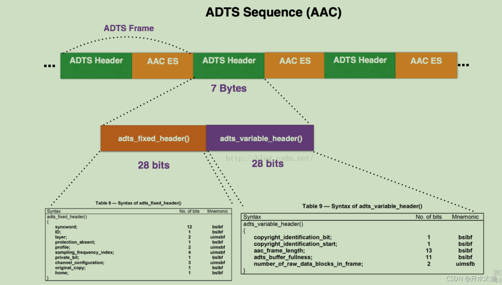
>
> 注意: `ADTS header`的长度可能为7字节或9字节,`protection_absent=0`时为9字节。`protection_absent=1`时为7字节
> 每⼀帧的`ADTS`的头⽂件都包含了⾳频的采样率，声道，帧⻓度等信息，这样解码器才能解析读取。 ⼀般情况下`ADTS`的头信息都是7个字节，分为2部分：
> `adts_fixed_header();`
> `adts_variable_header();`
> 其⼀为固定头信息，紧接着是可变头信息。固定头信息中的数据每⼀帧都相同，⽽可变头信息则在帧与帧之间可变。
>
> 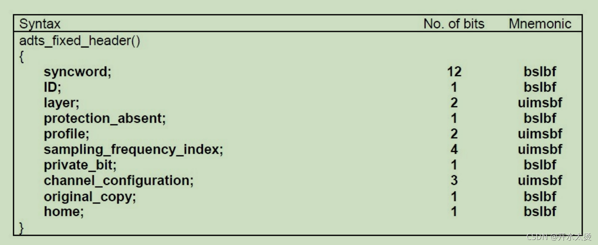
>
> `syncword` ：同步头 总是`0xFFF`, all bits must be 1，代表着⼀个`ADTS`帧的开始
> `ID`：`MPEG`标识符，0标识`MPEG-4`，1标识`MPEG-2`
> `Layer`：always: ‘00’ protection_absent：表示是否误码校验。Warning, set to 1 if there is no CRC and 0 if there is CRC
> `profile`：表示使⽤哪个级别的`AAC`，如01 Low Complexity(LC)— `AAC LC`。有些芯⽚只⽀持`AAC LC` 。
>
> 在`MPEG-2 AAC`中定义了3种：
>
> 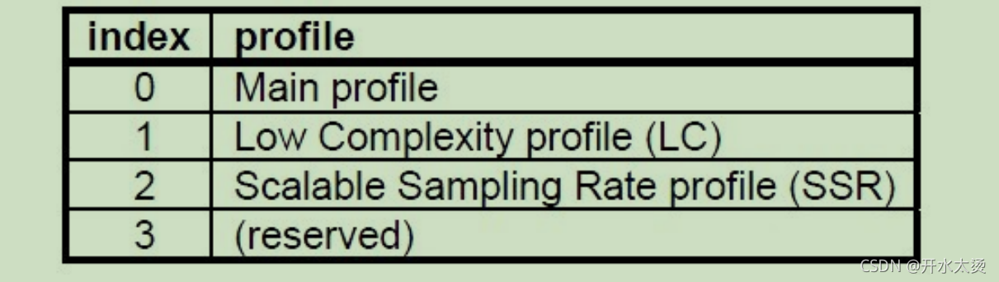
>
> `profile`的值等于 `Audio Object Type`的值减1
> `profile` = `MPEG-4 Audio Object Type - 1`
>
> 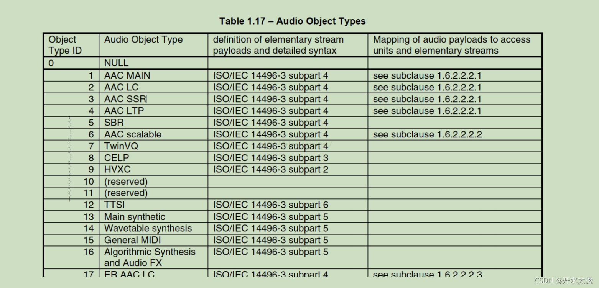
>
> 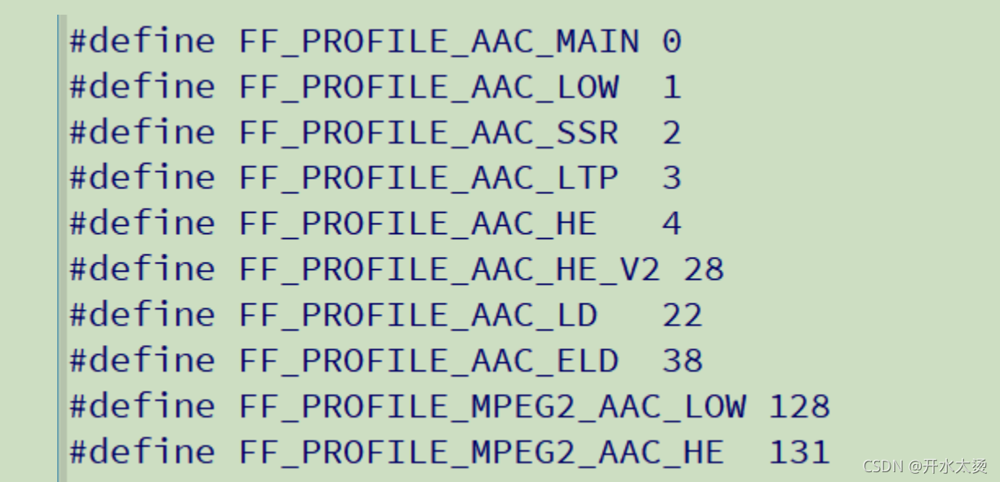
>
> `sampling_frequency_index`：表示使⽤的采样率下标，通过这个下标在 `Sampling Frequencies[ ]`数组中查找得知采样率的值。
>
> 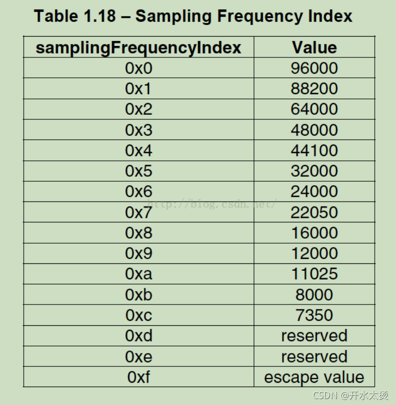
>
> `channel_configuration`: 表示声道数，⽐如2表示⽴体声双声道.
>
> 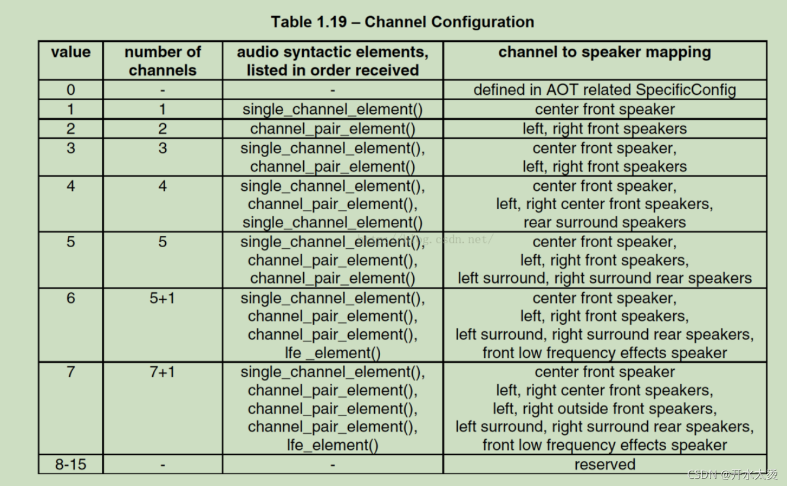
>
> **接下来看下`adts_variable_header();`**
>
> 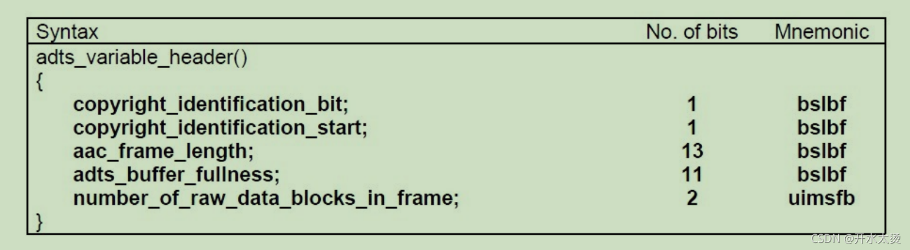
>
> `frame_length` : ⼀个`ADTS`帧的⻓度包括`ADTS`头和`AAC`原始流.
> `frame length`, this value must include 7 or 9 bytes of header length:
> `aac_frame_length = (protection_absent == 1 ? 7 : 9) + size(AACFrame)`
> `protection_absent=0`时, `header length=9bytes`
> `protection_absent=1`时, `header length=7bytes`
> `adts_buffer_fullness`：0x7FF 说明是码率可变的码流。
> `number_of_raw_data_blocks_in_frame`：表示`ADTS`帧中有`number_of_raw_data_blocks_in_frame + 1`个`AAC`原始帧。
> 所以说`number_of_raw_data_blocks_in_frame == 0 `表示说`ADTS`帧中有⼀个 `AAC`数据块。 下⾯是`ADTS`的`AAC`⽂件部分：
>
> 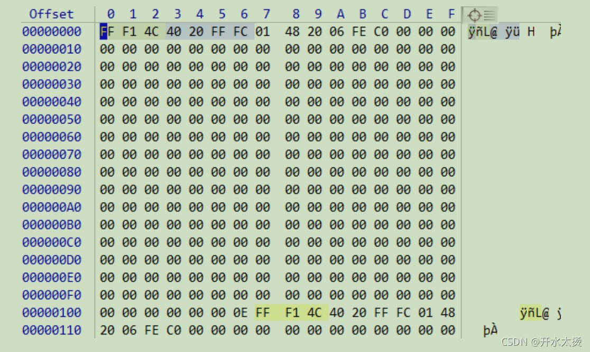
>
> 第⼀帧的帧头7个字节为：0xFF 0xF1 0x4C 0x40 0x20 0xFF 0xFC 分析各个关键数值：
>
> 111111111111
> 0
> 00
> 1
> 01
> 0011
> 0
> 001
> 0
> 0
> 0
> 0
> 0000100000111(帧⻓度)
> 11111111111
> 00
>
> 计算帧⻓度：将⼆进制 0000100000111 转换成⼗进制为263。观察第⼀帧的⻓度确实为263个字节。 计算⽅法:（帧⻓度为13位，使⽤`unsigned int`来存储帧⻓数值）
>
> ```c
> unsigned int getFrameLength(unsigned char *str){
> 	if(!str){
>         return 0;
>     }
>     unsigned int len = 0;
>     int f_bit = str[3];
>     int m_bit = str[4];
>     int b_bit = str[5];
>     len += (b_bit >> 5);
>     len += (m_bit << 3);
>     len += ((f_bit & 3) << 11);
>     return len;
> }
> ```
>
> **流程测试**
>
> ```c
> #include <stdio.h>
> #include <libavutil/log.h>
> #include <libavformat/avio.h>
> #include <libavformat/avformat.h>
> #include <libavcodec/avcodec.h>
> 
> #define ADTS_HEADER_LEN 7;
> 
> const int sampling_frequencies[] = {
>     96000,  // 0x0
>     88200,  // 0x1
>     64000,  // 0x2
>     48000,  // 0x3
>     44100,  // 0x4
>     32000,  // 0x5
>     24000,  // 0x6
>     22050,  // 0x7
>     16000,  // 0x8
>     12000,  // 0x9
>     11025,  // 0xa
>     8000    // 0xb
>     // 0xc d e f 是保留的
> };
> 
> int adts_header( char *const p_adts_header , const int data_length ,
>     const int profile , const int samplerate ,
>     const int channels ) {
>     int sampling_frequency_index = 3;   // 默认使用48000hz
>     int adtsLen = data_length + 7;
> 
>     int frequencies_size = sizeof( sampling_frequencies ) / sizeof( sampling_frequencies[0] );
>     int i = 0;
>     for (i = 0; i < frequencies_size; i++) {
>         if (sampling_frequencies[i] == samplerate) {
>             sampling_frequency_index = i;
>             break;
>         }
>     }
>     if (i >= frequencies_size) {
>         printf( "unsupport samplerate:%d\n" , samplerate );
>         return -1;
>     }
> 
>     p_adts_header[0] = 0xff;            // syncword:0xfff                                   高8bits
>     p_adts_header[1] = 0xf0;            // syncword:0xfff       低4bits
>     p_adts_header[1] |= ( 0 << 3 );     // MPEG Version: 0 for MPEG-4, 1 for MPEG-2     1bit
>     p_adts_header[1] |= ( 0 << 1 );     // Layer:0                                      2bits
>     p_adts_header[1] |= 1;              // protection absent: 1                         1bit
> 
>     p_adts_header[2] = ( profile ) << 6;                            // profile:profile                  2bits
>     p_adts_header[2] |= ( sampling_frequency_index & 0x0f ) << 2;   // sampling frequency index         4bits
>     p_adts_header[2] |= ( 0 << 1 );                                 // private bit: 0                   1bit
>     p_adts_header[2] |= ( channels & 0x04 ) >> 2;                   // channel configuration            高1bit
> 
>     p_adts_header[3] = ( channels & 0x03 ) << 6;                    // channel configuration            低2bits
>     p_adts_header[3] |= ( 0 << 5 );                                 // original: 0                      1bit
>     p_adts_header[3] |= ( 0 << 4 );                                 // home: 0                          1bit
>     p_adts_header[3] |= ( 0 << 3 );                                 // copyright id bit: 0              1bit
>     p_adts_header[3] |= ( 0 << 2 );                                 // copyright id start: 0            1bit
>     p_adts_header[3] |= ( ( adtsLen & 0x1800 ) >> 11 );             // frame length: value              高2bits
> 
>     p_adts_header[4] = (uint8_t)( ( adtsLen & 0x7f8 ) >> 3 );       // frame length:value               中间8bits
>     p_adts_header[5] = (uint8_t)( ( adtsLen & 0x7 ) << 5 );         // frame length:value               低3bits
>     p_adts_header[5] |= 0x1f;                                       // buffr fullness: 0x7ff            高5bits
>     p_adts_header[6] = 0xfc;                // 11111100             // buffer fullness:0x7ff            低6bits
> 
>     // number_of_raw_data_blocks_in_frame:
>     // 表示ADTS帧中有number_of_raw_data_blocks_in_frame + 1个原始帧
> 
>     return 0;
> }
> 
> int main( int argc , char *argv[] ) {
>     int ret = -1;
>     char errors[1024];
> 
>     char *in_filename = NULL;
>     char *aac_filename = NULL;
> 
>     FILE *aac_fd = NULL;
> 
>     int audio_index = -1;
>     int len = 0;
> 
>     AVFormatContext *ifmt_ctx = NULL;
>     AVPacket pkt;
> 
>     // 设置打印级别
>     av_log_set_level( AV_LOG_DEBUG );
> 
>     if (argc < 3) {
>         av_log( NULL , AV_LOG_DEBUG , "the count of parameters should be more than three!\n" );
>         return -1;
>     }
> 
>     in_filename = argv[1];  // 输入文件
>     aac_filename = argv[2]; // 输出文件
> 
>     if (in_filename == NULL || aac_filename == NULL) {
>         av_log( NULL , AV_LOG_DEBUG , "src or dts file is null, plz check them!\n" );
>         return -1;
>     }
> 
>     aac_fd = fopen( aac_filename , "wb" );
>     if (!aac_fd) {
>         av_log( NULL , AV_LOG_DEBUG , "Could not open destination file %s\n" , aac_filename );
>         return -1;
>     }
> 
>     // 打开输入文件
>     if (( ret = avformat_open_input( &ifmt_ctx , in_filename , NULL , NULL ) ) < 0) {
>         av_strerror( ret , errors , 1024 );
>         av_log( NULL , AV_LOG_DEBUG , "Could not open source file: %s, %d(%s)\n" ,
>             in_filename ,
>             ret ,
>             errors );
>         return -1;
>     }
> 
>     // dump媒体信息
>     av_dump_format( ifmt_ctx , 0 , in_filename , 0 );
> 
>     // 初始化packet
>     av_init_packet( &pkt );
> 
>     // 查找audio对应的stream index
>     audio_index = av_find_best_stream( ifmt_ctx , AVMEDIA_TYPE_AUDIO , -1 , -1 , NULL , 0 );
>     if (audio_index < 0) {
>         av_log( NULL , AV_LOG_DEBUG , "Could not find %s stream in input file %s\n" ,
>             av_get_media_type_string( AVMEDIA_TYPE_AUDIO ) ,
>             in_filename );
>         return AVERROR( EINVAL );
>     }
> 
>     // 打印AAC级别
>     printf( "audio profile:%d, FF_PROFILE_AAC_LOW:%d\n" ,
>         ifmt_ctx->streams[audio_index]->codecpar->profile ,
>         FF_PROFILE_AAC_LOW );
> 
>     if (ifmt_ctx->streams[audio_index]->codecpar->codec_id != AV_CODEC_ID_AAC) {
>         printf( "the media file no contain AAC stream, it's codec_id is %d\n" ,
>             ifmt_ctx->streams[audio_index]->codecpar->codec_id );
>         goto failed;
>     }
> 
>     // 读取媒体文件，并把aac数据帧写入本地文件
>     while (av_read_frame( ifmt_ctx , &pkt ) >= 0) {
>         if (pkt.stream_index == audio_index) {
>             char adts_header_buf[7] = { 0 };
>             adts_header( adts_header_buf , pkt.size ,
>                 ifmt_ctx->streams[audio_index]->codecpar->profile ,
>                 ifmt_ctx->streams[audio_index]->codecpar->sample_rate ,
>                 ifmt_ctx->streams[audio_index]->codecpar->channels );
>             fwrite( adts_header_buf , 1 , 7 , aac_fd ); // 要手动封装adts_header, 写adts header，ts流不适用，ts流分离出来的packet带了adts header
>             len = fwrite( pkt.data , 1 , pkt.size , aac_fd );   // 写adts data
>             if (len != pkt.size) {
>                 av_log( NULL , AV_LOG_DEBUG , "warning, length of writed data isn't equal pkt.size(%d, %d)\n" , len , pkt.size );
>             }
>         }
>         av_packet_unref( &pkt );
>     }
> failed:
>     // 关闭输入文件
>     if (ifmt_ctx) {
>         avformat_close_input( &ifmt_ctx );
>     }
>     if (aac_fd) {
>         fclose( aac_fd );
>     }
> }
> ```
