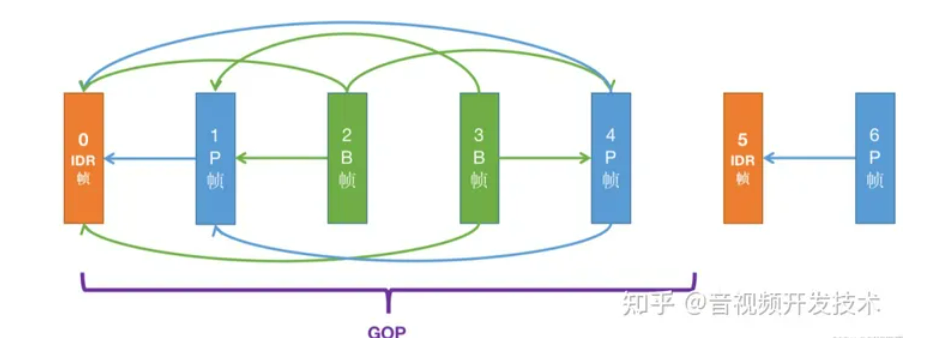

# 1 `H.264`或称`AVC`（Advanced Video Coding，高级视频编码）视频编码

> [超详细的h264码流结构解析！ - 知乎 (zhihu.com)](https://zhuanlan.zhihu.com/p/622152133)
>
> [【精选】H264编码基础概念+格式分析_程序员老舅的博客-CSDN博客](https://blog.csdn.net/m0_60259116/article/details/124870967?ops_request_misc=%7B%22request%5Fid%22%3A%22170029584216800186530614%22%2C%22scm%22%3A%2220140713.130102334..%22%7D&request_id=170029584216800186530614&biz_id=0&utm_medium=distribute.pc_search_result.none-task-blog-2~all~top_positive~default-1-124870967-null-null.142^v96^pc_search_result_base4&utm_term=h264编码&spm=1018.2226.3001.4187)
>
> ​	视频中存在很多冗余信息，比如图像相邻像素之间有较强的相关性，视频序列的相邻图像之间内容相似，人的视觉系统对某些细节不敏感等，对着部分冗余信息进行处理的过程就是视频编码。
>
> ​	在相邻几幅图像画面中，一般有差别的像素只有10%以内的点,亮度差值变化不超过2%，而色度差值的变化只有1%以内。所以对于一段变化不大图像画面，我们可以先编码出一个完整的图像帧A，随后的B帧就不编码全部图像，只写入与A帧的差别，这样B帧的大小就只有完整帧的1/10或更小！B帧之后的C帧如果变化不大，我们可以继续以参考B的方式编码C帧，这样循环下去。这段图像我们称为一个序列：序列就是有相同特点的一段数据。当某个图像与之前的图像变化很大，无法参考前面的帧来生成，那我们就结束上一个序列，开始下一段序列 也就是对这个图像生成一个完整帧A1，随后的图像就参考A1生成，只写入与A1的差别内容。
>
> **编码帧的分类**
>
> ​	通常一个H264码流中包含了多个GOP(图像组)，每一个GOP里面包含多个视频编码帧，如下图所示。GOP（Group of Pictures）图像组的意思。H264码流对GOP的划分是两个邻近关键帧(IDR帧)之间的图像为一个GOP，包含前面的IDR帧，不包含后面的IDR帧，包含第一个IDR帧后面的所有P帧和B帧；如下图GOP图像包含了5个图像编码帧,一个IDR帧和两个P帧，两个B帧。GOP又分为开放(open)GOP和闭合(close)GOP；open GOP是指当前GOP中的P帧和B帧能将前一个GOP的图像作为参考帧，并且open gop中不存在IDR帧，会有I帧(下面会介绍)，假设下图是open GOP的情况，序号为6的P帧能参考序号为0的IDR帧(此时应该叫I帧)或者序号为6的P帧参考序号为1和4的P帧。close GOP是指当前GOP中的P帧和B帧不能将前一个GOP的图像作为参考帧，若下图是close GOP的情况序号为6的P帧不能参考序号为0的IDR帧，也不能参考序号为1和4的P帧，他只能参考序号为5的IDR帧。
>
> 
>
> 一个GOP包含了一个IDR帧和多个P帧或B帧。这里在介绍下H264的编码帧类型：
>
> **IDR帧：Instantaneous Decoding Refresh，即时解码刷新帧；也叫关键帧 。同时IDR帧也是I帧(帧内编码帧)；IDR帧编码上采用帧内编码技术，即IDR帧的编码和解码不需要参考其他视频帧，只对图像做空间上冗余的压缩编码；解码过程遇到IDR帧会重新解析计算解码参数，并清空之前的解码信息，可以防止前面GOP内的错误延续到当前GOP。**
>
> **I帧：帧内（Intraframe）压缩编码帧；帧内压缩过程，主要是通过空间上邻近像素相似的特点来解决空间冗余(当前编码块/像素和周围块/像素存在相似或者相同就是空间冗余)的一个编码方法，比如常见的jpeg图像就是通过帧内编码压缩的图像。I帧不一定是IDR帧(关键帧)，IDR帧一定是I帧/关键帧；I帧解码不会像P帧B帧那样需要依赖前面或者后面视频帧图像，所以I帧可以单独一帧来解码；I帧和IDR帧最大的区别在于解码过程是否会清空之前的解码信息(IDR帧会清空之前的解码信息，I帧则不会)。**
>
> **P帧：前向参考编码帧，通常采用帧间和帧内混合的编码方式。通常当前视频图像和前一帧视频图像有着相似和差异的内容，去除相似的内容，保留差异的值进行编码，就可以消除图像时间上的冗余；解码需要依赖参考帧，等参考帧解码完成后才能解码P帧。**
>
> **B帧：双向参考编码帧，就是需要参考前面一帧图像也需要参考后面的一帧的图像；和P帧类似，B帧通常也采用帧间和帧内混合的编码方式；不同的地方是P帧是和前一帧的差异做编码，B帧不仅仅和前一帧差异做编码，也和后面一帧的差异进行编码；B帧解码需要依赖前后的参考帧，等前后参考帧解码全部完成后才能解码B帧。**
>
> **H.264分层设计**
>
> ​	H264算法在概念上分为两层：
>
> `VCL`（Video Coding Layer）视频编码层，负责高效的内容表示。
>
> `NAL`（Network Abstraction Layer）网络提取层，负责以网络所要求的恰当的方式对数据进行打包和传送。`NAL`的设计目的，是根据不同的网络把数据打包成相应的格式，将`VCL`产生的比特字符串适配到各式各样的网络和多元环境中。
>
> **`NAL`的封装方式**
>
> `NAL`是将每一帧数据写入到一个`NAL`单元中，进行传输或存储的。`NALU`分为`NAL`头和`NAL`体，`NALU`头通常为`00 00 00 01`，作为一个新的`NALU`的起始标识。`NALU`封装这`VCL`编码后的信息或者其它信息。
>
> **`NAL`封装过程**
>
> I帧、P帧、B帧都是被封装成一个或者多个NALU进行传输或者存储的。每一个I帧开始之前也有非VCL的NAL单元，用于保存其他信息，它们是PPS、SPS。PPS（Picture Parameter Sets）：图像参数集。SPS（Sequence Parameter Set）：序列参数集。