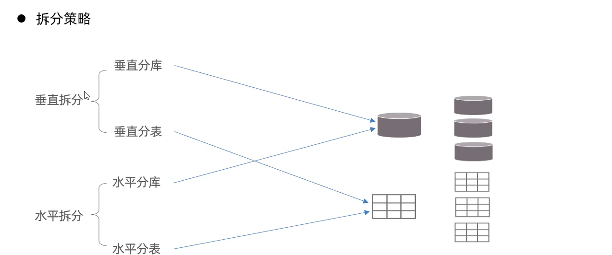
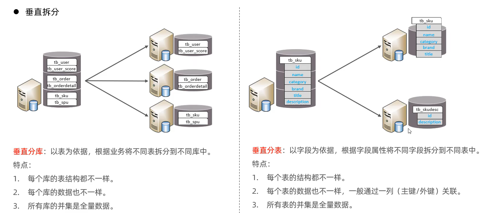
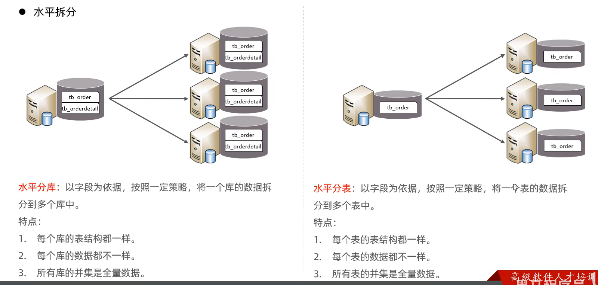
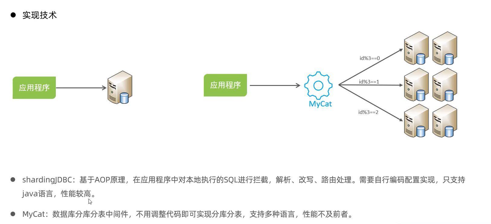
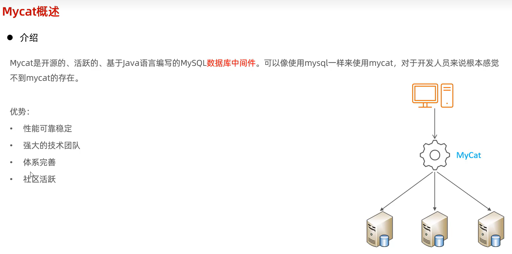

# 1 函数


## 1.1 字符串函数

> 函数是指一段可以被另一段程序调用的程序或代码。
>
> 
>
> ```sql
> # 字符串拼接
> select concat('hello', 'world!');
> 
> # 字符串转为小写
> select lower('Hello');
> 
> select concat(2, 3); # 23
> 
> # 字符串左填充
> select lpad('01', 5, '-');
> 
> # 由于业务需求变更，企业员工的工号，统一为5位数，目前不足5位数的全部在前面补0.比如1号员工的工号应该为00001
> update emp set workno = lpad(workno, 5, '0');
> ```

## 1.2 数值函数

> 
>
> ```sql
> select ceil(1.1); # 2
> 
> select floor(1.9); # 1
> 
> select mod(7,4);  # 3
> 
> select rand();
> 
> select round(2.345, 2) # 2.35
> 
> # 生成一个六位数的随机验证码
> select lpad(round(rand() * 100000, 0), 6, '0');
> ```

## 1.3 日期函数

> 
>
> ```sql
> # 当前日期
> select curdate();
> 
> # 当前时间
> select curtime();
> 
> # 当前日期时间
> select now();
> 
> # 获取年份
> select year(now());
> select year(curdate());
> 
> # 指定日期往后推70天
> select date_add(now(), interval 70 day);
> # 后推 70 月
> select date_add(now(), interval 70 month);
> # 后推 70 年
> select date_add(now(), interval 70 year);
> 
> # 求取日期差值
> select datediff('2021-12-01', '2021-10-01');
> 
> # 查询所有员工入职天数，并根据入职天数倒序排序
> select name, datediff(curdate(), entrydate) as 'entrydays' from emp order by entrydays desc;
> ```

## 1.4 流程函数

> 
>
> ```sql
> select if(true, 'ok', 'error'); # 'ok'
> 
> select ifnull('ok', 'default'); # 'ok'
> select ifnull('', 'default'); # ''
> select ifnull(null, 'default'); # 'default'
> 
> # 查询emp表的员工姓名，和工作地址（北京/上海 -----> 一线城市，其他 -----> 二线城市)
> select 
> 	name, 
> 	(case workaddr when '北京' then '一线城市' when '上海' then '一线城市' else '二线城市' end) as '工作地址'
> from emp;
> 
> # 统计班级各个学员的成绩，展示的规则如下：
> --- > 85，展示优秀
> --- > 60，展示及格
> --- > 否则，展示不及格
> 
> select 
> id,
> name,
> (case when math >= 85 then '优秀' when math >= 60 then '及格' else '不及格' end) 'math',
> (case when english >= 85 then '优秀' when english >= 60 then '及格' else '不及格' end) 'english',
> (case when chinese >= 85 then '优秀' when chinese >= 60 then '及格' else '不及格' end) 'chinese'
> from score
> ```

# 2 约束

> 概念：约束是作用于表中字段上的规则，用于限制存储在表中的数据。
>
> 目的：保证数据库的正确、有效性和完整性。
>
> 
>
> 
>
> ```sql
> create table user(
> 	id int primary key auto_increment comment '主键',
>     name varchar(10) not null unique comment '姓名',
>     age int check(age > 0 and age <= 120) comment '年龄',
>     status char(1) default '1' comment '状态',
>     gender char(1) comment '性别'
> ) comment '用户表';
> ```

## 2.1 外键约束

> 外键约束
>
> 外键用来让两张表格的数据之间建立连接，从而保证数据的一致性和完整性。
>
> 
>
> **语法**
>
> ```sql
> create table 表名(
> 	字段名 数据类型,
> 	……
> 	[constraint][外键名称] foreign key(外键字段名) references 主表(主表列名)
> );
> 
> alter table 表名 add constraint 约束名称 foreign key(外键字段名) references 主表(主表列名);
> 
> /* 添加外键 */
> alter table emp add constraint fk_emp_dept_id foreign key(dept_id) references dept(id);
> 
> /* 删除外键约束 */
> alter table emp drop foreign key fk_emp_dept_id;
> ```
>
> 删除/更新行为
>
> 
>
> ```sql
> alter table 表名 add constraint 约束名称 foreign key (外键字段) references 主表名(主表字段名) on update cascade on delete cascade;
> ```

# 3 多表查询

## 3.1 多表关系

> ​	项目开发中，在进行数据库表结构设计时，会根据业务需求即业务模块之间的关系，分析并设计表结构，由于业务之间相互关联，所以各个表结构之间也存在着各种联系，基本上分为三种：
>
> * `1:1`关系：
>
>   * > 案例：用户和用户详情的关系
>     >
>     > 关系：**一对一关系，多用于单表拆分，将一张表的基础字段放在一张表中，其它详情字段放在另一张表中，以提升效率。**
>     >
>     > 实现：**在任意一方加入外键，关联另外一方的主键，并且设置外键为唯一的（`UNIQUE`）**
>     >
>     > 
>     >
>     > 
>
> * `1:n`关系：
>
>   * > 案例：部门和员工关系
>     >
>     > 关系：一个部门对应多个员工，一个员工对应一个部门
>     >
>     > 实现：**在多的一方建立外键，指向一的一方的主键**
>     >
>     > 
>
> * `n:n`关系：额外建立关系模式，一般情况下该模式主键包含至少两个属性分别来自两个实体
>
>   * > 案例：学生与课程的关系
>     >
>     > 关系一个学生可以选修多门课程，一门课程也可以供多个学生选择
>     >
>     > 实现：**建立第三张中间表，中间表至少包含两个外键，分别关联两方主键**
>     >
>     > 

## 3.2 多表查询

> 多表查询概述
>
> 

### 3.2.1 交叉连接

> ​	笛卡尔积 ：连接查询的多个表格中所有数据都相互匹配一次，形成一个包含所有可能情况的临时数据表 。
>
> ​	笛卡尔积非常影响查询性能，会降低查询效率，所以要尽量避免产生笛卡尔积 
>
> ​	交叉连接（无条件连接）就会产生笛卡尔积
>
> 
>
> ```sql
> # 交叉连接关键字：cross join
> select 属性列表 from 表1 [cross join]表2,....; # cross join可以省略
> 
> # 默认连接方式为cross join，即以笛卡尔积形式连接
> select student.s_id, student.s_name, class.c_name from stduent, class;
> 
> # 筛选笛卡尔积之后的结果
> select student.* class.* from stduent, class where student.s_cid = class.cid;
> -- 有where子句，往往会先生成笛卡尔积后的表，然后再根据条件筛选；并且cross join后加条件只能用where，不能用on
> ```

### 3.2.2 内连接

> 内连接先判断连接条件，根据表中匹配的字段，**列出连接条件匹配的数据**，也就是说只有相匹配的结果才能查询出来。
>
> ```sql
> # 语法
> select 字段列表 from 表1 [inner] join 表2 on 条件表达式 inner join 表3 on 条件表达式....;
> 
> select * emp e inner join dept d on e.dept_id = d.id;
> ```

### 3.2.3 外连接

> 外连接是对内连接进行补全，又分为左外连接（左连接）、右外连接（右连接）和全外连接（全连接）。
>
> **左外连接**
>
> ​	以左表为基准，显示左表查询字段的所有记录，右表只显示与左表匹配的记录，没有匹配的用`null`代替。
>
> ​	关键字：`left [outer] join`
>
> **右外连接**
>
> ​	与左连接相反，是以右表为基准，显示右表查询字段的所有记录，左表只显示和右表匹配的记录，没有匹配的用`null`代替。
>
> ​	关键字：`right [outer] join`
>
> **全外连接：**（mysql不支持全外连接，但可以用`union`连接查询语句来实现全连接
>
> ​	全连接左右表不做限制，显示全部数据，没有匹配的数据用`null`代替。
>
> ​	关键字：`full [outer] join`
>
> ```sql
> # 1 查询emp表的所有数据，和对应的部门信息（左外连接）
> select e.*, d.name from emp e left outer join dept d on e.dept_id = d.id;
> 
> # 2 查询dept表的所有数据，和对应的员工信息（右外连接）
> select d.*, e.* from emp e right outer join dept d on e.dept_id = d.id;
> ```

### 3.2.4 自连接

> 自连接查询语法：
>
> 自连接查询，可以是内连接查询，也可以是外连接查询，必须对表起别名进行区分。
>
> ```sql
> select 字段列表 from 表A 别名A join 表A 别名B on 条件...;
> 
> # 查询员工 及其所属领导（领导也属于员工）
> select a.name, b.name from emp a, emp b join where a.managerid = b.id;
> 
> # 查询员工及其领导名字，如果员工没有领导，也需要查询出来
> select a.name '员工', b.name '领导' from emp a left join emp b on a.managerid = b.id;
> ```

### 3.2.5 联合查询-`union`，`union all`

> ​	对于`union`查询，就是把多次查询的结果合并起来，形成一个新的查询结果集。
>
> `union all`：将多次查询出来的结果直接拼接
>
> `union`：拼接后去除重复的行
>
> * 对于联合查询的多张表的列数必须保持一致，字段类型也需要保持一致。
>
> ```sql
> select 字段列表 from 表A ...
> union[all]
> select 字段列表 from 表B ...;
> 
> # 将薪资低于5000的员工和年龄大于50的员工全部查询出来
> select * from emp where salary < 5000
> union
> select * from emp where age > 50;
> ```

## 3.3 子查询（嵌套查询）

> ​	SQL语句中嵌套`select`语句，称为嵌套查询，又称子查询。
>
> ```sql
> # 语法
> select * from t1 where columnl = (select columnl from t2);
> ```
>
> ​	**子查询外部的语句可以是`insert`/`update`/`delete`/`select`中的任何一个。**
>
> ​	根据子查询结果不同，可以分为：
>
> * 标量子查询（子查询结果为单个值）
>
> * 列子查询（子查询结果为一列）
>
> * 行子查询（子查询结果为一行）
>
> * 表子查询（子查询结果为多行多列）
>
>   根据子查询位置，分为：`where`之后、`from`之后、`select`之后。

### 3.3.1 标量子查询

> 标量子查询
>
> 子查询返回的结果是单个值（数字、字符串、日期等），最简单的形式，这种子查询称为标量子查询。
>
> 常用的操作符：`=`、`<>`、`>`、`>=`、`<`、`<=`
>
> ```sql
> # 查询”销售部“的所有员工信息
> -- 1 查询”销售部“部门ID
> -- 2 根据“销售部”部门ID，查询员工信息
> select * from emp where dept_id = (select id dept where name = '销售部');
> 
> # 查询在“李四”入职之后入职的员工信息
> -- 1 查询“李四”的入职日期
> -- 2 查询指定入职日期之后入职的员工信息
> select * from emp where entrydate > (select entrydate from emp where name = '李四');
> ```

### 3.3.2 列子查询

> 列子查询
>
> 子查询返回的结果是一列（可以是多行），这种子查询称为列子查询。（列表示属性名类型一致）
>
> 常用的操作符：`in`、`not int`、`any`、`some`、`all`
>
> 
>
> ```sql
> # 1 查询销售部和市场部的所有员工信息
> -- 查询销售部和市场部的部门ID
> -- 根据部门ID查询员工信息
> select * from emp where dept_id in (select id from dept where nam = '销售部' or name = '市场部');
> 
> # 2 查询比财务部所有人工资都高的员工信息
> -- 查询财务部部门ID
> -- 根据部门ID查询所有财务部人员工资
> -- 查询比财务部所有人工资都高的员工信息
> select * from emp where salary > all (select salary from emp where dept_id = (select id from dept where name = '财务部'));
> 
> # 查询比研发部其中任意一人工资高的员工信息
> -- 查询研发部所有人工资
> -- 查询比研发部其中任意一人工资高的员工信息
> select * from emp where salary > any (select salary from where dept_id = (select id from dept where name = '研发部'));
> ```

### 3.3.3 行子查询

> 行子查询
>
> ​	子查询返回的结果是一行（可以是多列），这种子查询称为行子查询。（行表示一个记录的多个属性字段的值）
>
> 常用的操作符：`=`、`<>`、`in`、`not in`
>
> ```sql
> # 1 查询与张三的薪资及直属领导相同的员工信息。
> -- 查询张三的薪资及直属领导
> -- 查询与张三的薪资及直属领导相同的员工信息
> select * from emp where (salary, managerid) = (select salary, managerid from emp where name = '张三');
> ```

### 3.3.4 表子查询

> 表子查询
>
> 子查询返回的结果是多行多列，这种子查询称为表子查询。
>
> 常用的操作符：`in`。
>
> ```sql
> # 1 查询与 张三和李四的职位和薪资相同的员工信息。
> -- 查询张三、李四的职位和薪资
> -- 查询与张三、李四职位和薪资相同的员工信息
> select * from emp where (job, salary) in (select job, salary from emp where name = '张三' or name = '李四');
> 
> # 2 查询入职日期是 2016-01-10 之后的员工，及其部门信息
> -- 查询入职日期是 2016-01-10 之后入职之后的信息
> -- 查询这部分员工对应的部门信息
> select e.*, d.* from (select from emp where entrydate > '2016-01-10') e left join dept d on e.dept_id = d.id;
> ```

## 3.4 多表查询案例

```sql
# 1 查询员工的姓名、年龄、职位、部门信息（交叉连接）
select e.name, e.age, e.job, d.name from emp e, dept d where e.dept_id = d.id;

# 2 查询年龄小于30岁的员工的姓名、年龄、职位、部门信息（内连接）
select e.name, e.age, e.job, d.name from emp e inner join dept d on e.dept_id = d.id where e.age < 30;

# 3 查询拥有员工的部门ID和部门名称
select distinct d.id, d.name from emp e, dept d where e.dept_id = d_id;

# 4 查询所有年龄大于40岁的员工，及其归属的部门名称；如果员工没有分配部门，也需要展示出来
select e.*, d.name from emp e left join dept d on e.dept_id = d.id where e.age > 40;

# 5 查询所有员工的工资等级
select e.*, s.grade from emp e, salgrade s where e.salary >= s.lowsal and s.salary <= s.higsal;

# 6 查询比平均薪资高的员工信息
select * from emp where salary > (select avg(salary) from emp);

# 7 查询低于本部门平均薪资的员工信息
select *, select(avg(e1.salary) from emp e2 where e2.salary < (select avg(e1.salary) from emp e1 where e1.dept_id = e2.dept_id);
# 8 查询所有部门的部门信息，并统计师部门的员工人数
select d.id, d.name, (select count(*) from emp e where e.dept_id = d.id) '人数' from dept d;
# 9 查询所有学生的选课情况，展示出学生名称，学号，课程名称
select s.name, s.no, c.name from stduent s, student_course sc, course c where s.id = sc.studentid and sc.courseid = c.id;
```


## 3.5 多表查询总结

> 

# 4 事务

## 4.1 事务简介

> 事务是一组操作的集合，它是一个不可分割的工作单位，事务会把所有的操作作为一个整体向系统提交或撤销操作请求，即**这些操作要么同时成功，要么同时失败。**默认MySQL的事务是自动提交的，也就是说，当执行一条DML语句，MySQL会立即隐式的提交事务。
>
> 
>
> ```sql
> # 转账操作（张三给李四转1000）
> -- 1. 查询张三账户余额
> select * from account where name = '张三';
> -- 2. 将张三账户余额减1000
> update account set money = money - 1000 where name = '张三';
> # 此时发生异常，转账操作会终止，才不会回滚
> -- 3. 将李四账户余额加1000
> update account set mouney = money + 1000 where name = '李四';
> ```

## 4.2 事务操作

> 1. 查看或设置事务的提交方式
>
>    1. ```sql
>       select @@autocommit;
>       set @@autocommit = 0;
>       ```
>
> 2. 开启事务
>
>    1. ```sql
>       start transaction;
>       -- or
>       begin;
>       ```
>
> 3. 提交事务
>
>    1. ```sql
>       commit;
>       ```
>
> 4. 回滚事务
>
>    1. ```sql
>       rollback;
>       ```
>
> ```sql
> select @@autocommit;
> 
> set @@autocommit = 0;	-- 设置为手动提交
> 
> # 转账操作（张三给李四转1000）
> -- 1. 查询张三账户余额
> select * from account where name = '张三';
> -- 2. 将张三账户余额减1000
> update account set money = money - 1000 where name = '张三';
> # 此时发生异常，转账操作会终止，才不会回滚
> -- 3. 将李四账户余额加1000
> update account set mouney = money + 1000 where name = '李四';
> 
> -- 提交事务
> commit;
> 
> -- 若事务失败，则回滚
> rollback;
> ```
>
> ```sql
> # 设置自动提交事务
> set @@autocommit = 1;
> 
> -- 开始事务
> start transaction;
> # 转账操作（张三给李四转1000）
> -- 1. 查询张三账户余额
> select * from account where name = '张三';
> -- 2. 将张三账户余额减1000
> update account set money = money - 1000 where name = '张三';
> # 此时发生异常，转账操作会终止，才不会回滚
> -- 3. 将李四账户余额加1000
> update account set mouney = money + 1000 where name = '李四';
> 
> -- 提交事务
> commit;
> 
> -- 若事务失败，则回滚
> rollback;
> ```

## 4.3 事务的四大特性

> 

## 4.4 并发事务问题

> 

## 4.5 事务的隔离级别

> 
>
> ```sql
> -- 查看事务的隔离级别
> select @@tarnsaction_isolation;
> 
> -- 设置事务的隔离级别
> set [session | global] transaction isolation level {read uncommited | read commited | repeatable read | serializable};
> ```

# 5 存储引擎

## 5.1 MySQL体系结构

> 
>
> 

## 5.2 存储引擎简介

> ​	存储引擎就是存储数据、建立索引、更新/查询数据等技术的实现方式。存储引擎是基于表的，而不是基于数据库的，所以存储引擎也可被称为表类型。
>
> 1) 在创建表时，指定存储引擎
>
>    1) ```sql
>       create table 表名(
>       	字段1 字段1类型 [comment 字段1注释],
>       	...
>       	字段n 字段n类型 [comment 字段n注释]
>       )engine=innodb [comment 表注释];
>       ```
>
>    2) 查看当前数据库支持的存储引擎
>
>       1) ```sql
>          show engines;
>          ```
>
> 存储引擎特点
>
> 
>
> 使用`idb2sdi`命令可以查看`xxx.idb`文件中的表结构信息。如：
>
> ```shell
> idb2sdi account.idb
> ```
>
> 

> 

> 
>
> 

## 5.3 存储引擎选择

> 

# 6 索引

## 6.1 索引概述

> ​	索引（index）是帮助MySQL高效获取数据的数据结构（有序）。在数据之外，数据库系统还维护着满足特定查找算法的数据结构，这些数据结构以某种方式引用（指向）数据，这样就可以在这些数据结构上实现高级查找算法，这种数据结构就是索引。
>
> 
>
> 
>
> 
>
> 

## 6.2 B-Tree

> 
>
> 

## 6.3 B+Tree

> 
>
> 
>
> 

## 6.4 Hash

> 
>
> 

## 6.5 索引分类

> 
>
> 
>
> 
>
> 

> 

## 6.6 索引语法

> * 创建索引
>
>   * ```sql
>     # 默认是创建常规索引
>     create [unique|fulltext] index index_name on table_name (index_col_name,...);
>     ```
>
> * 查看索引
>
>   * ```sql
>     show index from table_name;
>     ```
>
> * 删除索引
>
>   * ```sql
>     drop index index_name on table_name;
>     ```
>
> 
> 
>
>
> ```sql
> # 1 name字段为姓名字段，该字段的值可能会重复，为该字段创建索引。
> create index idx_user_name on tb_user(name);
> 
> # 2 phone手机号字段的值，是非空，且唯一的，为该字段创建唯一索引
> create unique index idx_user_phone on tb_user(phone);
> 
> # 3 为profession、age、status创建联合索引
> create index index idx_user_pro_age_sta on tb_user(profession, age, status);
> 
> # 4 为email创建合适的索引来提升查询效率
> create index idx_user_email on tb_user(email);
> ```

## 6.7 SQL性能分析

### 6.7.1 SQL执行频率

> 
>
> 

### 6.7.2 慢查询日志

> ```sql
> # 查看慢查询日志开关
> show variables like 'slow_query_log';
> ```
>
> 

### 6.7.3 profile

> 
>
> 

### 6.7.4 explain执行计划

> `explain`或者`desc`命令可以获取MySQL如何执行`select`语句的信息，包括`select`语句执行过程中表如何连接和连接的顺序。
>
> 语法：
>
> ```sql
> # 直接在select语句之前加上关键字explain / desc
> explain select 字段列表 from 表名 where 条件;
> ```
>
> 
>
> `explain`执行计划各字段的含义：
>
> * `id`：`select`查询的序列号，表示查询中执行`select`子句或者是操作表的顺序（`id`相同，执行顺序从上到下执行；`id`不同，值越大，越先执行）。
>   * 
>   * 
> * `select_type`：表示`select`的类型，常见的取值有`simple`（简单表，即不使用表连接或者子查询）、`primary`（主查询，即外层的查询）、`union`（union中的第二个或者后面的查询语句）、`subquery`（`select/where`之后包含了的子查询）等。
> * `type`：表示连接类型，性能由好到差的连接类型为`NULL`、`system`、`const`、`eq_ref`、`ref`，`range`，`index`，`all`。
> * `possible_key`：显示查询可能应用在这张表上的索引，一个或多个。
> * `key`：实际使用的索引，如果为`NULL`，则没有使用索引。
> * `key_len`：表示索引中使用的关键字的字节数，该值为索引字段最大可能长度，并非实际使用长度，在不损失精确性的前提下，长度越短越好。
> * `rows`：MySQL认为要执行查询的行数，在innodb引擎的表中，是一个估计值，可能并不总是准确的。
> * `filtered`：表示返回结果的行数占需读取的行数的百分比，`filtered`值越大越好。

##  6.8 索引的使用

> 

### 6.8.1 最左前缀法则

> ​	如果索引了多列（联合索引），要遵守最左前缀法则。最左前缀法则是指查询从索引的最左列开始，并且不跳过索引中的列。如果跳跃某一列，**索引将部分失效（后面的字段索引失效）。**
>
> 
>
> 
>
> 
>
> 
>
> 
>
> 

### 6.8.2 覆盖索引

> ​	尽量使用覆盖索引（查询使用了索引，并且需要返回的列，在该索引中已经全部能够找到），减少`select *`。
>
> > `using index condition`：查询使用了索引，但是需要回表查询数据
> >
> > `using where; using index`:查询使用了索引，但是需要的数据都在索引列中都能找到，所以不需要回表查询数据。
>
> 

### 6.8.3 前缀索引

> ​	当字段的类型为字符串（varchar，text等）时，有时候需要索引很长的字符串，这会让索引变得很大，查询时，浪费大量的磁盘IO，影响查询效率。此时可以只将字符串的一部分前缀，建立索引，这样可以大大节约索引空间，从而提高索引效率。
>
> 语法：
>
> ```sql
> create index idx_xxxx on table_name(column(n));
> ```
>
> 前缀长度：
>
> **可以根据索引的选择性来决定，**而选择性是指不重复的索引值（基数）和数据表的记录总数的比值，索引选择性越高则查询效率越高，唯一索引的选择性是1，这是最好的索引选择性，性能也是最好的。
>
> 求选择性：
>
> ```sql
> select count(distinct email)/count(*) from tb_user;
> 
> select count(distinct substring(email, 1, 10) / count(*)) from tb_user;
> 
> create index idx_email_5 on tb_user(email(t));
> ```
>
> 

### 6.8.4 单列索引和联合索引

> 单列索引：即一个索引只包含单个列。
>
> 联合索引：即一个索引包含了多个列。
>
> 在业务场景中，如果存在多个查询条件，考虑针对于查询字段建立索引时，建议建立联合索引，而非单列索引。
>
> 

## 6.9 索引的设计原则

> * 针对于数据量较大，且查询比较频繁的表建立索引。
> * 针对于常作为查询条件（where）、排序（order by）、分组（group by）操作的字段建立索引。
> * 尽量选择区分度高的列作为索引，尽量建立唯一索引，区分度高，使用的索引的效率越高。
> * 如果是字符串类型的字段，字段的长度越长，可以针对字段的特点，建立前缀索引。
> * 尽量使用联合索引，减少单列索引，查询时，联合索引很多时候可以覆盖索引，节省存储空间，避免回表，提高查询效率。
> * 要控制索引的数量，索引并不是多多益善，索引越多，维护索引结构的代价也就越大，会影响删改的效率。
> * 如果索引列不能存储NULL值，请在创建表时使用`not null`约束它。当优化器知道每列是否包含`null`值时，它可以更好的确定哪个索引最有效地用于查询。

# 7 SQL 优化

## 7.1 插入数据优化

> `insert`优化
>
> 1) 批量插入
>
>    1) ```sql
>       insert into tb_test values(1, 'Tom'), (2, 'Cat'), (3, 'Jerry');
>       ```
>
> 2) 手动提交事务，避免频繁开启和提交事务。
>
>    1) ```sql
>       start transaction;
>       insert into tb_test values(1, 'Tom'), (2, 'Cat'), (3, 'Jerry');
>       insert into tb_test values(4, 'Tom'), (5, 'Cat'), (6, 'Jerry');
>       commit;
>       ```
>
> 3) 主键顺序插入
>
> **大批量插入数据**
>
> 如果一次性需要插入大批量数据，使用`insert`语句插入性能较低，此时可以使用`MySQL`数据库提供的`load`指令进行插入。操作如下：
>
> 
>
> ```sql
> # 客户端连接服务器时，加上参数 --local-infile
> mysql --local-infile -u root -p
> # 设置全局参数local_infile为1，开启从本地加载文件导入数据的开关
> set global local_infile = 1;
> # 执行load指令将准备好的数据，加载到表结构中
> load data local infile '/root/sql.log' into table 'tb_user' fields terminated by ',' lines terrminated by '\n';
> ```
>
> **主键顺序插入性能要高于乱序插入。**

## 7.2 主键优化

> 
>
> 
>
> 
>
> 

## 7.3 order by优化

> `Using filesort`：通过表的索引或全表扫描，读取满足条件的数据行，然后在排序缓冲区sort buffer中完成排序操作，所有不是通过索引直接返回排序结果的排序都叫`FileSort`排序。
>
> `Using index`：通过有序索引顺序扫描直接返回有序数据，这种情况即为`using index`，不需要额外排序，操作效率高。
>
> 
>
> 
>
> 

## 7.4 group by 优化

> 

## 7.5 limit 优化

> 

## 7.6 count优化

> 
>
> 
>
> 
>
> 

## 7.7 update 优化

> 

## 7.8 总结

> 

# 8 视图

> 视图（View）是一种虚拟存在的表。视图中的数据并不在数据库中实际存在，行和列数据来自定义视图的查询中使用的表，并且是在使用视图时动态生成的。
>
> 通俗的讲，视图只保存了查询的SQL逻辑，不保存查询结果。所以我们在创建视图的时候，主要的工作就落在创建这条SQL查询语句上。
>
> 语法
>
> * 创建
>
>   * ```sql
>     create [or replace] view 视图名称[(列名称列表)] as select 语句 [with[cascaded|local] check option];
>           
>     create or replace view stu_v_1 as select id,name from stde
>     ```
>
> * 查询视图
>
>   * ```sql
>     # 查看创建视图的语句
>     show create view 视图名称;
>     # 查看视图数据
>     select * from 视图名称;
>     ```
>
> * 修改视图
>
>   * ```sql
>     create [or replace] view 视图名称[列名列表] as select 语句 [with[cascaded | local] check option];
>             
>     alter view 视图名称[列名列表] as select语句 [with[cascaded | local] check option]
>     ```
>
> * 删除视图
>
>   * ```sql
>     drop view [if exists] 视图名称 [,视图名称]...;
>     ```
>
>
> ```sql
> create or replace view stu_v_1 as select id, name from stduent where id <= 20;
> 
> // 通过视图插入数据
> insert into stu_v_1 values(6, 'Tom');
> //该条数据插入后，但查询视图却查不到这条数据，因为其id > 20
> insert into stu_v_1 values(30, 'Tom');
> 
> alter view stu_v_1 as select id, name from stduent where id <= 20 with cascaded check option;
> //检查选项会阻止该操作
> insert into stu_v_1 values(30, 'Tom');
> ```

## 8.1 视图检查选项

> ​	当使用`with check option`子句创建视图时，MySQL会通过视图检查正在更改的每个行，例如插入，更新，删除，以使其符合视图规定的定义。MySQL允许基于另一个视图创建视图，它还会检查依赖视图中的规则以保持一致性。为了确定检查的范围，mysql提供了两个选项：`cascaded`和`local`，默认值为`cascaded`。
>
> 
>
> ```sql
> create or replace view stu_v_1 as select id, name from stduent where id <= 20;
> // 通过视图插入数据
> insert into stu_v_1 values(6, 'Tom');
> //该条数据插入后，但查询视图却查不到这条数据，因为其id > 20
> insert into stu_v_1 values(30, 'Tom');
> 
> create or replace view stu_v_2 as select id, name from stu_v_1 where id <= 20 with cascaded check option;
> # 插入失败，因为违反了v2视图的检查选项
> insert into stu_v_2 values(7, 'Tom');
> #通过了v2的检查选项，但v2的检查是cascaded的，相当于在v1上也加了检查选项，所以会插入失败
> # cascaded表示会去检查其依赖的视图的选项
> insert into stu_v_2 values(26, 'Tom');
> 
> create or replace view stu_v_3 as select id,name from std_v_2 where id <= 15;
> # 插入成功，因为stu_v_3没有检查选项，但会去检查stu_v_2的检查选项
> insert into stu_v_3 values(17, 'Tom');
> ```
>
> `with local check option`：只在当前视图上加上检查选项
>
> `with cascaded check option`：在当前和递归地在依赖的视图上均加上检查选项。

## 8.2 视图的更新

> ​	要使视图更新，视图中的行与基础表中的行之间必须存在一对一的关系。如果视图包含以下任何一项，则该视图不可更新：
>
> * 聚合函数或窗口函数（`sum()`、`min()`、`max()`、`count()`等）
> * `distinct`
> * `group by`
> * `having`
> * `union`或者`union call`

## 8.3 视图作用

> 简单：
>
> ​	视图不仅可以简化用户对数据的理解，也可以简化他们的的操作。那些被经常使用的查询可以被定义为视图，从而使用户不必为以后的操作每次指定全部条件。
>
> 安全：
>
> ​	**数据库可以授权，但不能授权到数据库特定行和特定列上。通过视图用户只能查询和修改他们所能见到到的数据。**
>
> 数据独立：
>
> ​	视图可以帮助用户屏蔽真实表结构变化带来的影响。

# 9 存储过程

> ​	存储过程时事先经过编译并存储在数据库中的一段SQL语句的集合，调用存储过程可以简化应用开发人员的很多工作，减少数据在数据库和应用服务器之间的传输，对于提高数据处理的效率是有好处的。
>
> ​	存储过程思想上很简单，就是数据库SQL语言层面的代码封装和重用。
>
> **语法**
>
> * 创建
>
>   * ```sql
>     create procedure 存储过程([参数列表])
>     begin
>     	-- sql语句
>     end;
>           
>     create procedure p1()
>     begin
>     	select count(*) from student;
>     end;
>     ```
>
> * 调用
>
>   * ```sql
>     call 存储过程名称([参数]);
>           
>     call p1();
>     ```
>
> * 查看
>
>   * ```sql
>     # 查询指定数据库的存储过程及状态信息
>     select * from information_schema.routines where routine_schema='xxx';
>     # 查询某个存储过程的定义
>     show create procedure 存储过程名称; 
>     ```
>
> * 删除
>
>   * ```sql
>     drop procedure [if exists] 存储过程名称;
>     ```
>
> 注意：在命令行中，执行创建存储过程的SQL时，需要通过关键字`delimiter`指定SQL语句的结束符。默认为分号，这样会使得存储过程代码在遇到第一个分号时便早早以为存储过程语句结束了。另外当存储过程中只有一条语句时，可以不写`begin...end;`
>
> ```sql
> delimiter $$
> create procedure p1()
> begin
> 	select count(*) from student;
> end;
> delimiter ;
> ```

## 9.1 变量

### 9.1.1 系统变量

> ​	系统变量是MySQL服务器提供，不是用户定义的，属于服务器层面。分为全局变量（`global`）和会话变量（`session`）。
>
> **查看系统变量**
>
> ```sql
> show [session | global] variables;	-- 查看所有系统变量，默认是session
> show [session | global] variables like '....'; -- 可以通过like模糊匹配方式查找变量
> select @@[session | global].系统变量名; -- 查看指定变量的值\
> 
> show session variables;
> show session variables like 'auto%';
> select @@global.autocommit;
> ```
>
> **设置系统变量**
>
> ```sql
> set [session | global] 系统变量名 = 值;
> set @@[session | global].系统变量名 = 值;
> 
> set session autocommit = 0;
> set global autocommit = 0;
> ```
>
> > 注意：
> >
> > * 如果没有指定`session`/`global`，默认值是`session`，会话变量。
> > * mysql服务重新启动之后，所设置的全局参数会失效，要想不失效，可以在`/etc/my.cnf`中配置。

### 9.1.2 自定义变量

> ​	用户自定义变量是用户根据需要自己定义的变量，用户变量不用提前声明，在用的时候直接用“**@变量名**”使用就可以。其作用域为当前连接。用户定义的变量无须对其进行声明或初始化，只不过获取到的值为NULL。
>
> **赋值**
>
> ```sql
> set @var_name = expr [,@var_name = expr]...;
> set @var_name := expr [, @var_name := expr]...;
> 
> select @var_name := expr [, @var_name := expr]...;
> select 字段名 into @var_name from 表名;
> 
> set @myname = 'itcast';
> set @myage := 10;
> set @mygender := '男', @myhobby := 'C++';
> select count(*) into @mycount from tb_user;
> ```
>
> **使用**
>
> ```sql
> select @var_name;
> select @myname, @myage, @mygender, @myhobby;
> ```

### 9.1.3 局部变量

> ​	局部变量是根据需要定义的在局部生效的变量，访问之前，需要`declare`声明。可用作存储过程的局部变量和输入参数，局部变量的范围是在其内声明的`begin....end`块内。
>
> **声明**
>
> ```sql
> declare 变量名 变量类型 [default ...];
> ```
>
> 变量类型就是数据库字段类型：`int`、`bigint`、`char`、`varchar`、`date`、`time`等。
>
> **赋值**
>
> ```sql
> set 变量名 = 值;
> set 变量名 := 值;
> select 字段名 into 变量名 from 表名...;
> 
> create procedure p2()
> begin
> 	declare stu_count int default 0;
> 	select count(*) into stu_count from student;
> 	select stu_count;
> end;
> ```

## 9.2 `if` 判断

> ```sql
> if 条件1 then
> 	...
> elseif 	条件2 then
> 	...
> else
> 	...
> end if;
> ```
>
> ​	根据定义的分数score变量，判定当前分数对应的分数等级。
>
> 1) score >= 85分，等级为优秀
> 2) score >= 60分且score < 85分，等级为及格。
> 3) score < 60分，等级为不及格。
>
> ```sql
> create procedure p3()
> begin()
> 	declare score int default 58;
> 	declare result varchar(10);
> 	if score >= 85 then
> 		set result := '优秀';
> 	elseif score >= 60 then
> 		set result := '及格';
> 	else
> 		set result := '不及格'
> 	end if;
> 	select result;
> end;
> ```

## 9.3 存储过程的参数

> | 类型  |                    含义                    |
> | :---: | :----------------------------------------: |
> |  IN   | 该类型参数作为输入，也就是需要调用时传入值 |
> |  OUT  | 该类型作为输出，也就是该参数可以作为返回值 |
> | INOUT |   既可以作为输入参数，也可以作为输出参数   |
>
> ​	**用法**
>
> ```sql
> create procedure 存储过程名称([IN/OUT/INOUT 参数名 参数类型])
> begin
> 	--sql语句
> end;
> ```
>
> ​	根据传入的分数score变量，判定当前分数对应的分数等级，并返回
>
> 1) score >= 85分，等级为优秀
> 2) score >= 60分且score < 85分，等级为及格。
> 3) score < 60分，等级为不及格。
>
> ```sql
> create procedure p4(in score, out result varchar(10))
> begin()
> 	if score >= 85 then
> 		set result := '优秀';
> 	elseif score >= 60 then
> 		set result := '及格';
> 	else
> 		set result := '不及格'
> 	end if;
> end;
> 
> call p4(68, @result);
> select @result;
> 
> # 将传入的200分制的分数，进行换算，换算成百分制
> create procedure p5(inout score double)
> begin
> 	set score := score * 0.5;
> end;
> set @score = 78;
> call p5(@score);
> ```

## 9.4 case分支

> **语法**
>
> ```sql
> # 语法一
> case case_value
> 	when when_value1 then statement_list1
> 	[when when_value2 then statement_list2]...
> 	[else statement_list]
> end case;
> # 语法二
> case
> 	when search_condition1 then statement_list1
> 	[when search_condition2] then statement_list2]...
> 	[else statement_list]
> end case;
> ```
>
> 
>
> ```c++
> create procedure p6(in month int)
> begin
> 	declare result varchar(10);
> 	case 
>         when month >= 1 and month <= 3 then
>         	set result := '第一季度'6
> 		when month >= 4 and month <= 3 then
>         	set result := '第二季度';
> 		when month >= 7 and month <= 9 then
>         	set result := '第三季度';	
> 		when month >= 10 and month <= 12 then
>         	set result := '第四季度';
> 		else
>             set result := '非法参数';
> 	select concat('您输入的月份所属的季度为：', result);
> end case;
> ```

## 9.5 `while`循环

> `while`循环时有条件的循环控制语句。满足条件后，再执行循环体中的SQL语句。具体语法为：
>
> ```sql
> # 先判定条件，如果条件为true，则执行逻辑，否则，不执行逻辑
> while 条件 do
> 	sql逻辑
> end while;
> 
> # 计算从1累加到n的值，n为传入的参数值
> create procedure p7(in n int)
> begin
> 	declare total int default 0;
> 	while n > 0 do
> 		set total := total + n;
> 		set n := n - 1;
> 	end while;
> 	select total;
> end;
> ```

## 9.6 `repeat`循环

> ​	`repeat`是有条件的循环控制语句，当满足条件的时候退出循环。具体语法为：
>
> ```sql
> # 先执行一次逻辑，然后判定逻辑是否满足，如果满足，则退出。如果不满足，则继续下一次循环
> repeat
> 	sql逻辑...
> 	until 条件
> end repeat;
> 
> create procedure p8(in n int)
> begin
> 	declare total int default 0;
> 	repeat
> 		set total := total + n;
> 		set n := n - 1;
> 	until n <= 0;
> 	end repeat;
> end;
> ```

## 9.7 `loop`循环

> ​	`loop`实现简单的循环，如果不在SQL逻辑中增加退出循环的条件，可以用其来实现简单的死循环。`loop`可以配合以下两个语句使用：
>
> * `leave`：配合循环使用，退出循环
> * `iterater`：必须用在循环中，作用是跳出当前循环剩下的语句，直接进入下一次循环。
>
> ```sql
> [begin_label:]loop
> 	sql 逻辑
> end loop [end_label];
> leave label;	--退出指定标记的循环体
> iterate label;	--直接进入下一次循环
> 
> create procedure p9(in n int)
> begin
> 	declare total int default 0;
> 	
> 	sum:loop
> 		if n <= 0 then
> 			leave sum;
> 		end if;
> 		
> 		if n % 2 = 1 then
> 			set n := n - 1;
> 			iterate sum;
> 		end if;
> 		
> 		set total := total + n;
> 		set n := n - 1;
> 	end loop sum;
> end;
> call p10(10);
> ```

## 9.8 游标

> ​	游标是用来存储查询结果集的数据类型，在存储过程和函数中可以使用游标对结果集进行循环的处理。游标的使用包括游标的声明、`open`、`fetch`和`close`，其语法分别如下。
>
> ```
> # 1 声明游标
> declare 游标名称 cursor for 查询语句;
> 
> # 2 打开游标
> open 游标
> 
> # 3 获取游标记录
> fetch 游标名称 into 变量 [,变量];
> 
> # 4 关闭游标
> close 游标名称;
> ```
>
> eg:
>
> > ​	根据传入的参数`uage`，来查询用户表tb_user中，所有用户年龄小于`uage`的用户姓名（name）和专业（profession），并将用户的姓名和专业插入到所创建的一张新表（id, name, profession）中。
> >
> > ```sql
> > create procedure p11(in age int)
> > begin
> > 	declare uname varchar(100);
> > 	declare upro varchar(100);
> > 	declare u_cursor cursor for select name, profession from tb_user where age <= uage;
> > 	
> > 	drop table if exists tb_user_pro;
> > 	create table if not exists tb_user_pro(
> >     	id int primary key auto_increment,
> >     	name varchar(100),
> >     	profession varchar(100)
> >     );
> >     
> >     open u_cursor;
> >     while true do
> >     	fetch u_cursor into uname, upro;
> >     	insert into tb_user_pro values (null, uname, upro);
> >     end while;
> >     close u_cursor;
> > end;
> > ```

## 9.9 条件处理程序

> ​	条件处理程序（Handler）可以用来定义在流程控制结构执行过程中遇到问题时相应的处理步骤。具体语法为：
>
> ```sql
> declare handler_action handler for condition_vlaue [,condition_value]... statement;
> 
> handler_action
> 	continue: 继续执行当前程序
> 	exit: 终止执行当前程序
> condition_value
> 	sqlstate sqlstate_value: 状态码，如02000
> 	sqlwarning: 所以以01开头的sqlstate代码的简写
> 	not found: 所有以02开头的sqlstate代码的简写
> 	sqlexception: 所有没有被sqlwarning或not found捕获的sqlstate代码的简写
> ```
>
> eg：
>
> > 为上一章的存储过程添加游标遍历结束条件。
> >
> > ```sql
> > create procedure p11(in age int)
> > begin
> > 	declare uname varchar(100);
> > 	declare upro varchar(100);
> > 	declare u_cursor cursor for select name, profession from tb_user where age <= uage;
> > 	# '02000'为游标中没有数据了的状态码
> > 	# declare exit handler for SQLSTATE '02000' close u_cursor;
> > 	declare exit handler for not found close u_cursor;
> > 	
> > 	drop table if exists tb_user_pro;
> > 	create table if not exists tb_user_pro(
> >     	id int primary key auto_increment,
> >     	name varchar(100),
> >     	profession varchar(100)
> >     );
> >     
> >     open u_cursor;
> >     while true do
> >     	fetch u_cursor into uname, upro;
> >     	insert into tb_user_pro values (null, uname, upro);
> >     end while;
> >     close u_cursor;
> > end;
> > ```

# 10 存储函数

> ​	存储函数是有返回值的存储过程，**存储函数的参数只能是`IN`类型的**。具体语法如下：
>
> ```sql
> create function 存储函数名称([参数列表])
> returns type [characteristic...]
> begin
> 	--sql语句
> 	return...;
> end;
> characteristic说明：
> * deterministic:相同输入的参数总是产生相同的结果
> * no sql: 不包含sql语句
> * reads sql data: 包含读取数据的语句，但不包含写入数据的语句
> 
> -- 计算从1到n的累加
> create function fun1(n int)
> returns int deterministic
> begin
> 	declare total int default 0;
> 	while n > 0 do
> 		set total := total + n;
> 		set n := n - 1;
> 	end while;
> 	return total;
> end;
> 
> select fun1(50);
> ```

# 11 触发器

> ​	触发器是与表有关的数据库对象，指在`insert/update/delete`之前或之后，触发并执行触发器中定义的SQL语句集合。触发器的这种特性可以协助应用在数据库端确保数据的完整性，日志记录，数据校验等操作。
>
> ​	使用别名`old`和`new`来引用触发器中发生变化的记录内容，这与其他的数据库是相似的。现在**触发器只支持行级触发，不支持语句级触发。**影响了多少行就会触发多少次触发器。
>
> | 触发器类型        | `new`和`old`                                               |
> | ----------------- | ---------------------------------------------------------- |
> | `insert `型触发器 | `new`表示将要或者已经新增的数据                            |
> | `update`型触发器  | `old`表示修改之前的数据，`new`表示将要或者已经修改后的数据 |
> | `delete`型触发器  | `old`表示将要或者已经删除的数据                            |
>
> **语法**
>
> ```sql
> create trigger trigger_name
> before/after insert/update/delete
> on tbl_name for each row -- 行级触发器
> begin
> 	trigger_stmt;
> end;
> 
> # 查看触发器
> show triggers;
> 
> # 删除触发器
> drop trigger [schema_name.]trigger_name;	--如果没有指定schema_name，默认为当前数据库
> 
> # 通过触发器记录tb_user表的数据变更日志，将变更日志插入到日志表user_logs中，包含增加，修改，删除
> create table user_logs(
> 	id int(11) not null auto_increment,
>     operation varchar(20) not null comment '操作类型，insert/update/delete',
>     operate_time datetime not null comment '操作时间',
>     operate_id int(11) not null comment '操作参数',
>     operate_params varchar(500) comment '操作参数',
>     primary key('id')
> )engine = innodb default charset = utf8;
> 
> -- 插入数据触发器
> create trigger tb_user_insert_trigger
> 	after insert on tb_user for each row
> begin
> 	insert into user_logs(id, operation, operate_time, operate_id, operate_params) values
> 	(null, 'insert', now(), new.id, concat('插入的数据内容为：id=', new.id, ', name=', new.name, ', phone=',
>                                           new.phone, ', email=', new.email, ', profession=', new.profession));
> end;
> 
> -- 修改数据的触发器
> create trigger tb_user_update_trigger
> 	after update on tb_user for each row
> begin
> 	insert into user_logs(id, operation, operate_time, operate_id, operate_params) values
> 	(null, 'update', now(), new.id, concat('更新之前的数据内容为：id=', old.id, ', name=', old.name, ', phone=', old.phone, ', email=', old.email, ', profession=', old.profession, '更新之后的数据内容为：id=', new.id, ', name=', new.name, ', phone=', new.phone, ', email=', new.email, ', profession=', new.profession));
> end;
> ```

# 12 锁

> **分类**
>
> MySQL中的锁，按照锁的粒度分，分为以下三类：
>
> 1) 全局锁：锁定数据库中的所有表
> 2) 表级锁：每次操作锁住整张表。
> 3) 行级锁：每次操作锁住对应的行数据。

## 12.1 全局锁

> ​	全局锁就是对整个数据库实例加锁，**加锁后整个实例就处于只读状态，后续的DML的写语句，DDL语句，已经更新操作的事务提交语句都将被阻塞。**
>
> ​	其典型的使用场景是做全库的逻辑备份，对所有的表进行锁定，从而获取一致性视图，保证数据的完整性。
>
> 
>
> 
>
> ```sql
> # 加全局锁
> flush tables with read lock;
> 
> //释放锁
> unlock tables;
> # shell命令执行
> mysqldump -h 192.168.200.202 -uroot -p123 db01 > D:/db01.sql
> ```
>
> **特点**
>
> 数据库中加全局锁，是一个比较重的操作，存在以下问题：
>
> 1) 如果在主库上备份，那么备份期间都不能执行更新操作，业务基本上就得停摆。
>
> 2) 如果在从库上备份，那么在备份期间从库不能执行主库同步过来的二进制日志（binlog），会导致主从延迟。
>
>    **在InnoDB引擎中，我们可以在备份时加上参数 `–-single-transaction`参数来完成不加锁的一致性数据备份。**
>
>    ```shell
>    # 实现原理是快照读
>    mysqldump --single-transaction -uroot -p123 itcast > itcast.sql
>    ```

## 12.2 表级锁

> ​	表级锁，每次操作锁住正在表。锁粒度大，发生锁冲突的概率最高，并发度最低。应用在MyISAM、InnoDB、BDB等存储引擎中。
>
> 对于表级锁，主要分为以下三类：
>
> 1) 表锁
> 2) 元数据锁（meta data lock, MDL）
> 3) 意向锁
>
> **表锁**
>
> 对于表锁，分为两类：
>
> 1) 表共享锁（read lock）
> 2) 表独占写锁（write lock）
>
> 
>
> 语法：
>
> ```sql
> # 加锁
> lock tables 表名... read/write;
> # 释放锁 或者客户端断开
> unlock tables;
> 
> lock tables score read;
> # 当前客户端写会报错，其他客户端写会阻塞
> update score set math = 100 where id = 2;
> # ERROR 1099 (HY000): Table 'score' was locked with a READ lock and can't be updated
> unlock tables;
> 
> # 加写锁后，当前客户端可读可写，其他客户端读和写都会被阻塞
> lock tables score write;
> ```
>
> **元数据锁（meta data lock, MDL）**
>
> ​	MDL加锁过程是系统自动控制的，无需显式使用，在访问一张表的时候自动加上。**MDL锁主要作用是维护表元数据的一致性，在表上有活动事务的时候，不可以对元数据进行写入操作。**为了避免DML与DDL冲突，保证读写的准确性。
>
> ​	在MySQL5.5中引入了MDL，当对一张表进行增删改查的时候，加MDL读锁（**共享读锁和共享写锁**）；当对表结构进行变更操作的时候，加MDL写锁（**排他**）。
>
> 
>
> 查看元数据锁：
>
> ```sql
> select object_type, object_schema, object_name, lock_type, lock_duration from performance_schema.metadata_locks;
> ```
>
> **意向锁**
>
> ​	为了避免DML在执行时，加的行锁与表锁的冲突，在InnoDB中引入了意向锁，使得表锁不用检查每行数据是否加锁，使用意向锁来减少表锁的检查工作。 
>
> * 意向共享锁（IS）：由语句`select...lock in share mode`添加。与表锁共享锁（read）兼容，与表锁排它锁（write）互斥。
> * 意向排他锁（IX）：由语句`insert`、`update`、`delete`、`select...for update`添加。与表级共享锁（read）及排它锁（write）都互斥。意向锁之间不会互斥。
>
> 可以通过以下SQL，查看意向锁及行锁的加锁情况：
>
> ```sql
> select object_schema, object_name, index_name, lock_type, lock_mode, lock_data from performance_schema.data_locks;
> ```

## 12.3 行级锁

> ​	行级锁，每次操作锁住对应的行数据。锁定粒度最小，发生锁冲突的概率最低，并发度最高。应用在InnoDB存储引擎中。
>
> InnoDB的数据是基于索引组织的，行锁是通过对索引上的索引加锁来实现的，而不是记录加的锁。对于行级锁，主要分为以下三类：
>
> 1. 行锁（Record Lock）：锁定单个行记录的锁，防止其它事务对此行进行`update`和`delete`。在RC，RR隔离级别下都支持。
> 2. 间隙锁（Gap Lock）：锁定索引记录间隙（不包含记录），确保索引记录间隙不变，防止其它事务在这个间隙进行`insert`，产生幻读。在RR隔离级别下都支持。
> 3. 临键锁（Next-Key Lock）：行锁和间隙锁组合，同时锁住数据，并锁住数据前面的间隙Gap。在RR级别下支持。  
>
> 

### 12.3.1 行锁

> InnoDB实现了以下两种类型的行锁：
>
> *  共享锁（S）：允许一个事务去读取，阻止其它事务获得相同数据的排它锁。
> * 排它锁（X）：允许获取排它锁的事务更新数据，阻止其它事务获得相同数据的共享锁和排它锁。 
>
> 
>
> 
>
> ​	默认情况下，InnoDB在REPEATABLE READ事务隔离级别运行，InnoDB使用`next-key`锁进行搜索和索引扫描，以防止幻读。
>
> * 针对唯一索引进行检索时，对已存在的记录进行等值匹配时，将自动优化为行锁。
> * InnoDB的行锁是针对于索引加的锁，不通过索引条件检索数据，那么InnoDB将对表中所有记录加锁，此时就会升级为表锁。
>
> 
>
> ```sql
> select * from stu where age = 3 lock in share mode;
> 
> select object_schema, object_name, index_name, lock_type, lock_mode, lock_data from performance_schema.data_locks;
> ```
>
> 
>
> ​	可以看出，当对非唯一索引进行查询时，会对二级索引加临建锁，对主键索引加记录锁和间隙锁，防止在该记录的前后间隙插入`age=3`的记录，在主键索引上加记录锁是为了防止避开`age`字段的索引去修改该记录。 其实在二级索引中，当`age`相同时，会根据主键值来进行进一步排序。

# 13 InnoDB存储引擎

> 
>
>  
>
> 

## 13.1 内存架构

> 
>
> 

> 
>
> 
>
> 
>
> 

## 13.2 磁盘架构

> 

## 13.3 后台线程

> ```sql
> show engine innodb status;
> ```
>
>  

# 14 事务

> 
>
> 

## 14.1 redo log

> 
>
> 

## 14.2 undo log

> 

## 14.3 MVCC

> **当前读**
>
> ​	读取的是记录的最新版本，读取时还要保证其它并发事务不能修改当前记录，会对读取的记录进行加锁。对于我们日常的操作，如；`select ... lock in share mode`（共享锁），`select ... for update`、`update`、`insert`、`delete`（排他锁）都是一种当前读。
>
> **快照读**
>
> ​	简单的`select`（不加锁）就是快照读，快照读，读取的时记录数据的可见版本，有可能是历史数据，不加锁，是非阻塞读。
>
> * `Read Committed`：每次`select`，都生成一个快照读。
> * `Repeatable Read`：开启事务后第一个`select`语句才生成快照读。
> * `Serializable`：快照读会退化为当前读。
>
> **MVCC**
>
> 全称`Multi-Version Concurrency Control`，多版本并发控制。指维护一个数据的多个版本，使得读写操作没有冲突，快照读为MySQL实现MVCC提供了一个非阻塞读功能。MVCC的具体实现，还需要依赖于数据库记录中的隐式字段、undo日志和readView。
>
> **记录中隐藏的字段**
>
> 
>
> ```shell
> idbtosdi stu.idb
> ```

## 14.1 MVCC原理

> 
>
> 
>
> **readView**
>
> 
>
> 
>
> 
>
> 

# 15 系统数据库

> 

# 16 常用工具

> 
>
> 
>
> ```shell
> # 查看mysql服务器版本
> $ mysqladmin -uroot -p1234 version
> # 查看系统变量
> $ mysqladmin -uroot -p1234 variables
> # 创建数据库
> $ mysqladmin -uroot -p1234 create db02
> # 执行语句
> $ mysqladmin -uroot -p1234 -e 'show databases'
> # 删除数据库
> $ mysqladmin -uroot -p1234 drop db02
> ```
>
> 
>
> ```shell
> $ cd /var/lib/mysql
> $ mysqlbinlog binlog.000011
> ```
>
> 
>
> ```
> $ mysqlshow -uroot -p1234 --count
> $ mysqlshow -uroot -p1234 db02 course --count
> ```
>
> 
>
> ```sql
> $ mysqldump -uroot -p1234 db01 > db01.sql
> # 去掉建表语句
> $ mysqldump -uroot -p1234 -t db01 > db01.sql
> # 只保留建表语句
> $ mysqldump -uroot -p1234 -d db03 > db03.sql
> 
> $ mysqldump -uroot -p1234 -T /var/lib/mysql-files/ db01 score
> ```
>
> 
>
> ```shell
>  $ mysqlimport -uroot -p1234 db01 /var/lib/mysql-files/score.txt
>  
>  $ mysql -uroot -p1234
>  mysql> use db01;
>  mysql> source /root/db01.sql
> ```
>
> 

# 17 日志

## 17.1 错误日志

> 
>

## 17.2 二进制日志

>  
>
> 
>
> 
>
> 
>
> 

## 17.3 查询日志

> 

## 17.4 慢查询日志

> 

# 18 主从复制

> 
>
> 

## 18.1 搭建主从复制

> 
>
> 
>
> 
>
> 
>
> 
>
> 
>
> 
>
> 

# 19 分库分表

> 

## 19.1 拆分策略

> 
>
> 
>
> 

## 19.2 实现技术

> 

## 19.3 Mycat概述

> 
