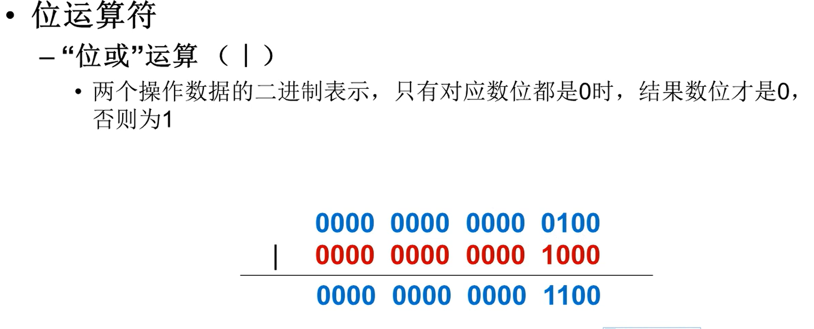

# 1 数据类型

> 

## 1.1 数值类型

> 
>
> 
>
> ```python
> print(round(0.1 + 0.2), 2) # 保留两位小数
> ```
>
> 
>
> ```python
> x = 3 + 4j
> print('实数部分', x.real)
> print('虚数部分', x.imag)
> ```

## 1.2 字符串类型

> 
>
> 
>
> 
>
> 

## 1.3 布尔类型

> 

## 1.4 数据类型转换

> 
>
> ```python
> x = 10
> y = 3
> z = x / y	# 在执行除法运算结果为float类型
> print(z, type(z)) # 3.3333333333333 <class 'float'>
> print(bin(y)) # 0b11 转成二进制字符串
> 
> # float类型转int类型，只保留整数部分
> print(int(3.14)) # 3
> print(int(-3.14)) # -3
> print(int(-0.5)) # 0
> 
> # 将字符串str转成int或float类型报错的情况
> print(int('18a')) # ValueError
> print(int('3.14')) # ValueError
> 
> print(ord('杨')) # 26472
> print(chr(26472)) # '杨'
> ```

# 1.5 `eval()`函数

> 
>
> ```python
> age = eval(input('请输入您的年龄：')) # 相当于执行了int(age)操作
> eval('print("hello")')
> ```

## 1.6 算术运算符

> 
>
> ```python
> print(10 / 2) # 5.0 结果为float类型
> ```
>
> 
>
> ```python
> # python支持系列解包赋值
> a, b = 10, 20
> # 交换两个变量的值
> a, b = b, a
> ```

## 1.6 比较运算符

> 

# 1.7 逻辑运算符

> 
>
> ```python
> # 会发生短路现象，当第一个表达式为false，就不会去计算第二个表达式了，or同理
> print(8 < 7 and 10/0)
> ```

## 1.8 位运算

> 
>
> 
>
> 
>
> 
>
> 
>
> 
>
> **运算符优先级**
>
> 

#  2 python保留字

> 
>
> ```python
> import keyword
> print(keyword.kwlist)
> ```

# 3 python 标识符命名规范

> 
>
> 
>
> 

# 4 分支结构

## 4.1  `if`语句

> ```python
> number = eval(input("输入您的6位中奖号码: "))
> # if-else赋值
> result = '中奖了' if number == 987654 else '未中奖'
> ```

## 4.2 循环结构

> 
>
> 

# python中的引用

> [python中的引用_python 引用_愈努力俞幸运的博客-CSDN博客](https://blog.csdn.net/qq_37891604/article/details/124528827)

 