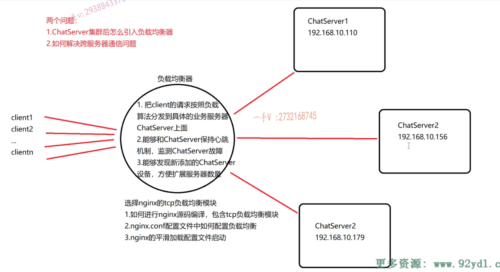
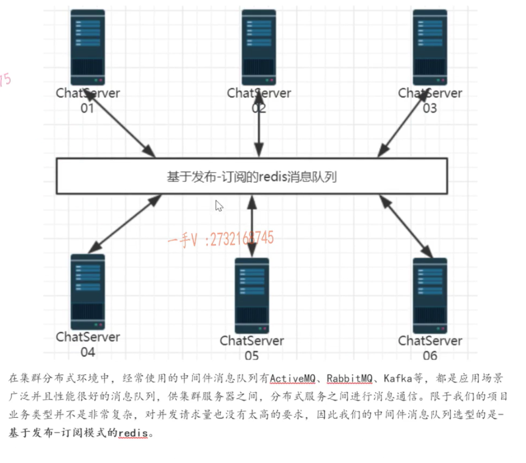

# Json

> **json序列化**
>
> ```c++
> #include "json.hpp"
> #include <string>
> 
> using json = nlohmann::json;
> 
> #include <iostream>
> #include <vector>
> #include <map>
> 
> using namespace std;
> 
> //json序列化示例1
> void func1() {
>     json js;
>     js["msg_type"] = 2;
>     js["from"] = "zhang san";
>     js["msg"] = "lis si";
>     js["msg"] = "hello, what are you doing now?";
> 
>     string sendBuf = js.dump();
>     cout << js << endl;
> }
> 
> void func2() {
>     json js;
>     //添加数组
>     js["id"] = { 1, 2, 3, 4, 5 };
>     // 添加 key-value
>     js["name"] = "zhang san";
>     //添加对象
>     js["msg"]["zhuang san"] = "hello world";
>     js["msg"]["liu shuo"] = "hello china";
>     //上面的语句等同于一次性添加数组对象
>     js["msg"] = { {"zhan san", "hello"} , {"liu shuo", "hello china"} };
>     cout << js << endl;
> }
> 
> void func3() {
>     json js;
> 
>     //直接序列化一个vector容器
>     vector<int> vec;
>     vec.push_back( 1 );
>     vec.push_back( 2 );
>     vec.pubh_back( 3 );
>     js["list"] = vec;
> 
>     //直接序列化一个map容器
>     map<int , string> m;
>     m.insert( { 1, "黄山" } );
>     m.insert( { 2, "华山" } );
>     m.insert( { 3, "泰山" } );
>     js["path"] = m;
>     
>     cout << js << endl;
> }
> int main() {
>     func1();
>     func2();
>     func3();
>     return 0;
> }
> ```
>
> **反序列化**
>
> > ```c++
> > #include "json.hpp"
> > #include <string>
> > 
> > using json = nlohmann::json;
> > 
> > #include <iostream>
> > #include <vector>
> > #include <map>
> > 
> > using namespace std;
> > 
> > //json序列化示例1
> > string func1() {
> >     json js;
> >     js["msg_type"] = 2;
> >     js["from"] = "zhang san";
> >     js["msg"] = "lis si";
> >     js["msg"] = "hello, what are you doing now?";
> > 
> >     string sendBuf = js.dump();
> >     cout << js << endl;
> >     return sendBuf;
> > }
> > 
> > string func2() {
> >     json js;
> >     //添加数组
> >     js["id"] = { 1, 2, 3, 4, 5 };
> >     // 添加 key-value
> >     js["name"] = "zhang san";
> >     //添加对象
> >     js["msg"]["zhuang san"] = "hello world";
> >     js["msg"]["liu shuo"] = "hello china";
> >     //上面的语句等同于一次性添加数组对象
> >     js["msg"] = { {"zhan san", "hello"} , {"liu shuo", "hello china"} };
> > 
> >     return js.dump();
> > }
> > 
> > void func3() {
> >     json js;
> > 
> >     //直接序列化一个vector容器
> >     vector<int> vec;
> >     vec.push_back( 1 );
> >     vec.push_back( 2 );
> >     vec.push_back( 3 );
> >     js["list"] = vec;
> > 
> >     //直接序列化一个map容器
> >     map<int , string> m;
> >     m.insert( { 1, "黄山" } );
> >     m.insert( { 2, "华山" } );
> >     m.insert( { 3, "泰山" } );
> >     js["path"] = m;
> > 
> >     cout << js << endl;
> > }
> > int main() {
> >     string recvBuf = func1();
> >     //数据的反序列化 json字符串 ==》 反序列化
> >     json jsbuf = json::parse( recvBuf );
> >     cout << jsbuf["msg_type"] << endl;
> > 
> >     string recvBuf2 = func2();
> >     json jsbuf2 = json::parse( recvBuf2 );
> > 
> >     vector<int> v = jsbuf2["id"];
> >     cout << jsbuf2["id"];
> > 
> >     string recvBuf3 = func3();
> >     json jsbuf3 = json::parse( recvBuf3 );
> >     map<int , string> mymap = jsbuf3["path"];
> >     
> >     return 0;
> > }
> > ```

# muduo网络库编程库

> 需要链接`libmuduo_base.so`、`libmuduo_net.so`和`libpthread.so` 
>
> 
>
> ```c++
> //服务器类，基于muduo库开发
> class ChatServer{
> public:
> 	ChatServer(muduo::net::EventLoop *loop,
> 	const muduo::net::InetAddress &listenAddr)
> 	:_server(loop, listenAddr, "ChatServer"){
> 		//通过绑定器设置回调函数
> 		_server.setConnectionCallback(std::bind(&ChatServer::onConnection, this, _1));
> 		
> 		_server.setMessageCallback(bind(&ChatServer::onMessage, this, _1, _2, _3));
> 		
> 		//设置EventLoop的线程个数
> 		_server.setThreadNum(10);
> 	}
> 	
> 	//启动ChatServer服务
> 	void start(){
> 		_server.start();
> 	}
> private:
> 	//TcpServer绑定的回调函数，当有新连接或连接中断时调用
> 	void onConnection(const muduo::net::TcpConnectionPtr &con){
> 		if (conn->connected()) {
>             cout << conn->peerAddress().toIpPort() << "->" <<
>             conn->localAddress().toIpPort() << "state:online" << endl;
>         }
>         else {
>             cout << conn->peerAddress().toIpPort() << "->" <<
>                 conn->localAddress().toIpPort() << "state:offline" << endl;
>             conn->shutdown(); //close(fd);
>         }
> 	}
> 	//TcpServer绑定的回调函数，当有新数据时调用
> 	void onMessage(const muduo::net::TcpConnectionPtr &con,
> 		muduo::net::Buffer *buf, muduo::Timestamp time){
> 		string buf = buffer->retrieveAllAsString();
>         cout << "recv data:" << buf << "time:" << time.toString() << endl;
>         conn->send( buf );
> 		}
> };
> ```
>
> ```c++
> // 客户端实现， 基于C++muduo网络库
> class ChatClient{
> public:
> 	ChatClient(muduo::net::EventLoop *loop,
> 		const muduo::net::InetAddress &addr)
> 		:_client(loop, addr, "ChatClient"){
> 		//设置客户端TCP连接回调接口
> 		_client.setConnectionCallback(std::bind(&ChatClient::onConnection, this, _1));
> 		
> 		//设置客户端接收数据回调接口
> 		_client.setMessageCallback(std::bind(&ChatClient::onMessage, this, _1, _2, _3));
> 		}
> 		
> 	//连接服务器
> 	void connect(){
> 		_client.connect();
> 	}
> private:
> 	//TcpClient绑定回调函数，当连接或者断开服务器时调用
> 	void onConnection(const muduo::net::TcpConnectionPtr &con);
> 	//TcpClient绑定回调函数，当有数据接收时调用
> 	void onMessage(const muduo::net::TcpConnectionPtr &con, muduo::net::Buffer *buf, muduo::Timestamp time);
> 	
> 	muduo::net::TcpClient _client;
> }
> ```
>
> > VsCode   
> >
> > `c_cpp_properties.json` -> 编辑配置文件
> >
> > `tasks.json` -> 编译配置文件
> >
> > `Ctrl + shift + B` -> 编译快捷键

# 数据库设计

> ```sql
> create database chat;
> use chat;
> 
> create table if not exists User(
>     id int primary key auto_increment comment '用户id',
>     name varchar(50) not null unique comment '用户名',
>     password varchar(50) not null comment '用户密码',
>     state enum('online', 'offline') default('offline') comment '当前登录状态'
> );
> 
> create table if not exists Friend(
>     userid int not null comment '用户id',
>     friendid int not null comment '好友id',
>     primary key (userid, friendid)
> );
> 
> create table if not exists AllGroup(
>     id int primary key auto_increment comment '组id',
>     groupname varchar(50) not null unique comment '组名称',
>     groupdesc varchar(200) default('') comment '组功能描述'
> );
> 
> create table if not exists GroupUser(
>     groupid int not null comment '组id',
>     userid int not null comment '组员id',
>     grouprole enum('creator', 'normal') default('normal') comment '组内角色',
>     primary key (groupid, userid)
> );
> 
> create table if not exists OfflineMessage(
>     userid int not null comment '用户id',
>     message varchar(500) not null comment '离线消息（存储Json字符串）'
> );
> ```

# 负载均衡器——nginx

> 

# 服务器中间件——基于发布-订阅的Redis

> 

# hiredis库

> [Hiredis_hiredis版本_奔跑的码仔的博客-CSDN博客](https://blog.csdn.net/lhl_blog/article/details/78665285)

## hirredis中的redisRely类型

> ​	在hiredis库中，redisReply类型是用于表示Redis服务器返回的回复的结构体。Redis是一个基于内存的数据结构服务器，提供了丰富的数据结构和操作命令。hiredis是一个C语言编写的用于与Redis服务器进行通信的客户端库，redisReply类型是其核心组件之一。
>
> ​	hiredis是一个轻量级、高性能的Redis客户端库，它以简洁的API和高效的实现而闻名。hiredis库的目标是提供一个快速、稳定、易于使用的Redis客户端。它是基于C语言编写的，可以轻松地集成到任何C/C++项目中。
>
> hiredis库支持的特性包括：
>
> * 非阻塞式I/O：可以使用异步API来执行多个Redis命令，提高性能。
> * 支持Redis的所有命令：可以执行任何Redis支持的操作，如GET、SET、HGET、HSET等。
> * 自动重连：在网络故障或连接断开时，可以自动重新连接到Redis服务器。
> * 支持发布/订阅模式可以订阅和接收Redis服务器发送的消息。
> * 支持管道：可以使用管道技术一次发送多个Redis命令，提高性能。
>
> redisReply类型是hiredis库中用于表示Redis服务器返回的回复的结构体。它定义在hiredis.h头文件中，如下所示：
>
> ```c
> typedef struct redisReply{
> 	int type;	// 回复的类型，如REDIS_REPLY_STRING、REDIS_REPLY_ARRAY等
> 	long long integer;	//	当回复类型为整数时，存储整数值
> 	size_t len;	// 当回复类型为字符串时，存储字符串的长度
> 	char *str; // 当回复类型为字符串时，存储字符串的值
> 	size_t elements;	// 当回复类型为数组时，存储数组元素的个数
> 	struct redisReply **element;	// 当回复类型为数组时，存储数组元素的指针
> }redisReply;
> ```
>
> redisReply结构体中各个成员的含义如下：
>
> * type：回复的类型，可以是以下几种类型之一：
>
>   * ```c
>     REDIS_REPLY_STRING // 字符串类型
>     REDIS_REPLY_ARRAY	// 数组类型
>     REDIS_REPLY_INTEGER	// 整数类型
>     REDIS_REPLY_NIL // 空值类型
>     REDIS_REPLY_STATUS // 状态回复类型
>     REDIS_REPLY_ERROR	// 错误回复类型
>     ```
>
> * integer：当回复的类型为整数时，存储整数值
>
> * len：当回复类型为字符串时，存储字符串的长度
>
> * str：当回复的类型为字符串时，存储字符串的值
>
> * elements：当回复的类型为数组时，存储数组元素的个数
>
> * element：当回复的类型为数组时，存储数组元素的指针
>
> ​    redisReply类型的定义使得hiredis库可以灵活地处理不同类型的回复。根据回复的类型，我们可以通过判断redisRedis结构体中的type成员类确定回复的具体类型，并从相应的成员中获取回复的值。
>
> ​	在使用hiredis库与Redis服务器进行通信时，我们可以通过调用hiredis提供的API来发送命令并接收回复。当接收到Redis服务器的回复时，hiredis会将回复的内容填充到redisReply结构体中，并将该结构体返回给调用者。
>
> ​	使用redisReply类型的一般步骤如下：
>
> 1) 声明一个redisReply指针变量，用于接收Redis服务器返回的回复。
>
>    1) ```c
>       redisReply *reply;
>       ```
>
> 2) 调用hiredis提供的API发送命令，并接收Redis服务器的回复。
>
>    1) ```c
>       reply = redisCommand(context, "GET key");
>       ```
>
> 3) 检查回复的类型，根据需要从redisReply结构体中获取回复的值
>
>    1) ```c
>       if(reply->type == REDIS_REPLY_STRING){
>       	printf("Reply: %s\n", reply->str);
>       }else if(reply->type == REDIS_REPLY_INTEGER){
>       	printf("Reply: %lld\n", reply->integer);
>       }
>       ```
>
> 4) 释放redisReply结构体所占用的内存
>
>    1) ```c
>       freeReplyObject(reply);
>       ```
>
> 示例代码：
>
> ```c
> #include <stdio.h>
> #include <stdlib.h>
> #include <hiredis/hiredis.h>
> 
> int main(){
> 	redisContext *context = redisConnect("127.0.0.1", 6379);
>     if(context == NULL || context->err){
>         if(context){
>         	printf("Error: %s\n", context->errstr);
>         	redisFree(context);
>         }
>         else{
>             printf("Can't allocate redis context\n");
>         }
>         return -1;
>     }	
>     redisReply *reply = redisCommand(context, "GET key");
>     if(reply == NULL){
>         printf("Failed to execute command: GET key\n");
>         redisFree(context);
>         return -1;
>     }
>     
>     if(reply->type == REDIS_REPLY_STRING){
>         printf("Reply: %s\n", reply->str);
>     }
>     else if(reply->type == REDIS_REPLY_INTEGER){
>         printf("Reply: %lld\n", reply->integer);
>     }
>     
>    freeReplyObject(reply);
>    redisFree(context);
>    return 0;
> }
> ```

