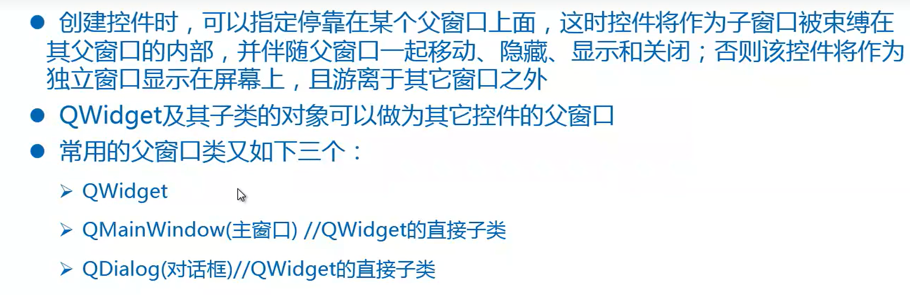
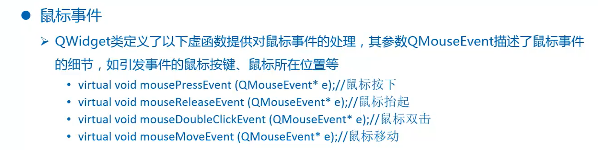
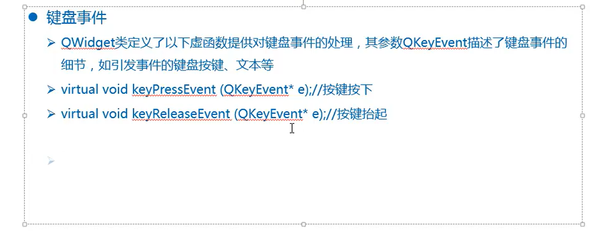

# 1 Qt中常用的工具介绍

> * assistant（Qt助手，帮助手册）
> * qmake （Qt构建器，生成makefile文件）
> * designer （Qt设计师，设计界面，生成基于xml的.ui文件）
> * uic（Qt转换器，将.ui文件转换为C++代码）
> * rcc（Qt资源编译器）
> * moc（Qt元对象编译器，将语法扩展部分还原成标准C++语法）
> * qtcreator（Qt创造器）
>
> ```shell
> $ ~/Hello: qmake -project	# 在当前项目下生成生成makefile的文件，即工程文件， Hello.pro，相当于cmake中的CMakeLists.txt，其会自动链接QT要使用的库
> $~/Hello: qmake 	# 生成makefile文件
> ```

# Qt中文编码

> 
>
> 
>
> 

## 2.1 编码转换

> 
>
> ```shell
> :set fileencoding=GBK	# 在vim编辑器中修改文件的编码格式
> ```
>
> ```c++
> #include <QLabel>
> #include <QTextCodec>
> // 1)创建编码对象
> QTextCodec* coder = QTextCodec::codecForName("gbk");
> 
> // 将要显示gbk编码字符串转换为unicode
> QLabel label(coder->toUnicode("我是标签"));
> ```

# 3 父窗口

> 
>
> ```text
> 在Qt中创建对象的时候会提供一个Parent对象指针，下面来解释这个parent的作用
> 1、QObject是以对象树的形式组织起来的
> （1）、当你创建一个QObject对象时，会看到QObject的构造函数接收一个QObject指针作为参数，这个参数就是parent，也就是父对象指针。
> 这相当于，在创建QObject对象时，可以提供一个其父类对象，我们创建的这个QObject对象会自动添加到其父对象的children()列表。
> （2）、当父对象析构的时候，这个列表中的所有对象也会被析构。（注意，这里的父对象并不是继承意义上的父类！）
> 这种机制在GUI程序设计中相当有用。例如，一个按钮有一个QShortcut(快捷键)对象作为其子对象。当我们删除按钮的时候，这个快捷键也会被删除。
> 2、QWidget是能够在屏幕上显示的一切组件的父类
> QWidget继承自QObject,因此也继承了这种对象树关系。一个孩子自动地成为父组件的一个子组件。因此，它会显示在父组件的坐标系统中，被父组件的边界剪裁。例如，当用户关闭一个对话框的时候，应用程序将其删除，那么，我们希望属于这个对话框的按钮，图标等应该一起被删除。事实就是如此，因为这些都是对话框的子组件。
> 
> 3、我们可以自己删除子对象，它们会自动从其父对象列表中删除。比如我们删除了一个工具栏时，其所在的主窗口会自动将该工具栏从其子列表中删除，并且自动调整屏幕显示。
> 
> 4、Qt引入对象树的概念，一定程度上解决了内存释放问题。
> （1）、当一个QObject对象在堆区创建的时候，Qt会同时为其创建一个对象树，不过，对象树中的对象顺序是没有定义的，这意味着，销毁这些对象的顺序也是未定义的。
> （2）、任何对象树中的QObject对象delete的时候，如果这个对象有parent，则自动将其从parent的children（）列表中删除；如果有孩子，则自动delete每一个孩子。Qt保证没有QObject会被delete两次，这是由析构顺序决定的。
> 因此，在Qt中，尽量在构造的时候就指定parent对象，并且大胆在堆区进行创建。先构造的对象后析构，因此要先创建父组件，再创建子组件，否则的话会先析构子组件，然后再析构父组件时析构children中的子组件时再次析构子组件，程序会崩溃。
> ```
>
> 
>
> ```c++
> #include <QWidget>
> #include <QDialog>
> #include <QMainWindow>
> #include <QLabel>
> #include <QPushButton>
> #include <QApplication>
> 
> int main(int argc, char** argv){
>     QApplication app(argc, argv);
>     
>     //QWidget parent;
>     QDialog parent;
>     parent.move(50, 50);
>     parent.resize(320, 240);
>     
>     QLabel label("我是标签", &parent);
>     // 相对于父窗口
>     label.move(20, 40);
>     
>     QPushButton button("我是按钮", &parent);
>     button.move(20, 100);
>     button.resize(80, 80);
>     
>     QPushButton *button2 = new QPushButton("我是按钮", &parent);
>     button2->move(170, 100);
>     button2->resize(80, 80);
>     
>     parent.show();	// 父窗口显示，上面停靠的控件也将一起显示
>     
>     return app.exec();
> }
> ```
>
> 

# 3 信号与槽

> 
>
> 
>
> 
>
> 
>
> ```c++
> #include <QApplication>
> #include <QLabel>
> #include <QPushButton>
> #include <QDialog>
> 
> int main(int argc, char** argv){
>  QApplication app(argc, argv);
> 
>  QDialog parent;	//父窗口
>  parent.resize(320, 240);
> 
>  QLabel label("我是标签", &parent);
>  label.move(50, 40);
>  QPushButton button("我是按钮", &parent);
>  button.move(50, 140);
>  QPushButton button2("退出", &parent);
>  button2.move(200, 140);
>  parent.show();
>  QObject::connect(&button, SIGNAL(clicked(void)), &label, SLOT(close(void)));
>  // 增加退出应用程序按钮
>  QObject::connect(&button2, SIGNAL(clicked(void)), 
>                   //&app, SLOT(closeAllWindows(void)));
>                   //&app, SLOT(quit(void)));
>                   &parent, SLOT(close(void)));
> 
> 
>  return app.exec();
> }
> ```
>
> 
>
> 
>
> 
>
> ```c++
> 
> #include <QApplication>
> #include <QDialog>
> #include <QSlider>
> #include <QSpinBox>
> 
> int main(int argc, char** argv){
>     QApplication app(argc, argv);
> 
>     QDialog parent;
>     parent.resize(320, 240);
> 
>     QSlider slider(Qt::Horizontal, &parent);
>     slider.move(20, 100);
>     slider.setRange(0, 200);
>     QSpinBox spin(&parent);
>     spin.move(220, 100);
>     spin.setRange(0, 200);
> 
>     // 滑块滑动让选值框数值随之改变
>     QObject::connect(&slider, SIGNAL(valueChanged(int)), &spin, SLOT(setValue(int)));
>     // 选值框数值改变让滑块随之滑动
>     QObject::connect(&spin, SIGNAL(valueChanged(int)), &slider,  SLOT(setValue(int)));
>     parent.show();
> 
>     return app.exec();
> }
> ```

# 4 Qt面向对象编程

> 
>
> `calculatordialog.h`
>
> ```c++
> #ifndef CALCULATORDIALOG_H
> #define CALCULATORDIALOG_H
> 
> #include <QDialog>
> #include <QLabel>
> #include <QPushButton>
> #include <QLineEdit> // 行编辑控件
> #include <QHBoxLayout> // 水平布局器
> #include <QDoubleValidator> // 浮点数验证器
> 
> class CalculatorDialog : public QDialog{
>  Q_OBJECT
> public:
>  CalculatorDialog(void);
> public slots:
>  void enableButton(void);
>  void calcClicked(void);
> private:
>  QLineEdit* m_editX; //左操作数
>  QLineEdit* m_editY; // 右操作数
>  QLineEdit* m_editZ; // 显示结果
>  QLabel* m_label; // "+"
>  QPushButton* m_button; // "="
> };
> 
> #endif // CALCULATORDIALOG_H
> ```
>
> `calculatordialog.cpp`
>
> ```c++
> #include "calculatordialog.h"
> 
> CalculatorDialog::CalculatorDialog(void){
>  // 界面初始化
>  setWindowTitle("计算器");
>  m_editX = new QLineEdit(this);
>  m_editX->setAlignment(Qt::AlignRight);
>  // 设置数字验证器，只能输入浮点数
>  m_editX->setValidator(new QDoubleValidator(this));
> 
>  m_editY = new QLineEdit(this);
>  m_editY->setAlignment(Qt::AlignRight);
>  m_editY->setValidator(new QDoubleValidator(this));
> 
>  m_editZ = new QLineEdit(this);
>  m_editZ->setAlignment(Qt::AlignRight);
>  m_editZ->setReadOnly(true); // 设置只读
> 
>  m_label = new QLabel("+",  this);
>  m_button = new QPushButton("=", this);
>  m_button->setEnabled(false);    //设置禁用状态
> 
>  QHBoxLayout* layout  = new QHBoxLayout(this);
>  layout->addWidget(m_editX);
>  layout->addWidget(m_label);
>  layout->addWidget(m_editY);
>  layout->addWidget(m_button);
>  layout->addWidget(m_editZ);
>  setLayout(layout);
> 
>  // 左右操作数文本改变时，发送信号textChanged()
>  connect(m_editX, SIGNAL(textChanged(QString)), this, SLOT(enableButton(void)));
>  connect(m_editY, SIGNAL(textChanged(QString)), this, SLOT(enableButton(void)));
> 
>  // 点击按钮，发送信号clicked
>  connect(m_button, SIGNAL(clicked(void)), this, SLOT(calcClicked(void)));
> }
> 
> void CalculatorDialog::enableButton(void){
>  bool bXOk, bYOk;
>  // toDouble(): QSting转换为double，参数保存是否转换成功的结果
>  m_editX->text().toDouble(&bXOk);
>  m_editY->text().toDouble(&bYOk);
> 
>  // 当左右操作数都输入了有效数据，则使能等号按钮，否则设置禁用
>  m_button->setEnabled(bXOk && bYOk);
> }
> 
> void CalculatorDialog::calcClicked(void){
>  double res = m_editX->text().toDouble() +
>          m_editY->text().toDouble();
>  QString str = QString::number(res);
>  m_editZ->setText(str);
> }
> ```
>
> `main.cpp`
>
> ```c++
> #include <QApplication>
> #include "calculatordialog.h"
> 
> int main(int argc, char** argv){
>  QApplication app(argc, argv);
> 
>  CalculatorDialog calc;
>  calc.show();
> 
>  return app.exec();
> }
> ```
>
> 
>
> `timedialog.h`
>
> ```c++
> #ifndef TIMEDIALOG_H
> #define TIMEDIALOG_H
> 
> #include <QDialog>
> #include <Qlabel>
> #include <QPushButton>
> #include <QVBoxLayout>
> #include <QTime>
> #include <QDebug>
> 
> class TimeDialog : public QDialog
> {
>     Q_OBJECT
> public:
>     TimeDialog();
> signals:
>     void mySignal(const QString&);
> public slots:
>     void getTime(void);
> private:
>     QLabel *m_label;
>     QPushButton *m_button;
> };
> 
> #endif // TIMEDIALOG_H
> ```
>
> `timedialog.cpp`
>
> ```c++
> #include "timedialog.h"
> #include <QFont>
> 
> TimeDialog::TimeDialog()
> {
>     m_label = new QLabel(this);
>     m_label->setFrameStyle(QFrame::Panel|QFrame::Sunken);
>     m_label->setAlignment(Qt::AlignHCenter|Qt::AlignVCenter);
>     QFont font;
>     font.setPointSize(20);
>     m_label->setFont(font);
> 
>     m_button = new QPushButton("获取当前时间", this);
>     m_button->setFont(font);
> 
>     QVBoxLayout *layout  = new QVBoxLayout(this);
>     layout->addWidget(m_label);
>     layout->addWidget(m_button);
>     setLayout(layout);
> 
>     connect(m_button, SIGNAL(clicked()), this, SLOT(getTime()));
>     connect(this, SIGNAL(mySignal(const QString&)), m_label, SLOT(setText(QString)));
> }
> 
> void TimeDialog::getTime(void){
>     qDebug("getTime");
>     qDebug() << "getTime";
>     QTime time = QTime::currentTime();
>     QString str = time.toString("hh:mm:ss");
>    /* m_label->setText(str); */
>     emit mySignal(str);
> }
> ```

# 5 Qt设计师

> 
>
> 

## 5.1 以继承方式使用设计师生成的ui界面

> `ui_CalculatorDialog.h`
>
> ​	通过设计师设计生成`CalculatorDialog.ui`文件，使用`uic`转换工具通过命令`uic CalculatorDialog.ui -o ui_CalculatorDialog.h`生成C++格式的界面设计代码（这一步在Qt Creator中自动完成）。
>
> `calculatordialog.h`
>
> ```c++
> #ifndef CALCULATORDIALOG_H
> #define CALCULATORDIALOG_H
> 
> #include "ui_CalculatorDialog.h"
> 
> // 继承方式使用ui生成的界面
> class CalculatorDialog : public QDialog, public Ui::CalculatorDialog{
>     Q_OBJECT
> public:
>     CalculatorDialog(void);
> public slots:
>     void enableButton(void);
>     void calcClicked(void);
> };
> 
> #endif // CALCULATORDIALOG_H
> ```
>
> `calculatordialog.cpp`
>
> ```c++
> #include "calculatordialog.h"
> 
> CalculatorDialog::CalculatorDialog(void){
>     // 界面初始化
>     setupUi(this);
>     // 设置数字验证器，只能输入浮点数
>     m_editX->setValidator(new QDoubleValidator(this));
>     m_editY->setValidator(new QDoubleValidator(this));
> 
>     // 左右操作数文本改变时，发送信号textChanged()
>     connect(m_editX, SIGNAL(textChanged(QString)), this, SLOT(enableButton(void)));
>     connect(m_editY, SIGNAL(textChanged(QString)), this, SLOT(enableButton(void)));
> 
>     // 点击按钮，发送信号clicked
>     connect(m_button, SIGNAL(clicked(void)), this, SLOT(calcClicked(void)));
> }
> 
> void CalculatorDialog::enableButton(void){
> 	bool bXOk, bYOk;
> 	// toDouble(): QSting转换为double，参数保存是否转换成功的结果
> 	m_editX->text().toDouble(&bXOk);
> 	m_editY->text().toDouble(&bYOk);
> 
> 	// 当左右操作数都输入了有效数据，则使能等号按钮，否则设置禁用
> 	m_button->setEnabled(bXOk && bYOk);
> }
> 
> void CalculatorDialog::calcClicked(void){
> 	double res = m_editX->text().toDouble() +
>      m_editY->text().toDouble();
> 	QString str = QString::number(res);
> 	m_editZ->setText(str);
> }
> ```

## 5.2以组合方式使用设计师生成的ui界面（默认和推荐方式）

> `calculatordialog.h`
>
> ```c++
> #ifndef CALCULATORDIALOG_H
> #define CALCULATORDIALOG_H
> 
> #include "ui_CalculatorDialog.h"
> 
> // 组合方式使用ui生成的界面
> class CalculatorDialog : public QDialog{
>     Q_OBJECT
> public:
>     CalculatorDialog(void);
>     ~C
> public slots:
>     void enableButton(void);
>     void calcClicked(void);
> private:
>     Ui::CalculatorDialog *ui;
> };
> 
> #endif // CALCULATORDIALOG_H
> ```
>
> `calculatordialog.cpp`
>
> ```c++
> #include "calculatordialog.h"
> 
> CalculatorDialog::CalculatorDialog(void)
>     : ui(new Ui::CalculatorDialog){
>     // 界面初始化
>    ui-> setupUi(this);
>     // 设置数字验证器，只能输入浮点数
>     ui->m_editX->setValidator(new QDoubleValidator(this));
>     ui->m_editY->setValidator(new QDoubleValidator(this));
> 
>     // 左右操作数文本改变时，发送信号textChanged()
>     connect(ui->m_editX, SIGNAL(textChanged(QString)), this, SLOT(enableButton(void)));
>     connect(ui->m_editY, SIGNAL(textChanged(QString)), this, SLOT(enableButton(void)));
> 
>     // 点击按钮，发送信号clicked
>     connect(ui->m_button, SIGNAL(clicked(void)), this, SLOT(calcClicked(void)));
> }
> 
> void CalculatorDialog::enableButton(void){
>     bool bXOk, bYOk;
>     // toDouble(): QSting转换为double，参数保存是否转换成功的结果
>     ui->m_editX->text().toDouble(&bXOk);
>     ui->m_editY->text().toDouble(&bYOk);
> 
>     // 当左右操作数都输入了有效数据，则使能等号按钮，否则设置禁用
>     ui->m_button->setEnabled(bXOk && bYOk);
> }
> 
> void CalculatorDialog::calcClicked(void){
>     double res = ui->m_editX->text().toDouble() +
>       ui->m_editY->text().toDouble();
>     QString str = QString::number(res);
>     ui->m_editZ->setText(str);
> }
> 
> CalculatorDialog::~CalculatorDialog(void){
>     delete ui;
> }
> ```

## 5.2 登录案例

> 
>
> `logindialog.h`
>
> ```c++
> #ifndef LOGINDIALOG_H
> #define LOGINDIALOG_H
> 
> #include "ui_LoginDialog.h"
> #include <QMessageBox>
> #include <QDebug>
> 
> class LoginDialog : public QDialog {
>     Q_OBJECT
> public:
>     LoginDialog(void);
>     ~LoginDialog(void);
> public slots:
>     void onAccepted(void);
>     void onRejected(void);
> private:
>     Ui::LoginDialog *ui;
> };
> 
> #endif // LOGINDIALOG_H
> ```
>
> `logindialog.cpp`
>
> ```c++
> #include "logindialog.h"
> 
> LoginDialog::LoginDialog(void)
>     : ui(new Ui::LoginDialog){
>     ui->setupUi(this);
>     connect(ui->buttonBox, SIGNAL(accepted(void)), this, SLOT(onAccepted(void)));
>     connect(ui->buttonBox, SIGNAL(rejected(void)), this, SLOT(onRejected(void)));
> }
> 
> void LoginDialog::onAccepted(void){
>     if(ui->m_usernameEdit->text() == "tarena" && ui->m_passwordEdit->text() == "123456"){
>         qDebug() << "登录成功";
>         close();
>     }
>     else{
>         // 创建消息提示框
>         QMessageBox msgBox(QMessageBox::Critical, "Error", "用户名或密码错误", QMessageBox::Ok, this);
>         msgBox.exec();
>     }
> }
> 
> void LoginDialog::onRejected(void){
>     QMessageBox msgBox(QMessageBox::Question, "登录", "是否确定要取消登录？", QMessageBox::Yes|QMessageBox::No, this);
>     if(msgBox.exec() == QMessageBox::Yes){
>         close();
>     }
> }
> 
> LoginDialog::~LoginDialog(void){
>     delete ui;
> }
> ```

# 6 Qt事件处理机制

> 
>
> 
>
> 

## 6.1 绘图事件

> 
>
> 
>
> `showimagedialog.h`
>
> ```c++
> #ifndef SHOWIMAGEDIALOG_H
> #define SHOWIMAGEDIALOG_H
> 
> #include <QDialog>
> #include <QPainter>
> #include <QImage>
> 
> namespace Ui {
> class ShowImageDialog;
> }
> 
> class ShowImageDialog : public QDialog
> {
>     Q_OBJECT
> 
> public:
>     explicit ShowImageDialog(QWidget *parent = 0);
>     ~ShowImageDialog();
> 
> private slots:
>     void on_m_btnPrev_clicked();
> 
>     void on_m_btnNext_clicked();
> private:
>     void paintEvent(QPaintEvent *event);
> private:
>     Ui::ShowImageDialog *ui;
>     int m_index;
> };
> 
> #endif // SHOWIMAGEDIALOG_H
> ```
>
> `showimagedialog.cpp`
>
> ```c++
> #include "showimagedialog.h"
> #include "ui_showimagedialog.h"
> #include <QDebug>
> 
> ShowImageDialog::ShowImageDialog(QWidget *parent) :
>     QDialog(parent),
>     ui(new Ui::ShowImageDialog)
> {
>     ui->setupUi(this);
>     m_index = 0;
> }
> 
> ShowImageDialog::~ShowImageDialog()
> {
>     delete ui;
> }
> 
> void ShowImageDialog::on_m_btnPrev_clicked()
> {
>     if(--m_index < 0){
>         m_index = 4;
>     }
>     update(); // 触发绘图事件执行
> }
> 
> void ShowImageDialog::on_m_btnNext_clicked()
> {
>     if(++m_index > 4){
>         m_index = 0;
>     }
>     update(); //触发绘图事件
> }
> 
> void ShowImageDialog::paintEvent(QPaintEvent *event){
>     //qDebug("paintEvent");
>     // 1 创建画家对象
>     QPainter painter(this);
>     // 2 获取绘图所在的矩形区域
>     QRect rect = ui->frame->frameRect();
>     //qDebug() << "平移前：" << rect;
>     // 坐标值平移，使得rect与painter属于相同坐标系
>     rect.translate(ui->frame->pos());
>     //qDebug() << "平移后：" << rect;
>     // 3 构建要绘制的图形对象
>     QImage image(":/images/" + QString::number(m_index) + ".jpg");
>     // 4 使用painter将image图片画到rect
>     painter.drawImage(rect, image);
> }
> ```

## 6.2 定时器事件

> 
>
> 

### 6.2.1 以`QObject`提供的静态方法实现

> `erniedialog.h`
>
> ```c++
> #ifndef ERNIEDIALOG_H
> #define ERNIEDIALOG_H
> 
> #include <QDialog>
> #include <QTime>
> #include <QTimer>
> #include <QPainter>
> #include <QDir>
> #include <QVector>
> #include <QImage>
> #include <QDebug>
> 
> namespace Ui {
> class ErnieDialog;
> }
> 
> class ErnieDialog : public QDialog
> {
>     Q_OBJECT
> 
> public:
>     explicit ErnieDialog(QWidget *parent = 0);
>     ~ErnieDialog();
> 
> private slots:
>     void on_pushButton_clicked();
> private:
>     // 加载图像到容器中
>     void loadPhotos(const QString& path);
>     // 定时器事件处理函数
>     void timerEvent(QTimerEvent *);
>     // 绘图事件处理函数
>     void paintEvent(QPaintEvent *);
> private:
>     Ui::ErnieDialog *ui;
>     QVector<QImage> m_vecPhotos;
>     int m_index;
>     int m_timer;
>     bool isStarted;
> };
> #endif // ERNIEDIALOG_H
> ```
>
> `erniedialog.cpp`
>
> ```c++
> #include "erniedialog.h"
> #include "ui_erniedialog.h"
> 
> ErnieDialog::ErnieDialog(QWidget *parent) :
>     QDialog(parent),
>     ui(new Ui::ErnieDialog)
> {
>     ui->setupUi(this);
>     m_index = 0;
>     isStarted = false;
>     // 设置随机数种子
>     qsrand(QTime::currentTime().msec());
>     loadPhotos("./images");
>     qDebug() << "加载图片个数：" << m_vecPhotos.size();
> }
> 
> ErnieDialog::~ErnieDialog()
> {
>     delete ui;
> }
> 
> void ErnieDialog::on_pushButton_clicked()
> {
>     if(isStarted == false){
>         isStarted = true;
>         m_timer = startTimer(200);
>         ui->pushButton->setText("停止");
>     }
>     else{
>         isStarted = false;
>         killTimer(m_timer);
>         ui->pushButton->setText("开始");
>     }
> }
> 
> // 加载图像到容器中
> void ErnieDialog::loadPhotos(const QString& path){
>     QDir dir(path);
>     // 遍历当前目录下所有图片
>     QStringList list1 = dir.entryList(QDir::Files);
>     for(int i = 0; i < list1.size(); i++){
>         QImage image(path + "/" + list1.at(i));
>         m_vecPhotos << image;
>     }
>     // 递归遍历子目录中的图片
>     QStringList list2 = dir.entryList(QDir::Dirs | QDir::NoDotAndDotDot);
>     for(int i = 0; i < list2.size(); i++){
>         loadPhotos(path + "/" + list2.at(i));
>     }
> }
> // 定时器事件处理函数
> void ErnieDialog::timerEvent(QTimerEvent *){
>     m_index = qrand() % m_vecPhotos.size();
>     update();
> }
> 
> // 绘图事件处理函数
> void ErnieDialog::paintEvent(QPaintEvent *){
>     QPainter painter(this);
>     QRect rect = ui->frame->frameRect();
>     rect.translate(ui->frame->pos());
>     painter.drawImage(rect, m_vecPhotos[m_index]);
> }
> ```

### 6.2.2 以封装好的`QTimer`对象实现

> `erniedialog.h`
>
> ```c++
> #ifndef ERNIEDIALOG_H
> #define ERNIEDIALOG_H
> 
> #include <QDialog>
> #include <QTime>
> #include <QTimer>
> #include <QPainter>
> #include <QDir>
> #include <QVector>
> #include <QImage>
> #include <QDebug>
> 
> namespace Ui {
> class ErnieDialog;
> }
> 
> class ErnieDialog : public QDialog
> {
>     Q_OBJECT
> 
> public:
>     explicit ErnieDialog(QWidget *parent = 0);
>     ~ErnieDialog();
> 
> private slots:
>     void on_pushButton_clicked();
>     // 定时器到时以后执行的槽函数
>     void onTimeout();
> private:
>     // 加载图像到容器中
>     void loadPhotos(const QString& path);
>     // 绘图事件处理函数
>     void paintEvent(QPaintEvent *);
> private:
>     Ui::ErnieDialog *ui;
>     QVector<QImage> m_vecPhotos;
>     int m_index;
>     QTimer m_timer;
>     bool isStarted;
> };
> 
> #endif // ERNIEDIALOG_H
> ```
>
> `erniedialog.cpp`
>
> ```c++
> #include "erniedialog.h"
> #include "ui_erniedialog.h"
> 
> ErnieDialog::ErnieDialog(QWidget *parent) :
>     QDialog(parent),
>     ui(new Ui::ErnieDialog)
> {
>     ui->setupUi(this);
>     m_index = 0;
>     isStarted = false;
>     // 设置随机数种子
>     qsrand(QTime::currentTime().msec());
>     loadPhotos("./images");
>     qDebug() << "加载图片个数：" << m_vecPhotos.size();
>     
>     // 每当定时器到时，会发送timeout信号
>     connect(&m_timer, SIGNAL(timeout()), this, SLOT(onTimeout()));
> }
> 
> ErnieDialog::~ErnieDialog()
> {
>     delete ui;
> }
> 
> void ErnieDialog::on_pushButton_clicked()
> {
>     if(isStarted == false){
>         isStarted = true;
>         m_timer .start(50);
>         ui->pushButton->setText("停止");
>     }
>     else{
>         isStarted = false;
>         m_timer.stop();
>         ui->pushButton->setText("开始");
>     }
> }
> 
> // 加载图像到容器中
> void ErnieDialog::loadPhotos(const QString& path){
>     QDir dir(path);
>     // 遍历当前目录下所有图片
>     QStringList list1 = dir.entryList(QDir::Files);
>     for(int i = 0; i < list1.size(); i++){
>         QImage image(path + "/" + list1.at(i));
>         m_vecPhotos << image;
>     }
>     // 递归遍历子目录中的图片
>     QStringList list2 = dir.entryList(QDir::Dirs | QDir::NoDotAndDotDot);
>     for(int i = 0; i < list2.size(); i++){
>         loadPhotos(path + "/" + list2.at(i));
>     }
> }
> 
> void ErnieDialog::onTimeout(){
>     m_index = qrand() % m_vecPhotos.size();
>     update();
> }
> 
> // 绘图事件处理函数
> void ErnieDialog::paintEvent(QPaintEvent *){
>     QPainter painter(this);
>     QRect rect = ui->frame->frameRect();
>     rect.translate(ui->frame->pos());
>     painter.drawImage(rect, m_vecPhotos[m_index]);
> }
> ```

## 6.3 鼠标和键盘事件

> 
>
> 
>
> 
>
> 
>
> `mousedialog.h`
>
> ```c++
> #ifndef MOUSEDIALOG_H
> #define MOUSEDIALOG_H
> 
> #include <QDialog>
> #include <QMouseEvent>
> #include <QKeyEvent>
> 
> namespace Ui {
> class MouseDialog;
> }
> 
> class MouseDialog : public QDialog
> {
>     Q_OBJECT
> 
> public:
>     explicit MouseDialog(QWidget *parent = 0);
>     ~MouseDialog();
> private:
>     void mousePressEvent(QMouseEvent *event);
>     void mouseReleaseEvent(QMouseEvent *event);
>     void mouseMoveEvent(QMouseEvent *event);
>     void keyPressEvent(QKeyEvent *);
> private:
>     Ui::MouseDialog *ui;
>     bool m_drag;
>     QPoint m_pos;
>     // QRect(x, y, w, h) QPoint(x, y) QSize(w, h)
> };
> 
> #endif // MOUSEDIALOG_H
> ```
>
> `mousedialog.cpp`
>
> ```c++
> #include "mousedialog.h"
> #include "ui_mousedialog.h"
> #include <QDebug>
> 
> MouseDialog::MouseDialog(QWidget *parent) :
>     QDialog(parent),
>     ui(new Ui::MouseDialog)
> {
>     ui->setupUi(this);
>     m_drag = false;
> }
> 
> MouseDialog::~MouseDialog()
> {
>     delete ui;
> }
> 
> void MouseDialog::mousePressEvent(QMouseEvent *event){
>     // 是否鼠标左键
>     if(event->button() == Qt::LeftButton){
>         // 获取label所在矩形区域
>         QRect rect = ui->label->frameRect();
>         // 坐标平移：让rect和鼠标使用相同的坐标系
>         rect.translate(ui->label->pos());
>         // 判断鼠标点击位置是否在rect矩形区域中
>         if(rect.contains(event->pos())){
>             m_drag = true;
>             // 计算相对位置，方便根据鼠标偏移来同步移动label
>             m_pos = ui->label->pos() - event->pos();
>         }
>     }
> }
> 
> void MouseDialog::mouseReleaseEvent(QMouseEvent *event){
>     if(event->button() == Qt::LeftButton){
>         m_drag = false;
>     }
> }
> 
> void MouseDialog::mouseMoveEvent(QMouseEvent *event){
>     if(m_drag){
>         // 计算label要移动到的新位置
>         QPoint newPos = event->pos() + m_pos;
>         QSize s1 = size();
>         QSize s2 = ui->label->size();
>         if(newPos.x() < 0){
>             newPos.setX(0);
>         }
>         else if(newPos.x() > s1.width() - s2.width()){
>             newPos.setX(s1.width() - s2.width());
>         }
> 
>         if(newPos.y() < 0){
>             newPos.setY(0);
>         }
>         else if(newPos.y() > s1.height() - s2.height()){
>             newPos.setY(s1.height() - s2.height());
>         }
>         // 移动label到新位置
>         ui->label->move(newPos);
>         //qDebug() << newPos;
>     }
> }
> 
>  void MouseDialog::keyPressEvent(QKeyEvent *event){
>      int x = ui->label->pos().x();
>      int y = ui->label->pos().y();
>      if(event->key() == Qt::Key_Up){
>          ui->label->move(x, y - 10);
>      }
>      else if(event->key() == Qt::Key_Down){
>          ui->label->move(x, y + 100);
>      }
>      else if(event->key() == Qt::Key_Left){
>          ui->label->move(x - 10, y);
>      }
>      else if(event->key() == Qt::Key_Right){
>          ui->label->move(x + 10, y);
>      }
>  }
> ```

# 7 Qt数据库

> 
>
> 
>
> 
>
> 
>
> 
>
> 
>
> 

## 7.1 Sqlite的操作指令

> 
>
> 
>
> 
>
> 
>
> 
>
> 

## 7.2 在Qt中使用Sqlite

> 
>
> 
>
> 
>
> 
>
> 
>
> 
>
> 

## 7.3 案例

> 
>
> `studentdialog.h`
>
> ```c++
> #ifndef STUDENTDIALOG_H
> #define STUDENTDIALOG_H
> 
> #include <QDialog>
> #include <QSqlDatabase>
> #include <QSqlQuery>
> #include <QSqlQueryModel>
> #include <QSqlError>
> #include <QDebug>
> 
> 
> namespace Ui {
> class StudentDialog;
> }
> 
> class StudentDialog : public QDialog
> {
>     Q_OBJECT
> 
> public:
>     explicit StudentDialog(QWidget *parent = 0);
>     ~StudentDialog();
> private:
>     // 创建数据库
>     void createDB();
>     // 创建数据表
>     void createTable();
>     // 查询
>     void queryTable();
> private slots:
>     void on_insertButton_clicked();
> 
>     void on_deleteButton_clicked();
> 
>     void on_updateButton_clicked();
> 
>     void on_sortButton_clicked();
> 
> private:
>     Ui::StudentDialog *ui;
>     QSqlDatabase db;    // 建立Qt和数据库连接
>     QSqlQueryModel model;   // 保存结果集
> };
> 
> #endif // STUDENTDIALOG_H
> ```
>
> `studentdialog.cpp`
>
> ```c++
> #include "studentdialog.h"
> #include "ui_studentdialog.h"
> #include <QMessageBox>
> 
> StudentDialog::StudentDialog(QWidget *parent) :
>     QDialog(parent),
>     ui(new Ui::StudentDialog)
> {
>     ui->setupUi(this);
>     //ui->tableView->horizontalHeader()->setSectionResizeMode(QHeaderView::Stretch);
>     createDB();
>     createTable();
>     queryTable();
> }
> 
> StudentDialog::~StudentDialog()
> {
>     delete ui;
> }
> 
> // 创建数据库
> void StudentDialog::createDB(){
>     // 添加数据库驱动库
>     db = QSqlDatabase::addDatabase("QSQLITE");
>     // 设置数据库名字（文件名）
>     db.setDatabaseName("student.db");
>     // 打开数据库
>     db.open();
>     if(db.open() == true){
>         qDebug() << "创建/打开数据库成功！";
>     }
>     else{
>         qDebug() << "创建/打开数据库失败！";
>     }
> }
> 
> // 创建数据表
> void StudentDialog::createTable(){
>     QSqlQuery query;
>     QString str = QString("CREATE TABLE IF NOT EXISTS student ("
>                           "id INT PRIMARY KEY NOT NULL,"
>                           "name TEXT NOT NULL,"
>                           "score REAL NOT NULL)");
>     if(query.exec(str) == false){
>         qDebug() << str;
>     }
>     else{
>         qDebug() << "创建数据表成功！";
>     }
> }
> 
> // 查询
> void StudentDialog::queryTable(){
>     QString str = QString("SELECT * FROM student");
>     model.setQuery(str);
>     ui->tableView->setModel(&model);
> }
> 
> // 插入按钮对应的槽函数
> void StudentDialog::on_insertButton_clicked()
> {
>     QSqlQuery query;
>     int id = ui->idEdit->text().toInt();
>     if(id == 0){
>         QMessageBox::critical(this, "Error", "ID输入错误");
>         return ;
>     }
>     QString name = ui->nameEdit->text();
>     if(name == ""){
>         QMessageBox::critical(this, "Error", "姓名输入错误");
>     }
>     double score = ui->scoreEdit->text().toDouble();
>     if(score < 0 || score > 100){
>         QMessageBox::critical(this, "Error", "成绩输入错误");
>     }
>     QString str = QString("INSERT INTO student VALUES(%1, '%2', %3)").arg(id).arg(name).arg(score);
>     if(query.exec(str) == false){
>         qDebug() << str;
>     }
>     else{
>         qDebug() << "插入数据成功！";
>         queryTable();
>     }
> }
> 
> // 删除按钮对应的槽函数
> void StudentDialog::on_deleteButton_clicked()
> {
>     QSqlQuery query;
>     int id = ui->idEdit->text().toInt();
>     QString str = QString("DELETE FROM student WHERE id = %1").arg(id);
>     if(QMessageBox::question(this, "删除", "确定要删除", QMessageBox::Yes|QMessageBox::No) == QMessageBox::No){
>         return;
>     }
>     if(query.exec(str) == false){
>         qDebug() << str;
>     }
>     else{
>         qDebug() << "删除操作成功";
>         queryTable();
>     }
> }
> 
> // 更新操作对应的槽函数
> void StudentDialog::on_updateButton_clicked()
> {
>     QSqlQuery query;
>     int id = ui->idEdit->text().toInt();
>     double score = ui->scoreEdit->text().toDouble();
>     QString str = QString("UPDATE student SET score=%1 WHERE id=%2").arg(score).arg(id);
>     if(query.exec(str) == false){
>         qDebug() << str;
>     }
>     else{
>         qDebug() << "修改操作成功！";
>         queryTable();
>     }
> }
> 
> // 排序操作对应的槽函数
> void StudentDialog::on_sortButton_clicked()
> {
>     QString value = ui->valueComboBox->currentText();
>     QString condition;
>     if(ui->condComboBox->currentIndex() == 0){
>         condition = "ASC";
>     }
>     else{
>         condition = "DESC";
>     }
>     QString str = QString("SELECT * FROM student ORDER BY %1 %2").arg(value).arg(condition);
>     model.setQuery(str);
>     ui->tableView->setModel(&model);
> }
> ```

# 8 Qt网络编程

## 8.1 网络聊天室项目

> 
>
> 
>
> 
>
> 
>
> 
>
> 
>
> 
>
> 
>
> 
>
> 
>
> 
>
> 
