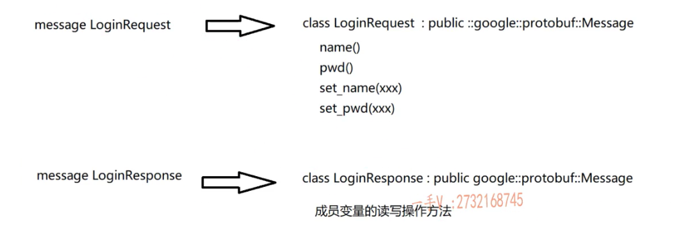

# 集群和分布式

> 集群：每一台服务器独立运行一个工程的所有模块。
>
> 分布式：一个工程拆分了很多模块，每一个模块独立部署运行在一个服务器主机上，所有服务器协同工作共同提供服务，每一台服务器称作分布式的一个节点，根据节点的并发要求，对一个节点可以再做节点模块的集群部署。
>
> 
>
> 

# RPC通信原理

> 
>
> 

# protobuf

## 序列化概念

> 序列化和反序列化：
>
> * 序列化：把对象转换成字节序列的过程称为对象的序列化。
> * 反序列化：把字节序列恢复为对象的过程称为对象的反序列化。
>
> 什么情况下需要序列化：
>
> * 存储数据：当你想把内存中的对象状态保存到一个文件中或者存到数据库中时。
> * 网络传输：网络直接传输数据，但是无法直接传输对象，所以要在传输前序列化，传输完成后反序列化成对象。
>
> 如何实现序列化：
>
> * xml、json、ProtoBuf

## ProtoBuf是什么

> 将结构化数据进行序列化的一种方式。
>
> 
>
> 
>
> 
>
>  
>
> 

# Zookeeper分布式协调服务

> [ZooKeeper原理及介绍 - 鹿泉 - 博客园 (cnblogs.com)](https://www.cnblogs.com/xinyonghu/p/11031729.html)
>
> 
>
> 
>
> 
>
> 
>
> 
>
> 
>
> **纠正：会在1/3的Timeout时间发送ping心跳消息**