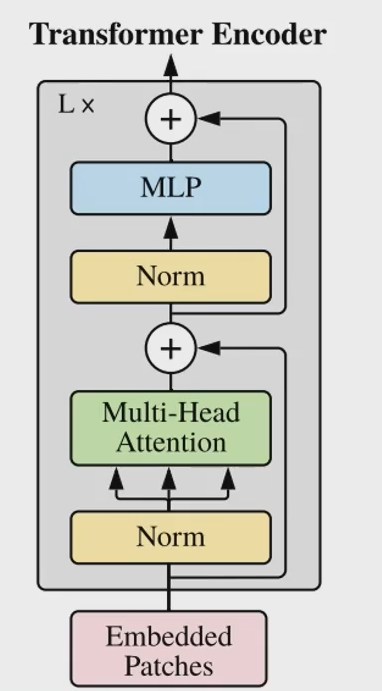

# 1 self-attention

1) 

> 

2) 

> 

3) 

> 

4) 计算向量间关联性

   > 1) 
   > 2) 
   > 3) 
   > 4) 
   > 5)  
   
   5) 矩阵化
   
      > 1) 
      > 2)   
      > 3) 
      > 4) 

# 2 Multi-head Self-attention

>1) 
>2) 
>3) 

# 3 Positional Ecoding

> 1) 
> 2) 

# 3 VIT

## 3. 1 Norm

# 4 Swin Transformer

## 4.1 模型流程

  ## 4.2 Patch Embedding

## 4.3 Windows Partition

## 4.4 Windows Muti-Head Self Attention

## 4.5 Patch Merging

## 4.6 Next Stage

## 4.7 Swin transformer:两个连续的Swin Block

> **W-MSA(Window Multi-head Self Attention)**
>
> **SW-MSA(Shifted Window Multi-head Self Attention)**

### 4.7.1 W-MSA

#### 4.7.1.1 复杂度分析

> hw = patch_num

### 4.7.2 SW-MSA

> shift_size = window_size // 2
>
> x = x.roll(shifts=(-shift_size, -shift_size), axis=(1,2))
>
> 

> typename _Operation::result_type std::binder1st<_Operation>::operator()(typename _Operation::second_argument_type&) const [with _Operation = times<int>; typename _Operation::result_type = int; typename _Operation::second_argument_type = const int]’ cannot be overloaded
>
> ​    operator()(typename _Operation::second_argument_type& __x) const
>
> operator()(const int& x) const;
>
> operator()(const int& x) const;
>
> (const times<int>)(const int&, int&);
>
> 
