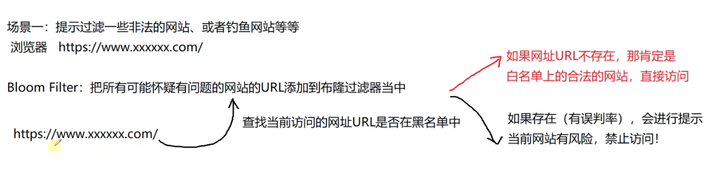

# 1 哈希表

## 1.1 线性探测哈希表实现

> 
>
> 
>
> ```c++
> #include <iostream>
> #include <vector>
> using namespace std;
> 
> enum State {
>     STATE_UNUSE ,   // 从未使用
>     STATE_USING ,   // 正在使用
>     STATE_DEL ,     // 已经被删除
> };
> 
> struct Bucket {
>     Bucket( int key = 0 , State state = STATE_UNUSE )
>         : key_( key )
>         , state_( state ) {}
>     int key_;   //存储的数据
>     State state_; // 桶的当前状态
> };
> 
> class HashTable {
> public:
>     HashTable( int size = primes_[0] , double loadFactor = 0.75 )
>         : useBucketNum_( 0 )
>         , loadFactor_( loadFactor )
>         , primeIdx_( 0 ) {
>         // 把用户传入的size调整到最近的比较大的素数上
>         if (size != primes_[0]) {
>             for (; primeIdx_ < PRIME_SIZE; primeIdx_++) {
>                 if (primes_[primeIdx_] > size)
>                     break;
>             }
>             // 用户传入的size过大，调整到最后一个素数
>             if (primeIdx_ == PRIME_SIZE) {
>                 primeIdx_--;
>             }
>         }
> 
>         tableSize_ = primes_[primeIdx_];
>         table_ = new Bucket[tableSize_];
>     }
> 
>     ~HashTable() {
>         delete[] table_;
>         table_ = nullptr;
>     }
> 
> public:
>     // 插入元素
>     bool insert( int key ) {
>         // 考虑扩容
>         double factor = useBucketNum_ * 1.0 / tableSize_;
>         cout << "factor:" << factor << endl;
>         if (factor > loadFactor_) {
>             // 哈希表扩容
>             expand();
>         }
> 
>         int idx = key % tableSize_;
>         if (table_[idx].state_ != STATE_USING) {
>             table_[idx].state_ = STATE_USING;
>             table_[idx].key_ = key;
>             useBucketNum_++;
>             return true;
>         }
>         
>         int i = idx;
>         do {
>             if (table_[i].state_ != STATE_USING) {
>                 table_[i].state_ = STATE_USING;
>                 table_[i].key_ = key;
>                 return true;
>             }
>             i = ( i + 1 ) % tableSize_;
>         } while (i != idx);
>         
>         return false;
>     }
> 
>     // 删除元素
>     bool erase( int key ) {
>         int idx = key % tableSize_;
>         int i = idx;
>         do {
>             if (table_[i].state_ == STATE_USING && table_[i].key_ == key) {
>                 table_[i].state_ = STATE_DEL;
>                 useBucketNum_--;
>             }
>             i = ( i + 1 ) % tableSize_;
>         } while (table_[i].state_ != STATE_UNUSE && i != idx);
> 
>         return true;
>     }
> 
>     // 查询元素
>     bool find( int key ) {
>         int idx = key % tableSize_;
>         int i = idx;
>         do {
>             if (table_[i].state_ == STATE_USING && table_[i].key_ == key) {
>                 return true;
>             }
>             i = ( i + 1 ) % tableSize_;
>         } while (table_[i].state_ != STATE_UNUSE && i != idx);
> 
>         return false;
>     }
>     
> private:
>     void expand() {
>         ++primeIdx_;
>         if (primeIdx_ == PRIME_SIZE) {
>             throw "HashTable is too large, can not expand anymore!";
>         }
> 
>         Bucket *newTable = new Bucket[primes_[primeIdx_]];
>         for (int i = 0; i < tableSize_; i++) {
>             if (table_[i].state_ == STATE_USING) {
>                 int idx = table_[i].key_ % primes_[primeIdx_];
> 
>                 int k = idx;
>                 do {
>                     if (newTable[k].state_ != STATE_USING) {
>                         newTable[k].state_ = STATE_USING;
>                         newTable[k].key_ = table_[i].key_;
>                         break;
>                     }
>                     k = ( k + 1 ) % primes_[primeIdx_];
>                 } while (k != idx);
>             }
>         }
> 
>         delete[] table_;
>         table_ = newTable;
>         tableSize_ = primes_[primeIdx_];
>     }
> private:
>     Bucket *table_; // 指向动态开辟的哈希表
>     int tableSize_; // 哈希表当前的长度
>     int useBucketNum_;  // 已经使用的桶的个数
>     double loadFactor_; // 哈希表的装载因子
> 
>     static const int PRIME_SIZE = 10; // 素数表的大小
>     static int primes_[PRIME_SIZE]; // 素数表
>     int primeIdx_;  // 当前使用的素数下标
> };
> 
> int HashTable::primes_[PRIME_SIZE] = { 3, 7, 23, 47, 97, 251, 443, 911, 1471, 42773 };
> ```

## 1.2 链式地址实现

> 
>
> 
>
> 
>
> 

> ```c++
> #include <iostream>
> #include <vector>
> #include <list>
> #include <algorithm>
> using namespace std;
> 
> class HashTable {
> public:
>     HashTable( int size = primes_[0] , double loadFactor = 0.75 )
>         : useBucketNum_( 0 )
>         , loadFactor_( loadFactor )
>         , primeIdx_( 0 ) {
>         if (size != primes_[0]) {
>             for (; primeIdx_ < PRIME_SIZE; primeIdx_++) {
>                 if (primes_[primeIdx_] >= size)
>                     break;
>             }
> 
>             if (primeIdx_ == PRIME_SIZE) {
>                 primeIdx_--;
>             }
>         }
> 
>         table_.resize( primes_[primeIdx_] );
>     }
> public:
>     // 增加元素，不能重复插入key
>     void insert( int key ) {
>         // 判断扩容
>         double factor = useBucketNum_ * 1.0 / table_.size();
>         if (factor > loadFactor_) {
>             expand();
>         }
> 
>         int idx = key % table_.size();
>         if (table_[idx].empty()) {
>             useBucketNum_++;
>             table_[idx].emplace_front( key );
>         }
>         else {
>             auto it = ::find( table_[idx].begin() , table_[idx].end() , key );
>             if (it != table_[idx].end()) {
>                 // key不存在
>                 table_[idx].emplace_front( key );
>             }
>         }
>     }
> 
>     void erase( int key ) {
>         int idx = key % table_.size();
>         auto it = ::find( table_[idx].begin() , table_[idx].end() , key );
>         if (it != table_[idx].end()) {
>             table_[idx].erase( it );
>             if (table_[idx].empty()) {
>                 useBucketNum_--;
>             }
>         }
>     }
> 
>     bool find( int key ) {
>         int idx = key % table_.size();
>         auto it = ::find( table_[idx].begin() , table_[idx].end() , key );
>         return it != table_[idx].end();
>     }
> 
> private:
>     void expand() {
>         if (primeIdx_ + 1 == PRIME_SIZE) {
>             throw "hashtable can not expand anymore!";
>         }
>         
>         primeIdx_++;
>         useBucketNum_ = 0;
> 
>         vector<list<int>> oldTable;
>         table_.swap( oldTable );
>         table_.resize( primes_[primeIdx_] );
> 
>         for (auto list : oldTable) {
>             for (auto key : list) {
>                 int idx = key % table_.size();
>                 if (table_[idx].empty()) {
>                     useBucketNum_++;
>                 }
>                 table_[idx].emplace_front( key );
>             }
>         }
>     }
> private:
>     vector<list<int>> table_;   // 哈希表的数据结构
>     int useBucketNum_;  // 记录桶的个数
>     double loadFactor_; // 哈希表的装载因子
> 
>     static const int PRIME_SIZE = 10;   // 素数表的长度
>     static int primes_[PRIME_SIZE]; // 素数表
>     int primeIdx_;  // 当前使用的素数小标
> };
> ```

# 2 大数据处理

## 查重

> * 哈希表
>   查重或者统计重复的次数。查询的效率高但是占用内存空间较大。|
> * 位图
>   位图法，就是用一个位（$0$或者$1$）来存储数据的状态，比较适合状态简单，数据量比较大，要求内存使用率低的问题场景。
>   位图法解决问题，首先需要知道待处理数据中的最大值，然后按照`size = (maxNumber / 32)+1`的大小来开辟一个`char`类型的数组，当需要在位图中查找某个元素是否存在的时候，首先需要计算该数字对应的数组中的比特位
>   然后读取值，$0$表示不存在，$1$表示已存在。
>   位图法有一个很大的缺点，就是数据没有多少，但是最大值却很大，比如有$10$个整数，最大值是$10$亿，那么就得按$10$亿这个数字计算开辟位图数组的大小，太浪费内存空间。
>

## 布隆过滤器

> * 布隆过滤器
>
>   布隆过滤器到底是个什么东西呢？通俗来讲，在使用哈希表比较占用内存的情况下，它是一种更高级的“位图法”解决方案，之所以说它更高级，是因为它没有上面位图法所说的缺陷。
>
>   **这里总结一下`Bloom Filter`的注意事项：**
>
>   1. `Bloom Filter`是通过一个位数组 + k个哈希函数构成的。
>   2.  `Bloom Filter`的空间和时间利用率都很高，但是它有一定的错误率，虽然错误率很低，`Bloom Filter`判断某个元素不在一个集合中，那该元素肯定不在集合里面；`Bloom Filter`判断某个元素在一个集合中，那么该元素有可能在，也有可能不在集合当中。
>   3. `Bloom Filter`的查找错误率，当然和位数组的大小，以及哈希函数的个数有关系，具体的错误率计算有相应的公式
>   4. `Bloom Filter`默认只支持`add`增加和`query`查询操作，不支持`delete`删除操作（因为存储的状态位有可能也是其它数据的状态位，删除后导致其它元素查找判断出错）。
>
>   `Bloom Filter`增加一个元素，经过k个哈希函数计算，得到`bitmap`位数组里面的一组序号，把相应的位置置为1
>
>   `Bloom Filter`搜索一个元素，经过k个函数函数计算，得到`bitmap`位数组里面的一组位的序号，判断相应的位置的值，如果全是1，证明相应的`key`存在，如果有一个$0$，则证明`key`不在`Bloom Filter`中。
>
>   很显然，过小的布隆过滤器很快所有的bit位均为1，那么查询任何值都会返回“可能存在”，起不到过滤的目的。布隆过滤器的长度会直接影响误报率，布隆过滤器越长其误报率越小。另外，哈希函数的个数也需要权衡，个数越多则布隆过滤器bit位置为1的速度就也快，且布隆过滤器的效率越低；但是如果太少的话，那误报率就会变高。
>
> 
>
> 
>
> `stringhash.h`
>
> ```c++
> #pragma once
> 
> 
> /// @brief BKDR Hash Function  
> /// @detail 本 算法由于在Brian Kernighan与Dennis Ritchie的《The C Programming Language》一书被展示而得 名，是一种简单快捷的hash算法，也是Java目前采用的字符串的Hash算法（累乘因子为31）。  
> template<class T>
> size_t BKDRHash(const T* str)
> {
>     register size_t hash = 0;
>     while (size_t ch = (size_t)*str++)
>     {
>         hash = hash * 131 + ch;   // 也可以乘以31、131、1313、13131、131313..  
>         // 有人说将乘法分解为位运算及加减法可以提高效率，如将上式表达为：hash = hash << 7 + hash << 1 + hash + ch;  
>         // 但其实在Intel平台上，CPU内部对二者的处理效率都是差不多的，  
>         // 我分别进行了100亿次的上述两种运算，发现二者时间差距基本为0（如果是Debug版，分解成位运算后的耗时还要高1/3）；  
>         // 在ARM这类RISC系统上没有测试过，由于ARM内部使用Booth's Algorithm来模拟32位整数乘法运算，它的效率与乘数有关：  
>         // 当乘数8-31位都为1或0时，需要1个时钟周期  
>         // 当乘数16-31位都为1或0时，需要2个时钟周期  
>         // 当乘数24-31位都为1或0时，需要3个时钟周期  
>         // 否则，需要4个时钟周期  
>         // 因此，虽然我没有实际测试，但是我依然认为二者效率上差别不大          
>     }
>     return hash;
> }
> /// @brief SDBM Hash Function  
> /// @detail 本算法是由于在开源项目SDBM（一种简单的数据库引擎）中被应用而得名，它与BKDRHash思想一致，只是种子不同而已。  
> template<class T>
> size_t SDBMHash(const T* str)
> {
>     register size_t hash = 0;
>     while (size_t ch = (size_t)*str++)
>     {
>         hash = 65599 * hash + ch;
>         //hash = (size_t)ch + (hash << 6) + (hash << 16) - hash;  
>     }
>     return hash;
> }
> /// @brief RS Hash Function  
> /// @detail 因Robert Sedgwicks在其《Algorithms in C》一书中展示而得名。  
> template<class T>
> size_t RSHash(const T* str)
> {
>     register size_t hash = 0;
>     size_t magic = 63689;
>     while (size_t ch = (size_t)*str++)
>     {
>         hash = hash * magic + ch;
>         magic *= 378551;
>     }
>     return hash;
> }
> /// @brief AP Hash Function  
> /// @detail 由Arash Partow发明的一种hash算法。  
> template<class T>
> size_t APHash(const T* str)
> {
>     register size_t hash = 0;
>     size_t ch;
>     for (long i = 0; ch = (size_t)*str++; i++)
>     {
>         if ((i & 1) == 0)
>         {
>             hash ^= ((hash << 7) ^ ch ^ (hash >> 3));
>         }
>         else
>         {
>             hash ^= (~((hash << 11) ^ ch ^ (hash >> 5)));
>         }
>     }
>     return hash;
> }
> /// @brief JS Hash Function  
> /// 由Justin Sobel发明的一种hash算法。  
> template<class T>
> size_t JSHash(const T* str)
> {
>     if (!*str)        // 这是由本人添加，以保证空字符串返回哈希值0  
>         return 0;
>     register size_t hash = 1315423911;
>     while (size_t ch = (size_t)*str++)
>     {
>         hash ^= ((hash << 5) + ch + (hash >> 2));
>     }
>     return hash;
> }
> /// @brief DEK Function  
> /// @detail 本算法是由于Donald E. Knuth在《Art Of Computer Programming Volume 3》中展示而得名。  
> template<class T>
> size_t DEKHash(const T* str)
> {
>     if (!*str)        // 这是由本人添加，以保证空字符串返回哈希值0  
>         return 0;
>     register size_t hash = 1315423911;
>     while (size_t ch = (size_t)*str++)
>     {
>         hash = ((hash << 5) ^ (hash >> 27)) ^ ch;
>     }
>     return hash;
> }
> /// @brief FNV Hash Function  
> /// @detail Unix system系统中使用的一种著名hash算法，后来微软也在其hash_map中实现。  
> template<class T>
> size_t FNVHash(const T* str)
> {
>     if (!*str)   // 这是由本人添加，以保证空字符串返回哈希值0  
>         return 0;
>     register size_t hash = 2166136261;
>     while (size_t ch = (size_t)*str++)
>     {
>         hash *= 16777619;
>         hash ^= ch;
>     }
>     return hash;
> }
> /// @brief DJB Hash Function  
> /// @detail 由Daniel J. Bernstein教授发明的一种hash算法。  
> template<class T>
> size_t DJBHash(const T* str)
> {
>     if (!*str)   // 这是由本人添加，以保证空字符串返回哈希值0  
>         return 0;
>     register size_t hash = 5381;
>     while (size_t ch = (size_t)*str++)
>     {
>         hash += (hash << 5) + ch;
>     }
>     return hash;
> }
> /// @brief DJB Hash Function 2  
> /// @detail 由Daniel J. Bernstein 发明的另一种hash算法。  
> template<class T>
> size_t DJB2Hash(const T* str)
> {
>     if (!*str)   // 这是由本人添加，以保证空字符串返回哈希值0  
>         return 0;
>     register size_t hash = 5381;
>     while (size_t ch = (size_t)*str++)
>     {
>         hash = hash * 33 ^ ch;
>     }
>     return hash;
> }
> /// @brief PJW Hash Function  
> /// @detail 本算法是基于AT&T贝尔实验室的Peter J. Weinberger的论文而发明的一种hash算法。  
> template<class T>
> size_t PJWHash(const T* str)
> {
>     static const size_t TotalBits = sizeof(size_t) * 8;
>     static const size_t ThreeQuarters = (TotalBits * 3) / 4;
>     static const size_t OneEighth = TotalBits / 8;
>     static const size_t HighBits = ((size_t)-1) << (TotalBits - OneEighth);
> 
>     register size_t hash = 0;
>     size_t magic = 0;
>     while (size_t ch = (size_t)*str++)
>     {
>         hash = (hash << OneEighth) + ch;
>         if ((magic = hash & HighBits) != 0)
>         {
>             hash = ((hash ^ (magic >> ThreeQuarters)) & (~HighBits));
>         }
>     }
>     return hash;
> }
> /// @brief ELF Hash Function  
> /// @detail 由于在Unix的Extended Library Function被附带而得名的一种hash算法，它其实就是PJW Hash的变形。  
> template<class T>
> size_t ELFHash(const T* str)
> {
>     static const size_t TotalBits = sizeof(size_t) * 8;
>     static const size_t ThreeQuarters = (TotalBits * 3) / 4;
>     static const size_t OneEighth = TotalBits / 8;
>     static const size_t HighBits = ((size_t)-1) << (TotalBits - OneEighth);
>     register size_t hash = 0;
>     size_t magic = 0;
>     while (size_t ch = (size_t)*str++)
>     {
>         hash = (hash << OneEighth) + ch;
>         if ((magic = hash & HighBits) != 0)
>         {
>             hash ^= (magic >> ThreeQuarters);
>             hash &= ~magic;
>         }
>     }
>     return hash;
> }
> ```
>
> `Bloom Filter.cpp`
>
> ```c++
> #include <iostream>
> #include <vector>
> #include <string>
> #include "stringhash.h"
> 
> using namespace std;
> 
> class BloomFilter {
> public:
>     BloomFilter( int bitSize = 1471 )
>         : bitSize_( bitSize ) {
>         bitMap_.resize( bitSize_ / 32 + 1 );
>     }
> public:
>     // 添加元素
>     void setBit( const char *str ) {
>         // 计算K组哈希函数的值
>         int idx1 = BKDRHash( str ) % bitSize_;
>         int idx2 = RSHash( str ) % bitSize_;
>         int idx3 = APHash( str ) % bitSize_;
> 
>         // 把相应的idx1 idx2 idx3索引处全部置1
>         int index = 0;
>         int offset = 0;
> 
>         index = idx1 / 32;
>         offset = idx1 % 32;
>         bitMap_[index] |= ( 1 << offset );
> 
>         index = idx2 / 32;
>         offset = idx2 % 32;
>         bitMap_[index] |= ( 1 << offset );
> 
>         index = idx3 / 32;
>         offset = idx3 % 32;
>         bitMap_[index] |= ( 1 << offset );
>     }
> 
>     // 查询元素
>     bool getBit( const char *str ) {
>          // 计算K组哈希函数的值
>         int idx1 = BKDRHash( str ) % bitSize_;
>         int idx2 = RSHash( str ) % bitSize_;
>         int idx3 = APHash( str ) % bitSize_;
> 
>         // 把相应的idx1 idx2 idx3索引处全部置1
>         int index = 0;
>         int offset = 0;
> 
>          // 计算K组哈希函数的值
>         int idx1 = BKDRHash( str ) % bitSize_;
>         int idx2 = RSHash( str ) % bitSize_;
>         int idx3 = APHash( str ) % bitSize_;
> 
>         index = idx1 / 32;
>         offset = idx1 % 32;
>         if (0 == ( bitMap_[index] & ( 1 << offset ) )) {
>             return false;
>         }
> 
>         index = idx2 / 32;
>         offset = idx2 % 32;
>         if (0 == ( bitMap_[index] & ( 1 << offset ) )) {
>             return false;
>         }
> 
>         index = idx3 / 32;
>         offset = idx3 % 32;
>         if (0 == ( bitMap_[index] & ( 1 << offset ) )) {
>             return false;
>         }
> 
>         return true;
>     }
> 
> private:
>     int bitSize_;  // 位图的长度
>     vector<int> bitMap_; // 位图数组
> };
> 
> 
> class BlackList {
> public:
>     void add( string url ) {
>         blockList_.setBit( url.c_str() );
>     }
> 
>     bool query( string url ) {
>         return blockList_.getBit( url.c_str() );
>     }
> private:
>     BloomFilter blockList_;
> };
> 
> int main() {
>     BlackList list;
>     list.add( "http://www.baidu.com" );
>     list.add( "http://www.360buy.com" );
>     list.add( "http://www.tmall.com" );
>     list.add( "http://www.tencent.com" );
> 
>     string url = "http://www.tmall.com";
>     cout << list.query( url ) << endl;
> }
> ```

## 位图

> 
>
> ```c
> #include <iostream>
> #include <vector>
> #include <stdlib.h>
> #include <time.h>
> #include <memory>
> using namespace std;
> 
> /*
> 有1亿个整数，最大值不超过1亿，问都有哪些元素重复了？谁是第一个重复的？谁是第一个不重复的？
> 内存限制100M
> 
> 1亿 = 100M
> 100M * 4 = 400M * 2 = 800M // 哈希表平均每个元素占用空间为原始空间的2倍
> */
> 
> int main() {
>     // 定义位图数组
>     vector<int> vec { 12, 78, 90, 123, 8, 9 };
>     
>     int max = vec[0];
>     for (int i = 1; i < vec.size(); i++) {
>         if (vec[i] > max)
>             max = vec[i];
>     }
> 
>     int *bitmap = new int[max / 32 + 1]();
>     unique_ptr<int> ptr( bitmap );
> 
>     // 找第一个重复出现的数字
>     for (auto key : vec) {
>         int index = key / 32;
>         int offset = key % 32;
> 
>         // 取key对应的值
>         if (0 == ( bitmap[index] & ( 1 << offset ) )) {
>             // 表示key没有出现过
>             bitmap[index] |= ( 1 << offset );
>         }
>         else {
>             cout << key << " ";
>             return 0;
>         }
>     }
>     return 0;
> }
> ```

# 3 TopK问题

## 3.1 大小根堆求topK问题

> * 大/小根堆
>
>   利用大根堆过滤前top k小的数据；小根堆过滤前前top k大的数据
>
> 
>
> ```c++
> #include <queue>
> #include <iostream>
> #include <cstdlib>
> #include <unordered_map>
> #include <functional>
> 
> using namespace std;
> 
> int main() {
>     vector<int> vec;
>     srand( time( NULL ) );
>     for (int i = 0; i < 1000; i++) {
>         vec.push_back( rand() % 10000 );
>     }
> 
>     // 统计重复次数最小的前3个数字
>     int k = 3;
>     unordered_map<int , int> map;
>     for (auto key : vec) {
>         map[key]++;
>     }
> 
>     using Type = pair<int , int>;
>     using Comp = function<bool( Type & , Type & )>;
>     priority_queue<Type , vector<Type> , Comp> maxheap( [] ( Type &a , Type &b )->bool {
>         return a.second < b.second;
>         } );
> 
>     auto it = map.begin();
>     for (int i = 0; i < k; i++, ++it) {
>         maxheap.push( *it );
>     }
>     for (; it != map.end(); ++it) {
>         if (maxheap.top().second > it->second) {
>             maxheap.pop();
>             maxheap.push( *it );
>         }
>     }
> 
>     while (!maxheap.empty()) {
>         cout << "key:" << maxheap.top().first
>             << " cnt:" << maxheap.top().second << endl;
>         maxheap.pop();
>     }
>     return 0;
> }
> 
> #if 0
> int main() {
>     vector<int> vec;
>     srand( time( NULL ) );
>     for (int i = 0; i < 1000; i++) {
>         vec.push_back( rand() % 10000 );
>     }
> 
>     // 求vec中值最小的前5个元素
>     priority_queue<int> maxheap;
>     int k = 5;
>     for (int i = 0; i < 5; i++) {
>         maxheap.push( vec[i] );
>     }
>     for (int i = 5; i < vec.size(); i++) {
>         if (maxheap.top() > vec[i]) {
>             maxheap.pop();
>             maxheap.push( vec[i] );
>         }
>     }
> 
>     while (!maxheap.empty()) {
>         cout << maxheap.top() << " ";
>         maxheap.pop();
>     }
> }
> 
> #endif
> ```

## 3.1 快排分割求topK问题

> 
>
> 平均时间复杂度：O(n)
>
> 最坏时间复杂度：O(n^2)
>
> ```c++
> #include <iostream>
> 
> using namespace std;
> 
> // 快排分割函数
> int Partation( int arr[] , int begin , int end ) {
>     int val = arr[begin];
>     int i = begin;
>     int j = end;
>     while (i < j) {
>         while (i < j && arr[j] > val)
>             j--;
> 
>         if (i < j) {
>             arr[i] = arr[j];
>             i++;
>         }
> 
>         while (i < j && arr[i] < val)
>             i++;
> 
>         if (i < j) {
>             arr[j] = arr[i];
>             j--;
>         }
>     }
>     arr[i] = val;
> 
>     return i;
> }
> void SelectTopK( int arr[] , int begin , int end , int k ) {
>     int pos = Partation( arr , begin , end);
>     if (pos == k - 1) {
>         return;
>     }
>     else if( pos > k - 1 ) {
>         SelectTopK( arr , begin , pos - 1 , k );
>     }
>     else {
>         SelectTopK( arr , pos + 1 , end , k );
>     }
> }
> int main() {
>     int arr[] = { 64, 45, 52, 80, 66, 68, 0, 2, 18, 75 };
>     int size = sizeof arr / sizeof arr[0];
> 
>     // 求值最小的前3个元素
>     int k = 3;
>     SelectTopK( arr , 0 , size - 1 , k );
>     for (int i = 0; i < k; i++) {
>         cout << arr[i] << " ";
>     }
> }
> ```

 # 4 堆

## 二叉堆

> 就是一颗完全二叉树，分为两种典型的堆，分别是大根堆和小根堆
>
> 满足`0 <= i <= (n - 1) / 2`，$n$代表最后一个元素的小标，特别的`(n - 1) / 2`为最后一个非叶子节点。
>
> 如果`arr[i] <= arr[2 * i + 1] && arr[i] <= arr[2 * i + 2]`，就是小根堆。
>
> 如果`arr[i] >= arr[2 * i + 1] && arr[i] >= arr[2 * i + 2]`，就是大根堆。
>
> | 排序算法 | 平均时间复杂度 | 最好时间复杂度 | 最坏时间复杂度 |    空间复杂度    | 稳定性 |
> | -------- | -------------- | -------------- | -------------- | :--------------: | ------ |
> | 堆排序   | $O(nlogn)$     | $O(nlogn)$     | $O(nlogn)$     |      $O(1)$      | 不稳定 |
> | 快速排序 | $O(nlogn)$     | $O(nlogn)$     | $O(n^2)$       | $O(logn) - O(n)$ | 不稳定 |
> | 归并排序 | $O(nlogn)$     | $O(nlogn)$     | $O(nlogn)$     |      $O(n)$      | 稳定   |
>
> ```c++
> #include <iostream>
> #include <functional>
> #include <cstring>
> #include <stdlib.h>
> #include <time.h>
> 
> using namespace std;
> 
> // 优先级队列实现
> class PriorityQueue {
> public:
>     using Comp = function<bool( int , int )>;
>     PriorityQueue( int cap = 20 , Comp comp = greater<int>() )
>         : size_( 0 )
>         , cap_( cap )
>         , comp_( comp ) {
>         que_ = new int[cap_];
>     }
> 
>     PriorityQueue( Comp comp )
>         : size_( 0 )
>         , cap_( 20 )
>         , comp_( comp ) {
>         que_ = new int[cap_];
>     }
> 
>     ~PriorityQueue() {
>         delete[] que_;
>         que_ = nullptr;
>     }
> 
> public:
>     // 入堆操作
>     void push( int val ) {
>         if (size_ == cap_) {
>             int *p = new int[2 * cap_];
>             memcpy( p , que_ , cap_ * sizeof( int ) );
>             delete[] que_;
>             que_ = p;
>             cap_ *= 2;
>         }
>         if (size_ == 0) {
>             que_[size_] = val;
>         }
>         else {
>             // 堆里面有多个元素，需要进行上浮调整
>             siftUp( size_ , val );
>         }
>         size_++;
>     }
> 
>     // 出堆操作
>     void pop() {
>         if (size_ == 0)
>             throw "container is empty!";
> 
>         size_--;
>         if (size_ > 0) {
>             // 删除堆顶元素，还有剩余的元素，要进行堆的下沉调整
>             siftDown(0, que_[size_]);
>         }
>     }
> 
>     bool empty() const { return size_ == 0; }
> 
>     int top() const {
>         if (size_ == 0)
>             throw "container is empty!";
>         return que_[0];
>     }
> 
>     int size() const { return size_; }
> private:
>     // 入堆上浮调整
>     void siftUp( int i , int val ) {
>         while (i > 0) {
>             int father = ( i - 1 ) / 2;
>             if (comp_( val , que_[father] )) {
>                 que_[i] = que_[father];
>                 i = father;
>             }
>             else {
>                 break;
>             }
>         }
>         que_[i] = val;
>     }
> 
>     // 出堆元素下沉调整
>     void siftDown( int i , int val ) {
>         // i下沉不能超过最后一个非叶子节点
>         while (i <= ( size_ - 2 ) / 2) {
>             int child = 2 * i + 1;
>             if (child + 1 < size_ && comp_( que_[child + 1] , que_[child] )) {
>                 child = child + 1;
>             }
> 
>             if (comp_( que_[child] , val )) {
>                 que_[i] = que_[child];
>                 i = child;
>             }
>             else {
>                 break;
>             }
>         }
>         que_[i] = val;
>     }
> 
> private:
>     int *que_;  // 指向动态扩容的数组
>     int size_;  // 数组元素的个数
>     int cap_;   // 数组的总空间大小
>     Comp comp_; // 比较其对象
> };
> 
> int main() {
>     PriorityQueue que;
>     srand( time( NULL ) );
> 
>     for (int i = 0; i < 10; i++) {
>         que.push( rand() % 100 );
>     }
> 
>     while (!que.empty()) {
>         cout << que.top() << " ";
>         que.pop();
>     }
>     cout << endl;
> }
> ```
>
> **堆排序**
>
> ```c++
> #include <iostream>
> 
> using namespace std;
> // 堆的下沉调整
> void siftDown( int arr[] , int i , int size ) {
>     int val = arr[i];
>     while (i <= ( size - 2 ) / 2) {
>         int child = 2 * i + 1;
>         if (child + 1 < size && arr[child + 1] > arr[child]) {
>             child = child + 1;
>         }
> 
>         if (arr[child] > val) {
>             arr[i] = arr[child];
>             i = child;
>         }
>         else {
>             break;
>         }
>     }
>     arr[i] = val;
> }
> void HeapSort( int arr[] , int size ) {
>     int n = size - 1;
>     for (int i = ( n - 1 ) / 2; i >= 0; i--) {
>         siftDown( arr , i , size );
>     }
>     
>     for (int i = n; i > 0; i--) {
>         int tmp = arr[0];
>         arr[0] = arr[i];
>         arr[i] = tmp;
>         siftDown( arr , 0 , i );
>     }
> }
> 
> int main() {
>     
>     return 0;
> }
> ```

# 5 一致性哈希算法-负载均衡算法介绍

> 一致性哈希算法 =》分布式系统负载均衡的首选算法
>
> 一个良好的分布式哈希方案应该具有良好的单调性，即服务节点的增减不会造成大量的哈希的重新定位。
>
> 
>
> 
>
> 
>
> 